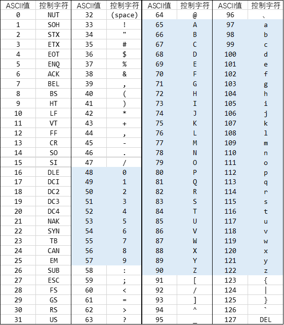
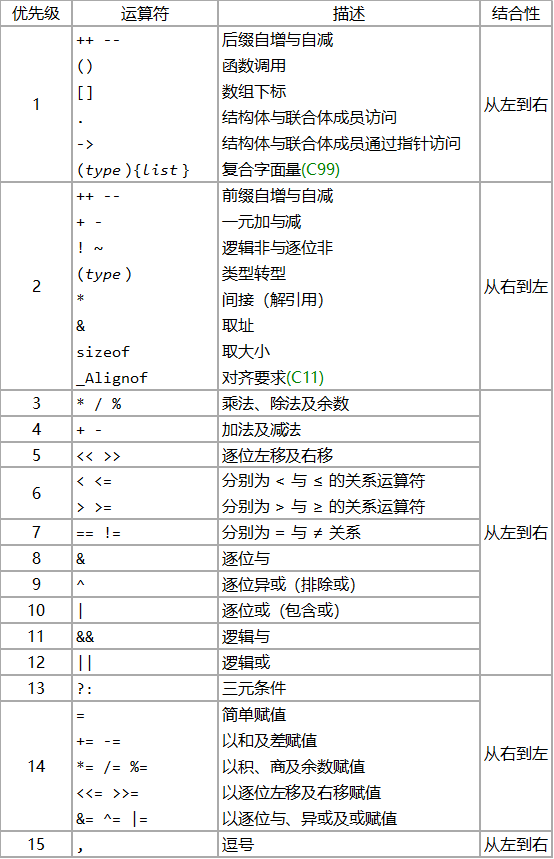
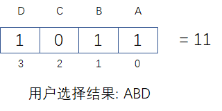

# C语言基础

### 第一个C语言程序

```cpp
#include <stdio.h>

int main() {
    int a, b;
    scanf("%d %d", &a, &b);	//读入a、b的值
    int sum = a + b;	//计算 a+b
    printf("%d + %d = %d\n", a, b, sum);
    return 0;
}
```

### 变量
#### 变量初始化

初始化：在生成变量的时放入数值

赋值：在已生成的变量中放入数值

```cpp
int a = 3;	//定义了一个变量a并将其初始化为3
int b;		//定义了一个变量b，此时变量b存放的值不确定（垃圾值）
b = 6;		//将变量b赋值为6
```

#### 变量命名规则 

变量名、函数名、数组名等统称为标识符 。C语言规定，标识符只能由字母（a～z，A～Z）、数字 （0～9）、下划线（_）组成，并且标识符的第一个字符必须是字母或下划线，不能以数字开头。且标识符不能与关键字相同。 

实际工程项目中，规范中变量名的选取应有意义，推荐驼峰式命名。

#### 变量类型

C语言的数据类型包括：

* 基本类型
  * 数值类型
    * 整型
    * 浮点型
  * 字符类型 `char`

* 构造类型
  * 数组
  * 结构体 `struct`
  * 联合 `union`
  * 枚举 `enum`
* 指针类型
* 空类型（void）

**整型**

`short`（16位）, `int`（通常为4字节，32位）, `long long`(8字节，64位)

`int`表示数据范围：-2^31 ~ 2^31 - 1，比±21亿略大一点

**浮点型**

float（单精度32位）, double（双精度64位，常用）

```cpp
#include <stdio.h>

int main(){
    double PI = 3.1415926;
    double r = 3;
    double S = PI * r * r;
    printf("%f\n", S);
    return 0;
}
```

**字符型**

char（8位），可表示ascii码表




```cpp
#include <stdio.h>

int main(){
	char c = 'e';
    char c_upper = c + 'A' - 'a';	//小写字母转大写字母
    printf("%c\n", c_upper);
    
    char a = '5';
    int d = a - '0';	//数字字符转换成其对应的数
    printf("%d\n", d);
    // '0' + 5 = '5'
    return 0;
}
```

**转义字符**

反斜杠`\`开头，常见的有：

- `\n`：换行符
- `\t`：制表符（用于文本对齐）
- `\\`：反斜杠字符`\`
- `\"`：双引号`"`
- `\'`：单引号`'`


**bool型**

C语言没有`bool`类型，C语言中用`0`表示逻辑假`false`，用`1`表示逻辑真`true`。

C++中将`bool`类型作为基本类型。

相比用`0`和`1`表示逻辑真假，用`bool`类型表示逻辑真假更加清晰直观，代码可读性更强。

```cpp
int num = 5;
bool flag = num > 0;
if (flag == true) {
    printf("yes\n");
} else if (flag == false) {
    printf("no\n");
} else {
    printf("bool类型要么为true，要么为false，没有第三种情况\n");
}
```


整型可以自动类型转换成`bool`类型，规则是`0`值为`false`，非`0`值为`true`。

```cpp
bool a = 3;		//a = true
bool b = 0;		//b = false
bool c = -1; 	//c = true
```

但并不推荐这么写。

```cpp
//判断一个数是否为0
bool isZero1(int num) {
    return num;			//虽然正确但不推荐
}

bool isZero2(int num) {
    return num != 0;	//这样写更加清晰
}
```


#### 常量

通常约定常量名全部用大写字母表示，多个单词中间加`_`隔开。如`MAX_SIZE`

**符号常量**

```cpp
#include <stdio.h>
#define PI 3.1415926

int main(){
    double r = 3;
    double S = PI * r * r;
    printf("%f\n", S);
    return 0;
}
```

**const常量(C++语法)**

```cpp
#include <stdio.h>

const double PI = 3.1415926;

int main(){
    double r = 3;
    double S = PI * r * r;
    printf("%f\n", S);
    return 0;
}
```

### 运算符、表达式和语句

#### 表达式

表达式（expression）一种可以被计算的语法结构，包括

* 字面量

  ```c
  double PI = 3.14;
  char ch = 'a';
  char str[] = "hello";
  ```

* 变量

* 函数调用（前提是该函数返回类型不为`void`）

  ```c
  int add(int a, int b) {
      return a + b;
  }
  
  int main() {
      int n = 5;
      int res = add(n, 1);
  }
  ```

  `add(n, 1)`是函数调用表达式，其计算结果为调用该函数的返回值。

* 由运算符和运算数组成

  对于算数表达式`a + b`，`+`称作是运算符（operator），`a`和`b`称作是操作数（operand）。因为`+`运算符需要两个操作数，因此`+`是一个二元运算符（也叫双目运算符）。

  当运算符的操作数也是表达式（字面量、常量、变量除外）时，通常称为复合表达式

  使用了xx运算符的表达式称为xx表达式，比如算术表达式、关系表达式、逻辑表达式、条件表达式、赋值表达式……

  相同的符号也可能有不同的含义，比如对于`-`，作为减号时需要两个操作数，是二元运算符（如 `a - 2`）；作为负号时只需一个运算数，是一元运算符（如`-(a + b)`）

  运算符也是有优先级的，不确定的情况下就使用括号以免出bug

#### 运算符

**赋值运算符**

`变量 = 表达式`

赋值表达式的计算结果为变量被赋值后的值。

```c
int a;
if ((a = 3) > 0) {	// 表达式a=3的计算结果为3，该if语句会被执行
    
}

int b, c;
b = c = 1 + 2;		//表达式会从右向左执行，相当于 b = (c = 1 + 2);
```

一个初学者常见错误

```c
int n = 0;
if (n = 0) {	// 赋值表达式 n=0 的计算结果为0，该if语句永远不会执行
    // do something
}
```


+=、-=、*=、/= ……

```cpp
int a = 3;
a = a + 1;	// 如果想让变量a的值增加1，可以这么写
a += 1;		// 也可以这样简写
// 同理可知， a = a / 2 等价于 a /= 2
```


**算术运算符**

+、-、*、/、%（求余）

要求操作数是算术表达式

求余运算符`%`要求操作数均为整数类型

```c
int a = 5 / 2; // a = 2，整数除以整数，运算结果还是整数，小数部分会丢弃
double b = 5 / 2;	// b = 2.0，将运算结果自动由int类型转换为double类型
double c = 5.0 / 2.0; 	// c = 2.5，两个double做运算，运算结果也是double类型

int f = 10 % 3; 	// f = 1，求余运算。
```

```cpp
int n = 123;
int c = n % 10;	//获取个位数（整数对10求余数可以获取最后一位）
int b = (n / 10) % 10;	//获取十分位数（整数对10做整除相当于是砍掉最后一位）
int a = n / 100;	//获取百分位数
```


**自增/自减运算符**

分为前置运算符（`++a`）和后置运算符（`a++`）

`i++`：将变量`i`的值增加`1`，表达式的计算结果为变量`i`**自增前**的值。

`++i`：将变量`i`的值增加`1`，表达式的计算结果为变量`i`**自增后**的值。

自增自减运算符要求操作数必须是一个变量。

```cpp
int a, i = 2;
a = i++;	//相当于以下两行代码
// a = i;	// a = 2
// i += 1;	// i = 3
```

```cpp
int a, i = 2;
a = ++i;	//相当于以下两行代码
// i += 1;	// i = 3
// a = i;	// a = 3
```

```c
int a, i = 2;
a = 2 * (i++ + 3);	//相当于以下两行代码
// a = 2 * (i + 3);
// i += 1;
```

```c
int a, i = 2;
a = 2 * (++i + 3);	//相当于以下两行代码
// i += 1;
// a = 2 * (i + 3);
```


**关系运算符**

<、>、<=、>=、==、!=

要求操作数均为算术表达式

关系表达式的运算结果为`bool`类型，即要么为`true`，要么为`false`。

当然，C语言中并没有`bool`类型，所以关系表达式的运算结果为`int`类型，为0或者1。


**逻辑运算符**

&&、||、!  （逻辑与、逻辑或、逻辑非）

要求操作数均为关系表达式

逻辑与`&&`：如果`&&`运算符的左右两边计算结果均为true，那么该逻辑表达式的运算结果就为true，否则为false。

逻辑或`||`：如果`||`运算符的左右两边计算结果只要有一个为true，那么该逻辑表达式的运算结果就为true，否则为false。

逻辑非`!`：一元运算符，对计算结果为布尔类型表达式的运算结果取反。

短路求值特性：

对于逻辑与`&&`，如果运算符左边计算结果为false，右边则不会再计算，此时表达式的计算结果直接为false。

对于逻辑或`||`，如果运算符左边计算结果为true，右边则不会再计算，此时表达式的计算结果直接为true。

```cpp
//假设数组的有效下标范围是[0, MAXN)
//在访问数组下标p前先检查下标是否越界
//这里就利用了短路求值特性，当下标范围不合法时，表达式 num[p] > 0 不会被执行
if (p >= 0 && p < MAXN && num[p] > 0) {
    printf("%d\n", num[p]);
}
```

**条件运算符**

条件运算符是一个三元运算符。它可以将 if 语句的功能凝缩到一个单一的语句中。条件表达式的逻辑不宜复杂。

```
表达式1 ? 表达式2 : 表达式3
```

其中表达式1的计算结果应是`bool`类型，表达式2和表达式3的类型必须一致。

条件表达式的计算结果为：若表达式1的计算结果为真，则返回表达式2的计算结果。否则返回表达式3的计算结果。例如：

```cpp
int a = 1, b = 2;
int max_value = a > b ? a : b;	//求a、b两者的最大值
```


```cpp
bool flag = true;
printf("%s\n", flag ? "YES" : "NO");
//等价于以下if-else语句
if (flag == true) {
    printf("YES\n");
} else {
    printf("NO\n");
}
```

#### 运算符优先级表

> https://zh.cppreference.com/w/c/language/operator_precedence

不用背，拿不准的就加括号



#### 类型转换

* 隐式类型转换：C语言在以下四种情况下会进行隐式转换:

  * 算术运算式中，低类型能够转换为高类型。（比如`char`转`int`，`int`转`double`）

  * 赋值表达式中，右边表达式的值自动隐式转换为左边变量的类型，并赋值给他。

    ```c
    double d = 3.33;
    int i;
    i = d;	//i = 3，小数部分会被丢失
    ```

  * 函数调用中参数传递时，系统隐式地将实参转换为形参的类型后，赋给形参。

  * 函数有返回值时，系统将隐式地将返回表达式类型转换为返回值类型，赋值给调用函数。

* 强制类型转换（显式类型转换）

  ```c
  #include <stdio.h>
  
  int main() {
  	int a = 5, b = 2;
  	double res1 = a / b;			//a、b都是整数类型，类型匹配，做整数除法运算
  	double res2 = (double)a / b;	// a强制转换成double类型，b自动转换成double类型
  	double res3 = a * 1.0 / b;		// a、b自动转换成double类型
  	printf("%f\n", res1);
  	printf("%f\n", res2);
  	printf("%f\n", res3);
  	return 0;
  }
  ```

  运算符`(double)`称为类型转换运算符，表达式`(double)a`为类型转换表达式，其计算结果为`double`类型。


#### 语句

语句指的是当程序运行时执行某个动作的语法结构，包括

**表达式语句**

表达式语句是最简单的一种语句，在表达式的末尾加分号`;`就形成了一个表达式语句。

最常用的表达式语句是赋值语句、函数调用语句、自增自减语句

```c
a = 3;		//a=3是赋值表达式，结尾加上了分号就变成了赋值语句
add(1, 2);	//函数调用语句，如果函数有返回值则会被忽略
a++;		//相当于a += 1 或 a = a + 1，表达式`a++`的计算结果会被忽略
1+2;		//算术表达式后加上分号形成一条语句，虽然语法正确但通常没有意义
```

**空语句**

单独一个分号`;`会被视为空语句，即什么都不做。

初学者一个常见的错误：

```c
for (int i = 0; i < 5; i++);	//注意这行末尾多了一个分号
	printf("%d\n", i);
```

等价于以下代码

```c
for (int i = 0; i < 5; i++) {
    ;	//do nothing
}
printf("%d\n", i);
```


**控制语句**

* 条件/选择语句

* 循环语句
* 特殊控制语句
  * return;
  * break;
  * continue;

### 位运算（了解）

| 运算符 | 含义                        | 例子                |
| ------ | --------------------------- | ------------------- |
| `<<`   | 左移                        | 0011 << 1 = 0110    |
| `>>`   | 右移                        | 0110 >> 1 = 0011    |
| `&`    | 按位与                      | 0011 & 1011 = 0011  |
| `|`    | 按位或                      | 0011 \| 1011 = 1011 |
| `~`    | 按位取反                    | ~0011  = 1100       |
| `^`    | 按位异或 (相同为零不同为一) | 0011 ^ 1011 = 1000  |

**应用举例：位掩码(BitMask)**

一道选择题有 ABCD 4个选项，想保存用户选择的结果。

如果是单选题，可以用一个`int`类型变量，约定 1表示选择A, 4表示选择D等.

但如果是多选题...难道要用4个`bool`类型的变量分别表示是否选择A B C D ?

| 二进制 | 十进制 | D    | C    | B    | A    | 含义   |
| :----: | :----: | ---- | ---- | ---- | ---- | ------ |
|  0001  |   1    | 0    | 0    | 0    | 1    | A      |
|  0010  |   2    | 0    | 0    | 1    | 0    | B      |
|  0100  |   4    | 0    | 1    | 0    | 0    | C      |
|  1000  |   8    | 1    | 0    | 0    | 0    | D      |
|  1010  |   10   | 1    | 0    | 1    | 0    | BD     |
|  1011  |   11   | 1    | 0    | 1    | 1    | ABD    |
|  1111  |   15   | 1    | 1    | 1    | 1    | ABCD   |
|   0    |   0    | 0    | 0    | 0    | 0    | 未选择 |



对于变量`num`

* 将其第`i`位设置为`1`: `num |= (1 << i)`
* 将其第`i`位设置为`0`: `num &= ~(1 << i)`
* 第`i`位是否为`1`:  `bool result = (num & (i << i)) != 0`
* 获取其第`i`位的值: `int result = (num >> i) & 1`

备注: `a |= b `表示`a = a | b`

```cpp
#include <stdio.h>

int main() {
	const int A = 1;	// 0001
	const int B = 2;	// 0010
	const int C = 4;	// 0100
	const int D = 8;	// 1000

	int answer = A | B | D;		//存放正确答案 1011

	int choose = 0;

	choose |= A;	//勾选A
	choose |= B;	//勾选B
	choose |= A;	//即使重复勾选A也没事
	choose |= D;	

	printf("choose = %d\n", choose);	//现在选了 ABD, 1011(11)

	choose &= ~A;	//取消勾选A
	choose &= ~C;	//即使之前没有选C也没事

	printf("choose = %d\n", choose);	//现在选了 BD, 1010(10)
	
	if (choose & A) {	//判断是否选择了 A
		printf("choose A\n");
	}
	if (choose & B) {
		printf("choose B\n");
	}
	if (choose & C) {
		printf("choose C\n");
	}
	if (choose & D) {
		printf("choose D\n");
	}

	//依次输出每一位的值
	for (int i = 0; i < 4; i++) {
		printf("第%d位: %d\n", i, (choose >> i) & 1);
	}

	if (choose == answer) {
		printf("right answer\n");
	}
	else {
		printf("wrong answer\n");
	}

	return 0;
}
```


### 输入输出

**格式化输出printf**

```
printf("格式控制字符串", ...)
```

| 数据类型           | 格式符 | 举例                 |
| ------------------ | ------ | -------------------- |
| int                | %d     | printf(“%d”, num);   |
| long long          | %lld   | printf(“%lld”, num); |
| float              | %f     | printf(“%f”, num);   |
| double             | %f     | printf(“%f”, num);   |
| char               | %c     | printf(“%c”, ch);    |
| 字符串（char数组） | %s     | printf(“%s”, str);   |

常用的几个输出格式

- `%md`，如`%5d`，可使不足m位的`int`变量以m位进行右对齐输出，高位用空格补齐。
- `%0md`，如`%05d`。跟上面类似，只是高位用0补齐（前导零）。
- `%.mf`，如`%.2f`，让浮点数保留m位小数输出

```cpp
#include <stdio.h>

int main() {
    int a = 123;
    double f = 3.14159;
    
    printf("%5d\n", a);
    printf("%05d\n", a);
    printf("%.2f\n", f);
    return 0;
}
```

输出结果：

```
  123
00123
3.14
```


**格式化输入scanf**

```
scanf("格式控制字符串"，...)
```

| 数据类型           | 格式符 | 举例                           |
| ------------------ | ------ | ------------------------------ |
| int                | %d     | scanf(“%d”, &num); //要加 &    |
| long long          | %lld   | scanf(“%lld”, &num);           |
| float              | %f     | scanf(“%f”, &num);             |
| double             | %lf    | scanf(“%lf”, &num);            |
| char               | %c     | scanf(“%c”, &ch);              |
| 字符串（char数组） | %s     | scanf(“%s”, str); //注意不加 & |

注意：

- `scanf`读入double变量时使用`%lf`占位，`printf`输出`double`类型变量时用`%f`占位
- `scanf`读入变量时需要在变量名前加`&`符号（只有读入字符串char数组时例外），学了指针那部分会解释原因
- `scanf`在读入字符串char数组时，变量名前不加`&`，学了指针那部分会解释原因

### 计算时间间隔

```
样例输入1
08:33-17:13
样例输出1
08:40

样例输入2
18:33-17:13
样例输出2
-01:20
```

```cpp
#include <stdio.h>

int main() {
	int hh1, mm1, hh2, mm2;
	scanf("%d:%d-%d:%d", &hh1, &mm1, &hh2, &mm2);
	int minutes = (hh2 - hh1) * 60 + (mm2 - mm1);
	if (minutes < 0) {
		printf("-");
		minutes = -minutes;
	}
	printf("%02d:%02d\n", minutes / 60, minutes % 60);
	return 0;
}
```


### 顺序结构

交换两个变量的值

```cpp
#include <stdio.h>

int main(){
    int a = 1, b = 2;
    
    int temp = a;	//temp = 1
    a = b;	//a = 2, b = 2
    b = temp;	// b = 1
    
    printf("a = %d, b = %d\n", a, b);
    return 0;
}
```

### 选择结构

if (逻辑表达式) { ............}

```cpp
#include <stdio.h>

int main(){
    int score;
    scanf("%d", &score);
    if (score >= 90) {
        printf("优\n");
    } else if (80 <= score && score < 90) {
        printf("良\n");
    } else if (70 <= score && score < 80) {
        printf("中\n");
    } else if (60 <= score && score < 70) {
        printf("及格\n");
    } else {
        printf("不及格\n");
    }
    return 0;
}
```

if语句也可以嵌套。

注意：在if、while等语句的判断条件中，0值视为假，非0值视为真。

```cpp
int a = 3;
if (a) {	//等价于 if (a != 0)
    
}

char ch = 'a';
if (ch) {	//等价于 if (ch != '\0')
    
}
```

但通常还是建议把条件写清楚，代码的可读性更重要。


### 循环结构

#### while循环

例题：读入一个正整数，输出其每一位数字之和。如读入`12345`，则应输出`15`

```cpp
#include <stdio.h>

int main() {
	int num;
	scanf("%d", &num);
    
	int sum = 0;
	while (num > 0) {
		sum += num % 10;
		num /= 10;
	}
    
	printf("%d\n", sum);
	return 0;
}
```

#### for循环

**例题：计算`0 + 2 + 4 + ... + 100`**

```cpp
#include <stdio.h>

int main() {
    int sum = 0;
    for (int i = 0; i <= 100; i += 2) {
        sum += i;
    }
    printf("%d\n", sum);
    return 0;
}
```

**计算：1 - 2 + 4 - 8 + 16 - 32 + 64**

```cpp
int sum = 0;
for (int i = 1, flag = 1; i <= 64; i *= 2, flag *= -1) {
    sum += flag * i;
}
```


```cpp
int n1 = 5;
for (int i = 0; i < n1; i++) {	//循环n1次
    //do something
}
printf("%d\n", n1);	//此时n1=5

int n2 = 6;
while (n2--) {	//循环n2次
    //do something
}
printf("%d\n", n2);	//此时n2=0
```

如果有一个变量n，你需要循环n次。一般使用for循环`for (int i = 0; i < n; i++)`，但如果你后面不再需要使用该变量n，你可以使用`while (n--)`这种更简单的写法，但这样循环执行完n的值会变为0。


**计算sin(x):**
$$
\sin x = x - \frac{x^3}{3!} + \frac{x^5}{5!} - \frac{x^7}{7!} + ...
$$

```cpp
#include <stdio.h>

int main() {
	double x = 3.14159 / 2;
	//scanf("%lf", &x);

    double exp_accum = x;   //累计次方
	double fact_accum = 1;  //累计阶乘
	double sum = x;			//注意sum并没有初始化为0，因为直接把第一项的结果包含进去了
    
    //i表示当前计算的是x^i项，总共计算到x^19这一项
	for (int i = 3, flag = -1; i < 20; i += 2, flag *= -1) {
		exp_accum *= x * x;
		fact_accum *= i * (i - 1);
		sum += flag * exp_accum / fact_accum;
	}

	printf("%f\n", sum);
	return 0;
}
```


```cpp
#include <stdio.h>

int main() {
	double x = 3.14159 / 2;
	//scanf("%lf", &x);

    double exp_accum = x;   //累计次方
	double fact_accum = 1;  //累计阶乘
	double sum = x;

	//i表示当前计算的是第i项（从1开始计数），总共计算到第10项
	for (int i = 2; i <= 10; i++) {
		int flag = i % 2 == 1 ? 1 : -1;	//奇数项为正
		int n = 2 * i - 1;
		exp_accum *= x * x;
		fact_accum *= n * (n - 1);
		sum += flag * exp_accum / fact_accum;
	}

	printf("%f\n", sum);
	return 0;
}
```


#### 双重循环

**九九乘法表**

```cpp
#include <stdio.h>

int main() {
	for (int i = 1; i <= 9; i++) {
		for (int j = 1; j <= i; j++) {
            //输出第i行的第j个表达式
			printf("%d * %d = %d\t", j, i, i * j);
		}
		printf("\n");
	}
	return 0;
}
```

```
1 * 1 = 1
1 * 2 = 2       2 * 2 = 4
1 * 3 = 3       2 * 3 = 6       3 * 3 = 9
1 * 4 = 4       2 * 4 = 8       3 * 4 = 12      4 * 4 = 16
1 * 5 = 5       2 * 5 = 10      3 * 5 = 15      4 * 5 = 20      5 * 5 = 25
```

**打印矩阵**

输入矩阵的行数N和列数M，按下面所示格式依次输出矩阵。例如当N=4，M=5时：

```
  1   2   3   4   5
  6   7   8   9  10
 11  12  13  14  15
 16  17  18  19  20

  1   5   9  13  17
  2   6  10  14  18
  3   7  11  15  19
  4   8  12  16  20

  1   2   3   4   5
 10   9   8   7   6
 11  12  13  14  15
 20  19  18  17  16
```


```cpp
#include <stdio.h>

int main() {
	int N, M;
	N = 4, M = 5;
	//scanf("%d %d", &N, &M);
    
	for (int i = 0; i < N; i++) {
		for (int j = 0; j < M; j++) {
			int data = i * M + j + 1;
			printf("%3d ", data);	//数字以3位宽度输出
		}
		printf("\n");
	}

	printf("\n");

	for (int i = 0; i < N; i++) {
		for (int j = 0; j < M; j++) {
			int data = i + j * N + 1;
			printf("%3d ", data);
		}
		printf("\n");
	}

	printf("\n");

	for (int i = 0; i < N; i++) {
		if (i % 2 == 0) {	//偶数行（行号列号从0开始计数）从小到大输出
			for (int j = 0; j < M; j++) {
				int data = i * M + j + 1;
				printf("%3d ", data);
			}
		}
		else {				//奇数行（行号列号从0开始计数）从大到小输出
			for (int j = 0; j < M; j++) {
				int data = i * M + M - j;
				printf("%3d ", data);
			}
		}
		printf("\n");
	}
	return 0;
}
```


#### continue

作用：跳过当前这一轮循环，直接进入下一轮循环

例题：计算0-100中所有不能被3或5整除的数之和

```cpp
#include <stdio.h>

int main() {
    int sum = 0;
    for (int i = 0; i <= 100; i++) {
        if (i % 3 == 0 || i % 5 == 0) continue;	//如果i能被3或5整除，则跳过当前这一轮循环
        sum += i;
    }
    printf("%d\n", sum);
    return 0;
}
```

其实`continue`关键字是可以被`if`语句所替代的，但用`continue`语句可以减少一层代码嵌套，可以增加代码可读性。

```cpp
    for (int i = 0; i <= 100; i++) {
        if (i % 3 != 0 && i % 5 != 0) {	//只有i不能被3和5整除，sum才累加
            sum += i;
        }
    }
```

#### break

作用：直接中断当前的循环

例题：读入一组数据，计算这组数据之和。你不知道到底有多少个数，以`-1`作为这组数据的结束标志。

样例输入: `1 2 3 4 5 -1`

样例输出:`15`

```cpp
#include <stdio.h>

int main() {
	int sum = 0;
	while (1) {	//while(1) 无限循环，使用break来中断循环
		int x;
		scanf("%d", &x);
		if (x == -1) break;
		sum += x;
	}
	printf("%d\n", sum);
	return 0;
}
```

## 编程作业

### 3n+1猜想

```
卡拉兹(Callatz)猜想：

对任何一个自然数n，如果它是偶数，那么把它砍掉一半；如果它是奇数，那么把(3n+1)砍掉一半。这样一直反复砍下去，最后一定在某一步得到n=1。卡拉兹在1950年的世界数学家大会上公布了这个猜想，传说当时耶鲁大学师生齐动员，拼命想证明这个貌似很傻很天真的命题，结果闹得学生们无心学业，一心只证(3n+1)，以至于有人说这是一个阴谋，卡拉兹是在蓄意延缓美国数学界教学与科研的进展……

我们今天的题目不是证明卡拉兹猜想，而是对给定的任一不超过1000的正整数n，简单地数一下，需要多少步（砍几下）才能得到n=1？

输入格式：每个测试输入包含1个测试用例，即给出自然数n的值。

输出格式：输出从n计算到1需要的步数。

输入样例：
3
输出样例：
5
样例解释：
3 -> 5 -> 8 -> 4 -> 2 -> 1
一共经过了5步
```

### 奇偶个数

```
题目描述
你的程序要读入一系列正整数数据，输入-1表示输入结束，-1本身不是输入的数据。程序输出读到的数据中的奇数和偶数的个数。

输入格式:
一系列正整数，整数的范围是（0,100000）。如果输入-1则表示输入结束。

输出格式：
两个整数，第一个整数表示读入数据中的奇数的个数，第二个整数表示读入数据中的偶数的个数。两个整数之间以空格分隔。

输入样例：
9 3 4 2 5 7 －1 

输出样例：
4 2
```


### 水仙花数

```
题目描述
“水仙花数”是指一个三位数，它的各位数字的立方和等于其本身，比如：153=1^3+5^3+3^3。
现在要求你输出所有在m和n范围内（最大范围是100~999）的水仙花数。

对于每个测试实例，要求输出所有在给定范围内的水仙花数，就是说，输出的水仙花数必须>=m,并且<=n，如果有多个，则要求从小到大排列在一行内输出，之间用一个空格隔开;
如果给定的范围内不存在水仙花数，则输出no;
每个测试实例的输出完毕后换行。

输入样例1
100 120
输出样例1
no

输入样例2
300 380
输出样例2
370 371
```


### 竖式打印

程序读入两个两位的正整数a、b（11 <= a, b <= 99，且a、b中不含数字0），输出a、b相乘的竖式（尽可能按照样例的格式输出）。

提示：使用`printf`函数使用`%md`控制输出数字的宽度

------

输入样例1

```
12 35
```

输出样例1
```
   12
*  35
------
   60
  36
------
  420
```

------

输入样例2

```
99 99
```

输出样例2

```
   99
*  99
------
  891
 891
------
 9801
```


## 参考代码

### (3n+1)猜想

```cpp
#include <stdio.h>

int main() {
    int num;
    scanf("%d", &num);
    int cnt = 0;	//用于记录“砍的次数”，cnt是count的缩写
    while (num > 1) {	//循环中止的条件是num变成1
        if (num % 2 == 0) {
            num /= 2;
        } else {
            num = (num * 3 + 1) / 2;
        }
        cnt++;		//记录“砍”的次数
    }
    printf("%d\n", cnt);
    return 0;
}
```


### 奇偶个数

版本1：

该题不知道循环的次数，适合使用`while`循环。

```cpp
#include <stdio.h>

int main() {
    int odd = 0, even = 0;
    while (true) {
        int x;
        scanf("%d", &x);
        if (x == -1) break;	//-1表示输入结束，直接break中断循环
        if (x % 2 == 0) even++;
        else odd++;
    }
    printf("%d %d\n", odd, even);
    return 0;
}
```

版本2：

`scanf`函数会返回成功读入变量的个数，若读到输入末尾会返回`EOF（End Of File）`标志，通常EOF的值为-1。

在不知道数据的个数时可以用下面3种写法来输入，一旦读到输入流的末尾或x的值不满足条件就中断循环，个人更喜欢第一种写法。

```cpp
while (scanf("%d", &x) == 1 && x != -1) //scanf成功读入一个值，并且读的值不是-1
while (scanf("%d", &x) ！= EOF && x != -1) 
while (scanf("%d", &x)， x != -1) 
```


```cpp
#include <stdio.h>

int main() {
    int x;
    int odd = 0, even = 0;
    while (scanf("%d", &x) == 1 && x != -1) {
        if (x % 2 == 0) even++;
        else odd++;
    }
    printf("%d %d\n", odd, even);
    return 0;
}
```


### 水仙花数

```cpp
#include <stdio.h>

int main() {
    int M, N;
    scanf("%d %d", &M, &N);
    int cnt = 0;	//cnt是count的缩写，记录范围内水仙花数的个数
    for (int num = M; num <= N; num++) {
        int a = num / 100;
        int b = (num / 10) % 10;
        int c = num % 10;
        if (a*a*a + b*b*b + c*c*c == num) {
            printf("%d ", num);
            cnt++;
        }
    }
    if (cnt == 0) printf("no");
    printf("\n");
    return 0;
}
```

### 竖式打印

```c
#include <stdio.h>

int main() {
	int a, b;
	scanf("%d %d", &a, &b);

	int b1 = b / 10;	//b的十位数
	int b2 = b % 10;	//b的个位数

	printf("%5d\n", a);
	printf("*%4d\n", b);
	printf("------\n");

	int num1 = b2 * a;
	int num2 = b1 * a;
	printf("%5d\n", num1);
	printf("%4d\n", num2);
	printf("------\n");

	int result = a * b;
	printf("%5d\n", result);
	return 0;
}
```

