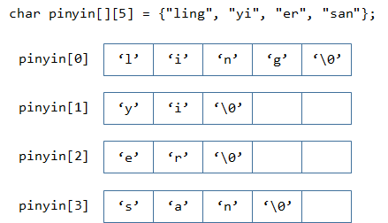

# 数组、字符串


## 数组的基本用法

### 定义数组

```
typeName arrayName[constExpression]
元素类型  数组名字[元素个数（常数）]
```

数组的实际使用长度可以小于数组的最大长度，通常需要用两个变量（或常量）来存放。

如用`N`表示数组当前存放元素的个数，`MAXN`表示数组最大长度

```cpp
int A[5];

#define MAXN 10
int B[MAXN];
```

特别提醒，现在学的这个语法，数组大小必须是常数，也就是说在编写代码时就必须确定好数组的大小。后面学了指针会讲动态分配数组，数组大小可以是变量，即可以根据实际情况创建指定大小的数组。

```cpp
int n;
scanf("%d", &n);
int A[n];   //错误，数组的长度n为变量
int B[100 + 5]  //正确
```

### 数组初始化

* 可使用`{}`为数组指定初始值

  ```c
  int A[5] = {1, 2, 3, 4, 5};
  ```

* 在初始化数组时，可以省略数组的长度，编译器会自动推断

  ```c
  int A[] = {1, 2, 3, 4, 5};	//编译器自动推断该数组的长度为5
  ```

  但在没有使用`{}`来初始化数组时，定义数组必须指定数组的长度

  ```c
  int A[]; 	//错误，未指定数组的长度
  ```

* 可以只给数组部分元素赋初始值，此时编译器会自动把剩余数组元素初始化为0

  ```c
  int A[5] = {1, 2, 3}; 	// {1, 2, 3, 0, 0}
  int B[5] = {1};			// {1, 0, 0, 0, 0}
  bool v[3] = {true};		// {true, false, false}
  
  //定义一个数组，并且将其初始化为0，通常这么写
  int C[5] = {0}; 		// {0, 0, 0, 0, 0}
  ```

* 绝对不能使用赋值语句进行初始化

  ```c
  int A[3];
  A = {1, 2, 3};	//错误
  ```

* 数组在使用前应当初始化，若数组没有被初始化，而直接访问其内容，所得结果可能非常奇怪。

  ```c
  #include <stdio.h>
  
  int main() {
  	int A[5];	//数组A并未被初始化，其存放的数不确定
  
  	//数组A并未被初始化，输出的结果可能非常奇怪
  	for (int i = 0; i < 5; i++) {
  		printf("%d ", A[i]);
  	}
  	printf("\n");
  
  	return 0;
  }
  ```

  该代码在vs的debug模式下运行结果为：

  ```
  -858993460 -858993460 -858993460 -858993460 -858993460
  ```

  原因（了解）：在debug模式下，vs会对局部变量所在内存（准确的说是栈内存）按字节初始化为16进制数`0xCC`，此时数组C中每个元素的值都为`0xCCCCCCCC`，用补码表示（即将该二进制数解释成`int`类型）就是-858993460这么一个奇怪的数。vs之所以会这么做是为了让程序员在debug模式下发现程序潜在的错误。


### 数组的遍历

可通过下标运算符`[]`访问数组中的每一个元素，数组下标从0开始计数，对于最大长度为`MAXN`的数组，其下标范围是`0 ~ MAXN-1`。

遍历：对数组中的每一个元素均访问（也可以修改）一次，不重复不漏掉。对访问的顺序并无要求（数组是一种线性结构，通常是顺序遍历）。

对于实际含有N个元素的数组A：

* 通常元素从下标0开始存放，数组每个元素的编号是`0 ~ N-1`
  * 顺序：`for (int i = 0; i < N; i++)`
  * 逆序：`for (int i = N - 1; i >= 0; i--)`
* 若元素从下标1开始存放（数组下标0实际上并没有存放数据），数组每个元素的编号是`1 ~ N`
  * 顺序：`for (int i = 1; i <= N; i++)`
  * 逆序：`for (int i = N; i >= 1; i--)`

```cpp
#include <stdio.h>
#define MAXN 100

int main() {
	int A[MAXN];
	int N = 10;

	//数组元素依次赋值
	for (int i = 1; i <= N; i++) {
		A[i] = 100 + 10 * i;
	}

	//逆序输出数组
	for (int i = N; i >= 1; i--) {
		printf("%d ", A[i]);
	}
	printf("\n");

	return 0;
}
```
### 数组的复制

```c
int A[5] = {1, 2, 3, 4, 5};
int B[5];

//试图将A数组的内容复制到B数组中
B = A;		//错误写法

//试图将数组A重置为0
A = {0};	//错误写法
```

C语言的数组是不支持直接使用赋值运算符操作，只能对数组元素逐一进行操作（通常借助for循环）。

```c
#include <stdio.h>
#define MAXN 5

int main() {
	int A[MAXN] = { 1, 2, 3, 4, 5 };
	int B[MAXN];

	//将A数组的内容复制到B数组中
	for (int i = 0; i < MAXN; i++) {
		B[i] = A[i];
	}

	//将数组A重置为0
	for (int i = 0; i < MAXN; i++) {
		A[i] = 0;
	}

	//...
	return 0;
}
```

### 例题：数组的基本操作

程序读入一组整数，依次输出其最大值、最小值、以及总和，并将其逆序输出。

输入数据第一行给出数据的个数N (N<=100)，第二行依次为这些数。

```
样例输入：
5
-1 0 -3 12 8

样例输出:
max = 12, min = -3, sum = 16
8 12 -3 0 -1
```
示例代码：
```cpp
#include <stdio.h>
#define MAXN 105
#define INF 1e9

int main() {
    int A[MAXN];
    
    int N;
    scanf("%d", &N);
    
    //读入数组
    for (int i = 0; i < N; i++) {
        scanf("%d", &A[i]);
    }
    
    int sum = 0;			//累积变量sum一定要初始化为0
    int min_value = INF;	//先将当前最小值初始化为一个非常大的数
    int max_value = -INF;	//先将当前最大值初始化为一个非常小的数
    for (int i = 0; i < N; i++) {
        sum += A[i];
        //如果当前元素比记录的最大值要大，就更新记录的最大值，反之同理。
        if (A[i] > max_value) max_value = A[i];	
        if (A[i] < min_value) min_value = A[i];
    }
    
    printf("max = %d, min = %d, sum = %d\n", max_value, min_value, sum);
    
    //数组逆置
    for (int i = 0; i < N / 2; i++){
        //交换A[i]与A[N - i - 1]的值
        int temp = A[i];
        A[i] = A[N - i - 1];
        A[N - i - 1] = temp;
    }
    
    for (int i = 0; i < N; i++) {
        printf("%d ", A[i]);
    }
    printf("\n");
    
    return 0;
}
```


```
N = 5
0, 1, 2, 3, 4
N = 6
0, 1, 2, 3, 4, 5
```
## 数组的常见使用场景

### 存放数据

#### 计算方差

程序读入一组数，求这些数的方差（结果保留两位小数）。

输入数据第一行给出数据的个数N (N<=100)，第二行依次为这些数。

方差公式：
$$
\sigma^2 = \frac{\sum_1^N (X_i - \overline{X})^2}{N}
$$

```
样例输入：
5
1 2 3 4 5

样例输出:
2.00
```

```cpp
#include <stdio.h>
#define MAXN 105

int main() {
    double num[MAXN];
    
	int N;
	scanf("%d", &N);
    
	double sum = 0;
	for (int i = 0; i < N; i++) {
		scanf("%lf", &num[i]);
		sum += num[i];	//在读入数据时就可以求和
	}

	double avg = sum / N;
    
	double variance = 0;	//方差
	for (int i = 0; i < N; i++) {
		double delta = avg - num[i];
		variance += delta * delta;
	}
	variance /= N;
    
	printf("%.2f\n", variance);

	return 0;
}
```

### 空间换时间策略

#### 筛选法求质数

给1万个1-100的数，依次判断这些数是否是质数

如果对于每个数都现场判断是否是质数则效率非常低下

可以提前准备一个`bool`数组A，如`A[100]=false`则表示100不是质数

| i    | 0    | 1    | 2    | 3    | 4    | 5    | 6    | 7    | 8    | 9    | 10   | 11   | 12   | 13   |
| ---- | ---- | ---- | ---- | ---- | ---- | ---- | ---- | ---- | ---- | ---- | ---- | ---- | ---- | ---- |
| A[i] | F    | F    | T    | T    | F    | T    | F    | T    | F    | F    | F    | T    | F    | T    |

为了生成这么一个质数表，可以采用筛选法

```cpp
#include <stdio.h>
#define MAXN 105

int main() {
    bool isPrimeNum[MAXN];
    
    //数组初始化
	isPrimeNum[0] = isPrimeNum[1] = false;    
	for (int i = 2; i < MAXN; i++) {
		isPrimeNum[i] = true;
	}
    //生成质数表
	for (int i = 2; i < MAXN; i++) {	//从2开始，因为2是最小的质素
		if (isPrimeNum[i]) {
			//把i的倍数全部设置成非质数
			//比如i=2，则把4、6、8...设置成非质数
			//若i=3，则把6、9、12、15...设置成非质数
			for (int j = 2 * i; j < MAXN; j += i) {	//注意该for循环的写法，容易出错
				isPrimeNum[j] = false;
			}
		}
	}
    //此时质数表已创建好，可以直接使用了
    
	int N;
	scanf("%d", &N);
	for (int t = 0; t < N; t++) {
		int x;
		scanf("%d", &x);
		printf("%s\n", isPrimeNum[x] ? "true" : "false");
	}
	return 0;
}
```


#### 数组范围求和

给定一组数，反复查询从第i个数到第j个数之间的和（从0开始计数，包含两端端点）

输入格式：

第一行给出数`N`，表示这组数的个数

第二行依次给出这`N`个数

第三行给出数`K`，表示接下来有`K`次查询

接下来`K`行，每行给出查询范围`i, j`

```
样例输入
6
0 1 2 3 4 5
3
0 2
2 5
0 5

样例输出
3
14
15
```

解析：
```
A[] = {1, 2, 3, 4, 5};
A[1]+A[2]+A[3] = 数组A前4个元素和 减去 数组A前1个元素和
sum[i]表示数组A前i个元素的和
A[i]+A[i+1]+...+A[j] = sum[j+1] - sum[i]

对于sum数组：
sum[0] = 0
sum[1] = A[0]
sum[2] = A[0] + A[1] = sum[1] + A[1]
sum[3] = A[0] + A[1] + A[2] = sum[2] + A[2]
sum[i] = sum[i-1] + A[i-1]

比如：
A[] = {1, 2, 3, 4, 5};
sum[] = {0, 1, 3, 6, 10, 15}
```

```cpp
#include <stdio.h>
#define MAXN 1005

//sum[i]表示数组A前i个元素的和，且sum[0] = 0
//全局变量自动初始化为0
int sum[MAXN];

int main() {
	int N;
	scanf("%d", &N);
	//这里并不需要存放原始数据，即没有A[]数组，只有sum[]数组
	for (int i = 1; i <= N; i++) {
		int x;
		scanf("%d", &x);
		sum[i] = sum[i - 1] + x;
	}

	int K;
	scanf("%d", &K);
	while (K--) {
		int i, j;
		scanf("%d %d", &i, &j);
		int ans = sum[j + 1] - sum[i];
		printf("%d\n", ans);
	}
	return 0;
}
```


### 建立映射关系

数组`Type A[MAXN]`可以看作是数组下标`i`到其对应元素`A[i]`的一种映射关系（key -> value）

数组下标`i`只能是`int`（准确的说应该是`unsigned int`，下标不能为负）类型

* `int A[MAXN]` 可看成是 `int -> int` 的映射：统计每个数字出现的次数
* `bool B[MAXN]` 可看成是 `int -> bool` 的映射：记录每个数字是否出现过

若想建立任意类型之间的映射关系，例如`char -> int`（统计每个字母出现的次数），先建立 `char -> int`之间的映射（可以借助ASCII码），再借助数组建立`int -> int`的映射。


#### 统计数字出现次数

程序读入一组数，每个数介于0-9，对于出现过的每个数字，输出其出现的次数。

输入数据第一行给出数据的个数N (N<=100)，第二行依次为这些数。

```
样例输入：
11
1 2 3 1 1 2 4 6 2 8 3

样例输出:
Number 1 appeared 3 times
Number 2 appeared 3 times
Number 3 appeared 1 times
Number 4 appeared 1 times
Number 6 appeared 1 times
Number 8 appeared 1 times
```


```cpp
#include <stdio.h>
#define MAXN 10

int main() {
    int number_count[MAXN] = {0};
    
	int N;
	scanf("%d", &N);

	for (int i = 0; i < N; i++) {
		int x;
		scanf("%d", &x);
		number_count[x] += 1;
	}

	for (int i = 0; i < MAXN; i++) {
		int cnt = number_count[i];
		if (cnt > 0) {
			printf("Number %d appeared %d times\n", i, cnt);
		}
	}
	
	return 0;
}
```

## 二维数组

```cpp
#include <stdio.h>

int main() {
    int A[2][3] = { {1,2,3},{4,5,6} };
    int B[2][3] = { 1,2,3,4,5,6 };
    int C[3][4] = { {1,2,3,4},
                    {5,6,7,8},
                    {3,3,4,4} };
    //1,0,0
    //0,2,0
    //0,0,3
    int D[3][3] = { {1},{0,2},{0,0,3} };

    printf("%d", C[0][3]);
    return 0;
}
```


### 矩阵加法

第一行给出N、M（N, M <= 100）两个数代表矩阵的行数和列数。接下来2*N行给出两个矩阵每个元素的值。

```
样例输入：
2 3
1 2 3
4 5 6
3 3 3
0 -1 -2
样例输出:
4 5 6
4 4 4
```
参考代码:
```cpp
#include <stdio.h>
#define MAXN 105

int A[MAXN][MAXN], B[MAXN][MAXN];
int ans[MAXN][MAXN];

int main() {
    int N, M;
    scanf("%d %d", &N, &M);
    //读入矩阵A、B
    for (int i = 0; i < N; i++) {
        for (int j = 0; j < M; j++) {
            scanf("%d", &A[i][j]);
        }
    }
    for (int i = 0; i < N; i++) {
        for (int j = 0; j < M; j++) {
            scanf("%d", &B[i][j]);
        }
    }
    //计算矩阵A+B
    for (int i = 0; i < N; i++) {
        for (int j = 0; j < M; j++) {
            ans[i][j] = A[i][j] + B[i][j];
        }
    }
    //输出结果
    for (int i = 0; i < N; i++) {
        for (int j = 0; j < M; j++) {
            printf("%d ", ans[i][j]);
        }
        printf("\n");	//每行结束输出一个换行符
    }
    return 0;
}
```


### 杨辉三角

```
1
1 1
1 2 1
1 3 3 1
1 4 6 4 1
```

每一行的开始和结束都是1；其余位置的元素是这样计算：

`A[i][j] = A[i - 1][j] + A[i - 1][j - 1];`

读入一个数字`n`，输出杨辉三角的前`n`行。(n <= 20)

```c
#include <stdio.h>
#define MAXN 25

int A[MAXN][MAXN];

int main() {
	int N;
	scanf("%d", &N);

	for (int i = 1; i <= N; i++) {
		//行号从1开始计数，这样第i行一共有i个数
		//列号也从1开始计数。这样第i行中的每一个数的列号j的取值是 1 <= j <= i
		A[i][1] = 1;	//第i行的第一个数
		for (int j = 2; j < i; j++) {
			A[i][j] = A[i - 1][j - 1] + A[i - 1][j];
		}
		A[i][i] = 1;	//第i行的最后一个数
	}

	for (int i = 1; i <= N; i++) {
		for (int j = 1; j <= i; j++) {
			printf("%d ", A[i][j]);
		}
		printf("\n");
	}

	return 0;
}
```

作业：弄懂并运行该代码，并将代码修改成行号和列号均从0开始计数


### 图片平滑器

包含整数的二维矩阵 M 表示一个图片的灰度。你需要设计一个平滑器来让每一个单元的灰度成为平均灰度 (向下舍入) ，平均灰度的计算是周围的8个单元和它本身的值求平均，如果周围的单元格不足八个，则尽可能多的利用它们。

```
样例输入
3 3
1 1 1
1 0 1
1 1 1

样例输出
0 0 0
0 0 0
0 0 0

解释
对于点 (0,0), (0,2), (2,0), (2,2): 平均 = 3/4 = 0
对于点 (0,1), (1,0), (1,2), (2,1): 平均 = 5/6 = 0
对于点 (1,1): 平均 = 8/9 = 0
```

```
样例输入
4 6
1 2 3 4 5 6
1 0 100 3 8 10
3 3 2 9 1 0
0 0 0 8 7 6

样例输出
1 17 18 20 6 4
1 12 14 15 5 3
1 12 13 15 5 3
1 1 3 4 5 2
```


```cpp
#include <stdio.h>
#define MAXN 105

int src[MAXN][MAXN];	//src-source 源矩阵
int dst[MAXN][MAXN];	//dst-destination 目标矩阵

int main() {
	int N, M;
	scanf("%d %d", &N, &M);

	for (int i = 0; i < N; i++) {
		for (int j = 0; j < M; j++) {
			scanf("%d", &src[i][j]);
		}
	}

	for (int r = 0; r < N; r++) {
		for (int c = 0; c < M; c++) {
			int cnt = 0;
			for (int nr = r - 1; nr <= r + 1; nr++) {
				for (int nc = c - 1; nc <= c + 1; nc++) {
					//周围邻居的坐标为(nr, nc)，且需要检查是否超出数组边界
					if (0 <= nr && nr < N && 0 <= nc && nc <= M) {
						cnt++;
						dst[r][c] += src[nr][nc];
					}
				}
			}
			dst[r][c] /= cnt;
		}
	}

	for (int i = 0; i < N; i++) {
		for (int j = 0; j < M; j++) {
			printf("%d ", dst[i][j]);
		}
		printf("\n");
	}

	return 0;
}
```


### 矩阵reshape

矩阵的reshape操作是指将原`N*M`的矩阵中的所有元素按行依次填充到一个新的`r*c`的矩阵中。

```
样例输入
//第一行的4个数表示将N*M (3*4)的矩阵reshape成R*C (2*6)的矩阵
3 4 2 6
1 2 3 4
2 2 2 2
3 3 2 9

样例输出
1 2 3 4 2 2
2 2 3 3 2 9
```


一个R行C列的二维数组，若将其映射成一维数组，则坐标`(i, j)`的元素在一维数组对应的下标为`i * C + j`

同理，一维数组中下标为`k`的元素，在二维数组的坐标为`(k / C, k % c)`


```cpp
#include <stdio.h>
#define MAXN 105

int src[MAXN][MAXN];	//src-source 源矩阵
int dst[MAXN][MAXN];	//dst-destination 目标矩阵

int main() {
	int N, M, R, C;
	scanf("%d %d %d %d", &N, &M, &R, &C);

	if (N * M != R * C) {
		printf("can not reshape\n");
		return 0;	//提前退出程序
	}

	for (int i = 0; i < N; i++) {
		for (int j = 0; j < M; j++) {
			scanf("%d", &src[i][j]);
		}
	}

	for (int r = 0; r < R; r++) {
		for (int c = 0; c < C; c++) {
			int idx = r * C + c;
			dst[r][c] = src[idx / M][idx % M];
		}
	}

	for (int i = 0; i < R; i++) {
		for (int j = 0; j < C; j++) {
			printf("%d ", dst[i][j]);
		}
		printf("\n");
	}

	return 0;
}
```


## 字符数组与字符串

### 字符串

字符串（String）实际上是一系列字符的集合。在C语言中，没有专门的string类型，通常是用一个字符数组来存放一个字符串。

* 字符串用双引号`""`界定，单个字符用单引号`''`界定
* 字符串必须有一个结尾标志，用`\0`表示（`\0`字符的ascii码为0）。因此字符串的长度至少要比其表示的内容的长度至少多1。比如为了容纳一个`"aaa"`，至少需要长度为4的字符数组来存放。
* `string.h`库中的`strlen`函数可用于计算字符串的长度（不包括结尾`\0`）


```cpp
#include <stdio.h>
#include <string.h>

int main() {
    char c[] = { 'h','e','l','l','o',' ','w' ,'o' ,'r' ,'l' ,'d'};//结尾没有\0不叫字符串
    
    char str1[] = { 'h','e','l','l','o',' ','w' ,'o' ,'r' ,'l' ,'d', '\0'};//字符串
    char str2[] = "hello world";	//这种写法更简洁，但该语法仅限于初始化使用
    printf("str1: %s\n", str1);
    printf("str2: %s\n", str2);

    char str3[20] = "hello";
    char str4[20] = "hello\0 world";
    printf("str4: %s\n", str4);

    printf("%d\n", strlen(str3));   //5
    printf("%d\n", sizeof(str3));   //20
    printf("%d\n", strlen(str4));   //5
    printf("%d\n", sizeof(str4));   //20
    return 0;
}
```


### 字符串数组

一个字符串实际上是一个一维的字符数组。

字符串数组的每个成员都是一个字符串，因此字符串数组实际上是一个二维的字符数组

在使用`{}`初始化一个二维字符数组时，数组第一维的长度可以省略，编译器会帮你计算，但第二维的长度不能省略，需要手动给出（注意算上`\0`）




```cpp
#include <stdio.h>
#include <string.h>
#define MAXN 105

//这里使用了映射的思想。可将 数组下标p -->  A[p]
char num_pinyin[10][10] = {"ling", "yi", "er", "san", "si",
                          "wu", "liu", "qi", "ba" , "jiu"};

int main() {
	for (int i = 0; i < 10; i++) {
        printf("%d: %s\n", i, num_pinyin[i]);
    }
	return 0;
}
```


## 编程作业

### 连续的K

```
题目描述
读入一串由'K'和'D'组成的字符串(字符串长度小于1000)，求出这个字符串最多有多少个连续的K
题目背景：在英雄联盟LOL中，如果你连续杀人(Kill)超过一定数游戏会语音播报，比如你连续击杀>=8个人，游戏会语音播放"超神legendary"，而你一旦死掉(Death)你的连杀记录就被重置为0。

输入样例：
KKKDKKDDDKKKK

输出样例：
4
```


### 矩阵压缩

将一个`N*M`的矩阵的行、列数压缩成原来的一半，即新矩阵成为原来矩阵的1/4大小。

具体变换如下所示，上下左右相邻的四个元素取平均值（取整）

```
      src                          dst
1 5 | 1 1 | 1 2         
3 4 | 3 3 | 5 4                   2 2 3
--------------- -> transformed -> 4 4 3
3 3 | 0 0 | 2 2          
5 5 | 8 8 | 4 5  
```

程序第一行读入N、M，(N、M均小于100且为偶数)。

```
样例输入：
4 6
1 5 1 1 1 2
3 4 3 3 5 4
3 3 0 0 2 2
5 5 2 2 4 5

样例输出：
3 2 3
4 1 3
```

提示：观察矩阵变换前后，其对应元素的行列下标之间的关系，用代码实现时通常行号列号都是从0开始计数


### 矩阵相乘

```
将两个给定的矩阵(3*3)相乘得到另一个距阵并将其打印出来。

样例输入
1 2 3 3 2 1 1 1 1
1 1 1 1 2 3 1 2 3

样例输出
6 11 16
6 9 12
3 5 7
```

要求将矩阵乘法计算的过程提取出来作为一个函数。

按理说该函数应该是接收两个二维数组，返回一个二维数组，但目前无法做到。

所以这里简单起见就通过全局变量的方式来传递函数的参数以及结果，此时该函数的参数为空，返回类型为`void`


### 念整数

```
题目内容：
你的程序要读入一个整数，范围是[-100000,100000]。然后，用汉语拼音将这个整数的每一位输出出来。
如输入1234，则输出：
yi er san si
注意，每个字的拼音之间有一个空格，但是最后的字后面没有空格。当遇到负数时，在输出的开头加上“fu”，如-2341输出为：
fu er san si yi

输入格式:
一个整数，范围是[-100000,100000]。

输出格式：
表示这个整数的每一位数字的汉语拼音，每一位数字的拼音之间以空格分隔。

输入样例：
-30

输出样例：
fu san ling
```

要求编写一个函数`void printPinYin(char ch);`，其功能是输出对应对应字符的拼音。


### 字频统计

读取一串只包含大小写字母的字符串，输出出现次数最多的字母及其出现的次数，在统计每个字母出现的次数时不区分字母的大小写。

```
样例输入：
aaAAabbbcdddefA

样例输出：
a 6
```


### 鞍点

```
题目内容：
给定一个n*n矩阵A。矩阵A的鞍点是一个位置（i，j），在该位置上的元素是第i行上的最大数，第j列上的最小数。一个矩阵A也可能没有鞍点。
你的任务是找出A的鞍点。

输入格式:
输入的第1行是一个正整数n, （1<=n<=100），然后有n行，每一行有n个整数，同一行上两个整数之间有一个或多个空格。

输出格式：
对输入的矩阵，如果找到鞍点，就输出其下标。下标为两个数字，第一个数字是行号，第二个数字是列号，均从0开始计数。
如果找不到，就输出
NO
题目所给的数据保证了不会出现多个鞍点。

输入样例：
4 
1 7 4 1 
4 8 3 6 
1 6 1 2 
0 7 8 9

输出样例：
2 1
```


## 作业参考代码

### 连续的K

```cpp
#include <stdio.h>
#include <string.h>
#define MAXN 1010

char str[MAXN];

int main() {
	scanf("%s", str);
	int len = strlen(str);	//求字符串的长度
	int cnt = 0;
	int max_cnt = 0;
	for (int i = 0; i < len; i++) {
		if (str[i] == 'K') {
			cnt++;
		} else {
			cnt = 0;
		}
		if (cnt > max_cnt) max_cnt = cnt;
	}
	printf("%d\n", max_cnt);
	return 0;
}
```


### 矩阵压缩

```cpp
#include <stdio.h>

#define MAXN 105

int src[MAXN][MAXN];	//source
int dst[MAXN][MAXN];	//destination

int main() {
	int N, M;
	scanf("%d %d", &N, &M);
	for (int i = 0; i < N; i++) {
		for (int j = 0; j < M; j++) {
			scanf("%d", &src[i][j]);
		}
	}

	int newN = N / 2;
	int newM = M / 2;
	for (int i = 0; i < newN; i++) {
		for (int j = 0; j < newM; j++) {
			int ii = 2 * i;
			int jj = 2 * j;
			int sum = src[ii][jj] + src[ii + 1][jj] + 
				src[ii][jj + 1] + src[ii + 1][jj + 1];
			dst[i][j] = sum / 4;
		}
	}

	for (int i = 0; i < newN; i++) {
		for (int j = 0; j < newM; j++) {
			printf("%d ", dst[i][j]);
		}
		printf("\n");
	}
	return 0;
}
```


### 矩阵相乘

根据矩阵运算规则，对于两个3*3的矩阵相乘：

`C[i][j] = A[i][1] * B[1][j] + A[i][2] * B[2][j] + A[i][3] * B[3][j] `

当然写代码时行列编号通常从0开始计数。

```cpp
#include <stdio.h>

const int MAXN = 10;
int N = 3;
int A[MAXN][MAXN], B[MAXN][MAXN], C[MAXN][MAXN];

void calculate() {
    for (int i = 0; i < N; i++) {
        for (int j = 0; j < N; j++) {
            int sum = 0;
            for (int k = 0; k < N; k++) {
                sum += A[i][k] * B[k][j];	//这个好好琢磨一下
            }
            C[i][j] = sum;
        }
    }
}

int main() {
    for (int i = 0; i < N; i++) {
        for (int j = 0; j < N; j++) {
            scanf("%d", &A[i][j]);
        }
    }
    for (int i = 0; i < N; i++) {
        for (int j = 0; j < N; j++) {
            scanf("%d", &B[i][j]);
        }
    }

    calculate();
    for (int i = 0; i < N; i++) {
        for (int j = 0; j < N; j++) {
            printf("%d ", C[i][j]);	//每一个数后跟一个空格
        }
        printf("\n");	//每一行输出一个\n
    }
    return 0;
}
```


### 念整数

尽管可以使用if-else语句或者switch-case语句来完成对0-9的判断，但使用字符串数组实现int->字符串类型的映射是更好的做法。

```cpp
switch(num){
case 0:
    printf("ling");
    break;
case 1:
	printf("yi");
    break;
    //.....
}
```

使用数组下标来建立数字与字符串的映射关系

```cpp
#include <stdio.h>
#include <string.h>

void printPinYin(char ch) {
    static char pinyin[][10] = { "ling","yi","er","san","si","wu","liu","qi","ba","jiu" };  //字符串数组
    if (ch == '-') {	//负号比较特殊，需要单独判断输出
        printf("fu ");
        return;
    }
    int index = ch - '0';  //将数字字符转换成其对应的数字，如： '7' - '0' = 7
    printf("%s ", pinyin[index]);
}

int main() {
    char str[20];
    scanf("%s", str);
    int len = strlen(str);
    for (int i = 0; i < len; i++) {
        printPinYin(str[i]);
    }
    printf("\n");
    return 0;
}
```

当然也可以逐个读入单个字符，此时main函数应该这么写（其余的不变）

```cpp
int main() {
    char ch;
    while (scanf("%c", &ch) == 1 && ch != '\n') {
        printPinYin(ch);
    }
    printf("\n");
    return 0;
}
```


### 字频统计

```cpp
#include <stdio.h>
#include <string.h>

#define MAXN 26

int main() {
	int A[MAXN] = { 0 };	//局部数组在使用前一定要手动初始化
	char str[1000];
	scanf("%s", str);
	int len = strlen(str);

	int max_cnt = -1;
	int max_cnt_index;

	for (int i = 0; i < len; i++) {
		//单独用一个char类型变量来记录当前处理的字符
		//可简化代码，避免后面反复出现 str[i]
		char ch = str[i];

		//遇到非字母字符就跳过，增强了代码的健壮性
		//即代码具有一定的容错能力
		if (!(ch >= 'a' && ch <= 'z') &&
			!(ch >= 'A' && ch <= 'Z')) {
			continue;
		}

		//如果遇到大写字母则将其转换为小写字母
		if (ch >= 'A' && ch <= 'Z') {
			ch = ch + 'a' - 'A';
		}

		//借助ascii码将char类型映射成int类型
		//如 'a' -> 0; 'b' -> 1; 'z' -> 25;
		int index = ch - 'a';

		A[index]++;

		if (A[index] > max_cnt) {
			max_cnt = A[index];
			max_cnt_index = index;
		}
	}

	printf("%c %d\n", max_cnt_index + 'a', max_cnt);
	return 0;
}
```


### 鞍点
```cpp
#include <stdio.h>
#define MAXN 105
#define INF 1e9

int G[MAXN][MAXN];
int maxInRow[MAXN], minInCol[MAXN];
int x, y;

//函数本身返回是否找到满足题意的点(true/false)
//若找到，则通过修改全局变量x、y的方式向调用者传递找到的点的坐标
bool judge(int N) {  
    for (int i = 0; i < N; i++) {
        for (int j = 0; j < N; j++) {
            if (G[i][j] == maxInRow[i] && G[i][j] == minInCol[j]) {
                x = i; y = j;
                return true;
            }
        }
    }
    return false;
}

int main() {
    for (int i = 0; i < MAXN; i++) maxInRow[i] = -INF; //初始化数组
    for (int i = 0; i < MAXN; i++) minInCol[i] = INF;
    int N;
    scanf("%d", &N);
    for (int i = 0; i < N; i++) {
        for (int j = 0; j < N; j++) {
            scanf("%d", &G[i][j]);
            if (G[i][j] > maxInRow[i]) maxInRow[i] = G[i][j];
            if (G[i][j] < minInCol[j]) minInCol[j] = G[i][j];
        }
    }
    if (judge(N)) {
        printf("%d %d\n", x, y);
    } else {
        printf("NO\n");
    }
    return 0;
}
```


## 考题练习

1. 以下对一维数组a的正确说明是：

   A)     char a(10);                    B) int a[]； 

   C)      int k＝5，a[k]；                     D）char  a[3]={‘a’,’b’,’c’};

2. 以下能对一维数组a进行初始化的语句是: (        )

   A. int a[5]=(0,1,2,3,4,)  B. int a(5)={}  

   C. int a[3]={0,1,2}       D. int a{5}={10*1}

3. 在C语言中对一维整型数组的正确定义为   D    。

   A) int a(10);          B)  int n=10,a[n];         C) int  n;   a[n];        

   D)#define N 10          int a[N]; 

4. 已知：int  a[10]; 则对a数组元素的正确引用是（    ）。

   A、a[10]     B、a[3.5]     C、a(5)     D、a[0]

5. 若有说明：`int a[][3]={{1,2,3},{4,5},{6,7}}; `则数组a的第一维的大小为: (    )

   A.  2     B.  3     C.  4   D.无确定值

答案:1-5:DCDDB

