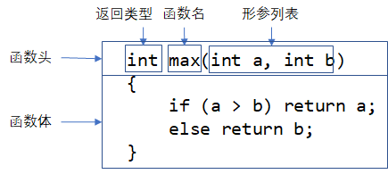

# 函数

## 函数基本使用方法
```cpp
#include <stdio.h>

int abs(int x) {
	if (x > 0) return x;
	else return -x;
}

int max(int a, int b) {
    if (a > b) return a;
    else return b;
}

int main() {
	printf("%d\n", abs(-10));
    
    int a = 1, b = 2;
    printf("%d\n", max(a, b));
    
    int c = max(-1, -3) + abs(-2);
    printf("%d\n", c);
    
	return 0;
}
```
`math.h`这个库中包含了常见的数学函数。

```cpp
// double sin(double x);
// double pow(double x, double y);
// double sqrt(double x);

#include <stdio.h>
#include <math.h>

int main(){
    double ans = sqrt(4);
    printf("%f", ans);
}
```


### 函数定义



### 函数调用

函数调用的形式是在函数名后加上小括号`()`，依次传入对应类型的参数。

`()`称为函数调用运算符，使用该运算符的表达式称为函数调用表达式，调用该函数后的函数返回值作为该表达式的计算结果。

函数调用运算符括起来的表达式称作实参（argument），实参不止一个时，使用逗号分隔。

注意，在定义函数时，形参列表（parameter type list）中需要注明每个形参的参数类型。但在调用函数时，实参前面不能添加类型。

形式参数：定义函数时，用于接收外部传入的数据，叫做形式参数，简称形参。

实际参数：调用函数时，传给形参的实际的数据，叫做实际参数，简称实参。

形参一定是变量，但实参仅仅要求是一个表达式，当实参为变量时，该变量被称为实参变量。

在调用函数时：根据函数名去查找指定的函数，实参与形参的顺序、个数以及类型（可以隐式类型转换）必须匹配。


```c
int a = 1, b = 2;
int result1 = max(int a, int b);	//错误写法
int result2 = max(a, b);	//正确写法

double c = 2.1, d = 3.2;
int result = max((int)c, (int)d);	//这里使用了类型转换运算符
```


### 有返回值的函数

```cpp
bool isPrimeNum(int x);     //C语言中没有bool类型，用0/1表示真假。
char uppercase(char ch);    //将小写字母转换成大写
```
return语句可以提前中断函数的执行，一个函数可以有多个return语句，即有多个出口。

```cpp
#include <stdio.h>

bool isPrimeNum(int x) {
	if (x < 2) return false;	//卫语句
	for (int i = 2; i < x; i++) {
		if (x % i == 0) {
			return false;
		}
	}
	return true;
}

//为了遵守函数单一出口的原则，代码逻辑复杂
bool isPrimeNum2(int x) {
    bool flag = true;
	if (x < 2) {
        flag = false;
    } else {
        for (int i = 2; i < x; i++) {
            if (x % i == 0) {
                flag = false;
                break;
            }
        }
    }
	return flag;
}

int main() {
	int T;
	scanf("%d", &T);
	for (int t = 0; t < T; t++) {
		int x;
		scanf("%d", &x);
		bool flag = isPrimeNum(x);
		printf("%s\n", flag ? "Yes" : "No");
	}
	return 0;
}
```

```cpp
#include <stdio.h>

char uppercase(char ch) {
    //若传入函数的不是小写字母，则直接返回该字符
	if (!(ch >= 'a' && ch <= 'z')) {
		return ch;
	}
	return ch + 'A' - 'a';
}

int main() {
	printf("%c\n", uppercase('h'));
    printf("%c\n", uppercase('+'));
	return 0;
}
```


### 无返回值的函数

```c
#include <stdio.h>

//函数原型声明
void put_n_star(int n);
void put_n_char(char ch, int n);

//连续输出n个星号*
void put_n_star(int n) {
	put_n_char('*', n);
}

//连续输出n个指定字符
void put_n_char(char ch, int n) {
	while (n--) {
		//putchar函数用于输出单个字符
		//效率比printf("*")高
		putchar(ch);
	}
}

int main() {
	int n = 5;
	for (int i = 1; i <= n; i++) {
		put_n_star(i);
		putchar('\n');
	}

	return 0;
}
```


void型函数也可以有return语句，用于提前结束函数的执行，常用于参数的合法性检查。
```cpp
//输出数组从st到ed（不包括ed）下标的元素，len表示数组的长度
void printArray(int A[], int st, int ed, int len){   //[st, ed)
    if (st < 0) {
        printf("printArray函数调用错误，参数st应大于0。错误参数: st = %d, ed = %d, len = %d\n", st, ed, len);
        return;	//卫语句
    }
    if (ed > len) {
        printf("printArray函数调用错误，参数ed应小于等于len。错误参数: st = %d, ed = %d, len = %d\n", st, ed, len);
        return;
    }
    if (st >= ed) {
        printf("printArray函数调用错误，参数st应小于ed。错误参数: st = %d, ed = %d, len = %d\n", st, ed, len);
        return;
    }
    for (int i = st; i < ed; i++){
        printf("%d ", A[i]);
    }
    printf("\n");
}
```

### 函数原型声明

编译器在编译C语言代码时会把源代码文件从头到尾扫描，**原则上函数定义要出现在函数调用之前**，否则就会报错。

```c
#include <stdio.h>

int main() {
	int res = f(1, 2);	//调用了f函数，报错："f": 找不到标识符
	printf("%d\n", res);
	return 0;
}

int pow(int x) {		//pow函数定义
	return x * x;
}

int f(int a, int b) {	//f函数定义
	return add(pow(a), pow(b)); //调用了add和pow函数，报错："add": 找不到标识符
}

int add(int a, int b) {	//add函数定义
	return a + b;
}
```

调整顺序后代码可以编译通过

```cpp
#include <stdio.h>

int pow(int x) {		//pow函数定义
	return x * x;
}

int add(int a, int b) {	//add函数定义
	return a + b;
}

int f(int a, int b) {	//f函数定义
	return add(pow(a), pow(b)); //调用了add和pow函数
}

int main() {
	int res = f(1, 2);	//调用了f函数
	printf("%d\n", res);
	return 0;
}

```

但在实际开发中，由于函数之前的调用关系可能会非常复杂，很难保证在每一个函数调用之前该函数的定义出现过，这时可以使用函数声明。

所谓声明（Declaration），就是告诉编译器我要使用这个函数，你现在没有找到它的定义不要紧，请不要报错，稍后我会把定义补上。  

函数原型声明的格式：

* 去掉函数定义中的函数体，并在最后加上分号`;`

    ```c
    int add(int a, int b);
    ```

* 在函数原型声明时，也可以去掉形参名

    ```c
    int add(int, int);
    ```

添加函数原型声明后的代码如下，可随意调整定义函数的顺序，编译器不会报错。

```c
#include <stdio.h>

int pow(int x);			//pow函数声明
int f(int a, int b);	//f函数声明
int add(int, int);	//add函数声明（函数声明的时候可以省略形参的名字）

int main() {
	int res = f(1, 2);	//调用了f函数，由于前面已经声明的该函数，所以不会报错
	printf("%d\n", res);
	return 0;
}

int pow(int x) {		//pow函数定义
	return x * x;
}

int f(int a, int b) {	//f函数定义
	return add(pow(a), pow(b)); //调用了add和pow函数
}

int add(int a, int b) {	//add函数定义
	return a + b;
}
```


### 值传递机制

```c
#include <stdio.h>

double power(double x, int n) {
	double result = 1.0;
	while (n--) {
		result *= x;
	}
	return result;
}

int main() {
	double a = 2;
	int b = 3;
	double res = power(a, b);
	printf("%f\n", res);
	return 0;
}
```

以上代码，在调用函数`power`时，形参x被赋上实参a的值，形参n被赋上实参b的值，像这样通过值来进行参数传递的机制称为值传递(pass by value)。

实参的变量名与形参的参数名可以相同也可以不同。


```cpp
#include <stdio.h>

void swap(int a, int b){	//这里的a、b称为形参
    int temp = a;
    a = b;
    b = temp;
}

int main() {
    int a = 1, b = 2;
    swap(a, b);	    //我希望能交换a、b的值，即预期结果是a = 2, b = 1
					//这里的a、b称为实参
    printf("%d %d\n", a, b);    //事实上a、b的值并未发生改变，还是a = 1, b = 2
    return 0;
}
```

在函数调用过程中，形参和实参在内存中是两个不一样数据区域。**所以在函数内部对形参变量所进行的修改是不会对实参起作用的**。

## 与数组相关的函数

```c
#include <stdio.h>

//输出数组
void printArray(const int arr[], int arr_size) {
	for (int i = 0; i < arr_size; i++) {
		printf("%d ", arr[i]);
	}
	printf("\n");
}

//重置数组为0
void setArrayZero(int A[], int N) {
	for (int i = 0; i < N; i++) {
		A[i] = 0;
	}
}

//填充数组为指定值
void fillArray(int x, int A[], int N) {
	for (int i = 0; i < N; i++) {
		A[i] = x;
	}
}

//逆置数组
void reverseArray(int A[], int N) {
	for (int i = 0; i < N / 2; i++) {
		//交换A[i]与A[N - i - 1]的值
		int temp = A[i];
		A[i] = A[N - i - 1];
		A[N - i - 1] = temp;
	}
}

//在数组当中查找指定元素key，若找到返回其数组下标，没找到则返回-1
//若有多个结果，则返回第一个遇到的元素的下标
int searchArray(int key, const int A[], int N) {
	for (int i = 0; i < N; i++) {
		if (A[i] == key) {
			return i;
		}
	}
	return -1;
}

int main() {
	int A[] = { 1,2,3,4,5 };
	int N = sizeof(A) / sizeof(int);

	printf("%d\n", searchArray(3, A, N));
	printf("%d\n", searchArray(22, A, N));

	reverseArray(A, N);
	printArray(A, N);
	
	fillArray(5, A, N);
	printArray(A, N);

	setArrayZero(A, N);
	printArray(A, N);

	return 0;
}
```

* 前面讲的函数内部对形参变量修改不能对实参变量起作用这个规则不适用于数组类型（指针那章会解释）。因此按照规范，若对数组是只读操作（不进行修改），则应该在数组形参前面加上`const`关键字。

  ```c
  void printArray(const int arr[], int arr_size) {
  	arr[0] = 1;	//试图对arr数组下标0元素进行修改，编译器会报错
  }
  ```

* 数组作为函数参数时，通常需要传入数组的大小。

  当然函数接口也可以采取如下方式设计，通常数组的区间采用**左闭右开**的形式。

  ```c
  #include <stdio.h>
  
  void printArray(const int arr[], int begin, int end) {
  	for (int i = begin; i < end; i++) {
  		printf("%d ", arr[i]);
  	}
  	printf("\n");
  }
  
  int main() {
      int A[] = { 1,2,3,4,5 };
  	int N = sizeof(A) / sizeof(int);
      printArray(A, 0, N);
      return 0;
  }
  ```

  

## 变量的作用域和生命周期

### 变量的作用域

变量的作用域（Scope）：变量的有效范围，即变量可以在哪个范围内可以被使用。

* 局部变量的作用范围仅限于当前代码块（代码块就是由`{`和`}`括起来的语句）
* 全局变量的作用范围默认是整个程序


```cpp
#include <stdio.h>

int main(){
    int N;
    scanf("%d", &N);
    int sum = 0;
    for (int i = 0; i < N; i++) {	//变量i的作用范围仅限于该for循环
        int x;		//变量x的作用范围仅限于该for循环的循环体
        scanf("%d", &x);
        sum += x;
    }
    printf("%d\n", N);
    printf("%d\n", x);	//未定义标识符 x
    printf("%d\n", i);	//未定义标识符 i
    printf("%d\n", sum);
    return 0;
}
```


```cpp
#include <stdio.h>

int main() {
    int i, N, x, sum;
    scanf("%d", &N);
    //sum变量忘记初始化为0
    for (int i = 0; i < N; i++) {
        scanf("%d", &x);
        sum += x;
    }
    printf("%d\n", N);
    printf("%d\n", x);
    printf("%d\n", i);
    printf("%d\n", sum);
    return 0;
}
```


**编程规范：对于局部变量，应尽可能减小其作用范围，即需要使用某个变量时才定义该变量。**


当局部变量与全局变量同名时，变量的访问遵循就近原则，全局变量会被屏蔽

```cpp
#include <stdio.h>

int a = 10;         //全局变量a

int main() {
    int a = 5;      //局部变量a
    if (a > 0) {
        printf("%d\n", a);  //访问的是局部变量a
    }
    return 0;
}
```


### 变量的生命周期

变量的生命周期（lifecycle）：变量在内存中什么时候被创建，什么时候被销毁

局部变量：

* 函数在执行前会创建好该函数中所有的局部变量
* 函数在执行完后会销毁所有由该函数所创建的局部变量
* 局部变量不会被自动初始化，必须手动初始化

全局变量：

* 程序执行前全局变量会被操作系统加载到内存

- 程序执行完，操作系统会回收程序所有使用的内存，全局变量自然被销毁
- 全局变量若未初始化，则会自动被初始化为0

静态变量：

* 在局部变量前加上`static`关键字修饰，即为静态变量

* 静态变量在本质上是一个全局变量，拥有全局变量的各种性质

* 唯一与全局变量不同的是：静态变量的作用范围与局部变量一致。

  ```cpp
  #include <stdio.h>
  
  void f() {
  	static int cnt = 0;
  	cnt++;
  	printf("当前是第%d次调用该函数\n", cnt);
  }
  
  int main() {
  	f();
  	f();
  	f();
  	f();
  	return 0;
  }
  ```


### 全局变量的使用场景

> https://zhuanlan.zhihu.com/p/59636541

全局变量的缺点：

* 无意间的修改
* 干扰了函数模块化

适合使用全局变量的情况：

* 保存全局数值（Preservation of global values）
* 简化极其常用数据的使用（Streamlining use of extremely common data）
* 消除流浪数据（Eliminating tramp data）

对于初学者来说：

* 比较大的局部变量（长度超过100的局部数组）建议设置成全局数组，或者使用动态内存分配
* 如果某个变量有很多函数都需要使用，则可以设置成全局变量
* 当函数需要返回多个值时，可以使用全局变量来传递（在实际开发中会有更好的解决办法）


```cpp
#include <stdio.h>
#define MAXN 105

int N;
int A[MAXN];	//数组大小超过100，建议设置成全局变量
int max_value, min_value, sum;	//全局变量自动初始化为0，但max_val、min_val还是需要手动初始化

//该函数需要返回数组的最大值、最小值、总和三个值，使用全局变量来传递
void processData() {
	max_value = min_value = A[0];
	for (int i = 0; i < N; i++) {
		sum += A[i];
		if (max_value < A[i]) max_value = A[i];
		if (min_value > A[i]) min_value = A[i];
	}
}

int main() {
	scanf("%d", &N);
	for (int i = 0; i < N; i++) {
		scanf("%d", &A[i]);
	}
	processData();
	printf("max_val = %d, min_val = %d, sum = %d\n", max_value, min_value, sum);
	return 0;
}
```


## 函数的优缺点

优点

- 使得代码逻辑更清晰（函数命名要规范）
- 提高了代码的重用性（避免复制粘贴代码）
- 函数是封装思想的一种体现，在调用函数时，你不必关心函数内部具体是怎么实现的（隐藏了实现细节），而只需关注函数的使用方法，即函数的参数、返回值是什么。函数也是程序模块化设计的一个基本单位，只需事先约定好函数的接口（函数的参数、返回值），便可将该模块交由他人开发。

缺点

- 使用函数并不能加快程序的运行，相反，调用函数也会有一定的性能开销，只是绝大部分情况下可以忽略不计，即函数带来的优点远远大于缺点。在部分场景，比如使用递归时，反复调用函数的性能损失将不能忽略。


## 回形打印

读入N和M，回形打印一个N*M的矩阵，例如：

1. N=5，M=6

    ```
      1   2   3   4   5   6
     18  19  20  21  22   7
     17  28  29  30  23   8
     16  27  26  25  24   9
     15  14  13  12  11  10
    ```

2. N=5，M=3

   ```
     1   2   3
    12  13   4
    11  14   5
    10  15   6
     9   8   7
   ```

对于复杂格式的输出，可以先将结果写到一个二维数组中，再将二维数组输出到屏幕上。

思路：

可以一层一层的输出数字，以N=5，M=6为例：

* 每一层的规律：
  * 第0层，从数字1到18；该层的起点的坐标为(0, 0)，行数为5，列数为6
  * 第1层，从数字19到28；该层的起点的坐标为(1, 1)，行数为3，列数为4
  * 第2层，从数字29到30；该层的起点的坐标为(2, 2)，行数为1，列数为2
  * 第i层：该层的起点的坐标为(i, i)，行数为N-2i，列数为M-2i，当行数和列数均大于0时该层才存在。
* 每一层可以分为4段分别输出，以第0层数字1到18为例：
  * 第1段，从数字1到数字6。该段存在条件：行数大于0
  * 第2段，从数字7到数字9。该段存在条件：列数大于0
  * 第3段，从数字10到数字15。该段存在条件：行数大于1
  * 第4段，从数字16到数字18。该段存在条件：列数大于1

坐标系的定义如下：

坐标(x, y)对应于二维数组的第y行第x列

```
(0,0)---------> x轴
 |
 |
 |
y轴
```


```cpp
#include <stdio.h>
#define MAXN 1024

int canvas[MAXN][MAXN];

void printShapeToCanvas(int N, int M) {
	int cnt = 1;
	int RowNum = N, ColNum = M;		//第i层的行数和列数
	int offsetX = 0, offsetY = 0;	//第i层起点坐标x、y的偏移量
	while (RowNum > 0 && ColNum > 0) {
		int x, y;
		for (int j = 0; j < ColNum; j++) {
			x = j, y = 0;
			canvas[offsetY + y][offsetX + x] = cnt++;
		}
		for (int i = 1; i <= RowNum - 2; i++) {
			x = ColNum - 1, y = i;
			canvas[offsetY + y][offsetX + x] = cnt++;
		}
		if (RowNum > 1) {
			for (int j = ColNum - 1; j >= 0; j--) {
				x = j, y = RowNum - 1;
				canvas[offsetY + y][offsetX + x] = cnt++;
			}
		}
		if (ColNum > 1) {
			for (int i = RowNum - 2; i > 0; i--) {
				x = 0, y = i;
				canvas[offsetY + y][offsetX + x] = cnt++;
			}
		}
		//进入下一层时需更新以下参数
		offsetX += 1, offsetY += 1;
		RowNum -= 2, ColNum -= 2;
	}
}

void printCanvas(int N, int M) {
	for (int i = 0; i < N; i++) {
		for (int j = 0; j < M; j++) {
			printf("%3d ", canvas[i][j]);
		}
		printf("\n");
	}
}

int main() {
	int N, M;
	N = 5, M = 6;
	//scanf("%d %d", &N, &M);

	printShapeToCanvas(N, M);
	printCanvas(N, M);

	return 0;
}
```


## 回形打印（动画显示）

思路1：

```cpp
#include <stdio.h>
#include <stdlib.h>
#include <Windows.h>
#define MAXN 1024

int canvas[MAXN][MAXN];
int N, M;
void printCanvas();
void printShape();
void printPoint(int x, int y, int data);

void printShape() {
	int cnt = 1;
	int RowNum = N, ColNum = M;
	int offsetX = 0, offsetY = 0;
	while (RowNum > 0 && ColNum > 0) {
		int x, y;
		for (int j = 0; j < ColNum; j++) {
			x = j, y = 0;
			printPoint(offsetX + x, offsetY + y, cnt++);
		}
		for (int i = 1; i <= RowNum - 2; i++) {
			x = ColNum - 1, y = i;
			printPoint(offsetX + x, offsetY + y, cnt++);
		}
		if (RowNum > 1) {
			for (int j = ColNum - 1; j >= 0; j--) {
				x = j, y = RowNum - 1;
				printPoint(offsetX + x, offsetY + y, cnt++);
			}
		}
		if (ColNum > 1) {
			for (int i = RowNum - 2; i > 0; i--) {
				x = 0, y = i;
				printPoint(offsetX + x, offsetY + y, cnt++);
			}
		}
		//进入下一层时需更新以下参数
		offsetX += 1, offsetY += 1;
		RowNum -= 2, ColNum -= 2;
	}
}

void printCanvas() {
	Sleep(200);		//暂停200毫秒（0.2秒）
	system("cls");	//清空控制台上的所有内容
	for (int i = 0; i < N; i++) {
		for (int j = 0; j < M; j++) {
			if (canvas[i][j] > 0) {
				printf("%3d ", canvas[i][j]);
			}
			else {
				printf("    ");	//4个空格
			}
		}
		printf("\n");
	}
}

void printPoint(int x, int y, int data) {
	canvas[y][x] = data;
	printCanvas();
}

int main() {
	N = 5, M = 6;
	//scanf("%d %d", &N, &M);

	printShape();

	return 0;
}
```

思路2：

```cpp
#include <stdio.h>
#include <Windows.h>

int gotoxy(short x, short y); 
void printShape(int N, int M);
void printPoint(int x, int y, int data);

void printShape(int N, int M) {
	int cnt = 1;
	int RowNum = N, ColNum = M;
	int offsetX = 0, offsetY = 0;
	while (RowNum > 0 && ColNum > 0) {
		int x, y;
		for (int j = 0; j < ColNum; j++) {
			x = j, y = 0;
			printPoint(offsetX + x, offsetY + y, cnt++);
		}
		for (int i = 1; i <= RowNum - 2; i++) {
			x = ColNum - 1, y = i;
			printPoint(offsetX + x, offsetY + y, cnt++);
		}
		if (RowNum > 1) {
			for (int j = ColNum - 1; j >= 0; j--) {
				x = j, y = RowNum - 1;
				printPoint(offsetX + x, offsetY + y, cnt++);
			}
		}
		if (ColNum > 1) {
			for (int i = RowNum - 2; i > 0; i--) {
				x = 0, y = i;
				printPoint(offsetX + x, offsetY + y, cnt++);
			}
		}
		//进入下一层时需更新以下参数
		offsetX += 1, offsetY += 1;
		RowNum -= 2, ColNum -= 2;
	}
}

//将控制台光标移动到第y行的第x个字符上
//这个函数不用深究，我也是网上百度的...
int gotoxy(short x, short y) {
	COORD coord = { x, y };
	return SetConsoleCursorPosition(GetStdHandle(STD_OUTPUT_HANDLE), coord);
}

void printPoint(int x, int y, int data) {
    //1个数字用4个字符的宽度显示，所以x坐标需乘以4
    //比如第一个数字由第0-3个字符显示，第2个数字由第4-7个字符显示
	gotoxy(x * 4, y);
	printf("%3d ", data);	//数字用空格补足3位，并在后面跟上一个空格，一共4个字符
	Sleep(200);
}

int main() {
	int N, M;
	N = 5, M = 6;
	//scanf("%d %d", &N, &M);

	printShape(N, M);
	gotoxy(0, N);	//将光标移动到第n行
	return 0;
}
```


## 考试题目

### 选择题

1. 对于一个完整的、可运行的C语言源程序来说，main函数是(        ) 

   A. 可以没有      B. 可以有多个        C. 无所谓           D.必须有，且只能是一个

2. 以下哪个不属于使用函数的好处?（     )

   A)提高程序的可读性    B)提高程序的速度       C)隐藏实现细节(封装)      D)代码重用

3. C语言中函数返回值的类型是由(           )决定的.

   ​    A)函数定义时指定的类型          B) return语句中的表达式类型 

   ​    C) 调用该函数时的实参的数据类型      D) 形参的数据类型

4. 在函数调用时，以下说法正确的是（     　）

    A.函数调用后必须带回返回值

      　B.实际参数和形式参数可以同名

      　C.函数间的数据传递不可以使用全局变量

      　D.主调函数和被调函数总是在同一个文件里

5. 在c语言中以下不正确的说法是：（　　）

   A.  实参可以是常量、变量、或表达式

   B.  形参可以是常量、变量或表达式

   C.  实参可以为任意类型

   D.  形参应与其对应的实参类型一致

6. 以下正确的说法是：（　　）

   A.  函数的定义可以嵌套，但函数的调用不可以嵌套

   B.  函数的定义不可以嵌套，但函数的调用可嵌套

   C.  函数的定义和调用均不可以嵌套

   D.  函数的定义和调用均可以嵌套

7. 若已定义的函数有返回值，则以下关于该函数调用的叙述中错误的是：（　　）

   A）函数调用可以作为独立的语句存在

   B）函数调用可以作为一个函数的实参

   C）函数调用可以出现在表达式中

   D）函数调用可以作为一个函数的形参

8. 下述函数定义形式正确的是（      ）。

   ​         A、 int f(int x; int y)             B、 int f(int x,y)

   ​         C、 int f(int x, int y)              D、 int f(x,y: int)

9. 关于函数参数，说法正确的是（      ）。

   A、 实参与其对应的形参各自占用独立的内存单元

   B、 实参与其对应的形参共同占用一个内存单元

   C、 只有当实参和形参同名时才占用同一个内存单元

   D、 形参是虚拟的，不占用内存单元

10. 在调用函数时，如果实参是简单变量，它与对应形参之间的数据传递方式是：（　　） 

    A、 地址传递                               B、 单向值传递 

    C、 由实参传给形参，再由形参传回实参       D、 传递方式由用户指定

### 判断题

1、  (   )return语句作为函数的出口，在一个函数体内只能有一个。　　  

2、  (   )在C程序中，函数不能嵌套定义，但可以嵌套调用。           

3、  (   ) C语言的源程序中必须包含库函数。                           

4、  (   )在C程序中，函数调用不能出现在表达式语句中。              

5、  (   )在C函数中，形参可以是变量、常量或表达式。                  

6、   (   )在C语言中，一个函数一般由两个部分组成，它们是函数首部和函数体。

7、  (   )若定义的函数没有参数，则函数名后的圆括号可以省略。

8、  (   )函数的函数体可以是空语句。

9、  (   )函数的实参和形参可以是相同的名字。

10、 (   )C语言中函数返回值的类型由return语句中的表达式的类型决定。

11、 (   )C语言程序中的main( )函数必须放在程序的开始部分。

12、 (    )函数调用中，形参与实参的类型和个数必须保持一致。


答案

选择题：1-5: DBABB	6-10: BDCAB

判断题：	1-5: FTFFF	6-10: TFTTF	11-12: FT


## 编程作业


将前面写的 “计算sinx”、“水仙花数”这两道题的核心代码提取出来作为一个函数

计算sinx ：

```cpp
double sin(double x);
```


水仙花数：

判断一个数是否是水仙花数

```cpp
bool judge(int num);
```


### 身份证校验

编写一个程序，读入用户输入的身份证号码，根据号码最后一位校验数字判断身份证号码是否合法，输出`Yes`或`No`。

身份证的校验规则如下：

> 1、将前面的身份证号码17位数分别乘以不同的系数。从第一位到第十七位的系数分别为：{ 7, 9, 10, 5, 8, 4, 2, 1, 6, 3, 7, 9, 10, 5, 8, 4, 2 }。
>
> 2、将这17位数字和系数相乘的结果相加，得到检验和。
>
> 3、将校验和除以11，看余数是多少？
>
> 4、余数只可能有0－1－2－3－4－5－6－7－8－9－10这11个数字。其分别对应的最后一位身份证的号码为{ '1', '0', 'X', '9', '8', '7', '6', '5', '4', '3', '2' }。(即余数0对应1，余数1对应0，余数2对应X...)
>
> 5、通过上面得知如果余数是3，就会在身份证的第18位数字上出现的是9。如果对应的数字是2，身份证的最后一位号码就是罗马数字X。
>
> 例如：某男性的身份证号码为【53010219200508011X】， 我们看看这个身份证是不是合法的身份证。
>
> 首先我们得出前17位的乘积和【` (5*7)+(3*9)+(0*10)+(1*5)+(0*8)+(2*4)+(1*2)+(9*1)+(2*6)+(0*3)+(0*7)+(5*9)+(0*10)+(8*5)+(0*8)+(1*4)+(1*2) ` 】是**189**，然后用189除以11得出的结果是189÷11=17余下2，187÷11=17，还剩下2不能被除尽，也就是说其**余数是2**。最后通过对应规则就可以知道余数2对应的检验码是X。所以，可以判定这是一个正确的身份证号码。

当然这个还不完善，因为身份证号的第7-14位是出生日期，所以还可以排除一些明显不可能的日期，当然这个比较麻烦这次作业就不要求。

```cpp
#include <stdio.h>
#include <string.h>

bool isValidIdCard(char str[]) {
	int len = strlen(str);	// 求字符串的长度
	if (len != 18) return false;	//长度不是18位直接不合法
	int W[] = { 7, 9, 10, 5, 8, 4, 2, 1, 6, 3, 7, 9, 10, 5, 8, 4, 2 };
	int checkSum = 0;	// checksum: 校验和
	for (int i = 0; i < 17; i++) {
		char ch = str[i];
		// 身份证的前17位如果有不是数字的字符直接不合法
		if (!('0' <= ch && ch <= '9')) return false;
		checkSum += W[i] * (ch - '0');
	}
	char checkCodeList[] = { '1', '0', 'X', '9', '8', '7', '6', '5', '4', '3', '2' };
	char checkCode = checkCodeList[checkSum % 11];	// checkcode: 校验码
	return checkCode == str[17];	// 最后一位的下标是17
}

int main() {
	char str[20];
	scanf("%s", str);
	bool res = isValidIdCard(str);
	printf("%s\n", res ? "Yes" : "No");
	return 0;
}
```

