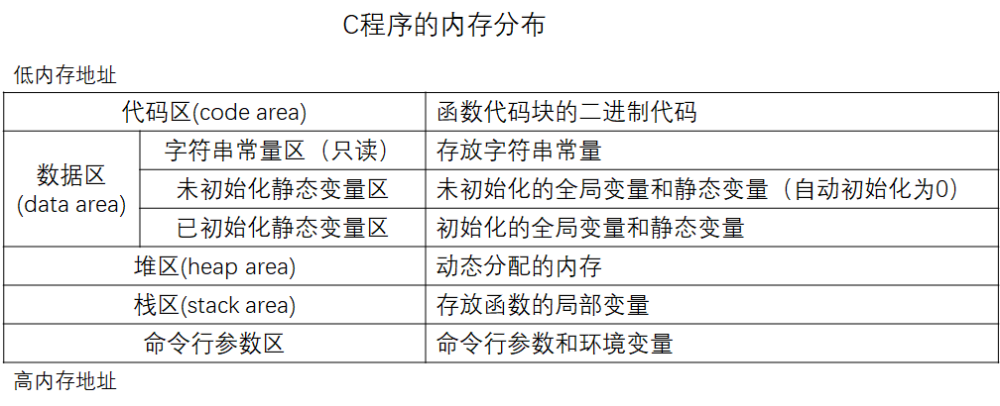
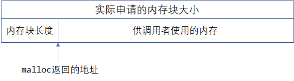
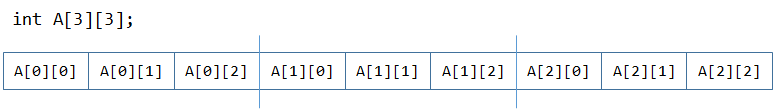
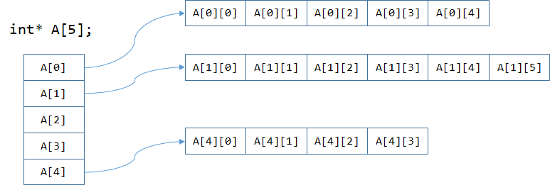

# 指针

## 内存的基本概念

* 内存定义
  * 硬件角度：内存是计算机必不可少的一个组成部分，是于CPU沟通的桥梁，计算机中所有的程序都是运行在内存中的。
  * 逻辑角度：内存是一块具备随机访问能力，支持读、写操作，用来存放程序及程序运行中产生的数据的区域。
  * 联想理解：以现实生活中的建筑物来类比最合适不过，计算机中可用的内存对应着一栋大楼，内存中的每一个单元格的地址对应着房间的门牌号。内存中存储的内容就是住在房间里面的人或物。我们根据内存单元格的地址就能找到对应内存中存储的数据。

* 位（bit） ：又称比特，是电子计算机中最小的数据单位。每一位的状态只能是0或1。
* 字节（Byte）：1 Byte = 8 bit，是内存基本的计量单位，
* KB ：1KB = 1024 Byte。(1024 = 2^10)

- MB :  1MB = 1024 KB。类似的还有GB、TB。
- 内存编址：计算机中的**内存按字节编址**，每个地址的存储单元可以存放一个字节（8个bit）的数据，CPU通过内存地址获取指令和数据，并不关心这个地址所代表的空间具体在什么位置、怎么分布，因为硬件的设计保证一个地址对应着一个固定的空间。

## 指针的基本用法

**取址运算符**`&`：获取变量的地址，要求操作数必须是一个变量 

**间接运算符**`*`：根据该指针变量所存储的地址，在内存当中访问该地址所存储的变量。要求操作数必须是指针类型，且不能是`void*`类型。


**例1**

```c
int a = 5;
int* pa = &a;	//表达式 &a 的运算结果为 int* 类型
				// 指针pa指向变量a

*pa = 10;		//表达式 *pa 的运算结果是一个int类型的变量，即变量a
				//将指针pa所指的变量修改为10

int b = *pa;	//将指针pa所指的变量赋值给变量b
printf("a = %d, b = %d\n", a, b);	// a = 10, b = 10
```


**例2**

```c
int a = 5;
int* p1 = &a;
int* p2 = &a;	//指针p1、p2均指向变量a

printf("%d\n", *p2);	// 通过指针p2读取到变量a的值，当前为5
*p1 = 10;				// 通过指针p1将变量a修改为10
printf("%d\n", *p2);	// 再次通过指针p2读取到变量a的值，已经变成10了
```


**例3**

```c
int a = 100;
*(&a) = 33;			//取内容运算符* 和 取地址运算符& 互为逆运算
printf("%d\n", a);	//a = 33
```

等价于下面的代码，使用中间变量存储表达式`&a`的计算结果

```c
int a = 100;
int* p = &a;
*p = 33;
printf("%d\n", a);
```


**例4**

指针p可以为`NULL`值，表示p不指向任何变量

`NULL`在C语言中是一个宏定义，即地址0表示特殊含义，该地址不存储任何变量

```c
#define NULL 0
```


```c
int a = 1, b = 2;
int* p = NULL;
if (p == NULL) {
    p = &a;
} else {
    p = &b;
}
printf("%d\n", *p); 	// *p = 1
```


**例**5

当需要一次性定义多个指针类型变量时，注意：

```c
int a = 1, b = 2;
int* p1, p2; 	//错误，此时p1是指针，p2是int型变量
p1 = &a;
p2 = &b;		//错误，该行代码赋值运算符左右两边的操作数类型不匹配
```

正确的写法是：

```c
int a = 1, b = 2;
int *p1, *p2; 	//正确，此时p1和p2是都是int*指针
p1 = &a;
p2 = &b;
```


## 指针的常见使用场景

### 指针作为函数参数（重点）

#### 通过形参修改实参

```cpp
#include <stdio.h>

void f(int* n) {
	*n += 1;
}

int main() {
	int n = 3;
	f(&n);
	printf("%d\n", n);
	return 0;
}
```


**值传递**

```cpp
#include <stdio.h>

void swap(int a, int b){	//值传递
    int temp = a;
    a = b;
    b = temp;
}

int main(){
    int a = 1, b = 2;
    swap(a, b);	    //我希望能交换a、b的值，即预期结果是a = 2, b = 1
    printf("%d %d\n", a, b);    //事实上a、b的值并未发生改变，还是a = 1, b = 2
    return 0;
}
```


**使用指针**

```cpp
#include <stdio.h>

void swap(int* a, int* b){	//函数接受两个变量的地址
    int temp = *a;      //函数内部都是访问指针所指地址的内容
    *a = *b;
    *b = temp;
}

int main(){
    int a = 1, b = 2;
    swap(&a, &b);       //调用这函数时需要传递变量的地址
    printf("%d %d\n", a, b);
    return 0;
}
```


**使用引用（C++）**

```cpp
#include <stdio.h>

void swap(int &a, int &b){
    int temp = a;
    a = b;
    b = temp;
}

int main(){
    int a = 1, b = 2;
    swap(a, b);
    printf("%d %d\n", a, b);
    return 0;
}
```


#### 函数返回多个值

编写一个函数，输入一元二次方程$ax^2+bx+c=0$的3个系数a、b、c，计算方程的根x1，x2，并将其返回。

由于方程的解有3种情况，所以还需要返回一个flag标志用来区分具体是哪种情况。


**使用指针**

```cpp
#include <stdio.h>
#include <math.h>
#define eps 0.000001

int calculate(double a, double b, double c, double* x1, double* x2) {
	double delta = b * b - 4 * a * c;
	//浮点数不能精确比较，这里把绝对值小于1e-6的数视为0
	if (delta > eps) {	// delta > 0
		double d = sqrt(delta);		//sqrt，开方函数
		*x1 = (-b + d) / (2 * a);
		*x2 = (-b - d) / (2 * a);
		return 2;
	} else if (fabs(delta) < eps) {	// delta = 0 （fabs函数是对浮点数求绝对值）
		*x1 = -b / (2 * a);
		*x2 = *x1;
		return 1;
	} else {	// delta < 0
		return 0;
	}
}

int main() {
	double a, b, c;
	scanf("%lf %lf %lf", &a, &b, &c);
	double x1, x2;
	int flag = calculate(a, b, c, &x1, &x2);
	if (flag == 2) {
		printf("x1 = %f, x2 = %f\n", x1, x2);
	} else if (flag == 1) {
		printf("x1 = x2 = %f\n", x1);
	} else {	//flag == 0
		printf("no real roots solution\n");
	}
	return 0;
}
```


**使用引用（C++）**

```cpp
#include <stdio.h>
#include <math.h>
#define eps 0.000001

int calculate(double a, double b, double c, double &x1, double &x2) {
	double delta = b * b - 4 * a * c;
	//浮点数不能精确比较，这里把绝对值小于1e-6的数视为0
	if (delta > eps) {	// delta > 0
		double d = sqrt(delta);
		x1 = (-b + d) / (2 * a);
		x2 = (-b - d) / (2 * a);
		return 2;
	} else if (fabs(delta) < eps) {	// delta = 0
		x1 = -b / (2 * a);
		x2 = x1;
		return 1;
	} else {	// delta < 0
		return 0;
	}
}

int main() {
	double a, b, c;
	scanf("%lf %lf %lf", &a, &b, &c);
	double x1, x2;
	int flag = calculate(a, b, c, x1, x2);
	if (flag == 2) {
		printf("x1 = %f, x2 = %f\n", x1, x2);
	} else if (flag == 1) {
		printf("x1 = x2 = %f\n", x1);
	} else {	//flag == 0
		printf("no real roots solution\n");
	}
	return 0;
}
```


#### 避免函数传参中的值传递

结构体下节详细讲，这里简单了解一下即可。

```cpp
#include <stdio.h>
#define MAX_SIZE 1024

struct Array {
	int data[MAX_SIZE];
	int size;
};

void printArray_1(Array arr) {	//值传递，有性能损失
	for (int i = 0; i < arr.size; i++) {
		printf("%d ", arr.data[i]);
	}
	printf("\n");
}

void printArray_2(const Array* arr) {	//使用指针
	for (int i = 0; i < arr->size; i++) {
		printf("%d ", arr->data[i]);
	}
	printf("\n");
}

void printArray_3(const Array &arr) {	//使用C++引用
	for (int i = 0; i < arr.size; i++) {
		printf("%d ", arr.data[i]);
	}
	printf("\n");
}

int main() {
	int N = 10;
	Array arr;
	arr.size = N;
	for (int i = 0; i < N; i++) {
		arr.data[i] = i;
	}
	printArray_1(arr);
	printArray_2(&arr);
	printArray_3(arr);
	return 0;
}
```


### 指针作为函数返回值

```c
#include <stdio.h>

//在数组A中查找指定元素，函数返回其地址，若没有找到则返回NULL
int* searchArray(int x, int A[], int N) {
	for (int i = 0; i < N; i++) {
		if (A[i] == x) {
			return &A[i];
		}
	}
	return NULL;	//没有找到返回NULL
}

int main() {
	int A[] = { 1,2,3,4,5 };
	int N = sizeof(A) / sizeof(int);
	int* pos = searchArray(3, A, N);
	if (pos == NULL) {
		printf("未找到指定元素\n");
	}
	else {
		int index = pos - A;
		printf("指定元素在内存当中的地址：0x%p\n", pos);
		printf("指定元素在数组中的下标：%d\n", index);
	}
	return 0;
}
```


## 指针与数组

### 指针的偏移运算

通常内存地址用16进制数表示，一般用数字0到9和字母A到F表示，其中:A-F相当于十进制的10-15。通常16进制数会以前缀`0x`开头。

```c
#include <stdio.h>

int main() {
	int A[] = { 1,2,3,4,5 };
	int* p0 = &A[0];
	int* p1 = &A[1];
	int* p2 = &A[2];
	printf("p0 = 0x%p\n", p0);   // p0 = 0x008FFD1C
	printf("p1 = 0x%p\n", p1);   // p1 = 0x008FFD20
	printf("p2 = 0x%p\n", p2);   // p2 = 0x008FFD24
	printf("p2 + 2 = 0x%p\n", p2 + 2);   // p2 + 2 = 0x008FFD2C
	printf("p2 - p0 = %d\n", p2 - p0);  // p2 - p0 = 2

	printf("\n\n");

	char C[] = "hello";
	char* p3 = &C[1];
	char* p4 = &C[3];
	printf("p3 = 0x%p\n", p3);   // p3 = 0x008FFCE9
	printf("p4 = 0x%p\n", p4);   // p4 = 0x008FFCEB
	printf("p4 - p3 = %d\n", p4 - p3);  // p4 - p3 = 2

	printf("\n\n");

	double B[] = { 1.0, 2.0, 3.0, 4.0, 5.0 };
	double* p5 = &B[0];
	double* p6 = &B[1];
	printf("p5 = 0x%p\n", p5);   // p5 = 0x008FFCA0
	printf("p6 = 0x%p\n", p6);   // p6 = 0x008FFCA8
	printf("p6 + 2 = 0x%p\n", p6 + 2);   // p6 + 2 = 0x008FFCB8
	
	return 0;
}
```


### 下标运算符[]的本质

```c
#include <stdio.h>

int main() {
	int A[] = { 1,2,3,4,5 };
	int N = sizeof(A) / sizeof(int);

	int* p = A;
	printf("p = 0x%p\n", p);
	printf("&A[0] = 0x%p\n", &A[0]);

	for (int i = 0; i < N; i++) {
		printf("%d ", *(p + i));
	}
	printf("\n");

	for (int i = 0; i < N; i++) {
		printf("%d ", p[i]);
	}
	printf("\n");

	printf("sizeof(A) = %d\n", sizeof(A));  //20
	printf("sizeof(p) = %d\n", sizeof(p));  //4

	return 0;
}
```

对指针进行下标`[]`运算等价于对指针进行偏移后再取内容

假设p是指针类型，`p[i]`表达式等价于`*(p + i)`表达式

C语言不会进行数组越界检查，在后续的一些编程语言则会对其进行检查。例如在java中，数组越界访问会引发 `ArrayIndexOutOfBoundsException` 异常。


### 指针与数组名的关系

- 严格来说，数组名不等于指针。数组名是一个特殊的复合结构，内部记录了数组第一个元素的地址以及该数组所占内存空间的大小。通常情况下使用数组名时，数组名会**退化**成指向数组第一个元素的**常量指针**。

  在对数组名进行`sizeof`运算时，数组名不会退化成指针。

### 数组作为函数参数

```cpp
//以下两种写法完全等价
void f(int A[], int N);
void f(int* A, int N);
```
```cpp
#include <stdio.h>

void printArray(int A[], int N) {
    int n = sizeof(A) / sizeof(int);	//无法求出数组A的长度
    printf("%d\n", n);	//n = 1，表面上看A是一个数组，实际上A已经完全退化成了一个指针，因此sizeof(A) = sizeof(int*) = 4
    //所以专门需要一个形参N来告诉该函数数组A的长度
    for (int i = 0; i < N; i++) {
        printf("%d ", A[i]);
    }
    printf("\n");
    printf("sizeof(A) = %d\n", sizeof(A));  // 4, 说明此时A完全是一个int*指针
}

int main() {
    int A[] = { 1,2,3,4,5 };
    int N = sizeof(A) / sizeof(int);    // 20 / 4 = 5
    printArray(A, N);
    return 0;
}
```


解决`scanf`函数的疑问

* 为什么`scanf`读入变量时为什么要对变量取地址
* `scanf`在读入字符串时为什么不需要在数组名前加取地址符号

## 动态内存分配

### 程序内存分布



内存分配的方式：

1. 静态存储区

   内存在程序编译的时候就已经分配好，这块内存在程序的整个运行期间都存在。例如全局变量，static变量

2. 栈

   在执行函数时，函数内局部变量的存储单元都可以在栈上创建，函数执行结束时，这些存储区域自动被释放。效率很高，但是分配的内存容量比较有限

3. 堆

   在堆上分配也称为动态内存分配：程序在运行的时候用malloc等函数申请任意多少的内存，程序员自己负责在何时用free释放内存（如果程序员没有释放的话，其空间会在程序执行结束时由操作系统回收）。
   
   动态内存分配的生存期由我们自己决定，使用非常灵活，但是问题相对也比较多；注意：如果没有释放的话，很容易就会造成内存溢出，因为堆中的内存块是全局的，不会因为函数的调用而结束

---------------------


```cpp
int* A = (int*)malloc(n * sizeof(int));
```

### malloc()

`#include <stdlib.h>	`

`void* malloc(size_t size);	`

* 使用`malloc`函数向操作系统申请的空间的大小是以字节为单位的

* 返回的指针类型是`void*`，需要类型转换为自己需要的类型

* ` int* A = (int*)malloc(n*sizeof(int))`

### free()

`void free(void *ptr);`

* 把申请得来的空间还给“操作系统”
* 申请过的空间，最终都应该要还
* 释放掉指针所指的内存空间后要记得把该指针置为NULL，否则该指针将称为“野指针”，代码容易出bug


`free`函数只能释放由`malloc`等函数所分配的内存空间，若传入的指针为`NULL`，则不做任何事。

若传入的指针并非是`malloc`等函数返回的值，则行为未定义（通常代码运行时会报错）

```c
int a = 2;
int* p = &a;
free(p);	//虽然语法正确，但运行时会报错
```

拓展：指针只存放了目标内存块起始地址，并没有存放所指内存块大小的信息的，那么 free 怎么才能知道要释放的内存块有多大？

涉及到`malloc`和`free`函数的具体实现方式，一种实现方式的原理如下：



### 动态分配数组

```cpp
#include <stdio.h>
#include <stdlib.h>

int main() {
	int N;
	scanf("%d", &N);
    
	int* A = (int*)malloc(N * sizeof(int));
	for (int i = 0; i < N; i++) {
		scanf("%d", &A[i]);
	}
    
	int sum = 0;
	for (int i = 0; i < N; i++) {
		sum += A[i];
	}
	printf("%d\n", sum);
    
	free(A);
    A = NULL;
	return 0;
}
```


## void* 指针

编写一个能交换任意类型变量的swap函数

```cpp
#include <stdio.h>
#include <stdlib.h>

//从源内存地址的起始位置开始拷贝n个字节到目标内存地址中，没有考虑内存重叠
// string.h 库中自带memcpy函数
//src-source, dst-destination
void memcpy(void* dst, const void* src, unsigned int n) {
	if (dst == NULL || src == NULL) return;
	char* p = (char*)dst;
	char* q = (char*)src;
	while (n--) {
		*(p++) = *(q++);	//p、q指针是char*类型，每次复制1字节
	}
}

void swap(void* a, void* b, unsigned int blocksize) {
	void* temp = malloc(blocksize);
	memcpy(temp, a, blocksize);	//浅复制
	memcpy(a, b, blocksize);
	memcpy(b, temp, blocksize);
	free(temp);		//忘记释放内存会造成内存泄漏
}

void swap_int(int* a, int* b) {
	int temp = *a;
	*a = *b;
	*b = temp;
}

int main() {
	int a = 1, b = 2;
	swap(&a, &b, sizeof(int));
	printf("a = %d, b = %d\n", a, b);

	int A[] = { 1,2,3 };
	int B[] = { 4,5,6 };
	swap(A, B, sizeof(int) * 3);
	printf("%d %d %d\n", A[0], A[1], A[2]);
	printf("%d %d %d\n", B[0], B[1], B[2]);
	return 0;
}
```


## 二级指针

编写这么一个函数，将传入的指针修改，使其指向偏移下一个单位

1. 使用值传递

   类似与`swap()`函数，不起作用

```cpp
#include <stdio.h>

void f(int* p) {
    *p = 100;
	p++;
}

int main() {
	int A[] = { 0,1,2 };
	int* p = &A[0];
	printf("%p\n", p);
	f(p);
	printf("%p\n", p);
    printf("%d\n", *p);
	return 0;
}
```

2. 使用二级指针

   指针也是一个变量，叫做“指针变量”

   `int** p1`可看成是`(int*)* p1`，即p1是一个指针，它指向另一个指针（记为p2），可通过p1指针修改p2指针所存放的地址，使得p2指针指向别的内存区域。

```cpp
#include <stdio.h>

void f(int** p) {
	(*p)++;
}

int main() {
	int A[] = { 0,1,2 };
	int* p = &A[0];
	printf("%p\n", p);
	f(&p);
	printf("%p\n", p);
	return 0;
}
```

3. 使用C++引用

```cpp
#include <stdio.h>

void f(int* &p) {
	p++;
}

int main() {
	int A[] = { 0,1,2 };
	int* p = &A[0];
	printf("%p\n", p);
	f(p);
	printf("%p\n", p);
	return 0;
}
```


## 动态分配二维数组

二维数组在内存中是按照一维的方式连续存放的



对于二维数组`int A[RowNum][ColNum]`，元素`A[i][j]`的地址为：`A + i * ColNum + j`

### 方法一

动态分配一个一维数组，将其看作是一个二维数组

```cpp
#include <stdio.h>
#include <stdlib.h>

int main() {
	int RowNum = 3, ColNum = 4;
	int* arr = (int*)malloc(RowNum * ColNum * sizeof(int));

	for (int i = 0; i < RowNum; i++) {
		for (int j = 0; j < ColNum; j++) {
			//可以计算出该元素的地址，使用指针访问
			*(arr + i * ColNum + j) = i * ColNum + j;
		}
	}
	
	for (int i = 0; i < RowNum; i++) {
		for (int j = 0; j < ColNum; j++) {
			//也可以计算出该元素在一维数组中的下标，使用下标访问
			int idx = i * ColNum + j;
			printf("%d ", arr[idx]);
		}
		printf("\n");
	}
	free(arr);
	return 0;
}
```

### 方法二

使用一个一维的指针数组`int* A[5]`，该数组的每一个元素都是一个`int*`指针，指向内存中的一片一维数组。



为了使二维数组的行数也能动态确定，需要动态分配一个存放“一级指针”的数组，此时需借助二级指针

```cpp
int N = 3, M = 5; //3行5列
//动态分配二维数组
int** A = (int**)malloc(N * sizeof(int*));
for (int i = 0; i < N; i++) {
    A[i] = (int*)malloc(M * sizeof(int));
}
//现在可以使用该二维数组了
A[2][3] = 3;
```

该方法分配的二维数组的特点：

* 分配内存时要分两步，先分配行，再依次分配每一列；释放内存时相反

* 每一行在内存当中并非连续存放，不能通过指针偏移来跨行获取元素
* 每一行存放的元素个数可以不相等

### 杨辉三角

使用方法二来动态分配二维数组

```cpp
#include <stdio.h>
#include <stdlib.h>

int main() {
	int N;
	scanf("%d", &N);
	int** A = (int**)malloc(N * sizeof(int*));

	for (int i = 0; i < N; i++) {
        //行列号均从0开始计数，此时第i行共有i+1个元素
		int currentRowSize = i + 1;	//使用中间变量可以增强代码可读性
		A[i] = (int*)malloc(currentRowSize * sizeof(int));
		A[i][0] = 1;	//第i行的第一个数
		for (int j = 1; j < currentRowSize - 1; j++) {
			A[i][j] = A[i - 1][j - 1] + A[i - 1][j];
		}
		A[i][currentRowSize - 1] = 1;	//第i行的最后一个数
	}

	for (int i = 0; i < N; i++) {
		int currentRowSize = i + 1;
		for (int j = 0; j < currentRowSize; j++) {
			printf("%d ", A[i][j]);
		}
		printf("\n");
	}

	//释放内存的顺序与分配时的顺序相反
	for (int i = 0; i < N; i++) {
		free(A[i]);
	}
	free(A);

	return 0;
}
```

## 指针与字符串

### char*与char[]的区别

```c
void f1(char* s);
void f2(char s[]);	//两种写法完全等价
```


```c
char* str1 = "hello";
char str2[] = "hello";
```


**char***

```c
char* str1 = "hello";
```

  会将字符串字面量（string literal）`hello`存放到内存的字符串常量区（这块空间只读），并让指针指向该字符串首地址。

  在源代码中若存在多个相同的字符串常量，内存当中只会保存一份。

  由于`str1`本质上是一个指针，所以可以让其指向其他字符串。

  ```c
  char* str1 = "hello";
  char* str2 = "hello";
  
  //输出的地址相同
  printf("str1 address: 0x%p\n", str1);
  printf("str2 address: 0x%p\n", str2);
  
  str1[0] = 'a';	//程序运行出错
  str1 = "world";	//合法
  ```

  另外注意在C++中，只有常量指针才可以指向一个字符串字面量。

  ```cpp
  char* str1 = "hello";	//C语言写法
  const char* str2 = "hello"; // C++中必须加上const修饰
  ```


**char[]**

  ```c
char str2[] = "hello";
  ```

也会将字符串字面量`hello`存放到内存的字符串常量区，同时将其复制到新创建好的字符数组中。可以对该字符数组做修改。

  ```c
  char str2[] = "hello";
  str2[0] = 'a'; 	//合法
  str2 = "world";	//非法，对字符数组只能一个字符一个字符的修改
  ```


**例题**

以下语句存在语法错误的是？（   A     ）

```c
A. char ss[6][20]; ss[1] = "right?";

B. char ss[][20] = {"right?"};

C. char *ss[6]; ss[1] = "right?";

D. char *ss[] = {"right?"};
```
### 常用字符串函数

**strlen**

获取字符串的长度，返回字符的个数，不包括`\0`结束符

```c
int my_strlen(const char* s) {
	int cnt = 0;
	for (int i = 0; s[i] != '\0'; i++) {
		cnt++;
	}
	return cnt;
}
```

**strcpy**

 将src指向的字符串拷贝到des指向的字符串数组中去，结束符`\0`也一同进行拷贝

```c
char* my_strcpy(char* dst, const char* src) {
    if (dst == NULL || src == NULL) return NULL;
	int i;
	for (i = 0; src[i] != '\0'; i++) {
		dst[i] = src[i];
	}
	dst[i] = '\0';
	return dst;	//便于链式调用
}
```

**strcat**

将src所指的字符串拼接到dst所指的字符串末尾。dst原字符串末尾的`\0`会被删掉。

```c
char* my_strcat(char* dst, const char* src) {
	if (dst == NULL || src == NULL) return NULL;
	int idx = 0;
	while (dst[idx] != '\0') idx++;
	int i;
	for (i = 0; src[i] != '\0'; i++) {
		dst[idx + i] = src[i];
	}
	dst[idx + i] = '\0';
	return dst;
}
```

**strcmp**

根据**字典序**顺序比较两个字符串：

* 如果 s1 < s2 ，也就是s1的字典序排在s2的前面，返回 负数
* 如果 s1 = s2，也就是两者字典序相同，也就是为同字符串， 返回 0
* 如果 s1 > s2，也就是s1的字典序排在s2的后面，返回 正数

当两个字符串不相等时，C标准没有规定返回值会是1 或 -1，只规定了返回正数或负数。

```cpp
int my_strcmp(const char* s1, const char* s2) {
	int i = 0;
	while (s1[i] == s2[i] && s1[i] != '\0') {
		i++;
	}
	return s1[i] - s2[i];
}
```

完整代码

普通版：

```cpp
#include <stdio.h>

//返回字符串的长度，不包括结尾'\0'
size_t my_strlen(const char* s) {
	int cnt = 0;
	for (int i = 0; s[i] != '\0'; i++) {
		cnt++;
	}
	return cnt;
}

//字符串拷贝
char* my_strcpy(char* dst, const char* src) {
	if (dst == NULL || src == NULL) return NULL;
	int i;
	for (i = 0; src[i] != '\0'; i++) {
		dst[i] = src[i];
	}
	dst[i] = '\0';
	return dst;	//便于链式调用
}

//字符串拼接
char* my_strcat(char* dst, const char* src) {
	if (dst == NULL || src == NULL) return NULL;
	int idx = 0;
	while (dst[idx] != '\0') idx++;
	int i;
	for (i = 0; src[i] != '\0'; i++) {
		dst[idx + i] = src[i];
	}
	dst[idx + i] = '\0';
	return dst;
}

//字符串比较，根据字典序比较
int my_strcmp(const char* s1, const char* s2) {
	int i = 0;
	while (s1[i] == s2[i] && s1[i] != '\0') {
		i++;
	}
	return s1[i] - s2[i];
}

int main() {
	printf("0.  %d\n", my_strlen("aaa\0aa"));

	char temp[20];
	printf("1.  %s\n", my_strcpy(temp, "hello"));
	printf("2.  %s\n", my_strcat(temp, " world"));
	printf("\n");

	printf("3.  %d\n", my_strcmp("aa", "aa"));
	printf("4.  %d\n", my_strcmp("aa", "ca"));
	printf("5.  %d\n", my_strcmp("ab", "abc"));
	printf("6.  %d\n", my_strcmp("a", "c"));

	printf("\n");

	printf("7.  %d\n", my_strcmp("d", "b"));
	printf("8.  %d\n", my_strcmp("db", "bbc"));
	printf("9.  %d\n", my_strcmp("dddd", "b"));
	printf("10.  %d\n", my_strcmp("dddd", ""));
	printf("11.  %d\n", my_strcmp("", ""));

	return 0;
}
```

优化版：

```c
#include <stdio.h>

//返回字符串的长度，不包括结尾'\0'
size_t my_strlen(const char* s) {
	const char* p = s;
	while (*(p++) != '\0');
	return p - s - 1;
}

//字符串拷贝
char* my_strcpy(char* dst, const char* src) {
	if (dst == NULL || src == NULL) return NULL;
	char* p = dst;
	while ((*p++ = *src++) != '\0');
	return dst;	//便于链式调用
}

//字符串拼接
char* my_strcat(char* dst, const char* src) {
	if (dst == NULL || src == NULL) return NULL;
	char* p = dst;
	while (*p != '\0') p += 1;
	while ((*p++ = *src++) != '\0');
	return dst;
}

//字符串比较，根据字典序比较
int my_strcmp(const char* s1, const char* s2) {
	while (*s1 == *s2 && *s1 != '\0') {
		s1++; s2++;
	}
	return *s1 - *s2;
}

int main() {
	printf("0.  %d\n", my_strlen("aaa\0aa"));

	char temp[20];
	printf("1.  %s\n", my_strcpy(temp, "hello"));
	printf("2.  %s\n", my_strcat(temp, " world"));
	printf("\n");

	printf("3.  %d\n", my_strcmp("aa", "aa"));
	printf("4.  %d\n", my_strcmp("aa", "ca"));
	printf("5.  %d\n", my_strcmp("ab", "abc"));
	printf("6.  %d\n", my_strcmp("a", "c"));

	printf("\n");

	printf("7.  %d\n", my_strcmp("d", "b"));
	printf("8.  %d\n", my_strcmp("db", "bbc"));
	printf("9.  %d\n", my_strcmp("dddd", "b"));
	printf("10.  %d\n", my_strcmp("dddd", ""));
	printf("11.  %d\n", my_strcmp("", ""));

	return 0;
}
```


注：`strcpy`、`strcat`等函数是不安全的，存在溢出的风险。实际开发中应使用`strncpy`、`strncat`等更安全的函数。

### 例题：解析数字字符串

优化前的代码：

```cpp
#include <stdio.h>
#include <string.h>

int parseInt(const char* str) {
	int len = strlen(str);
	int num = 0;
	for (int i = 0; i < len; i++) {
		char ch = str[i];
		if (!('0' <= ch && ch <= '9')) {
			return -1;	//遇到了非数字字符，返回-1表示错误
		}
		num = num * 10 + (ch - '0');
	}
	return num;
}

int main() {
	printf("%d\n", parseInt("0012340"));
	printf("%d\n", parseInt("0"));
	printf("%d\n", parseInt("1000"));
	printf("%d\n", parseInt("-0153"));
	printf("%d\n", parseInt("+0153"));
	return 0;
}
```

优化后的代码（支持解析负数）：

```cpp
#include <stdio.h>

int parseInt(const char* s) {
	if (s == NULL) return 0;
	int sign = 1;
	if (*s == '-') {
		sign = -1;
		s++;
	} else if (*s == '+') {
		s++;
	}
	int num = 0;
	while (*s != '\0') {
		char ch = *s;
		if (!('0' <= ch && ch <= '9')) {
			return -1;	//
		}
		num = num * 10 + (ch - '0');
		s++;
	}
	return sign * num;
}

int main() {
	printf("%d\n", parseInt("0012340"));
	printf("%d\n", parseInt("0"));
	printf("%d\n", parseInt("1000"));
	printf("%d\n", parseInt("-0153"));
	printf("%d\n", parseInt("+0153"));
	return 0;
}
```

### 例题：单词提取和排序

输入一个英文句子（长度小于1024字节，小于200个单词），提取其中所有的单词，并对这些单词排序后输出。英文句子中单词之间由空格或标点符号分割。

提示：

* 由于需要输入字符串，必须定义为字符数组
* 提取单词时，将发现单词的开始地址存放在指针数组中，并将发现的单词结束位置（即分隔符的位置）改为`\0`，以形成单词字符串的结尾
* 排序时基于交换指针实现

```cpp
#include <stdio.h>
#include <string.h>

#define MAX_CHAR_NUM 1024
#define MAX_WORD_NUM 200

char str[MAX_CHAR_NUM];
char* pos;

char* words[MAX_WORD_NUM];
int numWord = 0;

bool isAlphe(char ch) {
	return 'a' <= ch && ch <= 'z'
		|| 'A' <= ch && ch <= 'Z';
}

//跳过空格和标点符号，直到遇到字母或\0
void skip() {
	while (*pos != '\0' && !isAlphe(*pos)) {
		pos++;
	}
}

void readWords() {
	while (true) {
		skip();
		if (*pos == '\0') break;
		words[numWord++] = pos;
		while (isAlphe(*pos)) {
			pos++;
		}
		*pos = '\0';
		pos++;
	}
}

void printWords() {
	for (int i = 0; i < numWord; i++) {
		printf("%s\n", words[i]);
	}
}

void bubbleSort() {
	for (int t = numWord; t > 0; t--) {
		bool sorted = true;
		for (int i = 1; i < t; i++) {
			if (strcmp(words[i - 1], words[i]) > 0) {

				char* temp = words[i - 1];
				words[i - 1] = words[i];
				words[i] = temp;

				sorted = false;
			}
		}
		if (sorted) break;
	}
}

int main() {
	// 读入一行包含空格的字符串
	// 本来可以用gets函数的，但因为gets函数不安全被标准库删掉了，所以就用fgets函数代替
	fgets(str, MAX_CHAR_NUM, stdin);
	pos = str;
	readWords();
	printf("words num = %d\n", numWord);
	printWords();
	//printf("----------------------------------\n");
	//bubbleSort();
	//printWords();

	return 0;
}
```

```
   Copyright (c) Microsoft Corporation. All rights reserved.
```


## 函数指针

如果在程序中定义了一个函数，那么在编译时系统就会为这个函数代码分配一段存储空间，这段存储空间的首地址称为这个函数的地址。而且函数名表示的就是这个地址。既然是地址我们就可以定义一个指针来存放，这个指针就叫作函数指针。

```
函数返回值类型 (*指针变量名) (函数参数列表);
int (*p) (int, int);
表示p是一个函数指针，它指向这样一个函数：该函数接受两个int类型参数，返回一个int类型的值
```

函数指针名两端的括号不能省略，否则就称为函数的声明了。

比如`int *p (int, int);`表示函数p它接受两个`int`型参数，返回一个`int*`指针。


```cpp
#include <stdio.h>
#include <math.h>
#define PI 3.1415926

int main() {
	double (*f)(double);		//定义一个函数指针
	f = sin;					//使函数指针f指向sin函数

	double ans1 = f(-PI / 2);	//调用函数指针，与调用普通函数的语法一致
	printf("%f\n", ans1);
	return 0;
}
```

使用函数指针，可以将某个函数作为函数参数传递给另一个函数。

### 自定义函数的定积分计算

```cpp
#include <stdio.h>
#include <math.h>	//math.h库自带常用数学函数
#define PI 3.1415926

//计算函数f(x)在区间(a,b)上的定积分
double integral(double(*f)(double), double a, double b) {
	const int N = 100000;	//区间分成N份
	double dx = (b - a) / N;
	double sum = 0;			//整个曲边梯形面积
	for (int i = 0; i < N; i++) {
		double x = a + i * dx;
		double ds = f(x) * dx;
		sum += ds;
	}
	return sum;
}

double func1(double x) {
	return 1 / (1 + sin(x));
}

int main() {
	printf("%f\n", integral(sin, 0, PI / 2));
	printf("%f\n", integral(func1, -PI / 4, PI / 4));
	return 0;
}
```

### 自定义规则查找数组

```cpp
#include <stdio.h>

//在int数组当中找到第一个满足指定条件的元素，返回其下标。未找到则返回-1
int searchArray(int A[], int N, bool(*f)(int)) {
	for (int i = 0; i < N; i++) {
		if (f(A[i])) {
			return i;
		}
	}
	return -1;
}

bool f1(int x) { return x == 2; }	//找到第一个2
bool f2(int x) { return x > 0; }	//找到第一个正数

int main() {
	int A[] = { -1,0,1,2,3 };
	int N = sizeof(A) / sizeof(int);

	printf("%d\n", searchArray(A, N, f1));
	printf("%d\n", searchArray(A, N, f2));

	return 0;
}
```


## 考试题目练习

1. 如果函数参数是数组名,则向函数传送的是(    B   )
   - A.数组的长度 
   - B.数组的首地址
   - C.数组每个元素的地址
   - D.数组每个元素的值

2. 若有说明：`int a=2, *p=&a, *q=p;`，则以下非法的赋值语句是（D）。

   A． p=q;           B． *p=*q;         C． a=*q;         D． q=a;

3. 若有说明语句：`int a, b, c, *d=&c；`，则能正确从键盘读入三个整数分别赋给变量a、b、c的语句是（A）。

   A．` scanf("%d%d%d", &a, &b, d); `

   B．` scanf("%d%d%d", a, b, d);`

   C．` scanf("%d%d%d", &a, &b, &d);       `

   D．` scanf("%d%d%d", a, b,*d);`

4. 以下不能正确进行字符串赋初值的语句是（A）。

   A.  `char str[5]= "good!";`

   B．`char *str="good!";`

   C.  `char str[]="good!";`  

   D． `char str[5]={'g', 'o','o', 'd'};`

5. 下面程序段的运行结果是（C）。

   ```cpp
   char *s="abcde";
   s+=2;
   printf("%d", s);
   ```

   A． cde      B． 字符'c'    C． 字符'c'的地址     D． 无确定的输出结果

   解析：

    ```cpp
    int main() {
        char *s = "abcde";
        s += 2;
        printf("%d\n", s);
        printf("%p\n", s);
        printf("%c\n", *s);

        char str[] = "hello";
        str += 2;	//错误，str是数组名，可视作是常量指针，不可修改
        return 0;
    }
    ```

