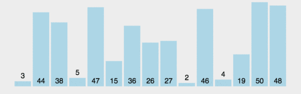
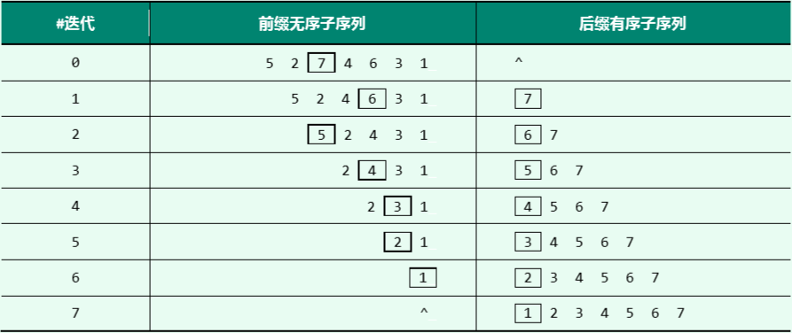

# 第一节 线性表-顺序存储-数组

## 数据结构的一些基本概念

### 时间复杂度

#### 概念

可以理解为某算法代码执行次数`k`与数据规模`n`在**渐进**意义上成什么数学关系。用大O记号表示。

在没有特殊说明时，均默认时间复杂度为最坏情况下的时间复杂度。

* 常数时间$O(1)$：通过下标访问数组
* 线性时间$O(n)$：遍历一维数组
* 平方$O(n^2)$
* $O(\sqrt n)$（根号n）
* 对数$O(\log n)$
* $O(n * \log n)$
* 对于带对数的时间复杂度，通常使用了“分而治之”算法思想，即每次将问题规模复杂度减半。

#### 例题

求下列函数的时间复杂度（      ）

```cpp
int func(int n) {
    int i = 0, sum = 0;
    while (sum < n) sum += ++i;
    return i;
}
```

A. $O(\log n)$	B. $O(\sqrt n)$ 		C. $O(n)$ 		D. $O(n^2)$

解析：

先理解代码的执行过程，可将代码转化成自己便于理解的等价形式。

```cpp
int func(int n) {
    int sum = 0;
    for (int i = 1; ; i++) {
        if (sum >= n) {
            return i;
        }
        sum += i;
    }
}
```

设for循环语句总共执行了k次，循环的中止条件是当sum超过n时，即


$$
\text{sum} = 1 + 2 + 3 + ...... + k >= n \\
\frac{(1 + k) * k}{2} >= n \\
0.5k^2 + 0.5k >= n	\\
k \propto \sqrt n （当n \to\infty ）
$$
所以该函数的时间复杂度为$O(\sqrt n)$


### 数据的逻辑结构

* 线性结构（一对一）
* 半线性结构（树）（一对多）
* 非线性结构（图）（多对多）

## 数组

### 数组的性质

`int A[n] = {a0, a1, a2, ..., a(n-1) }`

* 前驱、后继
* `A[i]`的在内存中物理地址：`A + i * sizeof(int)`
* 可通过下标来访问数组中的每一个元素，时间复杂度O(1)。随机访问

### 对数组进行常用的操作

* 查找：找到值等于e的元素在数组中的位置（下标）p
* 插入：在数组指定位置（下标）p插入一个元素e，原来的元素以及其后面的元素都依次往后挪一个位置。
* 删除：将数组指定下标p的元素删除，其后面的元素依次往前挪一个位置

## 顺序存储（数组）

### 定义及初始化

1. 数组静态存储

```cpp
#define MAX_SIZE 1000

struct SeqList {
    int data[MAX_SIZE];
    int size;	//数组当前存放元素的个数
};

void initSeqList(SeqList &L) {
	L.size = 0;
}
```

2. 数组动态存储

```cpp
struct SeqList {
	int* data;	//动态存储数组
	int size;	//数组当前存放元素的个数
	int maxSize;	//数组的最大长度
};

void initSeqList(SeqList &L) {
	int init_size = 100;
	L.data = (int*)malloc(init_size * sizeof(int));
	L.maxSize = init_size;
	L.size = 0;
}

void destorySeqList(SeqList &L) {
	free(L.data);
	L.data = NULL;
}
```

   

### 访问

时间复杂度O(1)

```cpp
int get(const SeqList &L, int p) {
    if (p < 0 || p >= L.size) return -1;	//访问下标不合法
    return L.data[p];
}
```

### 查找

时间复杂度O(n)

```cpp
//在数组当中查找指定元素，如果找到了返回其数组下标，没找到返回-1
int find(const SeqList &L, int x) {
	for (int i = 0; i < L.size; i++) {
		if (L.data[i] == x) return i;
	}
	return -1;	// -1 表示没找到
}
```

### 插入


时间复杂度O(n)

```cpp
//在数组下标pos处插入一个元素e
void insertAt(SeqList &L, int pos, int e) {
	if (pos < 0 || pos > L.size) return;	//插入的下标不合法
	if (L.size == L.maxSize) return;			//表满了
	for (int i = L.size; i > pos; i--) {	//往后腾出一个位置
		L.data[i] = L.data[i - 1];
	}
	L.data[pos] = e;						//放进去
	L.size++;								//表的长度+1
}
```

在表末尾插入一个元素

```cpp
//在数组末尾插入一个元素
void push_back(SeqList &L, int e) {
	//insert(L, L.size, e)
	if (L.size == L.maxSize) return;			//表满了
	L.data[L.size++] = e;
}
```

### 删除


删除指定下标的单个元素：时间复杂度O(n)

```cpp
//删除数组下标pos处的元素
void removeAt(SeqList &L, int pos) {
	if (pos < 0 || pos >= L.size) return;	//删除的下标不合法
	for (int i = pos; i < L.size - 1; i++) {
		L.data[i] = L.data[i + 1];
	}
	L.size--;
}
```

删除表末尾元素，并将其返回

```cpp
//删除数组最后一个元素，并将其返回
int pop_back(SeqList &L) {
	if (L.size == 0) return -1;	//数组为空，返回出错标记
	return L.data[--L.size];
}
```

批量删除下标 lo~hi 的元素：

1. 反复调用删除单个元素的函数？时间复杂度O(n^2)


```cpp
//错误写法
void remove_batch(SeqList &L, int lo, int hi) {
    for (int i = lo; i <= hi; i++) {
        removeAt(L, i);
    }
}

//正确写法
void remove_batch(SeqList &L, int lo, int hi) {
    int t = hi - lo + 1;
    while (t--) {
        removeAt(L, lo);
    }
}
```

2. 正确做法，时间复杂度O(n)

```cpp
//批量删除数组下标lo-hi的元素，左闭右闭[lo, hi]
void remove_batch(SeqList &L, int lo, int hi) {
	if (lo < 0 || hi >= L.size || lo > hi) return;	//删除的下标不合法
	int t = hi - lo + 1;
	for (int i = hi + 1; i < L.size; i++) {
		L.data[i - t] = L.data[i];
	}
	L.size -= t;
}
```

### 翻转

将数组翻转一遍，也就是数组第一个元素与最后一个元素交换，第二个元素与倒数第二个元素交换......

```cpp
//对数组下标lo到hi（不包括hi）的元素反转，左闭右开[lo, hi)
void reverse_1(SeqList &L, int lo, int hi) {
	//对当前区间[lo,hi)的第i个元素和倒数第i个元素进行交换
	for (int i = 0; i < (hi - lo) / 2; i++) {
		//swap(L.data[lo + i], L.data[hi - i - 1]);
		//使用了引用语法，变量名a与L.data[lo+i]指向的是内存中的同一变量
		int &a = L.data[lo + i];
		int &b = L.data[hi - i - 1];
		int temp = a;
		a = b;
		b = temp;
	}
}

void reverse_2(SeqList &L, int lo, int hi) {
	for (int i = lo, j = hi - 1; i < j; i++, j--) {
		// swap(L.data[i], L.data[j]);
		int temp = L.data[i];
		L.data[i] = L.data[j];
		L.data[j] = temp;
	}
}
```

### 冒泡排序

时间复杂度$O(n^2)$

每次扫描时，交换相邻的逆序对




将数组划分成两部分，前半部分`[0, t)`无序，后半部分`[t, n)`有序

每一次扫描只需对无序部分扫描，且扫描完前半部分最后一个元素一定就位，可归为后半部分。

```cpp
void bubbleSort(int A[], int n) {
    //前半部分[0, t)无序，后半部分[t, n)有序
	for (int t = n; t > 0; t--) {
		bool sorted = true;
		for (int i = 1; i < t; i++) {
			if (A[i - 1] > A[i]) {
				swap(A[i - 1], A[i]);
				sorted = false;
			}
		}
		if (sorted) break;
	}
}
```


### 上机完整代码

大部分数据结构教材采用的是这种写法

```cpp
#include <stdio.h>
#include <algorithm>
using namespace std;

struct SeqList {
	int* data;	//动态存储数组
	int size;	//数组当前存放元素的个数
	int maxSize;	//数组的最大长度
};

void initSqlList(SeqList &L) {
	int init_size = 100;
	L.data = (int*)malloc(init_size * sizeof(int));
	L.maxSize = init_size;
	L.size = 0;
}

void destorySqlList(SeqList &L) {
	free(L.data);
	L.data = NULL;
}

int find(const SeqList &L, int x) {
	for (int i = 0; i < L.size; i++) {
		if (L.data[i] == x) return i;
	}
	return -1;	// -1 表示没找到
}

//在数组下标pos处插入一个元素e
void insertAt(SeqList &L, int pos, int e) {
	if (pos < 0 || pos > L.size) return;	//插入的下标不合法
	if (L.size == L.maxSize) return;			//表满了
	for (int i = L.size; i > pos; i--) {	//往后腾出一个位置
		L.data[i] = L.data[i - 1];
	}
	L.data[pos] = e;						//放进去
	L.size++;								//表的长度+1
}

//在数组末尾插入一个元素
void push_back(SeqList &L, int e) {
	//insert(L, L.size, e)
	if (L.size == L.maxSize) return;			//表满了
	L.data[L.size++] = e;
}

//删除数组下标pos处的元素
void removeAt(SeqList &L, int pos) {
	if (pos < 0 || pos > L.size - 1) return;	//删除的下标不合法
	for (int i = pos; i < L.size - 1; i++) {
		L.data[i] = L.data[i + 1];
	}
	L.size--;
}

//批量删除数组下标lo-hi的元素，左闭右闭[lo, hi]
void remove_batch(SeqList &L, int lo, int hi) {
	if (lo < 0 || hi >= L.size || lo > hi) return;	//删除的下标不合法
	int t = hi - lo + 1;
	for (int i = hi + 1; i < L.size; i++) {
		L.data[i - t] = L.data[i];
	}
	L.size -= t;
}

//删除数组最后一个元素，并将其返回
int pop_back(SeqList &L) {
	if (L.size == 0) return -1;	//数组为空，返回出错标记
	return L.data[--L.size];
}

void printArray(const SeqList &L) {	//输出整个数组。
	for (int i = 0; i < L.size; i++) {
		printf("%d ", L.data[i]);
	}
	printf("\n\n");
}

//对数组下标lo到hi（不包括hi）的元素反转，左闭右开[lo, hi)
void reverse_1(SeqList &L, int lo, int hi) {
	//对当前区间[lo,hi)的第i个元素和倒数第i个元素进行交换
	for (int i = 0; i < (hi - lo) / 2; i++) {
		//swap(L.data[lo + i], L.data[hi - i - 1]);
		//使用了引用语法，变量名a与L.data[lo+i]指向的是内存中的同一变量
		int &a = L.data[lo + i];
		int &b = L.data[hi - i - 1];
		int temp = a;
		a = b;
		b = temp;
	}
}

//对数组下标lo到hi（不包括hi）的元素反转，左闭右开[lo, hi)
void reverse_2(SeqList &L, int lo, int hi) {
	for (int i = lo, j = hi - 1; i < j; i++, j--) {
		//swap(L.data[i], L.data[j]);
		int temp = L.data[i];
		L.data[i] = L.data[j];
		L.data[j] = temp;
	}
}

void bubbleSort(SeqList &L) {
	for (int t = L.size; t > 0; t--) {
		bool sorted = true;
		for (int i = 1; i < t; i++) {
			if (L.data[i - 1] > L.data[i]) {
				swap(L.data[i - 1], L.data[i]);
				sorted = false;
			}
		}
		if (sorted) break;
	}
}

int main() {
	SeqList L;
	initSqlList(L);
	printf("初始时数组为空：\n");
	printArray(L);

	for (int i = 1; i <= 6; i++) {
		push_back(L, i);
	}
	pop_back(L);
	printf("将元素1-6依次插入数组，并删掉最后一个元素: \n");
	printArray(L);

	insertAt(L, 2, 10);
	printf("在数组下标2处插入元素10: \n");
	printArray(L);

	insertAt(L, 1, 20);
	printf("在数组下标1处插入元素20: \n");
	printArray(L);

	removeAt(L, 3);
	printf("删除数组下标3的元素: \n");
	printArray(L);

	reverse_1(L, 2, L.size - 1);
	printf("对数组从下标2到倒数第2个元素进行翻转: \n");
	printArray(L);

	reverse_2(L, 0, L.size);
	printf("对整个数组的元素进行翻转: \n");
	printArray(L);

	bubbleSort(L);
	printf("对整个数组进行冒泡排序: \n");
	printArray(L);

	remove_batch(L, 1, 3);
	printf("批量删除下标1-3的元素: \n");
	printArray(L);

	destorySqlList(L);

	return 0;
}
```

### 完全不封装的代码示例

考试的时候（初试、机试）一般使用这种写法

```cpp
#include <stdio.h>
#define MAX_SIZE 1000

int _data[MAX_SIZE];	//数组
int _size;	//数组的长度

void push_back(int e) {
	if (_size == MAX_SIZE) return;			//表满了
	_data[_size++] = e;
}

void swap(int &a, int &b) {
	int temp = a;
	a = b;
	b = temp;
}

void bubbleSort(int A[], int n) {
	for (int t = n; t > 0; t--) {
		bool sorted = true;
		for (int i = 1; i < t; i++) {
			if (A[i - 1] > A[i]) {
				swap(A[i - 1], A[i]);
				sorted = false;
			}
		}
		if (sorted) break;
	}
}

void printArray() {
	for (int i = 0; i < _size; i++) {
		printf("%d ", _data[i]);
	}
	printf("\n");
}

int main() {
	for (int i = 1, sign = 1; i <= 5; i++, sign = -sign) {
		push_back(sign * i);
	}
	printArray();

	bubbleSort(_data, _size);
	printArray();

	return 0;
}
```

### 使用C++面向对象来封装代码


```cpp
#include <iostream>
#include <algorithm>
using namespace std;

template<typename T>
class Array {
private:
	T* _data;	//动态分配数组
	int _size;	//当前数组实际使用的长度
	int _capacity;	//当前数组的最大容量

public:
	Array(int capacity = 1) {	//构造函数
		_data = new T[capacity];	//动态分配数组
		_capacity = capacity;
		_size = 0;
	}

	~Array() {	//析构函数
		delete[] _data;
		cout << "数组所占内存已释放" << endl;
	}

	void expandArray() {	//实现一个自动扩容机制
		int newCapacity = _capacity * 2;	//简单的扩充为原来的2倍
		T* newArray = new T[newCapacity];
		if (newArray == nullptr) throw exception("内存分配失败");
		for (int i = 0; i < _size; i++) {
			newArray[i] = _data[i];
		}
		_capacity = newCapacity;
		delete[] _data;
		_data = newArray;
	}

	T& get(int i) {
		if (i < 0 || i >= _size) throw exception("访问下标不合法");
		return _data[i];
	}

	int find(const T &x) {
		for (int i = 0; i < _size; i++) {
			if (_data[i] == x) return i;
		}
		return -1;	// -1 表示没找到
	}

	void insertAt(int pos, const T &e) {
		if (pos < 0 || pos > _size) throw exception("插入的下标不合法");
		if (_size == _capacity) expandArray();
		for (int i = _size; i > pos; i--) {		//往后腾出一个位置
			_data[i] = _data[i - 1];
		}
		_data[pos] = e;						//放进去
		_size++;							//表的长度+1
	}

	void push_back(const T &e) {
		if (_size == _capacity) expandArray();
		_data[_size++] = e;
	}

	void removeAt(int pos) {
		if (pos < 0 || pos > _size - 1) throw exception("删除的下标不合法");
		for (int i = pos; i < _size - 1; i++) {
			_data[i] = _data[i + 1];
		}
		_size--;
	}

	T pop_back() {	//删除数组最后一个元素，并将其返回
		if (_size < 1) throw exception("数组为空，不能pop");
		return _data[--_size];
	}

	bool empty() {
		return _size == 0;
	}

	void clear() {
		_size = 0;
	}

	int size() {
		return _size;
	}

	int capacity() {
		return _capacity;
	}

	void printArray() {	//输出整个数组
		for (int i = 0; i < _size; i++) {
			cout << _data[i] << " ";
		}
		cout << endl << endl;
	}

	//对数组下标lo到hi（不包括hi）的元素反转，左闭右开[lo, hi)
	void reverse(int lo, int hi) {
		for (int i = lo, j = hi - 1; i < j; i++, j--) {
			swap(_data[i], _data[j]);
		}
	}

	//对整个数组进行反转。该函数与上面的函数同名，但参数列表不同，使用了函数重载特性
	void reverse() {
		for (int i = 0, j = _size - 1; i < j; i++, j--) {
			swap(_data[i], _data[j]);
		}
	}

	void sort() {
		for (int t = _size; t > 0; t--) {
			bool sorted = true;
			for (int i = 1; i < t; i++) {
				if (_data[i - 1] > _data[i]) {
					swap(_data[i - 1], _data[i]);
					sorted = false;
				}
			}
			if (sorted) break;
		}
	}

	//体验一下运算符[]重载，可以像使用数组一样方便的使用我们自己写的Vector对象
	T& operator[] (int i) {
		//return get(p);
		if (i < 0 || i >= _size) throw exception("访问下标不合法");
		return _data[i];
	}

	//对数组里的每个元素按照指定规则变换
	Array<T>& map(T(*f)(T)) {
		for (int i = 0; i < _size; i++) {
			_data[i] = f(_data[i]);
		}
		return *this;	//为了方便链式调用，返回当前对象的引用
	}

	//删除数组中满足指定条件的所有元素
	Array<T>& remove_if(bool(*f)(T)) {
		//该算法时间复杂度O(n^2)，可优化成O(n)
		for (int i = 0; i < _size; i++) {
			if (f(_data[i])) {
				removeAt(i);
			}
		}
		return *this;
	}

};

int main() {
	Array<int> L;

	//L.pop_back();
	try {
		L.pop_back();			//如果这句不放在try-catch语句中执行，代码运行时会报错
	}
	catch (exception e) {		//体验一下异常处理（仅作了解）
		cout << e.what() << endl << endl;
	}

	for (int i = 1; i <= 6; i++) {
		L.push_back(i);
	}
	L.pop_back();
	cout << "将元素1-6依次插入数组，并删掉最后一个元素: " << endl;
	L.printArray();

	L.insertAt(2, 10);
	cout << "在数组下标2处插入元素10: " << endl;
	L.printArray();

	L.insertAt(1, 20);
	cout << "在数组下标1处插入元素20: " << endl;
	L.printArray();

	L.removeAt(3);
	cout << "删除数组下标3的元素: " << endl;
	L.printArray();

	L.reverse();
	cout << "对整个数组的元素进行翻转:" << endl;
	L.printArray();

	L.sort();
	cout << "对整个数组进行冒泡排序: " << endl;
	L.printArray();

	//体验一下运算符[]重载，可以像使用数组一样方便的使用我们自己写的Vector对象
	cout << "L[2] = " << L[2] << endl << endl;

	L[1] = 100;
	cout << "将L[1]修改成100: " << endl;
	L.printArray();

	cout << "将数组里的每个元素做平方运算，并只保留偶数结果：" << endl;
	L.map([](int x) {return x * x; })	//lambda表达式，也叫匿名函数，c++11语法
		.remove_if([](int x) {return x % 2 == 1; })
		.printArray();

	return 0;
}
```

## C++ STL：Vector

vector是C++标准库中自带的一个封装好了的可扩容数组。

在创建vector容器时，可以使用构造函数可以为容器直接分配足够大的内存空间，也可以使用`reserve()`函数设置vector的容量。

```cpp
vector<int> V1;		//V1:size=0, capacity=0
vector<int> V2(100);	//V2:size=0, capacity=100
V2.reserve(1000);		//V2:size=0, capacity=1000
```

如果想像C语言数组那样对一个vector容器赋初始值，可以这么做

```cpp
int A[] = {1, 2, 3, 4};
vector<int> V = {1, 2, 3, 4};
```

遍历容器

1. 通过下标

   ```cpp
   vector<int> v = {1, 2, 3, 4, 5};
   for (int i = 0; i < v.size(); i++) {
       cout << v[i] << " ";
   }
   cout << endl;
   ```

2. 通过迭代器

   迭代器（iterator）可理解成类似于**指针**一样的东西。

   `begin()`函数返回指向容器首元素的迭代器

   `end()`函数返回指向容器最后一个元素的后一个元素的迭代器（begin、end函数遵循左闭右开规则）

   迭代器it支持 `*it`、`++it`、`it++`、`==`、`!=`运算（不支持`<`和`>`运算）

   对于vector和string，由于其底层实现是数组，因此其迭代器还支持`it + i`等偏移运算

   ```cpp
   vector<int> v = { 1,2,3,4,5 };
   
   vector<int>::iterator it = v.begin();	//it可以理解成指向容器首元素的指针
   cout << *it << endl;
   cout << v[2] << endl;
   cout << *(it + 2) << endl;
   cout << it[2] << endl;
   ```

   通过迭代器来遍历容器

   ```cpp
   vector<int> v = { 1,2,3,4,5 };
   
   //auto c++ 11 语法，自动推导类型
   for (auto it = v.begin(); it != v.end(); ++it) {
       cout << *it << " ";
   }
   cout << endl;
   ```

插入删除

```cpp
#include <iostream>
#include <vector>
using namespace std;

void print(const vector<int> &v) {
	for (auto it = v.begin(); it != v.end(); ++it) {
		cout << *it << " ";
	}
	cout << endl;
}

int main() {
	vector<int> v = { 1,2,3 };

	v.insert(v.begin(), 100);	//在下标0处插入100
	print(v);
	
	v.insert(v.begin() + 2, 101);
	print(v);
	
	v.insert(v.begin() + 3, { 102,103,104 });	//在下标3处批量插入元素
	print(v);
	
	v.insert(v.begin() + 2, 3, 11);	//在下标2处批量插入3个11
	print(v);

	v.erase(v.begin() + 5);	//删除下标5元素
	print(v);

	v.erase(v.begin() + 1);	//删除下标1的元素
	print(v);
	
	v.erase(v.begin(), v.begin() + 3);	//删除下标[0, 3)的元素
	print(v);

	return 0;
}
```


### vector api文档

参考资料：https://zh.cppreference.com/w/cpp/container/vector

| 函数名        | 函数接口                                         | 描述                                                 |
| :------------ | ------------------------------------------------ | ---------------------------------------------------- |
| 构造函数      | vector();                                        | 创建一个空vector                                     |
|               | vector(int nSize);                               | 创建一个vector，元素个数为nSize                      |
|               | vector(int nSize, const T& val);                 | 创建一个vector，元素个数为nSize，且将值均初始化为val |
|               | vector(const vector& other);                     | 复制构造函数                                         |
| **push_back** | void push_back(const T&  val);                   | 向容器尾部添加一个元素                               |
| **pop_back**  | void pop_back();                                 | 删除容器最后一个元素                                 |
| **front**     | T& front();                                      | 返回容器首元素的引用                                 |
| **back**      | T& back();                                       | 返回容器尾元素的引用                                 |
| at            | T& at(int pos);                                  | 访问指定下标的元素，同时进行越界检查                 |
| operator[]    | T& operator[] (int pos);                         | 访问指定下标的元素，不会进行越界检查                 |
| **clear**     | void clear();                                    | 清空容器中所有元素                                   |
| **empty**     | bool empty() const;                              | 返回容器是否为空                                     |
| **size**      | int size() const;                                | 返回容器中元素的个数                                 |
| capacity      | int capacity() const;                            | 返回当前容器所能容纳的最大元素个数                   |
| **begin**     | iterator begin();                                | 返回指向首元素的迭代器                               |
| **end**       | iterator end();                                  | 返回指向最后一个元素的下一个元素的迭代器             |
| rbegin        | reverse_iterator rbegin();                       | 反向迭代器，指向最后一个元素                         |
| rend          | reverse_iterator rend();                         | 反向迭代器，指向第一个元素之前的位置                 |
| **insert**    | **iterator insert(iterator it, const T& x);**    | 向迭代器所指元素前插入一个元素                       |
|               | iterator insert(iterator it, int n, const T& x); | 向迭代器所指元素前插入n个相同的元素x                 |
| **erase**     | **iterator erase(iterator it);**                 | 删除迭代器指向的元素                                 |
|               | iterator erase(iterator first, iterator last);   | 删除区间[first,last)中的元素                         |
| assign        | void assign(int n, const T& x);                  | 设置容器中前n个元素的值为x                           |


```cpp
#include <iostream>
#include <vector>
using namespace std;

int main() {
	vector<int> V = { 10,20,30 };
	printf("capacity: %d\n", V.capacity());
	printf("size: %d\n", V.size());

	V.reserve(100);
	printf("capacity: %d\n", V.capacity());
	printf("size: %d\n", V.size());	//注意区分一下vector的capacity和size
    
	for (int i = 1; i <= 5; i++) {
		V.push_back(i);
	}
	V.pop_back();

	for (int i = 0; i < V.size(); i++) {
		printf("%d ", V[i]);
	}
	printf("\n");

	printf("This vector is empty? %s\n", V.empty() ? "Yes" : "No");

	for (int x : V) {	//遍历一个容器（只读）还可以这样操作
        //增强for循环，C++11语法
		printf("%d ", x);
	}
	printf("\n");

	for (int &x : V) {	//如果想修改的话还得这样操作，需要加个引用&
		x = 100;
	}

	for (int x : V) {	//打印试试
		printf("%d ", x);
	}
	printf("\n");
	return 0;
}
```

对数组求和

```
//样例输入，第一行表示有多少个数
5
2 4 6 3 1
//样例输出
16
```

```cpp
#include <iostream>
#include <vector>
using namespace std;

int main() {
	int N;
	scanf("%d", &N);
	vector<int> A(N);
	for (int i = 0; i < N; i++) {
		scanf("%d", &A[i]);
	}
	int sum = 0;
	for (int x : A) {
		sum += x;
	}
	printf("%d\n", sum);
	return 0;
}
```

## 补充

### 二分查找

只适用于有序数组，时间复杂度$O(\log n)$

```cpp
#include <stdio.h>

int binary_search(int A[], int lo, int hi, int x) {	//二分查找迭代版
	while (lo <= hi) {
		int mid = (lo + hi) / 2;
		if (A[mid] == x) {
			return mid;
		} else if (x < A[mid]) {
			hi = mid - 1;
		} else {
			lo = mid + 1;
		}
	}
	return -1;	//没找到
}

int main() {
	int A[] = { 2,3,4,5,20,30,33,55,100 };
	int N = sizeof(A) / sizeof(int);
	int pos = binary_search(A, 0, N - 1, 100);
	printf("%d\n", pos);
	return 0;
}
```


### 插入排序


```cpp
#include <iostream>
using namespace std;

void insertionSort(int A[], int N) {
	for (int t = 0; t < N; t++) {
		int temp = A[t];
		int i;
		for (i = t - 1; i >= 0 && temp < A[i]; i--) {
			A[i + 1] = A[i];
		}
		A[i + 1] = temp;
	}
}

int main() {
	int A[] = { 6, 1, 2, 9, 7, 3 };
	int N = sizeof(A) / sizeof(A[0]);

	insertionSort(A, N);
	for (int i = 0; i < N; i++) {
		printf("%d ", A[i]);
	}
	printf("\n");
	return 0;
}
```


### 选择排序




```cpp
#include <iostream>
#include <algorithm>
using namespace std;

void selectionSort(int A[], int N) {
	//前半部分[0, t)无序，后半部分[t, n)有序
	for (int t = N; t > 0; t--) {
		//从前半部分选一个最大的元素（记录其下标）
		int maxElemIndex = 0;
		for (int i = 0; i < t; i++) {
			if (A[maxElemIndex] < A[i]) {
				maxElemIndex = i;
			}
		}
		//让前半部分最小的元素跟该区间最后一个元素(下标为t-1)交换
		swap(A[maxElemIndex], A[t - 1]);
	}
}

int main() {
	int A[] = { 6, 1, 2, 9, 7, 3 };
	int N = sizeof(A) / sizeof(A[0]);

	selectionSort(A, N);
	for (int i = 0; i < N; i++) {
		printf("%d ", A[i]);
	}
	printf("\n");
	return 0;
}
```


## 考试题目

### 插入排序思想

在数组A[]中，表中元素存放在数组下标`0 ~ m+n-1`中，且数组前m个元素递增有序，后n个元素递增有序。设计一个算法，使得数组整体有序。

时间复杂度$O(n^2+m*n)$

空间复杂度$O(1)$

```cpp
#include <stdio.h>

void AdjustArray(int A[], int M, int N) {
	for (int k = M; k < M + N; k++) {
		int temp = A[k];
		int i;
		for (i = k - 1; i >= 0 && A[i] > temp; i--) {
			A[i + 1] = A[i];
		}
		A[i + 1] = temp;
	}
}

int main() {
	int A[] = { 2,5,10,12,18,19,1,2,3,6,9,11,20 };
	int M = 6, N = 7;
	AdjustArray(A, M, N);
	for (int i = 0; i < M + N; i++) {
		printf("%d ", A[i]);
	}
	printf("\n");
	return 0;
}
```

### 合并两个有序数组


时间复杂度$O(m + n)$

空间复杂度$O(m + n)$

```cpp
#include <cstdio>

int* mergeSortedArray(int A[], int m, int B[], int n) {
	int* C = new int[m + n];
	int i = 0, j = 0;
	int k = 0;	// k是记录数组C当前存放元素的个数，也就是数组C的size
	while (i < m && j < n) {
		if (A[i] < B[j]) {
			C[k++] = A[i++];
		} else {
			C[k++] = B[j++];
		}
	}
	while (i < m) {
			C[k++] = A[i++];
	}
	while (j < n) {
			C[k++] = B[j++];
	}
	return C;
}

int main() {
	int A[] = { 2,5,10,12,18,19 };
	int B[] = { 1,2,3,6,9,11,20 };
	int M = sizeof(A) / sizeof(int);
	int N = sizeof(B) / sizeof(int);
	int* C = mergeSortedArray(A, M, B, N);
	for (int i = 0; i < M + N; i++) {
		printf("%d ", C[i]);
	}
	printf("\n");
    delete[] C;
	return 0;
}
```

### 删除无序数组中所有值为x的元素

时间复杂度$O(n)$

```cpp
#include <stdio.h>

int remove_x_1(int A[], int &N, int x) {
	//在长度为N的数组A中删除所有值为x的元素，并返回删除元素的个数
	int cnt = 0;
	for (int i = 0; i < N; i++) {
		if (A[i] == x) {	//如果当前元素要删掉
			cnt++;
		}
		else {				//如果当前元素要保留
			A[i - cnt] = A[i];	//当前元素应该往前挪cnt个位置
		}
	}
	N -= cnt;
	return cnt;
}

int remove_x_2(int A[], int &N, int x) {
	//在长度为N的数组A中删除所有值为x的元素，并返回删除元素的个数
	int index = 0;
	for (int i = 0; i < N; i++) {
		if (A[i] != x) {
			A[index++] = A[i];	//当前元素应当放在数组index下标处
		}
	}
	int ret = N - index;
	N = index;
	return ret;
}

int main() {
	int A[] = { 2,3,3,5,-1,3,2,10 };
	int N = sizeof(A) / sizeof(int);
	//remove_x_1(A, N, 3);
	remove_x_2(A, N, 3);
	printf("N = %d\n", N);
	for (int i = 0; i < N; i++) {
		printf("%d ", A[i]);
	}
	printf("\n");
	return 0;
}
```

### 有序数组去重

时间复杂度$O(n)$

```cpp
#include <stdio.h>

int unique_1(int A[], int &N) {
	//对长度为N的数组A进行去重，函数返回删除元素的个数
	int cnt = 0;
	for (int i = 1; i < N; i++) {
		if (A[i] == A[i - 1]) {
			cnt++;
			continue;	//continue是跳过当前循环体剩余的语句，直接进入下一轮循环
		}
		A[i - cnt] = A[i];	//当前元素应该往前挪cnt个位置
	}
	N -= cnt;
	return cnt;
}

int unique_2(int A[], int &N) {
	//对长度为N的数组A进行去重，函数返回删除元素的个数
	int index = 1;
	for (int i = 1; i < N; i++) {
		if (A[i] != A[index - 1]) {
			A[index++] = A[i];	//当前元素应当放在数组index下标处
		}
	}
	int ret = N - index;
	N = index;
	return ret;
}

int main() {
	int A[] = { 1,1,2,3,3,3,4,4,7,7,7,9,9,9,10 };
	int N = sizeof(A) / sizeof(int);
	printf("before unique, N = %d\n", N);
	//int cnt = unique_1(A, N);
	int cnt = unique_2(A, N);
	printf("after unique: cnt = %d, N = %d\n", cnt, N);
	for (int i = 0; i < N; i++) {
		printf("%d ", A[i]);
	}
	printf("\n");
	return 0;
}
```


### 奇偶分离

设计一个算法，使得数组当中所有的奇数都位于偶数的前面。

若能保证所有奇数与奇数之间、偶数与偶数之间的相对次序不变，则称该算法是稳定算法

**方法1：**

使用辅助数组。

时间$O(n)$，空间$O(n)$，不稳定

```cpp
void adjustArray_1(int A[], int N) {
	int* arr = new int[N];
	int p = 0, q = N - 1;
	for (int i = 0; i < N; i++) {
		if (isOddNum(A[i])) {
			arr[p++] = A[i];
		} else {
			arr[q--] = A[i];
		}
	}
	for (int i = 0; i < N; i++) {
		A[i] = arr[i];
	}
	delete[] arr;
}
```

稍加修改变为稳定算法：

```cpp
void adjustArray_1(int A[], int N) {
	int oddNumCnt = 0;
	for (int i = 0; i < N; i++) {
		if (isOddNum(A[i])) oddNumCnt++;
	}
	int* arr = new int[N];
	int p = 0, q = oddNumCnt;
	for (int i = 0; i < N; i++) {
		if (A[i] % 2 != 0) {
			arr[p++] = A[i];
		} else {
			arr[q++] = A[i];
		}
	}
	for (int i = 0; i < N; i++) {
		A[i] = arr[i];
	}
	delete[] arr;
} 
```


**方法2：**

时间$O(n)$，空间$O(1)$，不稳定

```cpp
void adjustArray_2(int A[], int N) {
	int i = 0, j = N - 1;
	while (i < j) {
		while (i < j && isOddNum(A[i])) i++;	//i指针一直向右移动，直到遇到偶数（或者i=j）
		while (i < j && isEvenNum(A[j])) j--;	//j指针一直向左移动，直到遇到奇数（或者i=j）
		/*
		当算法执行到此时有两种情况：
		情况1：i指向偶数，j指向奇数，此时需交换；
		情况2：i，j均指向同一个元素，此时应结束算法
			但对同一个元素执行swap操作也没问题，
			因此没有对该情况做专门判断
		*/
		swap(A[i], A[j]);
	}
}
```


**方法3：**

将其看成是一种特殊的排序。

这里使用的是冒泡排序，时间复杂度为$O(n^2)$，也可以使用其他排序算法。

```cpp
void adjustArray_3(int A[], int N) {
	for (int t = N; t > 0; t--) {
		bool sorted = true;
		for (int i = 1; i < t; i++) {
			if (isEvenNum(A[i - 1]) && isOddNum(A[i])) {
				swap(A[i - 1], A[i]);
				sorted = false;
			}
		}
		if (sorted) break;
	}
}
```


**完整代码**：

```cpp
#include <iostream>
#include <vector>
#include <initializer_list>
#include <algorithm>
using namespace std;

bool isOddNum(int n) { return n % 2 == 1; }
bool isEvenNum(int n) { return n % 2 == 0; }

void adjustArray_1(vector<int> &A) {
	int N = A.size();
	int oddNumCnt = 0;
	for (int i = 0; i < N; i++) {
		if (isOddNum(A[i])) oddNumCnt++;
	}
	int* arr = new int[N];
	int p = 0, q = oddNumCnt;
	for (int i = 0; i < N; i++) {
		if (A[i] % 2 != 0) {
			arr[p++] = A[i];
		}
		else {
			arr[q++] = A[i];
		}
	}
	for (int i = 0; i < N; i++) {
		A[i] = arr[i];
	}
	delete[] arr;
}

void adjustArray_2(vector<int> &A) {
	int N = A.size();
	int i = 0, j = N - 1;
	while (i < j) {
		while (i < j && isOddNum(A[i])) i++;
		while (i < j && isEvenNum(A[j])) j--;
		/*
		当算法执行到此时有两种情况：
		情况1：i指向偶数，j指向奇数，此时需交换；
		情况2：i，j均指向同一个元素，此时应结束算法
			但对同一个元素执行swap操作也没问题，
			因此没有对该情况做专门判断
		*/
		swap(A[i], A[j]);
	}
}

void adjustArray_3(vector<int> &A) {
	int N = A.size();
	for (int t = N; t > 0; t--) {
		bool sorted = true;
		for (int i = 1; i < t; i++) {
			if (isEvenNum(A[i - 1]) && isOddNum(A[i])) {
				swap(A[i - 1], A[i]);
				sorted = false;
			}
		}
		if (sorted) break;
	}
}

void printArray(const vector<int> &A) {
	for (int x : A) {
		printf("%d ", x);
	}
	printf("\n");
}

void test(const initializer_list<int> &il) {
	vector<int> temp;
	printf("before:\n");
	printArray(il);

	printf("after:\n");

	temp = il;
	adjustArray_1(temp);
	printArray(temp);

	temp = il;
	adjustArray_2(temp);
	printArray(temp);

	temp = il;
	adjustArray_3(temp);
	printArray(temp);
	printf("---------------------------------\n");
}

int main() {
	test({ 1,2,2,2,1,1,2,2 });
	test({ 2,1 });
	test({ 2,2,2,1 });
	test({ 1 });
	test({ 2 });

	return 0;
}
```

### 单调序列

如果数组是单调递增或单调递减的，那么它是单调的。

如果对于所有 i <= j，A[i] <= A[j]，那么数组 A 是单调递增的。 如果对于所有 i <= j，A[i]> = A[j]，那么数组 A 是单调递减的。

比如`[1,2,3]`，`[1,2,2,3]`，`[6,5,5]`，`[0,0,0]`都是单调序列。

当给定的数组 A 是单调数组时返回 true，否则返回 false。


```cpp
#include <iostream>
#include <vector>
using namespace std;

bool isMonotonic(vector<int> arr) {
	int N = arr.size();
	if (N <= 2) return true;
	if (arr[0] < arr[N - 1]) {
        //如果第一个元素小于最后一个元素，则判断该序列是否递增
		for (int i = 1; i < N; i++) {
			if (arr[i - 1] > arr[i]) return false;
		}
	}
	else if (arr[0] > arr[N - 1]) {
        //如果第一个元素大于最后一个元素，则判断该序列是否递减
		for (int i = 1; i < N; i++) {
			if (arr[i - 1] < arr[i]) return false;
		}
	}
	else {
        //如果第一个元素等于最后一个元素，则判断该序列元素是否都相等
		for (int i = 1; i < N; i++) {
			if (arr[i] != arr[0]) return false;
		}
	}
	return true;
}

int main() {
	printf("%s\n", isMonotonic({ 1,2,2,3 }) ? "true" : "false");
	printf("%s\n", isMonotonic({ 6,5,4,4 }) ? "true" : "false");
	printf("%s\n", isMonotonic({ 1,1,1,1 }) ? "true" : "false");
	printf("%s\n", isMonotonic({ 1,2,-1,1 }) ? "true" : "false");
	printf("%s\n", isMonotonic({ 1,3,2 }) ? "true" : "false");

}
```


### two sum问题-双指针思想

给定一个整数数组和一个目标值，找出数组中和为目标值的两个数。

**情况1：**

数组无序，且每个元素不重复，输出所有可能的解。

方法1：暴力枚举

时间复杂度$O(N^2)$

```cpp
void two_sum_1(vector<int> arr, int target) {
	int N = arr.size();
	for (int i = 0; i < N; i++) {
		for (int j = i + 1; j < N; j++) {
			if (arr[i] + arr[j] == target) {
				printf("arr[%d] + arr[%d] = %d + %d = %d\n", i, j, arr[i], arr[j], target);
			}
		}
	}
}
```


**情况2：**

数组递增有序，且不含重复元素，输出所有可能的解。

方法2：

时间复杂度$O(N)$

```cpp
void two_sum_2(vector<int> arr, int target) {
	int N = arr.size();
	int i = 0, j = N - 1;
	while (i < j) {
		int sum = arr[i] + arr[j];
		if (sum < target) {
			i++;
		}
		else if (sum > target) {
			j--;
		}
		else {
			printf("arr[%d] + arr[%d] = %d + %d = %d\n", i, j, arr[i], arr[j], target);
			i++; j--;
		}
	}
}
```

如果题目所给的数组是无序数组，则可以先对数组做一个排序，再使用该方法，此时这种做法的时间复杂度取决于排序算法的时间复杂度。


**情况3：**

数组递增有序，且可能含重复元素，输出所有可能的解，且输出结果不得重复。

比如对于`arr = [2, 2, 3, 3], target = 5`，只能输出一个`2 3`

对于`arr = [2, 2, 2, 2, 3], target = 4`，只能输出一个`2 2`

```cpp
void two_sum_3(vector<int> arr, int target) {
	int N = arr.size();
	int i = 0, j = N - 1;
	while (i < j) {
		int sum = arr[i] + arr[j];
		if (sum < target) {
			i++;
		}
		else if (sum > target) {
			j--;
		}
		else {
			//printf("arr[%d] + arr[%d] = %d + %d = %d\n", i, j, arr[i], arr[j], target);
			printf("%d %d\n", arr[i], arr[j]);
			i++; j--;
			while (i < j && arr[i] == arr[i - 1]) i++;	//跳过重复的数字
			while (i < j && arr[j] == arr[j + 1]) j--;
		}
	}
}
```


完整代码：

```cpp
#include <iostream>
#include <vector>
using namespace std;

void two_sum_1(vector<int> arr, int target) {
	int N = arr.size();
	for (int i = 0; i < N; i++) {
		for (int j = i + 1; j < N; j++) {
			if (arr[i] + arr[j] == target) {
				printf("arr[%d] + arr[%d] = %d + %d = %d\n", i, j, arr[i], arr[j], target);
				//printf("%d %d\n", arr[i], arr[j]);
			}
		}
	}
}

void two_sum_2(vector<int> arr, int target) {
	int N = arr.size();
	int i = 0, j = N - 1;
	while (i < j) {
		int sum = arr[i] + arr[j];
		if (sum < target) {
			i++;
		}
		else if (sum > target) {
			j--;
		}
		else {
			printf("arr[%d] + arr[%d] = %d + %d = %d\n", i, j, arr[i], arr[j], target);
			//printf("%d %d\n", arr[i], arr[j]);
			i++; j--;
		}
	}
}

void two_sum_3(vector<int> arr, int target) {
	int N = arr.size();
	int i = 0, j = N - 1;
	while (i < j) {
		int sum = arr[i] + arr[j];
		if (sum < target) {
			i++;
		}
		else if (sum > target) {
			j--;
		}
		else {
			printf("arr[%d] + arr[%d] = %d + %d = %d\n", i, j, arr[i], arr[j], target);
			//printf("%d %d\n", arr[i], arr[j]);
			i++; j--;
			while (i < j && arr[i] == arr[i - 1]) i++;	//跳过重复的数字
			while (i < j && arr[j] == arr[j + 1]) j--;
		}
	}
}

void displayArray(const vector<int> &arr, int target) {
	printf("array = [");
	for (int i = 0; i < arr.size(); i++) {
		if (i > 0) printf(", ");
		printf("%d", arr[i]);
	}
	printf("], target = %d\n", target);
}

void test(vector<int> arr, int target, void(*two_sum)(vector<int> arr, int target)) {
	displayArray(arr, target);
	two_sum(arr, target);
	printf("----------------------------------------\n");
}

int main() {
	test({ 2,7,11,15,5,4 }, 9, two_sum_1);
	test({ 2,2,3,3,2 }, 5, two_sum_1);
	test({ 2,2,3,3 }, 5, two_sum_2);
	test({ 2,2,2,2,2,5 }, 4, two_sum_3);

}
```

### 滑动窗口思想

引例

```
[a b c d e f g h]
-----------------
[a b c]
  [b c d]
    [c d e]
      [d e f]
        [e f g]
          [f g h]
```


## 关联容器map实现

### 原理

关联容器和顺序容器的根本不同在于：关联容器中的元素是按关键字来保存和访问的，而顺序容器中的元素则是按它们在容器中的位置来顺序保存和访问的

关联容器支持高效的**关键字查找**和**访问**。主要的关联容器类型是map和set。

map容器中的元素是一些关键字-值（key-value）对（也叫键值对，词条）：关键字起到索引的作用，值则表示索引相关联的数据，即通过key来访问value。

set容器中每个元素**只**包括一个关键字，set支持高效的关键字查询操作：检查一个给定关键字是否在set中

```cpp
#include <iostream>
#include <string>
#include <vector>
#include <map>
using namespace std;

template<typename K, typename V>
class Map {
private:
	struct Entry {
		K key;
		V value;
		Entry() :key(K()), value(V()) {}
		Entry(K key, V value) : key(key), value(value) {}
	};

	vector<Entry> elem;

private:
    //返回指定key的键值对所在的数组下标，-1表示不存在
	int find(K key) {
		for (int i = 0; i < elem.size(); i++) {
			if (elem[i].key == key) {
				return i;
			}
		}
		return -1;
	}

public:
    //根据key获取value，如果key不存在则返回指定值
	V get(K key, V not_found_return = V()) {
		int i = find(key);
		if (i != -1) return elem[i].value;
		return not_found_return;
	}

    //将指定键值对放入容器，若已存在相同key的键值对，则覆盖其value
	void put(K key, V value) {
		int i = find(key);
		if (i != -1) {
			elem[i].value = value;
		} else {
			elem.push_back(Entry(key, value));
		}
	}

    //返回容器中是否包含指定的key
	bool contain(K key) {
		return find(key) != -1;
	}

    //删除key所对应的键值对
	void remove(K key) {
		int i = find(key);
		if (i != -1) {
			elem.erase(elem.begin() + i);
		}
	}

	bool empty() { return elem.size() == 0; }
	bool size() { return elem.size(); }

	V& operator[] (K key) {
		int i = find(key);
		if (i != -1) {
			return elem[i].value;
		} else {
			elem.push_back(Entry(key, V()));
			return elem.back().value;
		}
	}
};

int main() {
	Map<string, int> mp;
	mp.put("tom", 100);
	mp.put("jack", 90);
	mp.put("rose", 80);
	cout << mp.get("tom", -1) << endl;
	cout << mp.get("jack", -1) << endl;
	cout << mp.get("zzz", -1) << endl;
	mp.remove("tom");
	mp.remove("zzz");
	cout << mp.get("tom", -1) << endl;

	cout << mp.contain("aaa") << endl;
	mp["aaa"] = 22;
	cout << mp["aaa"] << endl;
	cout << mp.contain("aaa") << endl;
	
	return 0;
}
```

该容器的get、put、contain、find等函数的时间复杂度均为O(n)，后面学了查找那章会优化这些操作的时间复杂度。

### C++ STL: map


```cpp
#include <iostream>
#include <string>
#include <map>
using namespace std;

//统计字符串中每个字符出现的次数
int main() {
	string str = "abbbbbdiacvcc";
	map<char, int> mp;
	for (char ch : str) {
		mp[ch] += 1;
	}
	for (auto it = mp.begin(); it != mp.end(); it++) {
		cout << it->first << ": " << it->second << endl;
	}
	return 0;
}
```

