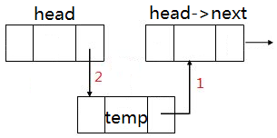

# 第二节 线性表-链式存储-链表

## 回顾数组

时间复杂度：

- 访问：由于可以随机访问，O(1)
- 插入：O(n)
- 删除：O(n)
- 静态操作：访问或修改某个元素的值，常数时间内完成
- 动态操作：插入或删除一个元素，线性时间内完成

此外数组还有一个限制：数组大小一经确定不得修改，存在数组满的风险。

可扩容数组实现原理：当数组满后创建一个更大的数组，将原来数组中的内容复制到新的数组，释放掉原来数组所占内存。

究其本质：数组在逻辑结构和物理结构上都是连续的，对数组局部进行的修改可能引起大范围甚至整个数据结构的调整。

## 改变存储策略

* 保留逻辑上的次序（通过使用指针），每个节点的物理地址不作要求
* 不再具有数组随机访问的特性，静态访问操作时间复杂度O(n)
* 插入删除操作仅在局部进行，动态修改操作时间复杂度O(1)。当然确定在哪个节点上操作仍需O(n)的时间复杂度。
* 空间利用率更高，按需确定大小，可以动态扩容。但每个节点指针的存储需额外占用一定空间。

## 单向链表

### 节点定义

#### C++写法

```cpp
struct Node {	//C++写法
	int data;
	Node* next;
	//构造函数
	Node(int x = 0) { data = x; next = NULL; }
};

int main() {
	Node* temp1 = new Node(1);
	Node* temp2 = new Node(2);
	temp1->next = temp2;
}
```

#### C语言写法

```cpp
#include <stdio.h>
#include <stdlib.h>

typedef struct Node {	//C语言写法
	int data;
	struct Node* next;
}Node;

Node* createNode(int data) {
	Node* temp = (Node*)malloc(sizeof(Node));
	temp->data = data;
	temp->next = NULL;
	return temp;
}

int main() {
	Node* temp1 = createNode(1);
	Node* temp2 = createNode(2);
	temp1->next = temp2;
}
```

### 关于头结点

* 又称哨兵节点。将链表**空**与**非空**情况进行统一，使得各类算法无需对各种边界退化情况做专门处理。

* 除非题目特别说明，否则默认链表都有头结点。

  

### 链表定义

```cpp
struct LinkList {
	Node* head;		//头节点，必须
	//Node* rear;		//尾指针，指向链表最后一个节点，可选
	//int size;		//链表节点个数，可选
    
	LinkList() {	//构造函数，链表创建时的初始化操作
		head = new Node();	//创建头结点
		//rear = head;		//尾指针指向头结点
		//size = 0;
	}
};

int main() {
	LinkList* L = new LinkList();
}
```


### 使用头插法建立链表



```cpp
//头插法建立链表
LinkList* createLinklist1(int A[], int n) {
	LinkList* L = new LinkList();
	for (int i = 0; i < n; i++) {
		Node* temp = new Node(A[i]);
		temp->next = L->head->next;
		L->head->next = temp;
	}
	return L;
}
```

### 使用尾插法建立链表


```cpp
//尾插法建立链表
LinkList* createLinklist2(int A[], int n) {
	LinkList* L = new LinkList();
	Node* rear = L->head;		//创建尾指针
	for (int i = 0; i < n; i++) {
		Node* temp = new Node(A[i]);
		rear->next = temp;
		rear = rear->next;		//更新尾指针
	}
	return L;
}
```

### 统计链表节点个数、输出整个链表

```cpp
int getSize(LinkList* L) {
	int cnt = 0;
	for (Node* p = L->head->next; p != NULL; p = p->next) {
		cnt++;
	}
	return cnt;
}

void printLinkList(LinkList* L) {
	for (Node* p = L->head->next; p != NULL; p = p->next) {
		printf("%d ", p->data);
	}
	printf("\n");
}
```

### 查找

#### 查找指定值节点位置

```cpp
//在链表中查找第一个值为x的节点，并返回该节点的指针，未找到则返回NULL
Node* findElem(LinkList* L, int x) {
	for (Node* p = L->head->next; p != NULL; p = p->next) {
		if (p->data == x) {
			return p;
		}
	}
	return NULL;
}
```

#### 访问第i个节点

```cpp
//访问第i个节点（i从0开始计数）
int getNodeAt(LinkList* L, int i) {
	int cnt = 0;
	for (Node* p = L->head->next; p != NULL; p = p->next) {
		if (cnt == i) return p->data;
		cnt++;
	}
	printf("越界了\n");
	return -1;	//越界了
}
```


### 插入

#### 在指定节点后面插入一个节点


```cpp
//在指定节点后面插入节点e，并返回新插入节点的位置
Node* insertAfter(Node* p, int e) {
	Node* temp = new Node(e);
	temp->next = p->next;
	p->next = temp;
	return temp;
}
```

#### 在下标i处插入一个节点


```cpp
//在下标i节点处插入一个节点e，并返回新插入节点的指针
//i从0开始计数，不包括头结点（与数组的操作统一）
//即在下标i节点的前面插入一个节点e
Node* insertAt(LinkList* L, int i, int e) {
	Node* p = L->head;
	while (i--) {	//p向后移动i次
		p = p->next;
		if (p == NULL) {
			printf("越界了，插入失败\n");
			return NULL;
		}
	}
	//return insertAfter(p, e);
	Node* temp = new Node(e);
	temp->next = p->next;
	p->next = temp;
	return temp;
}
```


### 删除

要删除节点p，必须找到节点p的前驱节点。

#### 删除节点p的后继节点


```cpp
int removeNodeAfter(Node* p) {	//删除指定节点的后继节点，并返回删除节点的值
	if (p->next == NULL) return -1;	
	Node* temp = p->next;
	int ret = temp->data;
	p->next = temp->next;	
	delete temp;	//free(temp);
	return ret;
}
```

#### 删除指定位置节点

```cpp
//给定节点t的地址，在链表中删除该节点
int removeNode(LinkList* L, Node* t) {
	Node* p;
    //找到节点t的前驱节点p
	for (p = L->head; p != NULL; p = p->next) {
		if (p->next == t) break;
	}
	//return deleteNodeAfter(p);
	int ret = t->data;
	p->next = t->next;
	delete t;
	return ret;
}
```

#### 删除下标i处的节点

```cpp
//删除下标i节点，并返回删除节点的值
//即删除下标i-1节点的后一个节点
int removeAt(LinkList* L, int i) {
	Node* p = L->head;
    //p向后移动i次，最终p指向带删除节点的前驱节点
	while (i-- && p->next != NULL) {
		p = p->next;
	}
	if (p->next == NULL) {
		printf("越界了，删除失败\n");
		return -1;
	}
	//return removeAfter(p);
	Node* temp = p->next;
	int ret = temp->data;
	p->next = temp->next;
	delete temp;
	return ret;
}
```


### 完整代码

```cpp
#include <cstdio>

struct Node {
	int data;
	Node* next;

	//构造函数，将该节点的data赋值为x（默认为0），next置为NULL
	Node(int x = 0) { data = x; next = NULL; }
};

struct LinkList {
	Node* head;		//头节点，必须

	//构造函数，将链表初始化为仅含头结点的空链表
	LinkList() {
		head = new Node();	//创建头结点
	}
};

//头插法建立链表
LinkList* createLinklist1(int A[], int n) {
	LinkList* L = new LinkList();
	for (int i = 0; i < n; i++) {
		Node* temp = new Node(A[i]);
		temp->next = L->head->next;
		L->head->next = temp;
	}
	return L;
}

//尾插法建立链表
LinkList* createLinklist2(int A[], int n) {
	LinkList* L = new LinkList();
	Node* rear = L->head;		//创建尾指针
	for (int i = 0; i < n; i++) {
		Node* temp = new Node(A[i]);
		rear->next = temp;
		rear = rear->next;		//更新尾指针
	}
	return L;
}

//在链表中查找第一个值为x的节点，并返回该节点的指针，未找到则返回NULL
Node* findElem(LinkList* L, int x) {
	for (Node* p = L->head->next; p != NULL; p = p->next) {
		if (p->data == x) {
			return p;
		}
	}
	return NULL;
}

//访问第i个节点（i从0开始计数）
int getNodeAt(LinkList* L, int i) {
	int cnt = 0;
	for (Node* p = L->head->next; p != NULL; p = p->next) {
		if (cnt == i) return p->data;
		cnt++;
	}
	printf("越界了\n");
	return -1;	//越界了
}

//在指定节点后面插入节点e，并返回新插入节点的位置
Node* insertAfter(Node* p, int e) {
	Node* temp = new Node(e);
	temp->next = p->next;
	p->next = temp;
	return temp;
}

//在下标i节点处插入一个节点e，并返回新插入节点的指针
//i从0开始计数，不包括头结点（与数组的操作统一）
//即在下标i节点的前面插入一个节点e
Node* insertAt(LinkList* L, int i, int e) {
	Node* p = L->head;
	while (i--) {	//p向后移动i次
		p = p->next;
		if (p == NULL) {
			printf("越界了，插入失败\n");
			return NULL;
		}
	}
	//return insertAfter(p, e);
	Node* temp = new Node(e);
	temp->next = p->next;
	p->next = temp;
	return temp;
}

//删除指定节点的后继节点，并返回删除节点的值
int removeAfter(Node* p) {
	if (p->next == NULL) return -1;
	Node* temp = p->next;
	int ret = temp->data;
	p->next = temp->next;
	delete temp;
	return ret;
}

//删除下标i节点，并返回删除节点的值
//即删除下标i-1节点的后一个节点
int removeAt(LinkList* L, int i) {
	Node* p = L->head;
	while (i-- && p->next != NULL) {	//p向后移动i次
		p = p->next;
	}
	if (p->next == NULL) {
		printf("越界了，删除失败\n");
		return -1;
	}
	//return removeAfter(p);
	if (p->next == NULL) return -1;
	Node* temp = p->next;
	int ret = temp->data;
	p->next = temp->next;
	delete temp;
	return ret;
}

//给定节点t的地址，在链表中删除该节点
int removeNode(LinkList* L, Node* t) {
	Node* p;
	for (p = L->head; p != NULL; p = p->next) {	//找到节点t的前驱节点p
		if (p->next == t) break;
	}
	//return deleteNodeAfter(p);
	int ret = t->data;
	p->next = t->next;
	delete t;
	return ret;
}

int getSize(LinkList* L) {
	int cnt = 0;
	for (Node* p = L->head->next; p != NULL; p = p->next) {
		cnt++;
	}
	return cnt;
}

void printLinkList(LinkList* L) {
	for (Node* p = L->head->next; p != NULL; p = p->next) {
		printf("%d ", p->data);
	}
	printf("\n\n");
}

int main() {
	int A[] = { 1,2,3,4,5 };
	int N = sizeof(A) / sizeof(int);

	printf("尾插法创建一个链表，记为L2:\n");
	LinkList* L2 = createLinklist2(A, N);
	printLinkList(L2);

	printf("头插法创建一个链表，记为L1:\n");
	LinkList* L1 = createLinklist1(A, N);
	printLinkList(L1);

	printf("以下均是对链表L1进行操作:\n\n");

	printf("在下标6处尝试插入节点10：\n");
	insertAt(L1, 6, 10);
	printf("\n");

	insertAt(L1, 5, 10);
	printf("在下标5处插入节点10：\n");
	printLinkList(L1);

	insertAt(L1, 0, 11);
	printf("在下标0处插入节点11：\n");
	printLinkList(L1);

	Node* p = findElem(L1, 3);
	printf("查找第一个值为3的节点，将该节点记为p\n");

	Node* p1 = insertAfter(p, 20);
	printf("在节点p后面插入一个节点20，并将新插入的节点记为p1：\n");
	printLinkList(L1);

	removeNode(L1, p1->next);
	printf("删除p1节点后的节点：\n");
	printLinkList(L1);

	removeAfter(p1);
	printf("再删除p1节点后的节点：\n");
	printLinkList(L1);

	removeAt(L1, 0);
	printf("删除下标0节点：\n");
	printLinkList(L1);

	printf("尝试删除下标5节点:");
	removeAt(L1, 5);
	printf("\n");

	removeAt(L1, 4);
	printf("删除下标4节点：\n");
	printLinkList(L1);

	printf("访问下标3的节点：");
	printf("%d\n\n", getNodeAt(L1, 3));

	return 0;
}
```


### 完整代码（头结点裸露、纯C语言实现）

写法1：

```c
#include <stdio.h>
#include <stdlib.h>

typedef struct Node {
	int data;
	struct Node* next;
} Node;

Node* createNode(int data) {
	Node* temp = (Node*)malloc(sizeof(Node));
	temp->data = data;
	temp->next = NULL;
	return temp;
}

//创建一个空链表
Node* createLinklist0() {
	Node* head = createNode(0);
	return head;
}

//头插法建立链表
Node* createLinklist1(int A[], int n) {
	Node* head = createNode(0);
	for (int i = 0; i < n; i++) {
		Node* temp = createNode(A[i]);
		temp->next = head->next;
		head->next = temp;
	}
	return head;
}

//尾插法建立链表
Node* createLinklist2(int A[], int n) {
	Node* head = createNode(0);
	Node* rear = head;		//创建尾指针
	for (int i = 0; i < n; i++) {
		Node* temp = createNode(A[i]);
		rear->next = temp;
		rear = rear->next;		//移动尾指针
	}
	return head;
}

Node* findElem(Node* L, int x) {
	for (Node* p = L->next; p != NULL; p = p->next) {
		if (p->data == x) {
			return p;
		}
	}
	return NULL;
}

//在指定节点后面插入节点，并返回新插入节点的位置
Node* insertNodeAfter(Node* p, int x) {
	Node* temp = createNode(x);
	temp->next = p->next;
	p->next = temp;
	return temp;
}

//删除指定节点的后继节点，并返回删除节点的值
int deleteNodeAfter(Node* p) {
	if (p->next == NULL) return -1;
	Node* temp = p->next;
	int ret = temp->data;
	p->next = temp->next;
	free(temp);
	return ret;
}

//删除指定节点，并返回删除节点的值
int deleteNode(Node* L, Node* t) {
	Node* p;
	for (p = L; p != NULL; p = p->next) {	//找到节点t的前驱节点p
		if (p->next == t) break;
	}
	//return deleteNodeAfter(p);
	int ret = t->data;
	p->next = t->next;
	free(t);
	return ret;
}

int getLinklistSize(Node* head) {
	int cnt = 0;
	for (Node* p = head->next; p != NULL; p = p->next) {
		cnt++;
	}
	return cnt;
}

void printLinklist(Node* head) {
	for (Node* p = head->next; p != NULL; p = p->next) {
		printf("%d ", p->data);
	}
	printf("\n");
}

int main() {
	int A[] = { 1,2,3,4,5 };
	int N = sizeof(A) / sizeof(int);

	Node* head = createLinklist1(A, N);	//头插法
	printLinklist(head);

	Node* head2 = createLinklist2(A, N);	//尾插法
	printLinklist(head2);

	Node* p = findElem(head, 3);	//找到节点3的位置
	Node* p1 = insertNodeAfter(p, 10);	//在节点3后面插入一个节点10
	printLinklist(head);

	deleteNode(head, p1->next);
	printLinklist(head);
	deleteNode(head, p1->next);
	printLinklist(head);

	return 0;
}
```

写法2：

```c
#include <stdio.h>
#include <stdlib.h>

typedef struct Node {
	int data;
	struct Node* next;
} Node;

typedef Node* Linklist;		//关键语句

Node* createNode(int data) {
	Node* temp = (Node*)malloc(sizeof(Node));
	temp->data = data;
	temp->next = NULL;
	return temp;
}

//创建一个空链表
Linklist createLinklist0() {
	Node* head = createNode(0);
	return head;
}

//头插法建立链表
Linklist createLinklist1(int A[], int n) {
	Node* head = createNode(0);
	for (int i = 0; i < n; i++) {
		Node* temp = createNode(A[i]);
		temp->next = head->next;
		head->next = temp;
	}
	return head;
}

Node* findElem(Linklist L, int x) {
	for (Node* p = L->next; p != NULL; p = p->next) {
		if (p->data == x) {
			return p;
		}
	}
	return NULL;
}

//在指定节点后面插入节点，并返回新插入节点的位置
Node* insertNodeAfter(Node* p, int x) {
	Node* temp = createNode(x);
	temp->next = p->next;
	p->next = temp;
	return temp;
}

void printLinklist(Linklist L) {
	for (Node* p = L->next; p != NULL; p = p->next) {
		printf("%d ", p->data);
	}
	printf("\n");
}

int main() {
	int A[] = { 1,2,3,4,5 };
	int N = sizeof(A) / sizeof(int);

	Linklist L = createLinklist1(A, N);	//头插法
	printLinklist(L);

	Node* p = findElem(L, 3);	//找到节点3的位置
	Node* p1 = insertNodeAfter(p, 10);	//在节点3后面插入一个节点10
	printLinklist(L);

	return 0;
}
```

备注：

`typedef`可以为一个已有类型取多个别名，比如

```c
typedef int numType1, numType2;	//给int类型取了两个别名
numType1 a = 5;
numType2 b = 10;
```

在严蔚敏的数据结构教材中，会出现这种写法：

```c
typedef struct Node {
	int data;
	struct Node* next;
} Node, *Linklist;
```

其实就相当于下面这种写法：

```c
typedef struct Node {
	int data;
	struct Node* next;
} Node;

typedef Node* Linklist;
```


### 例题：多项式加法

一个多项式可以使用链表来表示，设计一个算法，可以对用链表表示的多项式进行加法运算。

```
  P1 = 3x^5 + 4x^4 - x^3        + 2x - 1
+ P2 =        2x^4 + x^3 - 7x^2 +  x
-----------------------------------------
   P = 3x^5 + 6x^4       - 7x^2 + 3x - 1
```

思路：指数相同的项系数可以直接相加，其余部分直接拷贝

```cpp
#include <iostream>
#include <initializer_list>
#include <string>
using namespace std;

struct PolyNode {
	int coef;	//系数
	int exp;	//指数
	PolyNode* next;

	PolyNode() :next(NULL) {}
	PolyNode(int coef, int exp) :next(NULL), coef(coef), exp(exp) {}
};

PolyNode* poly_add(PolyNode* A, PolyNode* B) {
	PolyNode* p = A->next;
	PolyNode* q = B->next;
	PolyNode* C = new PolyNode();
	PolyNode* rear = C;
	while (p != NULL && q != NULL) {
		PolyNode* temp = NULL;
		if (p->exp > q->exp) {
			temp = new PolyNode(p->coef, p->exp);
			p = p->next;
		}
		else if (p->exp < q->exp) {
			temp = new PolyNode(q->coef, q->exp);
			q = q->next;
		}
		else {	//p、q所指的项指数相同，可以直接相加
			int x = p->coef + q->coef;
			if (x != 0) {
				temp = new PolyNode(x, p->exp);
			}	//如果相加后系数为0，此时temp==NULL
			p = p->next;
			q = q->next;
		}
		//如果temp不为null则将其插入多项式C的末尾
		if (temp != NULL) {
			rear->next = temp;
			rear = temp;	//rear = rear->next;
		}
	}
	while (p != NULL) {
		rear->next = new PolyNode(p->coef, p->exp);
		rear = rear->next;
		p = p->next;
	}
	while (q != NULL) {
		rear->next = new PolyNode(q->coef, q->exp);
		rear = rear->next;
		q = q->next;
	}
	return C;
}

//如果你不在意输出格式，该函数可以简单这样写
void printPoly_simply(PolyNode* head) {
	for (PolyNode* p = head->next; p != NULL; p = p->next) {
		printf("%dx^%d + ", p->coef, p->exp);
	}
	printf("\n");
}

void printPoly(PolyNode* head) {
	bool isFirst = true;	//当前输出的这一项是否是该多项式的第一项
	bool hasOutput = false;
	for (PolyNode* p = head->next; p != NULL; p = p->next) {
		int coef = p->coef, exp = p->exp;
		if (coef == 0) continue;

		//输出系数部分
		if (coef == 1) {
			printf("%s", isFirst ? "" : " + ");
		}
		else if (coef == -1) {
			printf("%s", isFirst ? "-" : " - ");
		}
		else if (coef > 1) {
			if (isFirst) printf("%d", coef);
			else printf(" + %d", coef);
		}
		else if (coef < -1) {
			if (isFirst) printf("%d", coef);
			else printf(" - %d", -coef);
		}

		//输出指数部分
		if (exp == 0) {
			if (coef == 1 || coef == -1) {
				printf("1");
			}
		}
		else if (exp == 1) {
			printf("x");
		}
		else {
			printf("x^%d", exp);
		}

		isFirst = false;
		hasOutput = true;
	}
	//如果一个多项式链表为空或者其每一项的系数都为0，则最终输出一个0
	if (hasOutput == false) printf("0");
	printf("\n");
}

void test(const initializer_list<pair<int, int>> &il1,
	const initializer_list<pair<int, int>> &il2) {
	static int cnt = 0;
	printf("-------------------------------\n");
	printf("测试用例 #%d:\n", ++cnt);

	PolyNode* A = new PolyNode();
	PolyNode* rear_A = A;
	for (pair<int, int> p : il1) {
		rear_A->next = new PolyNode(p.first, p.second);
		rear_A = rear_A->next;
	}

	PolyNode* B = new PolyNode();
	PolyNode* rear_B = B;
	for (pair<int, int> p : il2) {
		rear_B->next = new PolyNode(p.first, p.second);
		rear_B = rear_B->next;
	}

	printf("多项式A：\n");
	printPoly(A);
	printf("多项式B：\n");
	printPoly(B);
	printf("\n");

	PolyNode* C = poly_add(A, B);
	printf("多项式A+B：\n");
	printPoly(C);
}

int main() {
	test({ {3,5}, {4,4}, {-1,3}, {2,1}, {-1,0} },
		{ {2,4}, {1,3}, {-7,2}, {1,1} });

	test({ {-1,0} },
		{ {1,0} });

	return 0;
}
```


## 双向链表

### 节点、链表定义

```cpp
struct Node {
	int data;
	Node *pre, *next;

	Node(int x = 0) { data = x; pre = NULL; next = NULL; }
};

struct LinkList {
	Node *head, *rear;	//头节点、尾节点
	int size;

	LinkList() {
		head = new Node();
		rear = new Node();
		head->next = rear;
		rear->pre = head;
		size = 0;
	}
};
```

### 插入

#### 在p节点后面插入节点


```cpp
Node* insertNodeAfter(Node* p, int x) {		//在p后面插入
    Node* temp = new Node(x);
    temp->next = p->next;
    temp->pre = p;
    p->next->pre = temp;
    p->next = temp;
    size++;
    return temp;
}
```

#### 在p节点前面插入节点


```cpp
Node* insertNodeBefore(Node* p, int x) {	//在p前面插入
    Node* temp = new Node(x);
    temp->next = p;
    temp->pre = p->pre;
    p->pre->next = temp;
    p->pre = temp;
    size++;
    return temp;
}
```

### 删除


```cpp
int deleteNode(Node* p) {
    int ret = p->data;
    p->pre->next = p->next;
    p->next->pre = p->pre;
    delete p;
    size--;
    return ret;
}
```

### 清空

```cpp
void clear() {
    Node* p = head->next;
    while (p != rear) {
        Node* temp = p;
        p = p->next;
        delete temp;
    }
    head->next = rear;
    rear->pre = head;
    size = 0;
}
```

### 完整代码（使用C++面向对象的方法描述）

```cpp
#include <iostream>
using namespace std;

struct Node {
	int data;
	Node *pre, *next;

	Node(int x = 0) { data = x; pre = nullptr; next = nullptr; }
};

class LinkList {
private:
	Node *head, *rear;	//头节点、尾节点（注意区分尾节点与尾指针）
	int size;

public:
	//构造函数，自动创建头结点、尾节点，用于链表的初始化
	LinkList() {
		head = new Node();
		rear = new Node();
		head->next = rear;
		rear->pre = head;
		size = 0;
	}

	//重载了一个新的构造函数，该构造函数会先调用上面不带参数的构造函数
	//然后依次将initializer_list容器中的每个元素插入链表末尾，相当于尾插法初始化链表
	//定义了一个接受参数为初始化列表的构造函数后，就可以使用{}语法来初始化该链表
	//如 LinkList L = { 1,2,3,4,5 }; 编译器会自动调用该构造函数
	LinkList(const initializer_list<int> &il) :LinkList() {
		for (int x : il) {
			push_back(x);
		}
	}

	~LinkList() {	//析构函数
		clear();
		delete head; delete rear;
	}

	//访问第k个节点（k从0开始计数）
	int& get(int k) {
		//这里函数返回的是引用，因为不加引用get(k)只能作为右值  int a = get(k); 
		//而使用引用后get(k)则可以作为左值  get(k) = 100;
		if (k >= size) throw exception("访问下标越界");	//越界了
		int cnt = 0;
		for (Node* p = head->next; p != rear; p = p->next) {
			if (cnt == k) return p->data;
			cnt++;
		}
	}

	Node* findElem(int x) {
		for (Node* p = head->next; p != rear; p = p->next) {
			if (p->data == x) return p;
		}
		return nullptr;	//没找到
	}

	Node* insertNodeAfter(Node* p, int x) {
		Node* temp = new Node(x);
		temp->pre = p;
		temp->next = p->next;
		p->next->pre = temp;
		p->next = temp;
		size++;
		return temp;
	}

	Node* insertNodeBefore(Node* p, int x) {
		Node* temp = new Node(x);
		temp->next = p;
		temp->pre = p->pre;
		p->pre->next = temp;
		p->pre = temp;
		size++;
		return temp;
	}

	int removeNode(Node* p) {
		int ret = p->data;
		p->pre->next = p->next;
		p->next->pre = p->pre;
		delete p;
		size--;
		return ret;
	}

	void printAll() {
		if (head->next == rear) {
			printf("linklist is empty\n");
			return;
		}
		for (Node* p = head->next; p != rear; p = p->next) {
			printf("%d ", p->data);
		}
		printf("\n");
	}

	bool empty() {
		return size == 0;
	}

	void clear() {
		Node* p = head->next;
		while (p != rear) {
			Node* temp = p;
			p = p->next;
			delete(temp);
		}
		head->next = rear;
		rear->pre = head;
		size = 0;
	}

	int& operator[] (int k) {	//重载下标[]访问
		return get(k);
	}

	//下面这6个操作是为下一章学习队列做准备的
	int& front() {		//访问第一个节点
		if (empty()) throw exception("链表为空");
		return head->next->data;
	}

	int& back() {		//访问最后一个节点
		if (empty()) throw exception("链表为空");
		return rear->pre->data;
	}

	Node* push_back(int x) {	//在链表末尾插入一个节点
		return insertNodeBefore(rear, x);
	}

	Node* push_front(int x) {	//在链表开始插入一个节点
		return insertNodeAfter(head, x);
	}

	int pop_back() {		//删除链表末尾的节点
		if (empty()) throw exception("链表为空");
		return removeNode(rear->pre);
	}

	int pop_front() {		//删除链表开始的节点
		if (empty()) throw exception("链表为空");
		return removeNode(head->next);
	}
};

int main() {
	// 调用构造函数 LinkList(const initializer_list<int> &il)
	LinkList L = { 1,2,3,4,5 };	
	L.printAll();

	printf("L[2] = %d\n", L[2]);
	L[4] = 100;
	L.printAll();

	Node* p = L.findElem(4);
	L.insertNodeBefore(p, 10);
	L.printAll();

	L.removeNode(p);
	L.printAll();

	L.clear();
	L.printAll();
	return 0;
}
```

## 静态链表


### 节点定义

```cpp
typedef int NodePosi;	// 空指针NULL用-1表示，因此这里不能使用无符号int

struct Node {
	int data;
	NodePosi next;	//模拟指针
};
```

### 静态链表与普通链表的联系

其实整个内存也可以看成是一个数组，比如4GB的内存，每个字节分配一个数组编号的话，这个“数组”的下标范围就是从 0 ~ 2^32 - 1。这样普通链表也可以看成是静态链表，指针就相当于是内存这个数组的下标。

### 完整代码*

```cpp
#include <iostream>
using namespace std;

typedef int NodePosi;	// 约定空指针NULL用-1表示，因此这里不能使用无符号int

struct Node {
	int data;
	NodePosi next;	//模拟指针
};

class LinkList {	//使用数组模拟的静态单向链表
private:
	const int MAX_SIZE = 1000;

	Node* nodes;

	NodePosi head;	//头结点，对于静态链表，头结点的数组下标一定是0

	NodePosi index_allocator;	//记录当创建一个新节点时，当前可分配的数组下标。
								//这算是一个非常笨的“内存池”，只会分配下标，不会回收下标。

	NodePosi createNode(int x = 0) {
		if (index_allocator >= MAX_SIZE) throw exception("静态链表已满");
		nodes[index_allocator].data = x;
		nodes[index_allocator].next = -1;	// 相当于节点temp.next = NULL
		return index_allocator++;
	}

public:
	LinkList() {
		index_allocator = 0;
		nodes = new Node[MAX_SIZE];
		head = createNode();	//数组0号下标作为头结点
		printf("静态链表初始化完成\n");
	}

	~LinkList() {
		delete[] nodes;
	}

	NodePosi insertNodeAfter(NodePosi p, int x) {	//在指定节点p后面插入节点，并返回新插入节点的位置
		NodePosi temp = createNode(x);
		nodes[temp].next = nodes[p].next;
		nodes[p].next = temp;
		return temp;
	}

	int deleteNodeAfter(NodePosi p) {	//删除指定节点p的后继节点，并返回删除节点的值
		if (nodes[p].next == -1) throw exception("不能删除链表最后一个节点的后继节点");
		NodePosi temp = nodes[p].next;
		nodes[p].next = nodes[temp].next;
		return nodes[temp].data;
	}

	bool empty() {
		return nodes[head].next == -1;
	}

	void print() {
		for (NodePosi p = nodes[head].next; p != -1; p = nodes[p].next) {
			printf("%d ", nodes[p].data);
		}
		printf("\n");
	}
};

int main() {
	LinkList L;
	printf("L.empty() = %s\n", L.empty() ? "true" : "false");

	for (int i = 1; i <= 5; i++) {
		L.insertNodeAfter(0, i);	//在0号节点（头结点）后插入一个节点，相当于头插法建立链表
	}
	L.print();
	printf("L.empty() = %s\n", L.empty() ? "true" : "false");

	for (int i = 0; i < 5; i++) {
		L.deleteNodeAfter(0);
		L.print();
	}

	printf("L.empty() = %s\n", L.empty() ? "true" : "false");

	return 0;
}
```

## 考试题目

### 删除链表中值最小值的点

假设链表各节点的值不重复

```cpp
#include <iostream>
#include <initializer_list>
using namespace std;

struct Node {
	int data;
	Node* next;

	Node(int x = 0) :data(x), next(NULL) {}
};

void deleteMinNode(Node* head) {
	if (head->next == NULL) return; //链表为空
	Node* minNode_pre = head;
	
	for (Node* p = head; p->next != NULL; p = p->next) {
		if (p->next->data < minNode_pre->next->data) {
			minNode_pre = p;
		}
	}

	Node* temp = minNode_pre->next;
	minNode_pre->next = temp->next;
	delete temp;
}

void printLinkList(Node* head) {
	for (Node* p = head->next; p != NULL; p = p->next) {
		printf("%d ", p->data);
	}
	printf("\n");
}

void test(const initializer_list<int> &il) {
	static int cnt = 0;
	printf("-------------------------------\n");
	printf("测试用例 #%d:\n", ++cnt);
	Node* head = new Node();
	Node* rear = head;
	for (int x : il) {
		rear->next = new Node(x);
		rear = rear->next;
	}
	printf("调用算法前:\n");
	printLinkList(head);
	printf("\n");
	deleteMinNode(head);
	printf("调用算法后:\n");
	printLinkList(head);
}

int main() {
	test({ 1,2,3,-2,4 });
	test({ 1 });
	test({ 1,2 });
	test({ });

	return 0;
}
```

### 快慢指针

#### 查找中间节点

如果链表的节点个数（不包括头节点）为奇数，则返回中间那个节点的指针。

如果链表的节点个数为偶数，则返回中间两个节点的前面那个节点的指针。

```cpp
#include <iostream>
#include <initializer_list>
using namespace std;

struct Node {
	int data;
	Node* next;

	Node(int x = 0) :data(x), next(NULL) {}
};

Node* findMid(Node* head) {
	if (head->next == NULL) return NULL;
	Node* fast = head->next;
	Node* slow = head->next;
	while (fast->next != NULL && fast->next->next != NULL) {
		fast = fast->next->next;
		slow = slow->next;
	}
	return slow;
}

void printLinkList(Node* head) {
	if (head->next == NULL) {
		printf("null\n");
		return;
	}
	for (Node* p = head->next; p != NULL; p = p->next) {
		printf("%d ", p->data);
	}
	printf("\n");
}

void test(const initializer_list<int> &il) {
	static int cnt = 0;
	printf("-------------------------------\n");
	printf("测试用例 #%d:\n", ++cnt);
	
	Node* head = new Node();
	Node* rear = head;
	for (int x : il) {
		rear->next = new Node(x);
		rear = rear->next;
	}
	printLinkList(head);
	Node* ret = findMid(head);
	if (ret == NULL) printf("mid = null\n");
	else printf("mid = %d\n", ret->data);
}

int main() {
	test({ 1,2,3,-2,4 });
	test({ 1,2,3,4 });
	test({ 1 });
	test({ 1,2 });
	test({ });

	return 0;
}
```

#### 查找链表倒数第n个节点

```cpp
#include <iostream>
#include <initializer_list>
using namespace std;

struct Node {
	int data;
	Node* next;
	Node(int x = 0) :data(x), next(NULL) {}
};

//找到链表倒数第n个节点，当n=1时返回最后一个节点位置
Node* findNthFromEnd(Node* head, int n) {
	if (head->next == NULL || n < 1) return NULL;
	Node* fast = head->next;
	while (n--) {
		if (fast == NULL) return NULL;	//越界
		fast = fast->next;
	}
	Node* slow = head->next;
	while (fast != NULL) {
		fast = fast->next;
		slow = slow->next;
	}
	return slow;
}

void printLinkList(Node* head) {
	if (head->next == NULL) {
		printf("null\n");
		return;
	}
	for (Node* p = head->next; p != NULL; p = p->next) {
		printf("%d ", p->data);
	}
	printf("\n");
}

void test(const initializer_list<int> &il, int n) {
	static int cnt = 0;
	printf("-------------------------------\n");
	printf("测试用例 #%d:\n", ++cnt);

	Node* head = new Node();
	Node* rear = head;
	for (int x : il) {
		rear->next = new Node(x);
		rear = rear->next;
	}
	printLinkList(head);
	printf("n = %d,  ", n);
	Node* ret = findNthFromEnd(head, n);
	if (ret == NULL) printf("ret = null\n");
	else printf("ret = %d\n", ret->data);
}

int main() {
	test({ 1,2,3,4 }, 1);
	test({ 1,2,3,4 }, 2);
	test({ 1,2,3,4 }, 3);
	test({ 1,2,3,4 }, 4);
	test({ 1,2,3,4 }, 5);
	test({ 1 }, 1);
	test({ }, 0);

	return 0;
}
```


### 链表逆置

设计一个算法将带头结点的单链表L逆置，要求不能建立新的节点，只能使用表中已有的节点重新组合完成。


```cpp
#include <iostream>
#include <initializer_list>
using namespace std;

struct Node {
	int data;
	Node* next;

	Node(int x = 0) :data(x), next(NULL) {}
};

void reverseLinkList(Node* head) {
	Node* p = head->next;
	head->next = NULL;	//将头节点与其它节点断开
	while (p != NULL) {
		Node* temp = p;
		p = p->next;
		temp->next = head->next;	//将temp节点插在头节点后面
		head->next = temp;
	}
}

void printLinkList(Node* head) {
	for (Node* p = head->next; p != NULL; p = p->next) {
		printf("%d ", p->data);
	}
	printf("\n");
}

void test(const initializer_list<int> &il) {
	static int cnt = 0;
	printf("-------------------------------\n");
	printf("测试用例 #%d:\n", ++cnt);
	Node* head = new Node();
	Node* rear = head;
	for (int x : il) {
		rear->next = new Node(x);
		rear = rear->next;
	}
	printf("链表逆置前:\n");
	printLinkList(head);
	printf("\n");
	reverseLinkList(head);
	printf("链表逆置后:\n");
	printLinkList(head);
}

int main() {
	test({ 1,2,3,4,5,6 });
	test({ 1 });
	test({});

	return 0;
}
```

### 有序链表去重

```cpp
void uniqueLinkList(Node* head) {
    //错误写法，绝对不能这么写
	for (Node* p = head->next; p->next != NULL; p = p->next) {
		if (p->next->data == p->data) {
			Node* temp = p->next;
			p->next = temp->next;
			delete temp;
		}
	}
}
```

**经验**：对于单向链表来说，`for (Node* p = head->next; p != NULL; p = p->next)`遍历链表只适用于静态访问操作，对于遍历链表的同时进行插入删除等动态操作，应想清楚代码逻辑，改用`while`循环。

```cpp
#include <iostream>
#include <initializer_list>
using namespace std;

struct Node {
	int data;
	Node* next;

	Node(int x = 0) :data(x), next(NULL) {}
};

void uniqueLinkList(Node* head) {
	Node* p = head->next;
	if (p == NULL) return;	//链表为空
	while (p->next != NULL) {
		if (p->next->data == p->data) {
			Node* temp = p->next;
			p->next = temp->next;
			delete temp;
		}
		else {
			p = p->next;
		}
	}
}

void printLinkList(Node* head) {
	for (Node* p = head->next; p != NULL; p = p->next) {
		printf("%d ", p->data);
	}
	printf("\n");
}

void test(const initializer_list<int> &il) {
	static int cnt = 0;
	printf("-------------------------------\n");
	printf("测试用例 #%d:\n", ++cnt);
	Node* head = new Node();
	Node* rear = head;
	for (int x : il) {
		rear->next = new Node(x);
		rear = rear->next;
	}
	printf("调用算法前:\n");
	printLinkList(head);
	printf("\n");
	uniqueLinkList(head);
	printf("调用算法后:\n");
	printLinkList(head);
}

int main() {
	test({ 1,1,1,2,3,3,3,5,5 });
	test({ 1,1,1 });
	test({ 1 });
	test({ 1,2 });

	return 0;
}
```


### 拆分链表

设计一个算法，将一个带头节点的单链表A（数据域为整数）拆分为两个单链表A、B，其中链表A只含原链表data为奇数的节点，链表B只含原链表data为偶数的节点，且均需要保留原链表节点的相对次序。算法应接收两个链表A、B，其中链表B并未初始化。

```cpp
#include <iostream>
#include <initializer_list>
using namespace std;

struct Node {
	int data;
	Node* next;

	Node(int x = 0) :data(x), next(NULL) {}
};

void splitLinkList(Node* A, Node* &B) {
	B = new Node();
	Node* rear = B;
	Node* p = A;
	while (p->next != NULL) {
		if (p->next->data % 2 == 0) {
			Node* temp = p->next;
			p->next = temp->next;
			rear->next = temp;
			rear = temp;	//rear = rear->next;
		}
		else {
			p = p->next;
		}
	}
	rear->next = NULL;
}

void printLinkList(Node* head) {
	for (Node* p = head->next; p != NULL; p = p->next) {
		printf("%d ", p->data);
	}
	printf("\n");
}

void test(const initializer_list<int> &il) {
	static int cnt = 0;
	printf("-------------------------------\n");
	printf("测试用例 #%d:\n", ++cnt);

	Node* LinkList_A = new Node();
	Node* rear = LinkList_A;
	for (int x : il) {
		rear->next = new Node(x);
		rear = rear->next;
	}
	Node* LinkList_B = NULL;

	printf("调用算法前链表A:\n");
	printLinkList(LinkList_A);
	printf("\n");
	splitLinkList(LinkList_A, LinkList_B);
	printf("调用算法后:\n");
	printf("链表A:\n");
	printLinkList(LinkList_A);
	printf("链表B:\n");
	printLinkList(LinkList_B);
}

int main() {
	test({ 1,2,3,4,5 });
	test({ 2,2,1,3,4,4,4,5,6,6 });
	test({ 1,1,1 });
	test({ 2,2,2 });
	test({ 1 });
	test({ 2 });

	return 0;
}
```

### 合并两个有序单链表

链表A、B是两个带头结点的递增有序单链表，设计一个算法，将链表A、B合并成一个有序的单链表C，其中链表C的节点只能由链表A、B的节点组成，不能创建新的节点。合并结束应销毁链表A、B。

```cpp
#include <iostream>
#include <initializer_list>
using namespace std;

struct Node {
	int data;
	Node* next;

	Node(int x = 0) :data(x), next(NULL) {}
};

Node* mergeLinkList(Node* &A, Node* &B) {
	Node* p = A->next;
	Node* q = B->next;

	Node* C = A;	//将链表A的头结点给链表C使用
	C->next = NULL;

	A = NULL;
	delete B;	//链表B的头结点不需要了，释放掉
	B = NULL;

	Node* rear = C;	//对链表C进行尾插法
	while (p != NULL && q != NULL) {
		if (p->data < q->data) {
			rear->next = p;
			p = p->next;
		}
		else {
			rear->next = q;
			q = q->next;
		}
		rear = rear->next;
	}
	//rear->next = NULL;

	if (p != NULL) {
		rear->next = p;
	}
	if (q != NULL) {
		rear->next = q;
	}

	return C;
}

void printLinkList(Node* head) {
	for (Node* p = head->next; p != NULL; p = p->next) {
		printf("%d ", p->data);
	}
	printf("\n");
}

Node* createLinkList(const initializer_list<int> &il) {
	Node* head = new Node();
	Node* rear = head;
	for (int x : il) {
		rear->next = new Node(x);
		rear = rear->next;
	}
	return head;
}

void test(const initializer_list<int> &il1, const initializer_list<int> &il2) {
	static int cnt = 0;
	printf("-------------------------------\n");
	printf("测试用例 #%d:\n", ++cnt);

	Node* LinkList_A = createLinkList(il1);
	Node* LinkList_B = createLinkList(il2);

	printf("调用算法前:\n");
	printf("链表A:\n");
	printLinkList(LinkList_A);
	printf("链表B:\n");
	printLinkList(LinkList_B);
	printf("\n");

	Node* LinkList_C = mergeLinkList(LinkList_A, LinkList_B);
	printf("调用算法后:\n");
	printf("链表C:\n");
	printLinkList(LinkList_C);
}

int main() {
	test({ 1,3,5,7 }, { 2,4,6,20,30 });
	test({ 1, 1 }, { 2 });
	test({ 1 }, { });
	test({ }, { 2 });
	test({ }, { });

	return 0;
}
```

### 判断循环双向链表是否对称

给定一个带头节点的循环双向链表，设计一个算法判断其是否对称。


判断数组是否对称

```cpp
bool judge(int A[], int N) {
    for (int i = 0, j = N - 1; i < j; i++, j--) {
        if (A[i] !=  A[j]) return false;
    }
    return true;
}
```


对于链表

```cpp
bool judge(Node* head) {
	//for循环头部比较长，不习惯的话可以拆分成while循环。
	for (Node *p = head->next, *q = head->pre;
		p != q && q->next != p; p = p->next, q = q->pre) {
		if (p->data != q->data) return false;
	}
	return true;
}
```


```cpp
#include <iostream>
using namespace std;

struct Node {
	int data;
	Node *pre, *next;
	Node(int data = 0) :data(data), pre(NULL), next(NULL) {}
};

Node* createLinklist(const initializer_list<int> &il) {
	Node* head = new Node();
	head->next = head;
	head->pre = head;
	Node* rear = head;
	for (int x : il) {
		Node* temp = new Node(x);
		//双向链表的插入操作
		temp->next = rear->next;
		temp->pre = rear;
		rear->next->pre = temp;
		rear->next = temp;
		//更新尾指针
		rear = temp;
	}
	return head;
}

void printLinklist(Node* head) {
	if (head->next == head) {
		printf("empty\n");
		return;
	}
	for (Node* p = head->next; p != head; p = p->next) {
		printf("%d ", p->data);
	}
	printf("\n");
}

bool judge(Node* head) {
	//for循环头部比较长，不习惯的话可以拆分成while循环。
	for (Node *p = head->next, *q = head->pre;
		p != q && q->next != p; p = p->next, q = q->pre) {
		if (p->data != q->data) return false;
	}
	return true;
}

int main() {
	printf("%s\n", judge(createLinklist({1,2,3})) ? "true" : "false");
	printf("%s\n", judge(createLinklist({3,1})) ? "true" : "false");
	printf("%s\n", judge(createLinklist({1,2,2,1})) ? "true" : "false");
	printf("%s\n", judge(createLinklist({1,2,3,2,1})) ? "true" : "false");
	printf("%s\n", judge(createLinklist({1})) ? "true" : "false");
	printf("%s\n", judge(createLinklist({ })) ? "true" : "false");

}
```


## 不带头结点的循环单链表


判断链表是否为空：`first == NULL`

判断链表是否只有一个节点：`first != NULL && first->next == first`

判断指针p所指的节点是否是链表最后一个节点：`p != NULL && p->next == first`

因为链表没有带头结点，所以很多算法都需要对链表是否为空、是否是对第一个节点进行操作而做单独处理，难度大大增加。建议等有一定基础后再研究该代码。

```cpp
#include <iostream>
using namespace std;

struct Node {
	int data;
	Node* next;
	Node(int x = 0) :data(x), next(NULL) {}
};

Node* createLinkList_rearInsertion(int A[], int N) {
	if (N == 0) return NULL;
	//先手动创建第一个节点
	Node* first = new Node(A[0]);
	//再使用尾插法添加剩下的节点
	Node* rear = first;
	for (int i = 1; i < N; i++) {
		rear->next = new Node(A[i]);
		rear = rear->next;
	}
	//循环链表需要首尾相连
	rear->next = first;
	return first;
}

Node* insertAfter(Node* &p, int x) {
	if (p == NULL) {
		p = new Node(x);
		p->next = p;
		return p;
	}
	Node* temp = new Node(x);
	temp->next = p->next;
	p->next = temp;
}

//在链表下标i处插入一个节点，链表第一个节点从编号0开始计数，与数组接口保持一致
//返回新插入节点的指针
Node* insertAt(Node* &first, int i, int x) {
	if (i < 0) throw invalid_argument("插入下标i小于0");
	Node* temp = new Node(x);	//先把要插入的节点创建好
	//因为链表没有头节点，在下标0处插入/删除一个节点需特殊处理
	if (i == 0) {
		if (first == NULL) {	//链表为空
			first = temp;
			first->next = first;
			return first;
		}
		else {
			//在下标0处插入相当于是在链表最后一个节点后面添加一个节点
			//首先找到循环链表的最后一个节点（记为last）
			Node* last = first;
			while (last->next != first) last = last->next;
			//最后一个节点（last）后面插入新的节点temp
			last->next = temp;
			temp->next = first;
			first = temp;	//修改first指针，让新插入的temp节点作为下标0
			return temp;
		}
	}
	else {		//与普通带头节点的单链表操作基本一致
		Node* p = first;
		for (int t = 0; t < i - 1; t++) {	//p往后移动i-1次
			p = p->next;
			if (p == first) throw out_of_range("插入下标越界");
		}
		temp->next = p->next;
		p->next = temp;
		return temp;
	}
}

//删除链表下标i处的节点，同上，与数组接口保持一致
void removeAt(Node* &first, int i) {
	if (i < 0) throw invalid_argument("删除的下标i小于0");
	if (first == NULL) throw invalid_argument("不能对空链表进行删除操作");
	if (i == 0) {
		if (first->next == first) {	//链表只有一个节点
			delete first;
			first = NULL;
			return;
		}
		//找到循环链表的最后一个节点
		Node* last = first;
		while (last->next != first) last = last->next;
		//删除链表第一个节点
		Node* temp = first;
		first = first->next;
		last->next = first;
		delete temp;
	}
	else {
		Node* p = first;
		for (int t = 0; t < i - 1; t++) {	//p往后移动i-1次
			p = p->next;
			if (p->next == first) throw out_of_range("删除下标越界");
		}
		Node* temp = p->next;
		p->next = temp->next;
		delete temp;
	}
}

//删除链表中所有值为x的节点，并返回已删除的节点的个数
int removeValueEqualsTo(Node* &first, int x) {
	if (first == NULL) return 0;
	int cnt = 0;
	//先将第一个节点当成是头结点，对剩下的节点按照带头结点的单链表进行处理
	Node* p = first;
	while (p->next != first) {	//因为是循环链表，这里循环中止的条件跟普通单链表不一样
		if (p->next->data == x) {
			Node* temp = p->next;
			p->next = temp->next;
			delete temp;
			cnt++;
		}
		else {
			p = p->next;
		}
	}
	//再对第一个节点进行处理
	if (first->data == x) {
		if (first->next == first) {	//如果此时只剩一个节点
			delete first;
			first = NULL;
		}
		else {
			//前面的while循环执行完，指针p指向链表最后一个节点
			//在循环链表中删除第一个节点相当于是删除最后一个节点(指针p)的后继节点
			Node* temp = first;
			p->next = first->next;
			first = first->next;
			delete temp;
		}
		cnt++;
	}
	return cnt;
}

void printLinkList(Node* first) {
	if (first == NULL) {
		printf("链表为空\n");
		return;
	}

	printf("%d ", first->data);	//先手动输出第一个节点
	//然后把第一个节点当成是头节点，输出剩下的
	for (Node* p = first->next; p != first; p = p->next) {
		printf("%d ", p->data);
	}

	// 也可以使用do-while循环
	//Node* p = first;
	//do {
	//	printf("%d ", p->data);
	//	p = p->next;
	//} while (p != first);

	printf("\n");
}

void test_createLinkList_rearInsertion() {
	printf("对 createLinkList_rearInsertion 进行测试:\n");
	int A[] = { 1,2,3 };
	Node* L1 = createLinkList_rearInsertion(A, 3);
	printLinkList(L1);
	Node* L2 = createLinkList_rearInsertion(A, 2);
	printLinkList(L2);
	Node* L3 = createLinkList_rearInsertion(A, 1);
	printLinkList(L3);
	Node* L4 = createLinkList_rearInsertion(A, 0);
	printLinkList(L4);
	printf("-----------------------------------\n");
}

void test_insertAt() {
	printf("对 insertAt 进行测试:\n");
	Node* first = NULL;

	printf("在下标0插入元素10:\n");
	insertAt(first, 0, 10);
	printLinkList(first);

	printf("在下标0插入元素20:\n");
	insertAt(first, 0, 20);
	printLinkList(first);

	printf("在下标2插入元素30:\n");
	insertAt(first, 2, 30);
	printLinkList(first);

	printf("尝试在下标4插入元素40:\n");
	try {
		insertAt(first, 4, 40);
	}
	catch (exception e) {
		printf("%s\n", e.what());
	}

	printf("-----------------------------------\n");
}

void test_removeAt() {
	printf("对 removeAt 进行测试:\n");

	int A[] = { 1,2,3,4 };
	Node* first = createLinkList_rearInsertion(A, sizeof(A) / sizeof(int));
	printf("初始链表为:\n");
	printLinkList(first);

	printf("尝试删除下标4的元素:\n");
	try {
		removeAt(first, 4);
	}
	catch (exception e) {
		printf("%s\n", e.what());
	}

	printf("删除下标2的元素:\n");
	removeAt(first, 2);
	printLinkList(first);

	printf("删除下标2的元素:\n");
	removeAt(first, 2);
	printLinkList(first);

	printf("删除下标0的元素:\n");
	removeAt(first, 0);
	printLinkList(first);

	printf("删除下标0的元素:\n");
	removeAt(first, 0);
	printLinkList(first);

	printf("-----------------------------------\n");
}

void test_removeValueEqualsTo() {
	printf("对 removeValueEqualsTo 进行测试:\n");

	int A[] = { 2,2,2,2 };
	Node* first = createLinkList_rearInsertion(A, sizeof(A) / sizeof(int));
	printf("初始链表为:\n");
	printLinkList(first);

	printf("删除值为2的元素:\n");
	int cnt = removeValueEqualsTo(first, 2);
	printLinkList(first);
	printf("cnt = %d\n", cnt);
	printf("-----------------------------------\n");
}

int main() {
	//test_createLinkList_rearInsertion();
	//test_insertAt();
	//test_removeAt();
	test_removeValueEqualsTo();
	return 0;
}
```

## 补充：链表排序

### 选择排序

```
sorted         unsorted
----------  ------------
             r  
```


```cpp
#include <iostream>
#include <algorithm>
#include <initializer_list>
using namespace std;

struct Node {
	int data;
	Node* next;

	Node(int x = 0) :data(x), next(NULL) {}
};

void selectionSort(Node* head) {
	//链表前半部分已排序，后半部分未排序
	//r指针指向未排序部分节点的第一个
	//初始时所有节点（不含头节点）都属于未排序部分
	Node* r = head->next;
	while (r != NULL) {
		Node* minNode = r;
		for (Node* p = r; p != NULL; p = p->next) {
			if (p->data < minNode->data) {
				minNode = p;
			}
		}
		swap(r->data, minNode->data);
		r = r->next;
	}
}

void printLinkList(Node* head) {
	if (head->next == NULL) {
		printf("empty\n");
		return;
	}
	for (Node* p = head->next; p != NULL; p = p->next) {
		printf("%d ", p->data);
	}
	printf("\n");
}

void test(const initializer_list<int> &il) {
	static int cnt = 0;
	printf("-------------------------------\n");
	printf("测试用例 #%d:\n", ++cnt);

	Node* head = new Node();
	Node* rear = head;
	for (int x : il) {
		rear->next = new Node(x);
		rear = rear->next;
	}
	printLinkList(head);
	selectionSort(head);
	printLinkList(head);
}

int main() {
	test({ 2,5,3,7 });
	test({ 2,1,4,3 });
	test({ 3,2,1 });
	test({ 1 });
	test({ 2, -1 });
	test({ });

	return 0;
}
```


### 冒泡排序

```
unsorted       sorted
----------  ------------
             r  
```


```cpp
#include <iostream>
#include <algorithm>
#include <initializer_list>
using namespace std;

struct Node {
	int data;
	Node* next;

	Node(int x = 0) :data(x), next(NULL) {}
};

void bubbleSort(Node* head) {
	//链表前半部分未排序，后半部分已排序
	//r指针指向已排序部分节点的第一个
	Node* r = NULL;	//初始时已排序部分为空
	while (r != head->next) {
		bool isChanged = false;
		Node* p = head->next;
		while (p->next != r) {
			if (p->data > p->next->data) {
				swap(p->data, p->next->data);
				isChanged = true;
			}
			p = p->next;
		}
		if (isChanged == false) break;
		r = p;
	}
}

void printLinkList(Node* head) {
	if (head->next == NULL) {
		printf("empty\n");
		return;
	}
	for (Node* p = head->next; p != NULL; p = p->next) {
		printf("%d ", p->data);
	}
	printf("\n");
}

void test(const initializer_list<int> &il) {
	static int cnt = 0;
	printf("-------------------------------\n");
	printf("测试用例 #%d:\n", ++cnt);

	Node* head = new Node();
	Node* rear = head;
	for (int x : il) {
		rear->next = new Node(x);
		rear = rear->next;
	}
	printLinkList(head);
	bubbleSort(head);
	printLinkList(head);
}

int main() {
	test({ 2,5,3,7 });
	test({ 2,1,4,3 });
	test({ 3,2,1 });
	test({ 1 });
	test({ 2, -1 });
	test({ });

	return 0;
}
```


### 插入排序

```
sorted         unsorted
----------  ------------
         r  r.next       
```


```cpp
#include <iostream>
#include <algorithm>
#include <initializer_list>
using namespace std;

struct Node {
	int data;
	Node* next;

	Node(int x = 0) :data(x), next(NULL) {}
};

void insertionSort(Node* head) {
	Node* r = head;
	while (r->next != NULL) {
		//查找r->next节点应该插入的位置
		Node* p = head;
		while (p->next->data < r->next->data) {
			p = p->next;
		}
		//此时应将r后面的节点(记为temp)插入到p节点的后面
		if (p == r) {
			r = r->next;
			continue;
		}
		Node* temp = r->next;
		//先将temp从原链表中移除
		r->next = temp->next;
		//再将temp插入p的后面
		temp->next = p->next;
		p->next = temp;
	}
}

void printLinkList(Node* head) {
	if (head->next == NULL) {
		printf("empty\n");
		return;
	}
	for (Node* p = head->next; p != NULL; p = p->next) {
		printf("%d ", p->data);
	}
	printf("\n");
}

void test(const initializer_list<int> &il) {
	static int cnt = 0;
	printf("-------------------------------\n");
	printf("测试用例 #%d:\n", ++cnt);

	Node* head = new Node();
	Node* rear = head;
	for (int x : il) {
		rear->next = new Node(x);
		rear = rear->next;
	}
	printLinkList(head);
	insertionSort(head);
	printLinkList(head);
}

int main() {
	test({ 2,5,3,7 });
	test({ 2,1,4,3 });
	test({ 3,2,1 });
	test({ 1 });
	test({ 2, -1 });
	test({ });

	return 0;
}
```


## 抽象数据类型（ADT）

各种数据结构都可看作是由若干数据项组成的集合，同时对数据项定义一组标准的操作。现代数据结构普遍遵从“信息隐藏”的理念，通过统一接口和内部封装，分层次从整体上加以设计、 实现与使用。 

所谓封装，就是将数据项与相关的操作结合为一个整体，并将其从外部的可见性划分为若干级别，从而将数据结构的外部特性与其内部实现相分离，提供一致且标准的对外接口，隐藏内部的实现细节。于是，数据集合及其对应的操作可超脱于具体的程序设计语言、具体的实现方式， 即构成所谓的抽象数据类型（abstract data type, ADT）。抽象数据类型的理论催生了现代面向对象的程序设计语言，而支持封装也是此类语言的基本特征。 


线性表是一个抽象数据类型，它定义了一组元素（称为集合），这些元素在逻辑上应满足线性关系。同时也定义了对该集合的一些常用操作，比如查找、插入、删除等。

线性表的具体实现有两种实现方式，顺序存储和链式存储，由于实现的方式不同，其操作的效率也不一样。

