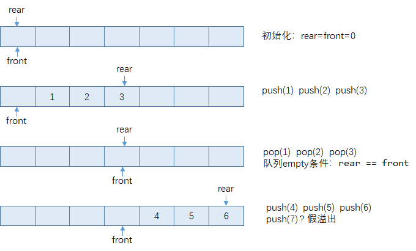

# 栈和队列、递归

## 栈

* 操作受限的线性表，只能在一端（栈顶）进行插入删除操作
* 先进后出，FILO

栈的实际应用

* 浏览器后退操作、app页面返回操作
* 各种软件的撤销操作
* 函数调用栈

栈的基本操作

* 入栈`push`
* 出栈`pop`
* 栈是否为空`isEmpty`

### 使用数组实现栈

#### 使用C++面向对象实现

```cpp
#include <iostream>
using namespace std;

class Stack {
private:
	int* _data;
	int _size;
	const int MAXN = 1000;

public:
	Stack() {
		_data = new int[MAXN];
		_size = 0;
	}

	~Stack() {
		delete[] _data;
	}

	void push(int x) {	//入栈
		_data[_size++] = x;
	}

	int& top() {		//访问栈顶元素
		if (empty()) throw exception("stack is empty");
		return _data[_size - 1];
	}

	void pop() {		//出栈
		if (empty()) throw exception("stack is empty");
		_size--;
	}

	bool empty() {
		return _size == 0;
	}

	int size() {
		return _size;
	}

	void clear() {
		_size = 0;
	}
};

int main() {
	Stack S;
	for (int i = 1; i <= 5; i++) {
		S.push(i);
	}
	printf("%d\n", S.size());
	S.top() = 100;	//由于top函数返回的是元素的引用，可这样更改栈顶元素的值（与考研无关，仅作了解）
	while (!S.empty()) {
		printf("%d ", S.top());
		S.pop();
	}
	printf("\n");
	return 0;
}
```

#### 关于考研教材上实现栈的方式

上面的代码是用 `size`变量表示当前栈所含元素的个数，此时判断栈空条件：`size == 0`

对于考研教材：

* 用栈顶指针top表示当前栈顶元素的下标
  * 判断栈空条件：`top == -1`
  * push、pop操作也要做相应改变
* pop操作不仅要弹出当前栈顶元素，还要将其值返回。即将上面代码中的top和pop操作合二为一。
* 由于C语言没有异常处理机制，每次操作是否成功通过函数返回值返回，原本需要返回的结果则通过指针或引用的方式。

```cpp
#include <stdio.h>

typedef int STATUS;
#define ERROR -1
#define SUCCESS 0

#define MAX_SIZE 3
int data[MAX_SIZE];
int top = -1;	//指示当前栈顶元素的下标

bool empty() {
	return top == -1;
}

STATUS push(int x) {
	if (top >= MAX_SIZE - 1) return ERROR;
	data[++top] = x;
	return SUCCESS;
}

STATUS pop(int *e) {
	if (empty()) return ERROR;
	*e = data[top--];
	return SUCCESS;
}

int main() {
	for (int i = 1; i <= 5; i++) {
		push(i);
	}
	while (empty() == false) {
		int top_elem;
		pop(&top_elem);
		printf("%d ", top_elem);
	}
	printf("\n");
	return 0;
}
```

### 使用（单向）链表实现栈

在单向链表头结点处进行插入删除节点操作

```cpp
#include <iostream>
using namespace std;

struct Node {
	int data;
	Node* next;

	Node(int x = 0) { data = x; next = NULL; }
};

class Stack {
private:
	Node* head;

public:
	Stack() {
		head = new Node();
	}

	~Stack() {
		Node* r = head;
		for (Node* p = head->next; p != NULL; p = p->next) {
			delete r;
			r = p;
		}
		delete r;
		printf("stack所占内存已释放\n");
	}

	bool empty() {
		return head->next == NULL;
	}

	void push(int x) {
		Node* temp = new Node(x);
		temp->next = head->next;
		head->next = temp;
	}

	int& top() {
		if (empty()) throw exception("stack is empty");
		return head->next->data;
	}

	void pop() {
		if (empty()) throw exception("stack is empty");
		Node* temp = head->next;
		head->next = temp->next;
		delete temp;
	}
};

int main() {
	Stack S;
	for (int i = 1; i <= 5; i++) {
		S.push(i);
	}
	S.top() = 100;
	while (S.empty() == false) {
		printf("%d ", S.top());
		S.pop();
	}
	printf("\n");
	return 0;
}
```


### 栈的应用

#### 进制转换


```cpp
#include <stdio.h>
#define MAXN 100

typedef struct {
	int base[MAXN];
	int top;	//top指向栈顶元素
}Stack;

Stack s;

int push(int e) {
	if (s.top >= MAXN - 1) return 0;
	s.base[++s.top] = e;
	return 1;
}

int pop(int* e) {
	if (s.top == -1) return 0;
	*e = s.base[s.top--];
	return 1;
}

int main() {
	int m = 1348, n = 8;
	s.top = -1;
	while (m > 0) {
		push(m % n);
		m /= n;
	}
	while (s.top != -1) {
		int e;
		pop(&e);
		printf("%d", e);
	}
	printf("\n");
	return 0;
}
```


#### 括号匹配

假设表达式中允许包含两种括号：圆括号和方括号,其嵌套的顺序随意。

`([]())`或`[([][])]`等为正确的格式

`[(])`或`([())`或`(()])`均为不正确的格式

应用场景：源代码语法正确性检查

样例输入

```
7
([]())
[([][])]
[(])
([())
(()])
)]
([
```

样例输出

```
Yes
Yes
No
No
No
No
No
```

参考代码

使用C++ STL

```cpp
#include <iostream>
#include <string>
#include <stack>
using namespace std;

bool isMatch(const string &exp) {
	stack<char> S;
	for (int i = 0; i < exp.length(); i++) {
		char ch = exp[i];
		if (ch == '(' || ch == '[') {
			S.push(ch);
		}
		else if (ch == ')') {
			if (S.empty()) return false;
			if (S.top() != '(') return false;
			S.pop();
		}
		else if (ch == ']') {
			if (S.empty()) return false;
			if (S.top() != '[') return false;
			S.pop();
		}
	}
	return S.empty();
}

int main() {
	int T;
	cin >> T;
	while (T--) {
		string str;
		cin >> str;
		bool ans = isMatch(str);
		printf("%s\n", ans ? "Yes" : "No");
	}
	return 0;
}
```

纯C语言

```c
#include <stdio.h>

int isMatch(const char* exp) {
	char Stack[1024]; int size = 0;	//栈的定义及初始化
	int i = 0;
	char ch;
	while ((ch = exp[i++]) != '\0') {
		if (ch == '(' || ch == '[') {
			Stack[size++] = ch;		//push
		}
		else if (ch == ')') {
			if (size == 0) return 0;	//如果栈为空，返回false
			if (Stack[size - 1] != '(') return 0;	//如果栈顶符号不匹配，返回false
			size--;						//pop
		}
		else if (ch == ']') {
			if (size == 0) return 0;	//如果栈为空，返回false
			if (Stack[size - 1] != '[') return 0;	//如果栈顶符号不匹配，返回false
			size--;						//pop
		}
	}
	return size == 0;	//最后如果栈为空，返回true，否则返回false
}

int main() {
	int T;
	scanf("%d", &T);
	while (T--) {
		char str[1024];
		scanf("%s", str);
		int ans = isMatch(str);
		printf("%s\n", ans ? "Yes" : "No");
	}
	return 0;
}
```

#### 计算后缀表达式

中缀表达式：`(1 + 2) * 3 - 4 * 5 = -11`

后缀表达式：`1 2 + 3 * 4 5 * -`

前缀表达式：`- * + 1 2 3 * 4 5 `

这里stack起到延迟缓冲的作用。

这里为了体现算法原理，简单起见假定输入的后缀表达式只含有`+ - *`3种操作符，且所有的操作数均为`0-9`的整数。

```cpp
#include <iostream>
#include <stack>
#include <string>
using namespace std;

//这里为了体现算法原理，简单起见假定输入的后缀表达式只含有"+ - *"这3种操作符，且所有的操作数均为0-9的整数。
int calc(const string &expr) {
	stack<int> S;	//stack只存放操作数
	for (int i = 0; i < expr.length(); i++) {
		char ch = expr[i];
		if (ch == ' ') continue;	//跳过空白字符
		if ('0' <= ch && ch <= '9') {
			S.push(ch - '0');
		}
		else {
			int b = S.top(); S.pop();
			int a = S.top(); S.pop();
			int ans;
			if (ch == '+') {
				ans = a + b;
			}
			else if (ch == '-') {
				ans = a - b;
			}
			else if (ch == '*') {
				ans = a * b;
			}
			S.push(ans);
		}
	}
	return S.top();
}

int main() {
	int ans = calc("1 2 + 3 * 4 5 * -");
	printf("%d\n", ans);
	return 0;
}
```

#### 出栈序列判定问题（栈混洗）

##### 定义

一个栈以`1, 2, 3, 4`的顺序入栈，怎样才能得到`3, 2, 4, 1`的出栈序列？

pu, pu, pu, pop, pop, pu, pop, pop

能得到`1, 4, 2, 3`的出栈序列吗？

假如这个栈的最大容量为2，能得到`1, 4, 3, 2`的出栈序列吗？


##### PAT A1051 Pop Sequence (25)

[链接]: https://pintia.cn/problem-sets/994805342720868352/problems/994805427332562944

Given a stack which can keep M numbers at most. Push N numbers in the order of 1, 2, 3, ..., N and pop randomly. You are supposed to tell if a given sequence of numbers is a possible pop sequence of the stack. For example, if M is 5 and N is 7, we can obtain 1, 2, 3, 4, 5, 6, 7 from the stack, but not 3, 2, 1, 7, 5, 6, 4.

**Input Specification:**

Each input file contains one test case. For each case, the first line contains 3 numbers (all no more than 1000): M (the maximum capacity of the stack), N (the length of push sequence), and K (the number of pop sequences to be checked). Then K lines follow, each contains a pop sequence of N numbers. All the numbers in a line are separated by a space.

**Output Specification:**

For each pop sequence, print in one line "YES" if it is indeed a possible pop sequence of the stack, or "NO" if not.

**Sample Input:**

```
//M N K
//M: 栈的容量; N: push序列的长度; K: 让你判断的pop序列的个数
5 7 5
1 2 3 4 5 6 7
3 2 1 7 5 6 4
7 6 5 4 3 2 1
5 6 4 3 7 2 1
1 7 6 5 4 3 2
```

**Sample Output:**

```
YES
NO
NO
YES
NO
```

**参考代码:**

```cpp
#include <iostream>
#include <stack>
using namespace std;
const int MAXN = 1010;

int num[MAXN];
int M, N, K;

bool judge() {
    stack<int> S;
    int p = 0;
    for (int i = 1; i <= N; i++) {
        S.push(i);
        if (S.size() > M) {
            return false;
        }
        while (!S.empty() && S.top() == num[p]) {
            S.pop();
            p++;
        }
    }
    return S.empty() == true;
}

int main() {
    scanf("%d %d %d", &M, &N, &K);
    for (int k = 0; k < K; k++) {
        for (int i = 0; i < N; i++) {
            scanf("%d", &num[i]);
        }
        bool ans = judge();
        printf("%s\n", ans ? "YES" : "NO");
    }
    return 0;
}
```

#### 计算中缀表达式

对于不带括号的中缀表达式：

* 遇到操作数直接入栈
* 遇到操作符，视情况处理
  * 栈顶运算符记为A，当前读取的运算符记为B
  * Case1: A的优先级 < B的优先级
    * B直接入栈, 读入新的字符
  * Case2: A的优先级 >= B的优先级
    * 取出A以及对应的运算数做计算并将结果放入栈中
    * 对于B暂时不做任何处理
  * `+`、 `-`的优先级为1，`*`、`/`的优先级为2
* 引入开始结尾标记运算符（也称界限符，delimiter），其优先级定义为0


对于带括号的中缀表达式，括号也是一种界限符

* 将`(`和`)`的优先级定义为0
* Case3: 遇到左括号直接入栈
* Case4: 遇到右括号且当前栈顶运算符为左括号, 即左右括号相遇, 应丢弃左右括号


```cpp
#include <iostream>
#include <stack>
#include <string>
using namespace std;

int priority(char op) {	//返回运算符的优先级
	switch (op) {
	case '+': return 1;
	case '-': return 1;
	case '*': return 2;
	case '/': return 2;
	case '(': return 0;
	case ')': return 0;
	default: throw invalid_argument("unknown op");
	}
}

double calc(double num1, double num2, char op) {
	switch (op) {
	case '+': return num1 + num2;
	case '-': return num1 - num2;
	case '*': return num1 * num2;
	case '/': return num1 / num2;
	default: throw invalid_argument("unknown op");
	}
}

int readNum(const string& expr, int &i) {
	int num = 0;
	while (isdigit(expr[i])) {
		num = num * 10 + expr[i] - '0';
		i++;
	}
	return num;
}

double calc(string infix_expr, string & postfix_expr) {
	stack<double> num_stack;	//运算数栈
	stack<char> op_stack;		//操作符栈
	postfix_expr.clear();

	//在表达式的左右两边加上括号
	infix_expr += ')';
	op_stack.push('(');

	int i = 0;
	while (i < infix_expr.length()) {
		char ch = infix_expr[i];
		while (isspace(ch)) ch = infix_expr[++i];	//跳过空白字符

		if (isdigit(ch)) {	//读入运算数
			//因为数字可能不只一位，需要连续读入数字
			int num = readNum(infix_expr, i);
			num_stack.push(num);
			postfix_expr += to_string(num);
			postfix_expr += ' ';
		}
		else if (ch == '(' || priority(op_stack.top()) < priority(ch)) {
			//遇到左括号直接入栈
			//当读入的运算符优先级高于栈顶运算符时，应将该运算符入栈
			op_stack.push(ch);
			i++;	//读入下个字符
		}
		else if (ch == ')' && op_stack.top() == '(') {
			//左右括号相遇直接丢弃
			//例如表达式 3*(1+2) 做完加法变成 表达式 3*(3) 时，应丢掉括号
			op_stack.pop();
			i++;
		}
		else {
			//栈顶运算符优先级大于等于读入的运算符优先级
			//之前入栈的运算符现在可以取出来做计算了
			//暂时不对当前读入的运算符做操作，也不需要移动i指针
			char op = op_stack.top(); op_stack.pop();
			double b = num_stack.top(); num_stack.pop();
			double a = num_stack.top(); num_stack.pop();
			double result = calc(a, b, op);
			num_stack.push(result);
			postfix_expr += op;
			postfix_expr += ' ';
		}
	}
	return num_stack.top();
}

void test(const string & expr) {
	string postfix;
	cout << expr << " = " << calc(expr, postfix) << endl;
	cout << "postfix expression: " << postfix << endl;
	cout << "--------------------------------" << endl;
}

int main() {
	test("2 - (3 * 4) / 5");
	test("12 + 24 - 9 + (255 - 252) * 2 ");
	test("123");
	return 0;
}
```


#### 面试题：字符串解码

链接：https://leetcode-cn.com/problems/decode-string

给定一个经过编码的字符串，返回它解码后的字符串。

编码规则为: `k[encoded_string]`，表示其中方括号内部的 `encoded_string` 正好重复 `k` 次。注意 `k` 保证为正整数。

你可以认为输入字符串总是有效的；输入字符串中没有额外的空格，且输入的方括号总是符合格式要求的。

此外，你可以认为原始数据不包含数字，所有的数字只表示重复的次数 `k` ，例如不会出现像 `3a` 或 `2[4]` 的输入。

示例:

```
s = "3[a]2[bc]", 返回 "aaabcbc".
s = "3[a2[c]]", 返回 "accaccacc".
s = "2[abc]3[cd]ef", 返回 "abcabccdcdcdef".
```


版本1：

```cpp
#include <iostream>
#include <stack>
#include <string>
using namespace std;

int readNum(const string& str, int &i) {
	int num = 0;
	while (isdigit(str[i])) {
		num = num * 10 + str[i] - '0';
		i++;
	}
	return num;
}

string readString(const string& str, int &i) {
	string res;
	while (isalpha(str[i])) {
		res += str[i];
		i++;
	}
	return res;
}

string decodeString(string s) {
	stack<int> num_stack;
	stack<string> str_stack;
	stack<char> op_stack;

	num_stack.push(1);
	op_stack.push('[');
	s += ']';

	int i = 0;
	while (i < s.length()) {
		char ch = s[i];

		if (isdigit(ch)) {
			int num = readNum(s, i);
			num_stack.push(num);
		}
		else if (isalpha(ch)) {
			string temp = readString(s, i);
			str_stack.push(temp);
		}
		else if (ch == '[') {
			op_stack.push(ch);
			i++;
		}
		else if (ch == ']') {
			int repeate_times = num_stack.top(); num_stack.pop();
			string repeate_str = str_stack.top(); str_stack.pop();

			string temp;
			while (repeate_times--) {
				temp += repeate_str;
			}

			if (str_stack.empty()) {
				str_stack.push(temp);
			}
			else {
				str_stack.top() += temp;
			}
			i++;
		}
	}
	return str_stack.top();
}

void test(const string & expr) {
	static int cnt = 0;
	cout << "#" << ++cnt << ":" << endl;
	cout << "input: " << expr << endl;
	cout << "output: " << decodeString(expr) << endl;
	cout << endl;
}

int main() {
	test("3[a2[c]]");
	test("ab2[ab2[c]]ab");
	test("2[abc]3[cd]ef");
	return 0;
}
```

版本2:

```cpp
#include <iostream>
#include <string>
#include <stack>
using namespace std;

string decode(string s) {
	stack<int> numStack;
	stack<string> strStack;
	string str;
	int num = 0;
	for (char ch : s) {
		if (isdigit(ch)) {
			num = num * 10 + ch - '0';
		}
		else if (isalpha(ch)) {
			str += ch;
		}
		else if (ch == '[') {
			numStack.push(num);
			strStack.push(str);
			num = 0;
			str = "";
		}
		else if(ch == ']') {
			int repeate_times = numStack.top(); numStack.pop();
			string repeate_str = str;
			str = strStack.top(); strStack.pop();
			while (repeate_times--) {
				str += repeate_str;
			}
		}
	}
	return str;
}

int main() {
	cout << decode("3[a]2[bc]") << endl;
	cout << decode("ef3[a2[c]]gg") << endl;
	cout << decode("2[abc]3[cd]ef") << endl;
}
```


## 队列

* 公平地对某种资源进行管理分配，如多个用户使用一台打印机
* 先进先出，FIFO
* 操作受限的线性表，只能在一端插入，另一端删除
* 后续章节 树的层次遍历、图的BFS广度优先搜索算法会用到队列
* 出队：在队列头部`front`做删除操作；入队：在队列尾部`rear`做插入操作

### 顺序队列



### 循环队列


* 队列empty条件：`return rear == front;`

* 队列full条件：`return (rear + 1) % MAX_SIZE == front`

* 入队push操作：

  ```cpp
  void push(int x) {
      rear = (rear + 1) % MAX_SIZE;
      data[rear] = x;
  }
  ```

* 出队pop操作：

  ```cpp
  int pop() {
      front = (front + 1) % MAX_SIZE;
      return data[front];
  }
  ```

* 获取队列大小

  ```cpp
  int size() {
      if (rear >= front) {	//注意这里必须取等号
          return rear - front;
      } else {
          return rear + MAX_SIZE - front;
      }
  }
  ```

完整代码：

```cpp
#include <iostream>
#include <queue>
using namespace std;

class Queue {
private:
	int* data;
	int front, rear;
	const int MAX_SIZE = 1000;

public:
	Queue() {
		data = new int[MAX_SIZE];
		rear = front = 0;
	}

	bool empty() {
		return rear == front;
	}

	bool full() {
		return (rear + 1) % MAX_SIZE == front;
	}

	void push(int x) {	//入队，enQueue
		if (full()) throw exception("队满了");
		rear = (rear + 1) % MAX_SIZE;
		data[rear] = x;
	}

	int pop() {			//出队，deQueue
		if (empty()) throw exception("队为空");
		front = (front + 1) % MAX_SIZE;
		return data[front];
	}

	int size() {
		if (rear >= front) {	//注意这里必须取等号
			return rear - front;
		} else {
			return rear + MAX_SIZE - front;
		}
	}
};

int main() {
	Queue Q;
	for (int i = 1; i <= 5; i++) {
		Q.push(i);
	}
	Q.pop();
	printf("size: %d\n", Q.size());
	Q.push(100);
	while (Q.empty() == false) {
		int x = Q.pop();
		printf("%d ", x);
	}
	printf("\n");
	return 0;
}
```

### 链表队列


```cpp
#include <iostream>
using namespace std;

struct Node {
	int data;
	Node* next;

	Node(int x = 0) { data = x; next = NULL; }
};

class Queue {
private:
	Node* head;	//链表的头节点
	Node* rear;	//链表的尾指针

public:
	Queue() {
		head = new Node();	//创建头节点
		rear = head;		//尾指针指向头节点
	}

	bool empty() {
		return head->next == NULL;
	}

	void push(int x) {	//入队，在链表尾指针处插入节点
		rear->next = new Node(x);
		rear = rear->next;
	}

	int pop() {			//出队，在链表头结点处删除节点
		if (empty()) throw exception("队列为空");
		int ret = head->next->data;
		Node* t = head->next;
		head->next = t->next;
		delete t;
		return ret;
	}
};

int main() {
	Queue Q;
	for (int i = 1; i <= 5; i++) {
		Q.push(i);
	}
	Q.pop();
	Q.push(100);
	while (Q.empty() == false) {
		int x = Q.pop();
		printf("%d ", x);
	}
	printf("\n");
	return 0;
}
```

## 递归

### 编写一个递归函数

- 这个递归函数的功能是什么，怎样调用这个函数，即设计好递归函数的返回值和参数列表
- 什么时候应该结束这个递归，它的边界条件（出口）是什么  （边界条件）
- 在非边界情况时，怎样从第n层转变成第n+1层  (递推公式)

### 计算阶乘(factorial)

$$
n!=\begin{cases}
1 & n=0 \\
n*(n-1)! & n>0
\end{cases}
$$


```cpp
#include <stdio.h>

int fact(int n){
    if (n == 0) return 1;
    return n * fact(n - 1);
}

int main(){
    int ans = fact(10); //调用（递归）函数
    printf("%d\n", ans);
    return 0;
}
```


### 计算斐波那契数列

Fibonacci sequence：0, 1, 1, 2, 3, 5, 8, 13, 21, 34, ……
$$
f(n)=\begin{cases}
0 & n=0 \\
1 & n=1 \\
f(n-2)+f(n-1) & n>1
\end{cases}
$$

```cpp
#include <stdio.h>

//求斐波那契数列的第n项
int fib(int n) {
    if (n == 0) return 0;
    if (n == 1) return 1;
    return fib(n - 2) + fib(n - 1);
}

int main() {
    for (int i = 0; i <= 10; i++) {	//依次输出fib数列前10项
        printf("fib(%d) = %d\n", i, fib(i));
    }
    return 0;
}
```

执行原理：


计算`fib(3)`

* 先计算`fib(1)`
  * 递归边界条件,直接返回`fib(1)`的计算结果
* 再计算`fib(2)`
  * 先计算`fib(0)`
    * 递归边界条件,直接返回`fib(0)`的计算结果
  * 再计算`fib(1)`
    * 递归边界条件,直接返回`fib(1)`的计算结果
  * 最后返回`fib(2)`的计算结果
* 最后返回`fib(3)`的计算结果

用二叉树表示：


进一步讨论:

该算法

* 优点: 非常简单, 易于理解
* 缺点: 包含大量重复计算(重复子问题), 效率低下

改进:

记忆型递归: 用一个数组存放已经计算过的项, 避免重复计算

依次输出fib数列的前80项, 注意`int`类型最多只能表示到fib(46), `long long int`类型可以表示到fib(92)

```cpp
#include <stdio.h>

//原始版本
long long fib1(int n) {
	if (n == 0) return 0;
	if (n == 1) return 1;
	return fib1(n - 2) + fib1(n - 1);
}

//改进, 记忆型递归
long long cache[105];	//用于保存已经计算过的结果
long long fib2(int n) {
	if (n == 0) return 0;
	if (n == 1) return 1;
	if (cache[n] == 0) {
		//如果表中没有该项的值,就先计算该结果,并将其写入表中
		cache[n] = fib2(n - 2) + fib2(n - 1);
	}
	return cache[n];
}

//消去递归,改成循环
long long fib3(int n) {
    int dp[] = new int[n + 1];
    dp[0] = 0;
    dp[1] = 1;
    for (int i = 2; i <= n; i++) {
        dp[i] = dp[i - 2] + dp[i - 1];
    }
    return dp[n];
    //没有释放dp数组内存，会出现内存泄漏，不过对于算法题来说问题不大
}

int main() {
	for (int i = 0; i <= 80; i++) {
		printf("fib(%d) = %lld\n", i, fib1(i));		//从大约第35项起就计算得很慢了
		//printf("fib(%d) = %lld\n", i, fib2(i));
		//printf("fib(%d) = %lld\n", i, fib3(i));
	}
	return 0;
}
```


### 函数调用栈

#### 理论

当在一个函数（称作主调函数）的运行期间调用另一个函数（称作被调函数）时，在被调函数运行之前，系统需要完成三件事：

1. 将所有的实参，返回地址等信息传递给被调函数保存；

2. 为被调函数的局部变量（也包括形参）分配存储空间；

3. 将控制转移到被调函数的入口。


从被调函数返回主调函数之前，系统也要完成三件事：

1. 保存被调函数的返回结果；

2. 释放被调函数所占的存储空间；

3. 依照被调函数保存的返回地址将控制转移到调用函数。


当有多个函数构成嵌套调用时，按照“后调用先返回”的原则，上述函数之间信息传递和控制转移必须借助“栈”来实现。

即系统将整个程序运行时所需的数据空间安排在一个栈中，每当调用一个函数时，就在栈顶分配一个存储区（push）；每当一个函数退出时，就释放他的存储区（pop）；当前运行的函数永远在栈顶位置。


#### 实例

主函数`main()`调用`funcA()`，`funcA()`调用`funcB()`，`funcB()`再自我调用（递归）


函数调用栈的基本单位是帧（frame）。每次函数调用时，都会相应地创建一帧， 记录该函数实例在二进制程序中的返回地址（return address），以及局部变量、传入参数等， 并将该帧压入调用栈。若在该函数返回之前又发生新的调用，则同样地要将与新函数对应的一帧压入栈中，成为新的栈顶。函数一旦运行完毕，对应的帧随即弹出，运行控制权将被交还给该函 数的上层调用函数，并按照该帧中记录的返回地址确定在二进制程序中继续执行的位置。

在任一时刻，调用栈中的各帧，依次对应于那些尚未返回的调用实例，亦即当时的活跃函数实例（active function instance）。特别地，位于栈底的那帧必然对应于入口主函数main()， 若它从调用栈中弹出，则意味着整个程序的运行结束，此后控制权将交还给操作系统。 

此外，调用栈中各帧还需存放其它内容。比如，因各帧规模不一，它们还需记录前一帧的起始地址，以保证其出栈之后前一帧能正确地恢复。

作为函数调用的特殊形式，递归也可借助上述调用栈得以实现。比如在上图中，对应于 `funcB()`的自我调用，也会新压入一帧。可见，同一函数可能同时拥有多个实例，并在调用栈中 各自占有一帧。这些帧的结构完全相同，但其中同名的参数或变量，都是独立的副本。比如在 `funcB()`的两个实例中，入口参数`m`和内部变量`i`各有一个副本。 

### 计算中缀表达式（递归）

表达式是可以递归定义的：

* 一个表达式由若干个（至少一个）项组成，项与项之间由`+`或`-`连接。
* 每一项是由若干个（至少一个）因子组成，因子与因子之间由`*`或`/`连接
* 每一个因子，要么是一个运算数，要么是一个由括号括起来的表达式

比如对于表达式`3+(1+2)*(3+4)-5/(6-2)​`，该表达式由3项组成：

* `3`，该项由1个因子组成
  * `3`，该因子是一个运算数，不能继续分解
* `(1+2)*(3*4)`，该项由2个因子组成
  * `(1+2)`，该因子是一个由括号括起来的表达式，可以继续分解
    * 去掉括号后，该表达式为`1+2`，由2项组成
      * `1`，该项由1个因子组成
        * `1`，该因子是运算数，不能继续分解
      * `2`，该项由1个因子组成
        * 2，该因子是运算数，不能继续分解
  * `(3*4)`，该因子是一个由括号括起来的表达式，可以继续分解
* `5/(6-2)`，该项由2个因子组成
  * `5`，该因子是一个运算数，不能继续分解
  * `(6-2)`，该因子是一个由括号括起来的表达式，可以继续分解
    * 去掉括号后，该表达式为`6-2`，由2项组成

该方法称为“递归下降分析算法”，属于《编译原理》这门课的内容。

算术表达式的上下文无关文法为：

```
// E-表达式，T-项，F-因子
E -> E + T
   | E - T
   | T

T -> T * F
   | T / F
   | F

F -> num
   | (E)
```


```cpp
#include <iostream>
#include <sstream>
#include <string>
using namespace std;

class Calculator {

private:
	class CharReader {
	private:
		int i = 0;
		string expr;

	public:
		void init(string expr) {
			this->expr = expr;
			i = 0;
		}

		//读取下个字符（自动跳过空白字符），同时将指针往后移动
		char next() {
			skipWhite();
			if (isEOF()) return EOF;
			return expr[i++];
		}

		//看一眼下个字符（自动跳过空白字符），不移动指针
		char peek() {
			skipWhite();
			if (isEOF()) return EOF;
			return expr[i];
		}

		//判断是否读取到字符串末尾
		//EOF=end of file，引申为结束标志
		bool isEOF() {
			return i >= expr.length();
		}

		//跳过空白字符
		void skipWhite() {
			while (!isEOF() && isspace(expr[i])) {
				i++;
			}
		}

		void errorMsg(string expected) {
			stringstream ss;
			ss << "syntax error : expected: " << expected;
			ss << ", but got: " << peek() << endl;
			ss << expr << endl;
			for (int t = 0; t < i; t++) {
				ss << " ";
			}
			ss << "^";
			throw exception(ss.str().c_str());	//将错误信息通过异常传递出去
		}
	};

private:
	CharReader reader;

public:
	double calc(string expr) {
		reader.init(expr);
		double res = calcExpr();
		if (!reader.isEOF()) reader.errorMsg("EOF");
		return res;
	}
    
private:
	double calcExpr() {		//计算一个表达式
		double res = calcTerm();
		while (true) {
			char op = reader.peek();
			if (op == '+' || op == '-') {
				reader.next();
				double temp = calcTerm();
				if (op == '+') {
					res += temp;
				} else {
					res -= temp;
				}
			} else break;
		}
		return res;
	}

	double calcTerm() {		//计算一项
		double res = calcFact();
		while (true) {
			char op = reader.peek();
			if (op == '*' || op == '/') {
				reader.next();
				double temp = calcFact();
				if (op == '*') {
					res *= temp;
				} else {
					if (fabs(temp) < 1e-8) throw exception("Divided by zero");
					res /= temp;
				}
			} else break;
		}
		return res;
	}

	double calcFact() {		//计算一个因子
		char ch = reader.peek();
		if (isdigit(ch) || ch == '-') {
			return readNum();
		} else if (ch == '(') {
			reader.next();	//跳过左括号 (
			double res = calcExpr();	//递归计算括号中的表达式
			if (reader.peek() != ')') reader.errorMsg(")");
			reader.next();	//跳过右括号 )
			return res;
		} else {
			reader.errorMsg("number");		//期望当前应该读入一个数字
		}
	}

	double readNum() {
		double res = 0;
		int flag = 1;
		//处理负号
		if (reader.peek() == '-') {
			reader.next();
			flag = -1;
		}
		//处理整数部分
		if (!isdigit(reader.peek())) reader.errorMsg("number");
		while (isdigit(reader.peek())) {
			res = res * 10 + (reader.next() - '0');
		}
		//处理小数部分
		if (reader.peek() == '.') {
			reader.next();
			double fac = 0.1;
			while (isdigit(reader.peek())) {
				res += fac * (reader.next() - '0');
				fac *= 0.1;
			}
		}
		return (double)flag * res;
	}
};

void test(string expr) {
	//cout << "---------------------" << endl;
	Calculator calc;
	try {
		cout << calc.calc(expr) << endl;
	}
	catch (exception e) {
        cout << e.what() << endl;
	}
}

int main() {
	test("( 3.14 * 10)");
	test("-1+2+3/4");
	test("3 + 4 * (1 + 2) + 3 * -4");
	test("3.12 + (-4.5 * (1 + -112.29)) * 2.00");		//1004.73
	test("(   -3)");

	//下面测试错误情况
	test("( 3.142x * 10))");
	test("((( 3 5 * 10))");
	test("(()");
	test(")");
	test("(( 3.142 * 10)");
	test("");
	return 0;
}
```

