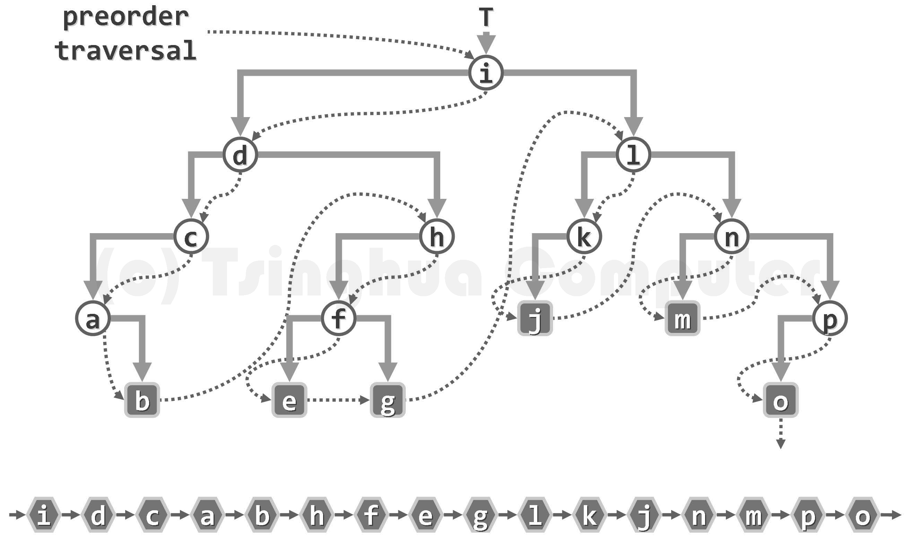
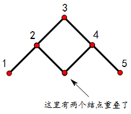
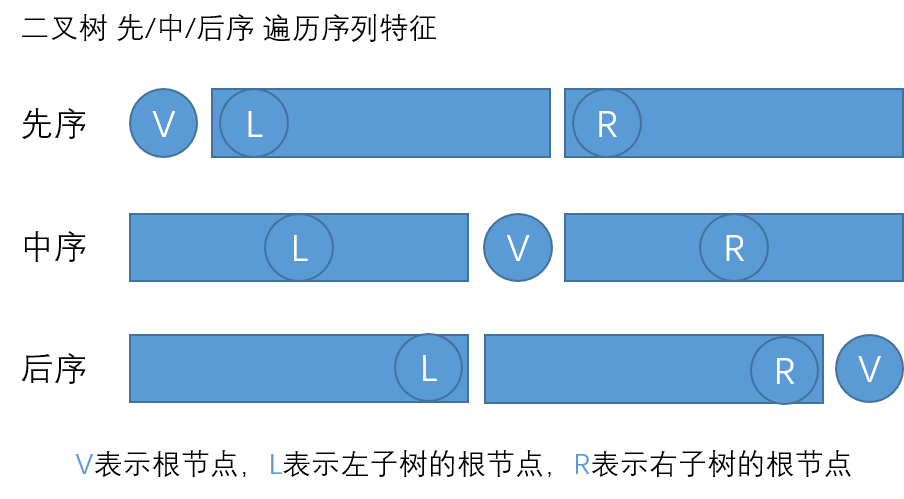

# 树与二叉树

## 树的概念

* 半线性结构
* 递归定义
* 分层结构，应用广泛
  * 文件系统
  * 互联网域名系统


* 空树
* 根节点
* 孩子节点
* 子树
* 叶节点
* 节点的度：节点的孩子节点的个数
* 节点的层次：树的根节点称为第1层（有的书认为是第0层）
* 树的高度：树中节点的最大层次


## 二叉树

* 每个节点的度数最多为2，每个节点最多有2棵子树
* 两颗子树要区分左右顺序


### 节点的定义

```cpp
struct Node {	//C++版本
	int data;
	Node *lchild, *rchild;

	Node(int x = 0) { data = x; lchild = rchild = NULL; }
};
```

### 二叉树的遍历

#### 先序遍历

**规则**

遍历一棵树

1. 如果该树为空,则退出
2. **先访问根节点**
3. 再遍历左子树
4. 最后遍历右子树

```cpp
void preorderTrav(Node* root) {	//先序遍历
	if (root == NULL) return;
	printf("%d ", root->data);	//最先访问根节点
	preorderTrav(root->lchild);
	preorderTrav(root->rchild);
}
```

**例子**


遍历一颗二叉树(以`1`作为根节点的树）：

- 先访问根节点 `1`
- 再访问左子树(以`2`作为根节点的子树)
  - 先访问该子树的根节点 `2`
  - 再访问该子树的左子树(子树为空, 直接退出)
  - 最后访问该子树的右子树(空树)
- 最后访问右子树(以`3`作为根节点的子树)
  - 先访问根节点 `3`
  - 再访问左子树(空树)
  - 最后访问右子树(以`4`为根节点的子树)
    - 先访问根节点 `4`
    - 再访问左子树(空树)
    - 最后访问右子树(空树)

最终遍历序列为: 1 2 3 4



```cpp
void preorderTrav(Node* root) {	//先序遍历
	if (root == NULL) return;
	printf("%d ", root->data);	//最先访问根节点
	preorderTrav(root->lchild);
	preorderTrav(root->rchild);
}

void preorderTrav(Node* root) {	//写法2
    if (root != NULL) {
        printf("%d ", root->data);
        preorderTrav(root->lchild);
        preorderTrav(root->rchild);
    }
}

void preorderTrav(Node* root) {	//写法3
	if (root == NULL) return;
	printf("%d ", root->data);
	if (root->lchild != NULL) {	//可以保证不会递归进入空节点
		preorderTrav(root->lchild);
	}
	if (root->rchild != NULL) {
		preorderTrav(root->rchild);
	}
}
```

#### 中序遍历

**规则**

遍历一棵树

1. 如果该树为空,则退出
2. 先遍历左子树
3. **再访问根节点**
4. 最后遍历右子树

```cpp
void inorderTrav(Node* root) {	//中序遍历
	if (root == NULL) return;
	inorderTrav(root->lchild);
	printf("%d ", root->data);	//中间的时候访问根节点
	inorderTrav(root->rchild);
}
```

**例子**


遍历一颗二叉树(以`1`作为根节点的树）：

- 先访问左子树(以`2`作为根节点的子树)
  - 先访问左子树(空树)
  - 再访问根节点 `2`
  - 最后访问右子树(空树)
- 再访问根节点 `1`
- 最后访问右子树(以`3`作为根节点的子树)
  - 先访问左子树(空树)
  - 再访问根节点 `3`
  - 最后访问右子树(以`4`为根节点的子树)
    - 先访问左子树(空树)
    - 再访问根节点 `4`
    - 最后访问右子树(空树)

最终遍历序列为: 2 1 3 4


中序遍历的特点:  **二叉树节点在水平方向上的投影顺序即为中序遍历的顺序。**

#### 后序遍历

**规则**

遍历一棵树

1. 如果该树为空,则退出
2. 先遍历左子树
3. 再遍历右子树
4. **最后访问根节点**

```cpp
void postorderTrav(Node* root) {	//后序遍历
	if (root == NULL) return;
	postorderTrav(root->lchild);
	postorderTrav(root->rchild);
	printf("%d ", root->data);	//最后访问根节点
}
```

**例子**


遍历一颗二叉树(以`1`作为根节点的树）：

- 先访问左子树(以`2`作为根节点的子树)
  - 先访问左子树(空树)
  - 再访问右子树(空树)
  - 最后访问根节点 `2`
- 再访问右子树(以`3`作为根节点的子树)
  - 先访问左子树(空树)
  - 再访问右子树(以`4`为根节点的子树)
    - 先访问左子树(空树)
    - 再访问右子树(空树)
    - 最后访问根节点 `4`
  - 最后访问根节点 `3`
- 最后访问根节点 `1`

最终遍历序列为: 2 4 3 1


#### 层次遍历

一层一层的访问, 每一层按照从左往右的顺序访问


```cpp
void levelTrav(Node* root) {	//层次遍历
	if (root == NULL) return;
	queue<Node*> Q;
	Q.push(root);
	while (Q.empty() == false) {
		Node* t = Q.front();
		Q.pop();
		printf("%d ", t->data);
		if (t->lchild != NULL) Q.push(t->lchild);
		if (t->rchild != NULL) Q.push(t->rchild);
	}
	printf("\n");
}
```


**进阶要求**

要求层次遍历在输出每一层的节点后换行。


```cpp
void levelTrav_2(Node* root) {	//层序遍历（输出每层后需换行）
	if (root == NULL) return;
	queue<Node*> Q;
	Q.push(root);
	while (Q.empty() == false) {
		int size = Q.size();	//size表示接下来要输出的这一层的节点数
		while (size--) {
			Node* t = Q.front();
			Q.pop();
			printf("%d ", t->data);
			if (t->lchild != NULL) Q.push(t->lchild);
			if (t->rchild != NULL) Q.push(t->rchild);
		}
		printf("\n");
	}
}
```

#### 完整代码


```cpp
#include <iostream>
#include <queue>
using namespace std;

struct Node {
	int data;
	Node *lchild, *rchild;

	Node(int x = 0) { data = x; lchild = rchild = NULL; }

	void setChildNode(Node* l, Node* r) {
		lchild = l;
		rchild = r;
	}
};

void preorderTrav(Node* root) {	//先序遍历
	if (root == NULL) return;
	printf("%d ", root->data);	//最先访问根节点
	preorderTrav(root->lchild);
	preorderTrav(root->rchild);
}

void inorderTrav(Node* root) {	//中序遍历
	if (root == NULL) return;
	inorderTrav(root->lchild);
	printf("%d ", root->data);	//中间的时候访问根节点
	inorderTrav(root->rchild);
}

void postorderTrav(Node* root) {	//后序遍历
	if (root == NULL) return;
	postorderTrav(root->lchild);
	postorderTrav(root->rchild);
	printf("%d ", root->data);	//最后访问根节点
}

void levelTrav(Node* root) {	//层次遍历
	if (root == NULL) return;
	queue<Node*> Q;
	Q.push(root);
	while (Q.empty() == false) {
		Node* t = Q.front();
		Q.pop();
		printf("%d ", t->data);
		if (t->lchild != NULL) Q.push(t->lchild);
		if (t->rchild != NULL) Q.push(t->rchild);
	}
	printf("\n");
}

void levelTrav_2(Node* root) {	//层序遍历（输出每层后需换行）
	if (root == NULL) return;
	queue<Node*> Q;
	Q.push(root);
	while (Q.empty() == false) {
		int size = Q.size();	//size表示接下来要输出的这一层的节点数
		while (size--) {
			Node* t = Q.front();
			Q.pop();
			printf("%d ", t->data);
			if (t->lchild != NULL) Q.push(t->lchild);
			if (t->rchild != NULL) Q.push(t->rchild);
		}
		printf("\n");
	}
}

int main() {
	Node* root = new Node(1);
	Node* node2 = new Node(2);
	Node* node3 = new Node(3);
	Node* node4 = new Node(4);
	Node* node5 = new Node(5);
	Node* node6 = new Node(6);
	Node* node7 = new Node(7);
	Node* node8 = new Node(8);

	root->setChildNode(node2, node3);
	node2->setChildNode(node4, node5);
	node3->setChildNode(NULL, node7);
	node5->setChildNode(node6, NULL);
	node4->setChildNode(NULL, node8);

	preorderTrav(root);
	printf("\n");

	inorderTrav(root);
	printf("\n");

	postorderTrav(root);
	printf("\n");

	levelTrav(root);

	levelTrav_2(root);
	return 0;
}
```

备注：

1. 其实没必要定义从`node1`到`node8`这么多变量，完全可以用一个数组存放
2. 为了构建出一颗树，需要手动设置各节点之间的关系

    ```cpp
    root->lchild = node2;
    root->rchild = node3;
    ```
    这两行等价于这行代码：
    ```cpp
    root->setChildNode(node2, node3);
    ```


### 二叉树的递归算法

#### 基础递归算法

二叉树的递归算法通常可分为两大类：基于递归遍历算法 和 基于分治算法

分治法的设计思想：

1. 分–将问题分解为规模更小的子问题；
2. 治–将这些规模更小的子问题逐个击破；
3. 合–将已解决的子问题合并，最终得出“母”问题的解；

##### 求二叉树的节点个数

**基于递归遍历算法**

计算链表的节点个数：`for`循环外放一个计数变量`cnt`

```cpp
int getSize(LinkList* L) {
	int cnt = 0;
	for (Node* p = L->head->next; p != NULL; p = p->next) {
		cnt++;
	}
	return cnt;
}
```

对于二叉树来说：

方法1：将`cnt`计数器作为全局变量

```cpp
int cnt;
void traverseTree(Node* root) {
	if (root == NULL) return;
	cnt++;
	traverseTree(root->lchild);
	traverseTree(root->rchild);
}

int countTreeNode(Node* root) {
	cnt = 0;
	traverseTree(root);
	return cnt;
}
```

方法2：也可以借助指针/引用语法而不使用全局变量

```cpp
void traverseTree(Node* root, int& cnt) {
	if (root == NULL) return;
	cnt++;
	traverseTree(root->lchild, cnt);
	traverseTree(root->rchild, cnt);
}

int countTreeNode(Node * root) {
	int cnt = 0;
	traverseTree(root, cnt);
	return cnt;
}
```


**基于分治算法**

树的节点个数 = 左子树的节点个数 + 右子树的节点个数  +  1(根节点自身)

边界条件：空树的节点个数为0

```cpp
int countTreeNode2(Node* root) {
	if (root == NULL) return 0;
	int leftSize = countTreeNode2(root->lchild);
	int rightSize = countTreeNode2(root->rchild);
	return leftSize + rightSize + 1;
}
```

**拓展**

1. 求叶节点的个数

   基于递归遍历

```cpp
int cnt;
void traverseTree(Node* root) {
	if (root == NULL) return;
	if(root->lchild == NULL && root->rchild == NULL) {
        //只有当前访问的节点是叶节点计数器才累加
        cnt++;
    }
	traverseTree(root->lchild);
	traverseTree(root->rchild);
}

int countLeafNode(Node* root) {
	cnt = 0;
	traverseTree(root);
	return cnt;
}
```

​	分治算法

```cpp
int countLeafNode(Node* root) {
	if (root == NULL) return 0;
	if (root->lchild == NULL && root->rchild == NULL) return 1;
	int leftSize = countLeafNode(root->lchild);
	int rightSize = countLeafNode(root->rchild);
	return leftSize + rightSize;
}
```

2. 求只有一个孩子的节点的个数

   基于递归遍历

```cpp
void traverseTree(Node * root) {
	if (root == NULL) return;
	if (root->lchild == NULL && root->rchild != NULL ||
		root->lchild != NULL && root->rchild == NULL) {
		cnt++;
	}
	traverseTree(root->lchild);
	traverseTree(root->rchild);
}
```

​	分治算法

```cpp
int countOneChildNode2(Node* root) {
	if (root == NULL) return 0;
	int l = countOneChildNode2(root->lchild);
	int r = countOneChildNode2(root->rchild);
	if (root->lchild == NULL && root->rchild != NULL ||
		root->lchild != NULL && root->rchild == NULL) {
		return l + r + 1;
	} else {
		return l + r;
	}
}
```


##### 求二叉树的高度

这里约定：树的高度 = 树的层数，空树的高度为0。

基于分治算法

```cpp
int getTreeHeight(Node* root) {
	if (root == NULL) return 0;
	int leftHeight = getTreeHeight(root->lchild);
	int rightHeight = getTreeHeight(root->rchild);
	return max(leftHeight, rightHeight) + 1;
}
```

基于递归遍历

```cpp
int maxLayerNum;

void traverseTree(Node* root, int currentlayerNum) {
	if (root == NULL) return;
	maxLayerNum = max(maxLayerNum, currentlayerNum);
	traverseTree(root->lchild, currentlayerNum + 1);
	traverseTree(root->rchild, currentlayerNum + 1);
}

int getTreeHeight(Node * root) {
	maxLayerNum = -1;
	traverseTree(root, 1);
	return maxLayerNum;
}
```

##### 二叉树的反转/克隆


```cpp
//反转一颗二叉树（直接在原有的二叉树上操作）
void invertTree(Node* root) {
	if (root == NULL) return;
	invertTree(root->lchild);
	invertTree(root->rchild);
	swap(root->lchild, root->rchild);
}

//克隆一颗二叉树
//需在内存中创建一个新的二叉树，使其与原有的二叉树相同
Node* cloneTree(Node* root) {
	if (root == NULL) return NULL;
	Node* temp = new Node(root->data);
	temp->lchild = cloneTree(root->lchild);
	temp->rchild = cloneTree(root->rchild);
	return temp;
}

//镜像克隆一颗二叉树
//需在内存中创建一个新的二叉树，使其与原有的二叉树互为镜像
Node* mirrorCloneTree(Node* root) {
	if (root == NULL) return NULL;
	Node* temp = new Node(root->data);
	temp->lchild = mirrorCloneTree(root->rchild);
	temp->rchild = mirrorCloneTree(root->lchild);
	return temp;
}
```

##### 完整代码

```cpp
#include <iostream>
#include <stack>
#include <queue>
#include <algorithm>
using namespace std;

struct Node {
	int data;
	Node *lchild, *rchild;

	Node(int x = 0) { data = x; lchild = rchild = NULL; }

	void setChildNode(Node* l, Node* r) {
		lchild = l;
		rchild = r;
	}
};

void preorderTrav(Node* root) {	//先序遍历
	if (root == NULL) return;
	printf("%d ", root->data);	//最先访问根节点
	preorderTrav(root->lchild);
	preorderTrav(root->rchild);
}

void inorderTrav(Node* root) {	//中序遍历
	if (root == NULL) return;
	inorderTrav(root->lchild);
	printf("%d ", root->data);	//中间的时候访问根节点
	inorderTrav(root->rchild);
}

//--------------------------------
//求二叉树的节点个数（基于递归遍历）
int cnt;
void traverseTree(Node* root) {
	if (root == NULL) return;
	cnt++;
	traverseTree(root->lchild);
	traverseTree(root->rchild);
}

int countTreeNode1(Node* root) {
	cnt = 0;
	traverseTree(root);
	return cnt;
}
//-----------------------------------

//求二叉树的节点个数（基于分治算法）
int countTreeNode2(Node* root) {
	if (root == NULL) return 0;
	int leftSize = countTreeNode2(root->lchild);
	int rightSize = countTreeNode2(root->rchild);
	return leftSize + rightSize + 1;
}

//-------------------------------------
//求二叉树的高度（基于递归遍历）
int maxLayerNum;

void traverseTree(Node* root, int currentlayerNum) {
	if (root == NULL) return;
	maxLayerNum = max(maxLayerNum, currentlayerNum);
	traverseTree(root->lchild, currentlayerNum + 1);
	traverseTree(root->rchild, currentlayerNum + 1);
}

int getTreeHeight1(Node * root) {
	maxLayerNum = -1;
	traverseTree(root, 1);
	return maxLayerNum;
}
//-------------------------------------

//求二叉树的高度（基于分治算法）
int getTreeHeight2(Node* root) {
	if (root == NULL) return 0;
	int left_high = getTreeHeight2(root->lchild);
	int right_high = getTreeHeight2(root->rchild);
	return max(left_high, right_high) + 1;
}

//反转一颗二叉树（直接在原有的二叉树上操作）
void invertTree(Node* root) {
	if (root == NULL) return;
	invertTree(root->lchild);
	invertTree(root->rchild);
	swap(root->lchild, root->rchild);
}

//克隆一颗二叉树
//需在内存中创建一个新的二叉树，使其与原有的二叉树相同
Node* cloneTree(Node* root) {
	if (root == NULL) return NULL;
	Node* temp = new Node(root->data);
	temp->lchild = cloneTree(root->lchild);
	temp->rchild = cloneTree(root->rchild);
	return temp;
}

//镜像克隆一颗二叉树
//需在内存中创建一个新的二叉树，使其与原有的二叉树互为镜像
Node* mirrorCloneTree(Node* root) {
	if (root == NULL) return NULL;
	Node* temp = new Node(root->data);
	temp->lchild = mirrorCloneTree(root->rchild);
	temp->rchild = mirrorCloneTree(root->lchild);
	return temp;
}

int main() {
	Node* root = new Node(1);
	Node* node2 = new Node(2);
	Node* node3 = new Node(3);
	Node* node4 = new Node(4);
	Node* node5 = new Node(5);
	Node* node6 = new Node(6);
	Node* node7 = new Node(7);
	Node* node8 = new Node(8);

	root->setChildNode(node2, node3);
	node2->setChildNode(node4, node5);
	node3->setChildNode(NULL, node7);
	node5->setChildNode(node6, NULL);
	node4->setChildNode(NULL, node8);

	printf("二叉树的节点个数（递归遍历）: %d\n", countTreeNode1(root));
	printf("二叉树的节点个数（分治算法）: %d\n", countTreeNode2(root));
	printf("\n");
	printf("二叉树的高度（递归遍历）: %d\n", getTreeHeight1(root));
	printf("二叉树的高度（分治算法）: %d\n", getTreeHeight2(root));
	printf("\n");


	printf("将root克隆为root2：\n");
	Node* root2 = cloneTree(root);
	preorderTrav(root2);
	printf("\n");
	inorderTrav(root2);
	printf("\n\n");

	printf("将root镜像克隆为root3：\n");
	Node* root3 = mirrorCloneTree(root);
	preorderTrav(root3);
	printf("\n");
	inorderTrav(root3);
	printf("\n\n");

	printf("将root2反转：\n");
	invertTree(root2);
	preorderTrav(root2);
	printf("\n");
	inorderTrav(root2);
	printf("\n\n");

	return 0;
}
```


#### 二叉树的序列化与反序列化

为了让一些复杂的数据结构、对象便于本地存储（称为持久化）或网络传输，通常需要将其转换成字符序列（字符串）或字节序列。

对于二叉树的序列化，可借助先序遍历产生一个字符序列，与普通先序遍历不同，该方法需要专门记录空节点，比如用`#`表示。如：`A,B,#,C,#,#,D,#,E,F,#,#,#`


```
AB#C##D#EF###
```


```cpp
#include <iostream>
#include <string>
using namespace std;

struct Node {
	char data;
	Node *lchild, *rchild;
	Node(char data = ' ') :data(data), lchild(NULL), rchild(NULL) {}
};

void serialize(Node* root, string &s) {	//可以把s看成是一个全局变量
	if (root == NULL) {
		s.push_back('#');
		return;
	}
	s.push_back(root->data);
	serialize(root->lchild, s);
	serialize(root->rchild, s);
}

string serializeTree(Node* root) {
	string s;
	serialize(root, s);
	return s;
}

Node* deserialize(const string &s, int &i) {	//可以把s，i看成是全局变量
	if (i >= s.length()) return NULL;
	char ch = s[i++];
	if (ch == '#') return NULL;
	Node* temp = new Node(ch);
	temp->lchild = deserialize(s, i);
	temp->rchild = deserialize(s, i);
	return temp;
}

Node* deserializeTree(const string &str) {
	int i = 0;
	Node* root = deserialize(str, i);
	return root;
}

void inorder(Node* root) {
	if (root == NULL) return;
	inorder(root->lchild);
	printf("%c ", root->data);
	inorder(root->rchild);
}

int main() {
	string str = "AB#C##D#EF###";
	Node* root = deserializeTree(str);
	inorder(root);
	printf("\n");
	string res = serializeTree(root);
	printf("%s\n", res.c_str());
	return 0;
}
```

#### 表达式树的输出与求值

（表达式的输出是基于递归遍历，表达式的求值是基于分治算法）

表达式树的特征：叶节点是运算数，非叶节点一定是运算符


题目给出表达式树的先序遍历序列，其中空节点用`#`表示，操作数均为`0-9`的整数。

第一行输出该表达式树的中缀表达式，该用括号的地方需要用括号括起来。

第二行输出该表达式树的前缀表达式。

第二行输出该表达式树的后缀表达式。

第四行输出该表达式树的计算结果，保留两位小数。

样例输入：

```
-+4##*1##-5##2##/6##3##
```

样例输出：

```
(4+(1*(5-2)))-(6/3)
- + 4 * 1 - 5 2 / 6 3
4 1 5 2 - * + 6 3 / -
5.00
```

完整代码：

```cpp
#include <iostream>
using namespace std;

struct Node {
	char data;
	Node *lchild, *rchild;
};

Node* createTree() {
	char ch = getchar();	//getchar函数可以读入单个字符。scanf("%c", &ch);
	if (ch == '#') return NULL;
	Node* root = new Node();
	root->data = ch;
	root->lchild = createTree();
	root->rchild = createTree();
	return root;
}

void preOrder(Node* root) {				//前缀表达式
	if (root == NULL) return;
	printf("%c ", root->data);
	preOrder(root->lchild);
	preOrder(root->rchild);
}

void inOrder(Node* root, int layer) {	//中缀表达式
	if (root == NULL) return;
	if (root->lchild == NULL && root->rchild == NULL) {
		//叶结点是操作数，直接输出，不加括号
		printf("%c", root->data);
	} else {
		//非叶节点是操作符，需加括号（第0层根节点除外）
		if (layer > 0) printf("(");
		inOrder(root->lchild, layer + 1);
		printf("%c", root->data);
		inOrder(root->rchild, layer + 1);
		if (layer > 0) printf(")");
	}
}

void postOrder(Node* root) {			//后缀表达式
	if (root == NULL) return;
	postOrder(root->lchild);
	postOrder(root->rchild);
	printf("%c ", root->data);
}

double calc(double a, double b, char op) {
	switch (op) {
	case '+': return a + b;
	case '-': return a - b;
	case '*': return a * b;
	case '/': return a / b;
	}
}

double calculateExprTree(Node* root) {
	if (root == NULL) return 0;
	if (root->lchild == NULL && root->rchild == NULL) {
		//叶节点，节点存放的是 操作数
		return root->data - '0';
	}
	//非叶结点，节点存放的是 操作符
	double a = calculateExprTree(root->lchild);
	double b = calculateExprTree(root->rchild);
	return calc(a, b, root->data);
}

int main() {
	Node* root = createTree();

	inOrder(root, 0);
	printf("\n");

	preOrder(root);
	printf("\n");

	postOrder(root);
	printf("\n");

	double ans = calculateExprTree(root);
	printf("%.2f\n", ans);

	return 0;
}
```


#### 求某节点到根节点的路径

##### 求某节点所在层数

先把问题简化一下，求二叉树指定节点所在层数（假设根节点的层数为1）

```cpp
int currentLayerNum = 0;	//当前访问的节点的层数
bool flag1 = false;	//flag标记可用于提前快速结束递归的执行
void getNodeLayer(Node* root, int x) {
	if (root == NULL) return;
	if (flag1) return;
	currentlayerNum++;
	if (root->data == x) {
		printf("%d\n", currentLayerNum);
		flag1 = true;
		return;
	}
	getNodeLayer(root->lchild, x);
	getNodeLayer(root->rchild, x);
	currentLayerNum--;
}
```


重新设计函数接口

```cpp
int layer = 0;
//求二叉树指定节点所在层数（假设根节点的层数为1）
//若未找到指定节点则返回-1
int getNodeLayer(Node* root, int x) {
	if (root == NULL) return -1;
	layer++;
	if (root->data == x) {
		return layer;
	}
	int ret;
	ret = getNodeLayer(root->lchild, x);
	if (ret != -1) return ret;
	ret = getNodeLayer(root->rchild, x);
	if (ret != -1) return ret;
	layer--;
	return -1;
}
```


##### 求节点路径

```cpp
vector<int> path;
bool flag2 = false;
void getNodePath(Node* root, int x) {
	if (root == NULL) return;
	if (flag2) return;
	path.push_back(root->data);
	if (root->data == x) {
		for (int x : path) {	//输出栈的内容
			printf("%d ", x);
		}
		flag2 = true;
		return;
	}
	getNodePath(root->lchild, x);
	getNodePath(root->rchild, x);
	path.pop_back();
}
```


##### 输出所有从根节点到叶节点的路径

```cpp
vector<int> path2;
void printAllPath(Node* root) {
	if (root == NULL) return;
	path2.push_back(root->data);
	if (root->lchild == NULL && root->rchild == NULL) {
		for (int x : path2) {	//输出栈path的内容
			printf("%d ", x);
		}
		printf("\n");
	}
	else {
		printAllPath(root->lchild);
		printAllPath(root->rchild);
	}
	path2.pop_back();
}
```


##### 完整代码

数据输入的第一行按照先序遍历顺序给出二叉树的序列化后的结果，其中空节点用`-1`表示。第二行给出指定节点的值。

第一行输出指定节点所在层数（根节点的层数为1）。

第二行输出从根节点到指定节点的路径。

空一行

第四行开始输出所有从根节点到叶节点的路径,输出完一条路径需换行


样例输入

```
1 2 4 -1 -1 5 7 -1 8 -1 -1  -1 3 -1 6 -1 -1
7
```

样例输出

```
4
1 2 5 7

1 2 4
1 2 5 7 8
1 3 6
```

参考代码

```cpp
#include <iostream>
#include <vector>
using namespace std;

struct Node {
	int data;
	Node *lchild, *rchild;

	Node(int x = 0) { data = x; lchild = rchild = NULL; }
};

Node* createTree() {
	int x;
	scanf("%d", &x);
	if (x == -1) return NULL;
	Node* root = new Node(x);
	root->lchild = createTree();
	root->rchild = createTree();
	return root;
}


int layer = 0;
bool flag1 = false;	//flag标记可用于提前快速结束递归的执行
void getNodeLayer(Node* root, int x) {
	if (root == NULL) return;
	if (flag1) return;
	layer++;
	if (root->data == x) {
		printf("%d\n", layer);
		flag1 = true;
		return;
	}
	getNodeLayer(root->lchild, x);
	getNodeLayer(root->rchild, x);
	layer--;
}

vector<int> path;
bool flag2 = false;
void getNodePath(Node* root, int x) {
	if (root == NULL) return;
	if (flag2) return;
	path.push_back(root->data);
	if (root->data == x) {
		for (int x : path) {	//输出栈path的内容
			printf("%d ", x);
		}
		printf("\n");
		flag2 = true;
		return;
	}
	getNodePath(root->lchild, x);
	getNodePath(root->rchild, x);
	path.pop_back();
}

vector<int> path2;
void printAllPath(Node* root) {
	if (root == NULL) return;
	path2.push_back(root->data);
	if (root->lchild == NULL && root->rchild == NULL) {
		for (int x : path2) {	//输出栈path的内容
			printf("%d ", x);
		}
		printf("\n");
	}
	else {
		printAllPath(root->lchild);
		printAllPath(root->rchild);
	}
	path2.pop_back();
}

int main() {
	Node* root = createTree();
	int x;
	scanf("%d", &x);

	getNodeLayer(root, x);

	getNodePath(root, x);
	printf("\n");

	printAllPath(root);
	printf("\n");

	return 0;
}
```

### 清华912：后序遍历的第k个节点

返回后序遍历的第 K 个（从1开始计数）节点(该节点记为x)，要求时间复杂度不超过该节点的深度，即Ο(depth(x))
```cpp
struct BinNode{ 
	int size;    //size表示以当前这个节点为根的子树当中，所有的节点个数
	BinNode *lchild, *rchild; 
};

BinNode *rank(BinNode* t, int k){ 
    //有效代码行数不超过12行
    //不要尝试模拟后序遍历，时间复杂度会超时。 
}
```


```cpp
BinNode* rank(BinNode* t, int k) {
	if (t == nullptr || t->size < k) return nullptr;
	if (t->size == k) return t;		//目标节点就在根节点
	if (t->lchild == nullptr) {		//如果左子树不存在，直接进入右子树搜索
		return rank(t->rchild, k);
	}
	int lsize = t->lchild->size;
	if (lsize >= k) {				//如果目标节点在左子树，就进入左子树搜索
		return rank(t->lchild, k);
	}
    else {							//否则进入右子树搜索
		return rank(t->rchild, k - lsize);	//注意k值需要更新
	}
}
```

时间、空间复杂度均为Ο(depth(x))

按照该思想，先序、中序遍历序列也可以写出类似的代码

完整代码：

```cpp
#include <iostream>
using namespace std;

struct Node {
	int data;
	int size;
	Node *lchild, *rchild;

	Node(int x = 0) { data = x; lchild = rchild = NULL; }

	void setChildNode(Node* l, Node* r) {
		lchild = l;
		rchild = r;
	}
};

Node* rankInPreorder(Node* t, int k) {
	if (t == nullptr || t->size < k) return nullptr;
	if (k == 1) return t;
	if (t->lchild == nullptr) {
		return rankInPreorder(t->rchild, k - 1);
	}
	int lsize = t->lchild->size;
	if (lsize >= k - 1) {
		return rankInPreorder(t->lchild, k - 1);
	}
	else {
		return rankInPreorder(t->rchild, k - lsize - 1);
	}
}

Node* rankInInorder(Node* t, int k) {
	if (t == nullptr || t->size < k) return nullptr;
	if (t->lchild == nullptr && k == 1 ||
		t->lchild != nullptr && k == t->lchild->size + 1) {
		return t;
	}
	if (t->lchild == nullptr) {
		return rankInInorder(t->rchild, k - 1);
	}
	int lsize = t->lchild->size;
	if (lsize >= k) {
		return rankInInorder(t->lchild, k);
	}
	else {
		return rankInInorder(t->rchild, k - lsize - 1);
	}
}

Node* rankInPostorder(Node* t, int k) {
	if (t == nullptr || t->size < k) return nullptr;
	if (t->size == k) return t;
	if (t->lchild == nullptr) {
		return rankInPostorder(t->rchild, k);
	}
	int lsize = t->lchild->size;
	if (lsize >= k) {
		return rankInPostorder(t->lchild, k);
	}
	else {
		return rankInPostorder(t->rchild, k - lsize);
	}
}

int generateEachNodeSize(Node* root) {
	if (root == NULL) return 0;
	int l = generateEachNodeSize(root->lchild);
	int r = generateEachNodeSize(root->rchild);
	root->size = l + r + 1;
	return root->size;
}

int main() {
	Node* root = new Node(1);
	Node* node2 = new Node(2);
	Node* node3 = new Node(3);
	Node* node4 = new Node(4);
	Node* node5 = new Node(5);
	Node* node6 = new Node(6);
	Node* node7 = new Node(7);
	Node* node8 = new Node(8);

	root->setChildNode(node2, node3);
	node2->setChildNode(node4, node5);
	node3->setChildNode(NULL, node7);
	node5->setChildNode(node6, NULL);
	node4->setChildNode(NULL, node8);

	generateEachNodeSize(root);

	for (int i = 1; i <= 8; i++) {
		Node* p = rankInPreorder(root, i);
		printf("%d ", p->data);
	}
	printf("\n");

	for (int i = 1; i <= 8; i++) {
		Node* p = rankInInorder(root, i);
		printf("%d ", p->data);
	}
	printf("\n");

	for (int i = 1; i <= 8; i++) {
		Node* p = rankInPostorder(root, i);
		printf("%d ", p->data);
	}
	printf("\n");
	return 0;
}
```

```
1 2 4 8 5 6 3 7
4 8 2 6 5 1 3 7
8 4 6 5 2 7 3 1
```


### 求二叉树的宽度

1. 将树的宽度定义为：具有结点数最多的那一层所具有的结点个数

2. 将树的每条边都看成是与水平方向成45°，且其边长为$\sqrt2$，则将树的宽度定义为该树在水平方向上的投影的长度。

   按此定义，下图这棵树的宽度为4。

   

```cpp
#include <iostream>
#include <queue>
using namespace std;

struct Node {
	int data;
	Node *lchild, *rchild;

	int layer;	//记录该节点所在层数

	Node(int x = 0) { data = x; lchild = rchild = NULL; }

	void setChildNode(Node* l, Node* r) {
		lchild = l;
		rchild = r;
	}
};

/*
方法一：该方法需要使用全局数组和变量记录每一层的节点数以及树的高度
*/
int layerNodeCount[1000];
int treeHeight = -1;

void dfs1(Node* root, int currentlayerNum) {
	if (root == NULL) return;
	layerNodeCount[currentlayerNum]++;
	treeHeight = max(treeHeight, currentlayerNum + 1);
	dfs1(root->lchild, currentlayerNum + 1);
	dfs1(root->rchild, currentlayerNum + 1);
}

int getTreeWidth_1(Node* root) {
	for (int i = 0; i < 1000; i++) layerNodeCount[i] = 0;
	treeHeight = -1;

	dfs1(root, 0);

	int maxWidth = -1;
	for (int i = 0; i < treeHeight; i++) {
		if (layerNodeCount[i] > maxWidth) maxWidth = layerNodeCount[i];
	}
	return maxWidth;
}

/*
方法二：该方法需要对Node结构体修改，增添一个属性layer以记录该节点所在层数
且需要一个数组记录每一层的节点数
*/
int getTreeWidth_2(Node* root) {
	if (root == NULL) return 0;

	queue<Node*> Q;
	int treeDepth = 0;	//记录该二叉树最多有多少层
	//记录每一层的节点数，这里假设树的最大深度不超过100
	//注意局部数组在使用时一定要显式初始化为0
	int layerNodes[100] = { 0 };

	root->layer = 0;	//把根节点设置为第0层
	Q.push(root);
	while (Q.empty() == false) {
		Node* cur = Q.front(); Q.pop();
		treeDepth = cur->layer;
		layerNodes[cur->layer]++;
		if (cur->lchild != NULL) {
			//下一层的节点的层号 = 当前cur节点的层号 + 1
			cur->lchild->layer = cur->layer + 1;
			Q.push(cur->lchild);
		}
		if (cur->rchild != NULL) {
			cur->rchild->layer = cur->layer + 1;
			Q.push(cur->rchild);
		}
	}

	int maxLayerNode = -1;
	for (int i = 0; i <= treeDepth; i++) {
		if (layerNodes[i] > maxLayerNode) {
			maxLayerNode = layerNodes[i];
		}
	}
	return maxLayerNode;
}

/*
方法三：该方法不需要对Node结构体修改，也不需要额外的数组记录每一层的节点数
*/
int getTreeWidth_3(Node* root) {
	if (root == NULL) return 0;
	queue<Node*> Q;
	Q.push(root);
	int treeWidth = -1;	//记录整棵树的宽度
	while (Q.empty() == false) {	//只要队列不为空
		int size = Q.size();
		treeWidth = max(size, treeWidth);	//更新这棵树的最大宽度
		while (size--) {	//把当前这一层的节点全部弹出
			Node* p = Q.front(); Q.pop();
			if (p->lchild != NULL) {
				Q.push(p->lchild);
			}
			if (p->rchild != NULL) {
				Q.push(p->rchild);
			}
		}
	}
	return treeWidth;
}

/*
将树的每条边都看成是与水平方向成45°，且其边长为√2，则将树的宽度定义为该树在水平方向上的投影的长度。
*/
int minPosition;
int maxPosition;

void dfs(Node* root, int position) {
	if (root == NULL) return;
	if (position < minPosition) minPosition = position;
	if (position > maxPosition) maxPosition = position;
	dfs(root->lchild, position - 1);
	dfs(root->rchild, position + 1);
}

int getTreeWidth_45(Node* root) {
	minPosition = maxPosition = 0;
	dfs(root, 0);
	return maxPosition - minPosition;
}

int main() {
	Node* root = new Node(1);
	Node* node2 = new Node(2);
	Node* node3 = new Node(3);
	Node* node4 = new Node(4);
	Node* node5 = new Node(5);
	Node* node6 = new Node(6);
	Node* node7 = new Node(7);
	Node* node8 = new Node(8);

	root->setChildNode(node2, node3);
	node2->setChildNode(node4, node5);
	node3->setChildNode(NULL, node7);
	node5->setChildNode(node6, NULL);
	node4->setChildNode(NULL, node8);

	printf("%d\n", getTreeWidth_1(root));
	printf("%d\n", getTreeWidth_2(root));
	printf("%d\n", getTreeWidth_3(root));
	printf("%d\n", getTreeWidth_45(root));

	return 0;
}
```


### 二叉树的遍历的非递归实现

#### 先序遍历

##### 版本1

消除尾递归


```cpp
void preorder_no_recu_1(Node* root) {
	if (root == NULL) return;
	stack<Node*> S;
	S.push(root);
	while (S.empty() == false) {
		Node* t = S.top(); S.pop();
		printf("%d ", t->data);
		if (t->rchild != NULL) {	//右节点要比左节点先入栈
			S.push(t->rchild);
		}
		if (t->lchild != NULL) {
			S.push(t->lchild);
		}
	}
	printf("\n");
}
```

该代码与二叉树的层次遍历类似，只是把queue换成stack，右孩子比左孩子先入栈。

##### 版本2


思路：先沿左侧通路自顶而下访问沿途节点，再自底而上依次遍历这些节点的右子树

```cpp
void preorder_no_recu_2(Node* root) {
	if (root == NULL) return;
	stack<Node*> S;
	Node* p = root;
	while (true) {
		if (p != NULL) {
			printf("%d ", p->data);
			S.push(p->rchild);
			p = p->lchild;
		} else if (S.empty() == false) {
			p = S.top(); S.pop();
		} else break;
	}
	printf("\n");
}
```

#### 中序遍历

 

思路：顺着左侧通路，自底而上依次访问沿途各节点及其右子树

```cpp
void inorder_no_recu(Node* root) {
	if (root == NULL) return;
	stack<Node*> S;
	Node* p = root;
	while (true) {
		if (p != NULL) {
			S.push(p);
			p = p->lchild;
		} else if (S.empty() == false) {
			p = S.top(); S.pop();
			printf("%d ", p->data);
			p = p->rchild;
		} else break;
	}
	printf("\n");
}
```

#### 后序遍历*


后序遍历与先序遍历的联系：

如果先序遍历时先访问右子树，再访问左子树，再将所得到的遍历序列逆序，就能得到后序遍历序列。

对于“先访问根节点，再访问右子树，最后访问左子树”的这种遍历方式，也称为**逆后序遍历**。

```cpp
void postorder_no_recu(Node* root) {
	if (root == NULL) return;
	stack<Node*> S;
	stack<int> temp;	//存放“逆后序遍历”，当然这个栈也可以存放指针
	Node* p = root;
	while (true) {
		if (p != NULL) {
			temp.push(p->data);	//printf("%d ", p->data);
			S.push(p->lchild);
			p = p->rchild;
		} else if (S.empty() == false) {
			p = S.top(); S.pop();
		} else break;
	}

	while (temp.empty() == false) {
		int x = temp.top(); temp.pop();
		printf("%d ", x);
	}
	printf("\n");
}
```

#### 完整代码

```cpp
#include <iostream>
#include <stack>
#include <queue>
#include <algorithm>
using namespace std;

struct Node {
	int data;
	Node *lchild, *rchild;

	Node(int x = 0) { data = x; lchild = rchild = NULL; }

	void setChildNode(Node* l, Node* r) {
		lchild = l;
		rchild = r;
	}
};

void preorder_no_recu_1(Node* root) {
	if (root == NULL) return;
	stack<Node*> S;
	S.push(root);
	while (S.empty() == false) {
		Node* t = S.top(); S.pop();
		printf("%d ", t->data);
		if (t->rchild != NULL) {	//右节点要比左节点先入栈
			S.push(t->rchild);
		}
		if (t->lchild != NULL) {
			S.push(t->lchild);
		}
	}
	printf("\n");
}

void preorder_no_recu_2(Node* root) {
	if (root == NULL) return;
	stack<Node*> S;
	Node* p = root;
	while (true) {
		if (p != NULL) {
			printf("%d ", p->data);
			S.push(p->rchild);
			p = p->lchild;
		}
		else if (S.empty() == false) {
			p = S.top(); S.pop();
		}
		else break;
	}
	printf("\n");
}

void inorder_no_recu(Node* root) {
	if (root == NULL) return;
	stack<Node*> S;
	Node* p = root;
	while (true) {
		if (p != NULL) {
			S.push(p);
			p = p->lchild;
		}
		else if (S.empty() == false) {
			p = S.top(); S.pop();
			printf("%d ", p->data);
			p = p->rchild;

		}
		else break;
	}
	printf("\n");
}

void postorder_no_recu(Node* root) {
	if (root == NULL) return;
	stack<Node*> S;
	stack<int> temp;	//当然这个栈也可以存放指针
	Node* p = root;
	while (true) {
		if (p != NULL) {
			temp.push(p->data);	//printf("%d ", p->data);
			S.push(p->lchild);
			p = p->rchild;
		}
		else if (S.empty() == false) {
			p = S.top(); S.pop();
		}
		else break;
	}

	while (temp.empty() == false) {
		int x = temp.top(); temp.pop();
		printf("%d ", x);
	}
	printf("\n");
}

int main() {
	Node* root = new Node(1);
	Node* node2 = new Node(2);
	Node* node3 = new Node(3);
	Node* node4 = new Node(4);
	Node* node5 = new Node(5);
	Node* node6 = new Node(6);
	Node* node7 = new Node(7);
	Node* node8 = new Node(8);

	root->setChildNode(node2, node3);
	node2->setChildNode(node4, node5);
	node3->setChildNode(NULL, node7);
	node5->setChildNode(node6, NULL);
	node4->setChildNode(NULL, node8);

	preorder_no_recu_1(root);

	preorder_no_recu_2(root);

	inorder_no_recu(root);

	postorder_no_recu(root);

	return 0;
}
```


### 根据遍历序列还原二叉树



#### 先序+中序 还原二叉树

给定一颗二叉树的先序和中序遍历序列，怎样重建这棵二叉树？并输出其后序遍历序列

先序：`4 1 3 2 6 5 7`

中序：`1 2 3 4 5 6 7`

后序：`2 3 1 5 7 6 4`

层序：`4 1 6 3 5 7 2 `


完整代码

```
7
4 1 3 2 6 5 7
1 2 3 4 5 6 7
```

```cpp
#include <iostream>
using namespace std;

struct Node {
	int data;
	Node *lchild, *rchild;

	Node(int x = -1) { data = x; lchild = rchild = NULL; }
};

const int MAXN = 110;
int preOrder[MAXN], inOrder[MAXN];

Node* createTree(int preL, int preR, int inL, int inR) {
	if (preL > preR) return NULL;
	Node* root = new Node(preOrder[preL]);
	int k = inL;
	while (inOrder[k] != preOrder[preL]) k++;
	int lsize = k - inL;
	root->lchild = createTree(preL + 1, preL + lsize, inL, k - 1);
	root->rchild = createTree(preL + lsize + 1, preR, k + 1, inR);
	return root;
}

void postOrderTrav(Node* root) {
	if (root == NULL) return;
	postOrderTrav(root->lchild);
	postOrderTrav(root->rchild);
	printf("%d ", root->data);
}

int main() {
	int N;
	scanf("%d", &N);
	for (int i = 0; i < N; i++) {
		scanf("%d", &preOrder[i]);
	}
	for (int i = 0; i < N; i++) {
		scanf("%d", &inOrder[i]);
	}
	Node* root = createTree(0, N - 1, 0, N - 1);
	postOrderTrav(root);
	printf("\n");
	return 0;
}
```

#### 中序+后序 还原二叉树


```cpp
const int MAXN = 110;
int in[MAXN], post[MAXN];

Node* build(int inL, int inR, int postL, int postR) {
    if (inL > inR) return NULL;
	Node* root = new Node(post[postR]);
	int k = inL;
	while (in[k] != post[postR]) k++;
	int lsize = k - inL;
	root->lchild = build(inL, k - 1, postL, postL + lsize - 1);
	root->rchild = build(k + 1, inR, postL + lsize, postR - 1);
	return root;
}
```


#### 先序+后序 还原真二叉树


Input

```
7
4 2 1 3 6 5 7
1 3 2 5 7 6 4
```

Output

```
1 2 3 4 5 6 7
```

```cpp
#include <iostream>
using namespace std;

struct Node {
	int data;
	Node *lchild, *rchild;

	Node(int x = -1) { data = x; lchild = rchild = NULL; }
};

const int MAXN = 1000;
int preOrder[MAXN], postOrder[MAXN];

Node* build(int preL, int preR, int postL, int postR) {
	Node* root = new Node(preOrder[preL]);
	if (preL == preR) return root;
	int k = postL;
	while (postOrder[k] != preOrder[preL + 1]) k++;
	int lsize = k - postL + 1;
	root->lchild = build(preL + 1, preL + lsize, postL, k);
	root->rchild = build(preL + lsize + 1, preR, k + 1, postR - 1);
	return root;
}

void inOrderTrave(Node* root) {
	if (root == NULL) return;
	inOrderTrave(root->lchild);
	printf("%d ", root->data);
	inOrderTrave(root->rchild);
}

int main() {
	int N;
	scanf("%d", &N);
	for (int i = 0; i < N; i++) {
		scanf("%d", &preOrder[i]);
	}
	for (int i = 0; i < N; i++) {
		scanf("%d", &postOrder[i]);
	}
	Node* root = build(0, N - 1, 0, N - 1);
	inOrderTrave(root);
	printf("\n");
	return 0;
}
```

#### 结论

- 先序、后序、层序这三个遍历序列中的任何一个都可以跟中序遍历序列来唯一确定一颗二叉树
- 先序、后序、层序这三个中任意两两组合都不能唯一确定一颗二叉树
- 原因是需要通过中序序列来找到根节点的位置，从而确定出左右子树元素的个数。
- 对于先序+后序，如果附加条件该二叉树是真二叉树（只有度为0或2的节点）， 则也可以唯一确定。

## 普通树


### 节点定义

```cpp
struct Node {
	int data;
	//由于树的子节点个数不确定，这里偷懒使用vecto容器来存放
	vector<Node*> child;

	Node(int x = 0) { data = x; }
};
```

### 树的遍历

#### 先序遍历

```cpp
void preOrder(Node* root) {
	if (root == NULL) return;
	printf("%d ", root->data);
	for (int i = 0; i < root->child.size(); i++) {
		preOrder(root->child[i]);
	}
}
```

#### 后序遍历

```cpp
void postOrder(Node* root) {
	if (root == NULL) return;
	for (int i = 0; i < root->child.size(); i++) {
		postOrder(root->child[i]);
	}
	printf("%d ", root->data);
}
```

#### 层次遍历

```cpp
void levelOrder(Node* root) {
	if (root == NULL) return;
	queue<Node*> Q;
	Q.push(root);
	while (Q.empty() == false) {
		Node* t = Q.front(); Q.pop();
		printf("%d ", t->data);
		for (int i = 0; i < t->child.size(); i++) {
			Q.push(t->child[i]);
		}
	}
	printf("\n");
}
```

#### 完整代码

```cpp
#include <iostream>
#include <vector>
#include <queue>
#include <initializer_list>
using namespace std;

struct Node {
	int data;
	vector<Node*> child;

	Node(int x = -1) { data = x; }

	void setChildNode(initializer_list<Node*> il) {
		//别研究这个函数到底是干嘛的了...只是我这里为了偷懒使用了一个C++11的新特性叫初始化列表
		//看下main函数里我是怎么调用这个函数的就可以了
		//重点是下面树的几个遍历操作啊.....
		for (Node* x : il) {
			child.push_back(x);
		}
	}
};

void preOrder(Node* root) {
	if (root == NULL) return;
	printf("%d ", root->data);
	for (int i = 0; i < root->child.size(); i++) {
		preOrder(root->child[i]);
	}
	//遍历一个容器想偷懒还可以这么写，这个语法叫增强for循环，也是C++11的特性
	//for (Node* x : root->child) {
	//	preOrder(x);
	//}
}

void postOrder(Node* root) {
	if (root == NULL) return;
	for (int i = 0; i < root->child.size(); i++) {
		postOrder(root->child[i]);
	}
	printf("%d ", root->data);
}

void levelOrder(Node* root) {
	if (root == NULL) return;
	queue<Node*> Q;
	Q.push(root);
	while (Q.empty() == false) {
		Node* t = Q.front(); Q.pop();
		printf("%d ", t->data);
		for (int i = 0; i < t->child.size(); i++) {
			Q.push(t->child[i]);
		}
	}
	printf("\n");
}

int main() {
	Node* root = new Node(1);
	Node* node2 = new Node(2);
	Node* node3 = new Node(3);
	Node* node4 = new Node(4);
	Node* node5 = new Node(5);
	Node* node6 = new Node(6);
	Node* node7 = new Node(7);
	Node* node8 = new Node(8);
	Node* node9 = new Node(9);
	Node* node10 = new Node(10);

	root->setChildNode({ node2,node3,node4 });
	node2->setChildNode({ node5,node6,node7 });
	node4->setChildNode({ node8 });
	node8->setChildNode({ node9,node10 });

	preOrder(root);
	printf("\n");

	postOrder(root);
	printf("\n");

	levelOrder(root);

	return 0;
}
```

## 线索二叉树

核心思想：

利用二叉树的空指针，将二叉树改造成一个线性结构，使得遍历二叉树能像遍历一个（双向）链表一样方便。

### 中序线索二叉树

若树中某节点的`lchild`指针为空，则让其指向中序遍历序列中该节点的前驱节点。

若树中某节点的`rchild`指针为空，则让其指向中序遍历序列中该节点的后继节点。

改造后的节点指针，将其称作是“线索”。

为了区分节点中的孩子节点指针究竟有没有被改造，即区分其究竟是指向原本的孩子节点还是指向前驱后继节点，需要在二叉树节点定义中添加两个标记。

```cpp
struct Node {
	int data;
	Node *lchild, *rchild;
	bool ltag_isThread;	//false表示指针，指向左孩子；true表示线索，指向直接前驱节点
	bool rtag_isThread;	//false表示指针，指向右孩子；true表示线索，指向直接后继节点
};
```


```cpp
#include <iostream>
using namespace std;

struct Node {
	int data;
	Node *lchild, *rchild;
	bool ltag_isThread;	//false表示指针，指向左孩子；true表示线索，指向直接前驱节点
	bool rtag_isThread;	//false表示指针，指向右孩子；true表示线索，指向直接后继节点

	Node(int x = 0) :data(x), lchild(NULL), rchild(NULL), 
		ltag_isThread(false), rtag_isThread(false) {}

	Node* firstNode() {	//返回以该节点作为根节点时，中序遍历序列下的第一个节点的位置
		Node* p = this;	//p指向当前节点
		while (p->ltag_isThread == false) {
			p = p->lchild;
		}
		return p;
	}

	Node* next() {	//返回在中序遍历序列中，当前节点的下一个节点的位置
		if (rtag_isThread == true) {
			return rchild;
		} else {
			return rchild->firstNode();
		}
	}
};

void inThread(Node* cur, Node* &pre) {
	if (cur == NULL) return;

	inThread(cur->lchild, pre);

	if (cur->lchild == NULL) {	//右孩子为空，将rchild指针改造成线索
		cur->lchild = pre;
		cur->ltag_isThread = true;
	}

	if (pre != NULL && pre->rchild == NULL) {	//相当于是在修改双向链表
		pre->rchild = cur;
		pre->rtag_isThread = true;
	}

	pre = cur;

	inThread(cur->rchild, pre);
}

void createInThread(Node* root) {
	if (root == NULL) return;
	Node* pre = NULL;
	inThread(root, pre);
	pre->rchild = NULL;
	pre->rtag_isThread = true;
}

void inOrderTrav_useThread(Node* root) {
	for (Node* p = root->firstNode(); p != NULL; p = p->next()) {
		printf("%d ", p->data);
	}
	printf("\n");
}

void inOrderTrav(Node* root) {
	//if (root == NULL) return;	//由于是线索树，这句可以不要，一般不会出错
	if (root->ltag_isThread == false) {
		inOrderTrav(root->lchild);
	}
	printf("%d ", root->data);
	if (root->rtag_isThread == false) {
		inOrderTrav(root->rchild);
	}
}

Node* createTree() {
	int x;
	scanf("%d", &x);
	if (x == -1) return NULL;
	Node* root = new Node(x);
	root->lchild = createTree();
	root->rchild = createTree();
	return root;
}

int main() {
	Node* root = createTree();

	createInThread(root);

	inOrderTrav_useThread(root);

	inOrderTrav(root);
	printf("\n");

	return 0;
}
```

```
1 2 4 -1 -1 5 7 -1 8 -1 -1  -1 3 -1 6 -1 -1
```

### 练习题

例题1：对下列二叉树进行中序线索化，则节点x的左右线索指向的节点分别是（      D         ）

A. c, c		B. c, a		C. d, c		D. b, a


例题2：在下图所示的线索二叉树中（用虚线表示线索），符合后序线索树定义的是（ D）。


## 哈夫曼树与哈夫曼编码

### 哈夫曼树


树的带权路径长度`WPL = 7*2 + 5*2 + 2*3 + 4*2 = 14 + 10 + 6 + 8 = 38 `


$$
WPL = 7*1 + 5*2 + 2*3 + 4*3 = 7 + 10 + 6 + 12 = 35
$$


哈夫曼树特点

* 树的带权路径长度WPL最小
* 树中没有度为1的节点，是真二叉树
* 权重越大的节点离根节点越近

### 编码

| 字符 | A    | E    | G    | M    | S    |
| ---- | ---- | ---- | ---- | ---- | ---- |
| 编码 | 00   | 01   | 10   | 110  | 111  |

“MESSAGE”编码结果：`110 01 111 111 00 10 01`


若`M`的编码是`11`，`S`的编码是`111`，则编码串`111111`可以被解释为`MMM`或`SS`

**前缀无歧义编码**（prefix-free code, PFC编码）原则：各字符的编码串互不为前缀。


二叉编码树


### 哈夫曼编码实例

| 字符 | A    | E    | C    | D    | E    | F    |
| ---- | ---- | ---- | ---- | ---- | ---- | ---- |
| 频次 | 623  | 99   | 239  | 290  | 906  | 224  |


| 字符 | A    | B    | C    | D    | E    | F    |
| ---- | ---- | ---- | ---- | ---- | ---- | ---- |
| 编码 | 00   | 0100 | 0110 | 0111 | 1    | 0101 |

### 代码实现

#### 字符串压缩

```cpp
#include <iostream>
#include <string>
#include <vector>
#include <map>
using namespace std;

map<char, int> charFreq;	//统计每个字符出现的频次
map<char, string> codeTable;	//存放每个字符的编码结果

void countFrequence(const string &str) {
	for (char ch : str) {
		charFreq[ch] += 1;
	}
}

struct HufNode {
	char ch;
	int cnt;
	HufNode *lchild, *rchild;

	HufNode() :ch('\0'), cnt(-1), lchild(NULL), rchild(NULL) {}
	HufNode(int cnt) : ch('\0'), cnt(cnt), lchild(NULL), rchild(NULL) {}
	HufNode(char ch, int cnt) :ch(ch), cnt(cnt), lchild(NULL), rchild(NULL) {}

	bool isLeafNode() {
		return lchild == NULL && rchild == NULL;
	}
};

HufNode* popMinNode(vector<HufNode*> &vec) {
	if (vec.empty()) return NULL;
	int minNodeIndex = 0;
	for (int i = 0; i < vec.size(); i++) {
		if (vec[i]->cnt < vec[minNodeIndex]->cnt) {
			minNodeIndex = i;
		}
	}
	HufNode* ret = vec[minNodeIndex];
	vec.erase(vec.begin() + minNodeIndex);
	return ret;
}

HufNode* createHufTree() {
	vector<HufNode*> vec;

	for (pair<int, char> p : charFreq) {
		vec.push_back(new HufNode(p.first, p.second));
	}

	while (vec.size() > 1) {
		HufNode* node1 = popMinNode(vec);
		HufNode* node2 = popMinNode(vec);
		HufNode* partent = new HufNode(node1->cnt + node2->cnt);
		partent->lchild = node1;
		partent->rchild = node2;
		vec.push_back(partent);
	}
	return vec.front();
}

void dfs(HufNode* root, string &path) {
	if (root == NULL) return;
	if (root->isLeafNode()) {
		codeTable[root->ch] = path;
	}
	else {
		path.push_back('0');
		dfs(root->lchild, path);
		path.pop_back();

		path.push_back('1');
		dfs(root->rchild, path);
		path.pop_back();
	}
}

void generateCodeTable(HufNode* root) {
	string path;
	dfs(root, path);
}

void encode(const string &s, string &result) {
	result.clear();
	for (char ch : s) {
		result.append(codeTable[ch]);
	}
}

void printCodeTable() {
	for (auto p : codeTable) {
		cout << p.first << "" << p.second << endl;
	}
}

int main() {
	string str;
	getline(cin, str);		//读入待压缩的字符串，不能包含换行符

	countFrequence(str);	//统计字频
	HufNode* root = createHufTree();	//生成哈夫曼树
	generateCodeTable(root);	//根据哈夫曼树生成编码表

	string encodeStr;
	encode(str, encodeStr);		//对读入的字符串进行编码

	cout << encodeStr << endl;	//输出编码后的结果
	cout << codeTable.size() << endl;	//输出编码规则的条数
	printCodeTable();	//依次输出每一条编码规则
	return 0;
}
```

**输入**

```
message, apple, banana, how are you?
```

**输出**

```
1000100001010101111011100001101101111010001001000000011011010110111100101110010111110110101111001111000101111100100001011100100111001101100
18
 101
,1101
?01100
a111
b01101
e000
g01110
h01111
l10000
m10001
n0010
o0011
p0100
r10010
s0101
u10011
w11000
y11001
```

**分析**

输入的字符串`message, apple, banana, how are you?`总共有36个字符，若采用ascii编码存储，需占用36字节。

而生成的01字符串总共有139位，若采用二进制文件存储，则需保存139bit，需 139/8= 17.375（向上取整） = 18字节。但编码方案还需额外占用一定的存储空间。

#### 字符串还原

```cpp
#include <iostream>
#include <string>
#include <map>
using namespace std;

map<char, string> codeTable;	//编码表

struct Node {
	char ch;
	Node *lchild, *rchild;
	Node() :ch('\0'), lchild(NULL), rchild(NULL) {}
	bool isleaf() {
		return lchild == NULL && rchild == NULL;
	}
};

Node* createTree() {	//根据编码表生成编码树
	Node* root = new Node();
	for (pair<char, string> pa : codeTable) {
		Node* p = root;
		for (char ch : pa.second) {
			if (ch == '0') {
				if (p->lchild == NULL) {
					p->lchild = new Node();
				}
				p = p->lchild;
			}
			else {
				if (p->rchild == NULL) {
					p->rchild = new Node();
				}
				p = p->rchild;
			}
		}
		p->ch = pa.first;
	}
	return root;
}

void decode(const string &s, string &result, Node* root) {
	result.clear();
	Node* p = root;
	for (char ch : s) {
		if (ch == '0') {
			p = p->lchild;
		}
		else {
			p = p->rchild;
		}
		if (p->isleaf()) {
			result += p->ch;
			p = root;
		}
	}
}

int main() {
	//读入带解码的字符串
	string str;
	getline(cin, str);

	//读入编码方案
	int K;
	cin >> K;
	cin.get();
	while (K--) {
		string temp;
		getline(cin, temp);
		char ch = temp[0];
		string code = temp.substr(1);	//字符所对应的编码
		codeTable[ch] = code;
	}

	Node* root = createTree();

	string result;
	decode(str, result, root);
	cout << result << endl;
	return 0;
}
```

**输入**

```
1000100001010101111011100001101101111010001001000000011011010110111100101110010111110110101111001111000101111100100001011100100111001101100
18
 101
,1101
?01100
a111
b01101
e000
g01110
h01111
l10000
m10001
n0010
o0011
p0100
r10010
s0101
u10011
w11000
y11001
```

**输出**

```
message, apple, banana, how are you?
```


## DFS算法与解答树

如果某问题的解可以由多个步骤得到，而每个步骤都有若干种选择（这些候选方案集可能会依赖之前做出的选择），且可以用递归枚举法实现，则它的工作方式可以用解答树来描述。

### 全排列问题

输出数字1~N所能组成的所有全排列


```cpp
#include <iostream>
#include <vector>
using namespace std;
const int MAXN = 10;

bool isUsed[MAXN];
vector<int> num;
int N;

void DFS(int index) {
	if (index >= N) {
		for (int x : num) {
			printf("%d ", x);
		}
		printf("\n");
		return;
	}
	for (int i = 1; i <= N; i++) {
		if (isUsed[i]) continue;
		num.push_back(i);
		isUsed[i] = true;
		DFS(index + 1);
		num.pop_back();
		isUsed[i] = false;
	}
}

int main() {
	N = 3;
	DFS(0);		//从第0层开始搜索
	return 0;
}
```

### 素数环问题

将1到n这n个整数围成一个圆环，若其中任意2个相邻的数字相加，结果均为素数，那么这个环就成为素数环。

例如数字1-6所组成的一个素数环，用数组表示是`[1, 4, 3, 2, 5, 6]`（第一位固定为1）


```cpp
#include <iostream>
#include <vector>
#include <algorithm>
using namespace std;
const int MAXN = 100;

bool isPrimeNum[MAXN];
vector<int> ans;
bool isUsed[MAXN];
int N;

void getPrimeTable() {	//筛选法求质数
	fill(isPrimeNum, isPrimeNum + MAXN, true);	//先假设都是素数
	isPrimeNum[0] = isPrimeNum[1] = false;
	for (int i = 2; i < MAXN; i++) {	//从2开始，因为2是最小的质素
		if (isPrimeNum[i]) {
			//把i的倍数全部设置成非质数
			//比如i=2，则把4、6、9...设置成非质数
			//若i=3，则把6、9、12、15...设置成非质数
			for (int j = 2 * i; j < MAXN; j += i) {	//注意该for循环的写法，容易出错
				isPrimeNum[j] = false;
			}
		}
	}
}

void DFS(int index) {
	if (index >= N) {
		int temp = ans[0] + ans[index - 1];	//判断第一个数和最后一个数相加后是否是质数
		if (isPrimeNum[temp] == false) return;
		for (int x : ans) {
			printf("%d ", x);
		}
		printf("\n");
		return;
	}
	for (int i = 2; i <= N; i++) {
		if (isUsed[i]) continue;
		int temp = ans[index - 1] + i;
		if (isPrimeNum[temp] == false) {
			continue;	//剪枝
		}
		ans.push_back(i);
		isUsed[i] = true;
		DFS(index + 1);
		ans.pop_back();
		isUsed[i] = false;
	}
}

int main() {
	getPrimeTable();

	N = 4;
	ans.push_back(1);	//素数环第一个数固定是1
	DFS(1);	//从第二个数开始搜索

	return 0;
}
```


### 八皇后问题

八皇后问题是一个以国际象棋为背景的问题：如何能够在8×8的国际象棋棋盘上放置八个皇后，使得任何一个皇后都无法直接吃掉其他的皇后？为了达到此目的，任两个皇后都不能处于同一条横行、纵行或斜线上。八皇后问题可以推广为更一般的n皇后摆放问题：这时棋盘的大小变为n×n，而皇后个数也变成n。当且仅当n = 1或n ≥ 4时问题有解。


```cpp
#include <cstdio>
#include <algorithm>
using namespace std;

const int MAXN = 100;
int solution[MAXN];	//solution[i]=j 表示棋盘的第i行第j列放有皇后
int cnt;
int N;

char chessboard[MAXN][MAXN];
void printSolution() {
	fill(chessboard[0], chessboard[0] + MAXN * MAXN, '*');
	for (int i = 0; i < N; i++) {
		int j = solution[i];
		chessboard[i][j] = '#';
		chessboard[i][N] = '\0';
	}
	printf("solution #%d\n", cnt);
	for (int i = 0; i < N; i++) {
		printf("%s\n", chessboard[i]);
	}
	printf("\n");
}

bool judge(int row, int col) {
	for (int i = 0; i < row; i++) {
		int j = solution[i];
		if (j == col || row + col == i + j || row - col == i - j)
			return false;
	}
	return true;
}

void DFS(int row) {
	if (row >= N) {
		cnt++;
		printSolution();
		return;
	}
	for (int col = 0; col < N; col++) {
		if (judge(row, col) == false) continue;
		solution[row] = col;
		DFS(row + 1);
	}
}

int main() {
	N = 8;
	DFS(0);
	printf("N = %d, total solutions: %d\n", N, cnt);
	return 0;
}
```

