# 图

## 图的基本概念

* 图

  所谓的图（graph），可定义为G = (V, E)。其中，集合V中的元素称作顶点（vertex）；集合E中的元素分别对应于V中的某一对顶点(u, v)，表示它们之间存在某种关系，故亦称作边（edge）。

* 无向图、有向图

  若边(u, v)所对应顶点u和v的次序无所谓，则称作无向边(undirected edge)，此时无向边(u, v)也可记作(v, u)。

  反之则称(u, v)为有向边（directed edge），有向边(u, v)表示从u指向v，其中u称作该边的起点（origin），而v称作该边的终点（destination）。

  若E中各边均无方向，则G称作无向图（undirected graph）。

  反之，若E中只含有向边，则G称作有向图（directed graph）。

  特别地，若E同时包含无向边和有向边，则G称作混合图（mixed graph）。

  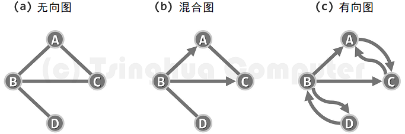

  相对而言，有向图的通用性更强，因为无向图和混合图都可转化为有向图，每条无向边(u, v)都可等效地替换为对称的一对有向边(u, v)和(v, u)。

* 顶点的度

  对于任何边e = (u, v)，称顶点u和v彼此邻接(adjacent)，互为邻居；而它们都与边e彼此关联(incident)。

  * 无向图

    在无向图中，与顶点v关联的边数，称作v的度数（degree），记作deg(v)。以上图(a)为例，顶点{ A, B, C, D }的度数分别为{ 2, 3, 2, 1 }。

  * 有向图（出度、入度）

    对于有向边e = (u, v)，e称作u的出边(outgoing edge)、v的入边(incoming edge)。v的出边总数称作其出度（out-degree），记作outdeg(v)；入边总数称作其入度（in-degree），记作indeg(v)。在上图(c)中，各顶点的出度为{ 1, 3, 1, 1 }，入度为{ 2, 1, 2, 1 }。

* 点权、边权

## 图的存储

### 邻接矩阵

邻接矩阵（adjacency matrix）是图最基本的实现方式，使用方阵`A[n][n]`表示由n个顶点构成的图，其中每个单元，各自负责描述一对顶点之间可能存在的邻接关系，故此得名。

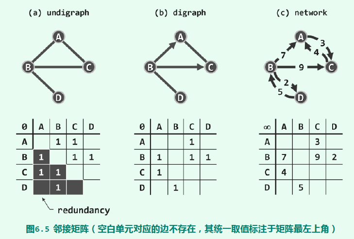

使用二维数组存储

```cpp
const int MAXN = 105;
int G[MAXN][MAXN];
```

* 如果仅需记录顶点u和顶点v是否连通，可以`G[u][v] = 1`，当然这里也可以用`bool`类型

* 对于无向图，同一条边在邻接矩阵中需要记录2次。`G[u][v] = G[v][u] = 1`

* 如果需要记录边权信息，如距离等等，可以直接在邻接矩阵中记录。
  * 顶点u、v间的距离是20：`G[u][v] = 20`
  * 如果顶点u、v间没有边，其边权通常可视具体情况用`0`或`-1`或`INF(infinity)`表示。其中`INF`是一个很大的数，`const int INF = 1e9`或`const int INF = 0x3f3f3f3f`

* 如果需要记录的边权信息不止一种，如uv间的距离、花费时间、花费金钱，则可用结构体

  ```cpp
  struct Edge {
  	int distance;
  	int cost;
  };
  
  Edge G[MAXN][MAXN];
  ```

* 对于点权信息，可以用另外一个一维数组存放。

* 优点

  * 实现简单

  * 对已确定的边进行操作，效率高

    对于已知边（比如`u`->`v`），要进行动态（增加或删除一条边）和静态（查询、修改边权）操作，时间复杂度为$O(1)$——其代价是邻接矩阵的空间冗余。

* 缺点

  * 空间复杂度过高$O(V^2)$

    对于稀疏图来说，邻接矩阵存图内存浪费太严重

    上机考试中，该存储方式一般适用于顶点数不超过1000的题

  * 顶点的动态操作效率低

    为了插入新的顶点，顶点集向量V[]需要添加一个元素；边集向量E[][]也需要增加一行，且每行都需要添加一个元素。顶点删除操作也与此类似。不过在通常的算法中，顶点的动态操作远少于其它操作。
  
  * 对于不确定边的查询效率较低
  
    比如想获取某个顶点所有与其相连的边，时间复杂度为$O(V)$

**邻接矩阵面向对象实现**

```cpp
#include <iostream>
using namespace std;

struct Graph {

	struct Vertex {
		int inDegree;
		int outDegree;
		//可以根据实际需求在此添加顶点的其余属性
		Vertex() :inDegree(0), outDegree(0) {}
	};

	struct Edge {
		bool isExist;
		int dist;
		//可以根据实际需求在此添加边的其余属性
		Edge() : isExist(false), dist(-1) {}
	};

	int numVertex;		//顶点个数
	int numEdge;		//边的个数
	Edge** AdjMatrix;	//邻接矩阵
	Vertex* vertexs;	//存储每个节点的属性（点权）

	Graph(int vertexNum) {
		numVertex = vertexNum;
		numEdge = 0;

		//动态分配一个二维数组
		AdjMatrix = new Edge * [numVertex];
		for (int i = 0; i < numVertex; i++) {
			AdjMatrix[i] = new Edge[numVertex];
		}

		vertexs = new Vertex[numVertex];
	}

	~Graph() {
		for (int i = 0; i < numVertex; i++) {
			delete[] AdjMatrix[i];
		}
		delete[] AdjMatrix;

		delete[] vertexs;
	}

	void addEdge(int u, int v, int dist) {
		AdjMatrix[u][v].isExist = true;
		AdjMatrix[u][v].dist = dist;
		vertexs[u].outDegree += 1;
		vertexs[v].inDegree += 1;
		numEdge += 1;
	}
};

int main() {
	int N, M;
	cin >> N >> M;
	Graph g(N);
	for (int i = 0; i < M; i++) {
		int u, v, dist;
		cin >> u >> v >> dist;
		g.addEdge(u, v, dist);
	}
	//do something
	return 0;
}
```

### 邻接表

* 优点
  * 内存利用率较高

    对于顶点数V与边数E，空间复杂度为$O(V+E)$。能较好处理稀疏图的存储。

  * 对不确定边的操作效率较高

    比如，要遍历从某点出发的所有边，不会像邻接矩阵一样可能会遍历到不存在的边。

* 缺点
  
  * 相比邻接矩阵实现较为复杂
    
  * 对确定边的操作效率不高
  
    比如对于给定的边（比如`u`->`v`），要进行查询或修改等操作只有通过遍历这种方式找到了。


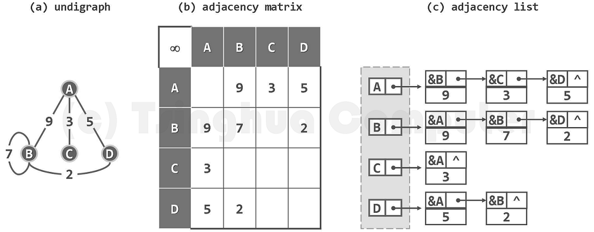


 


邻接表的面向对象实现

```cpp
#include <iostream>
using namespace std;

struct Graph {

	struct Vertex {
		int inDegree;
		int outDegree;
		//可以根据实际需求在此添加顶点的其余属性
		Vertex() :inDegree(0), outDegree(0) {}
	};

	struct Edge {
		int to;		//边的终点
		int dist;
		//可以根据实际需求在此添加边的其余属性
		Edge(int to, int dist) :to(to), dist(dist) {}
	};

	struct EdgeNode {
		Edge edge;
		struct EdgeNode* next;
		EdgeNode(int to, int dist) :edge(to, dist), next(NULL) {}
	};

	struct VertexNode {
		Vertex vertex;
		EdgeNode* first;	//不带头节点的链表的第一个节点指针
		EdgeNode* rear;		//链表最后一个节点的指针
		VertexNode() :vertex(), first(NULL), rear(NULL) {}
	};

	int numVertex;
	int numEdge;
	VertexNode* AdjList;	//邻接链表

	Graph(int vertexNum) {
		numVertex = vertexNum;
		numEdge = 0;
		AdjList = new VertexNode[numVertex];
	}

	~Graph() {
		for (int i = 0; i < numVertex; i++) {
			//销毁不带头节点的单链表
			EdgeNode* p = AdjList[i].first;
			while (p != NULL) {
				EdgeNode* temp = p;
				p = p->next;
				delete temp;
			}
		}
		delete[] AdjList;
	}

	void addEdge(int u, int v, int dist) {
		//在不带头节点的单向链表末尾添加一个节点
		EdgeNode* temp = new EdgeNode(v, dist);
		EdgeNode* &first = AdjList[u].first;
		EdgeNode* &rear = AdjList[u].rear;
		if (first == NULL) {
			first = temp;
		}
		else {
			rear->next = temp;
		}
		rear = temp;
		//修改图的其他属性
		AdjList[u].vertex.outDegree += 1;
		AdjList[v].vertex.inDegree += 1;
		numEdge += 1;
	}

};

int main() {
	int N, M;
	cin >> N >> M;
	Graph g(N);
	for (int i = 0; i < M; i++) {
		int u, v, dist;
		cin >> u >> v >> dist;
		g.addEdge(u, v, dist);
	}
	//do something
	return 0;
}
```


## 图的遍历

### 深度优先搜索(DFS)

思想：从某个顶点出发，沿着一条路一直走到底，如果发现不能到达目标解，那就返回到上一个节点，然后从另一条路开始走到底，这种尽量往深处走的概念即是深度优先的概念。

```cpp
//顶点访问状态：
//DFS算法会使用以下3个状态：未发现、正在访问中、访问完毕
enum Status { Undiscovered, Visiting, Visited };

void _dfs(int u, Status statuses[]) {
    statuses[u] = Visiting;
    cout << u << " ";
    for (int v = 0; v < numVertex; v++) {
        if (AdjMatrix[u][v].isExist &&
            statuses[v] == Undiscovered) {
            _dfs(v, statuses);
        }
    }
    statuses[u] = Visited;
}

void DFS() {
    Status* statuses = new Status[numVertex];
    fill(statuses, statuses + numVertex, Undiscovered);
    for (int i = 0; i < numVertex; i++) {
        if (statuses[i] == Undiscovered) {
            _dfs(i, statuses);
        }
    }
    cout << endl;
    delete[] statuses;
}
```


实例

粗边框白色，为当前顶点；细边框白色、双边框白色和黑色，分别为处于UNDISCOVERED、VISITING和VISITED状态的顶点；dTime和fTime标签，该节点被发现的时间以及完成访问的时间，分别标注于各顶点的左右。

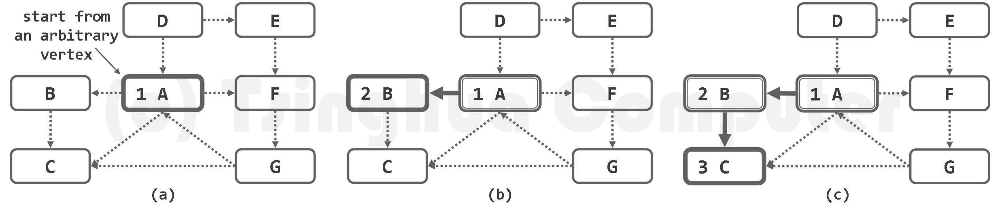

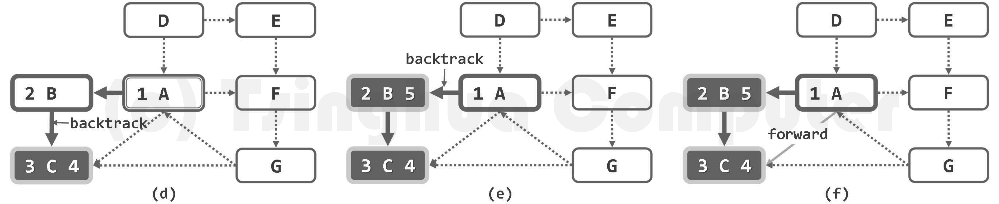

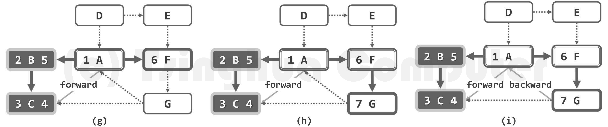

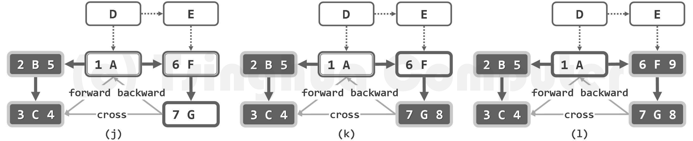

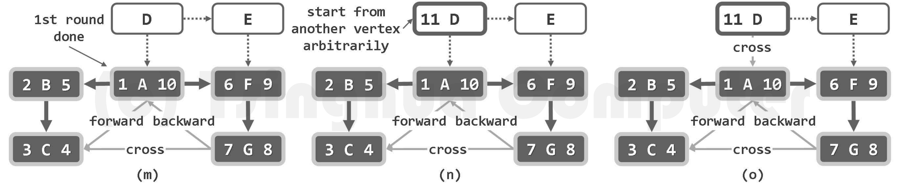

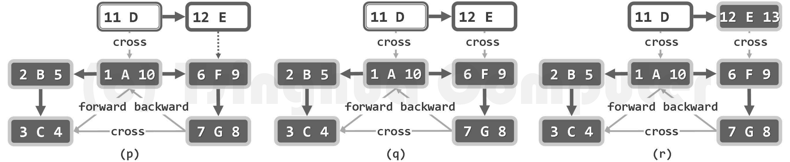

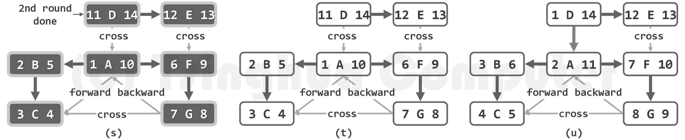

图(a)-图(m)对应于第一轮从顶点A出发开始搜索，图(n)-图(s)对应于第二轮从顶点D出发开始搜索

最终结果如图(t)所示，为包含两棵DFS树的一个DFS森林。可以看出，选用不同的起始基点，生成的DFS树（森林）也可能各异。如本例中，若从D开始搜索，则DFS森林可能如图(u)所示。

### 广度优先搜索(BFS)

```cpp
//顶点访问状态：
//BFS算法会使用以下3个状态：未发现、已发现（但还未访问）、访问完毕
enum Status { Undiscovered, Discovered, Visited };

void _bfs(int root, Status statuses[]) {
    queue<int> Q;
    Q.push(root);
    statuses[root] = Discovered;
    while (Q.empty() == false) {
        int u = Q.front(); Q.pop();
        cout << u << " ";
        statuses[u] = Visited;
        for (int v = 0; v < numVertex; v++) {
            if (statuses[v] == Undiscovered && AdjMatrix[u][v].isExist) {
                Q.push(v);
                statuses[v] = Discovered;
            }
        }
    }
}

void BFS() {
    Status* statuses = new Status[numVertex];
    fill(statuses, statuses + numVertex, Undiscovered);

    for (int i = 0; i < numVertex; i++) {
        if (statuses[i] == Undiscovered) {
            _bfs(i, statuses);
        }
    }
    cout << endl;
    delete[] statuses;
}
```

实例

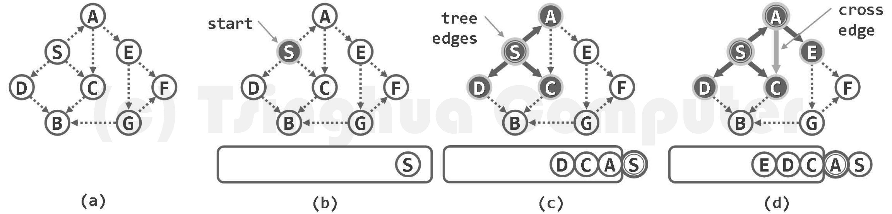

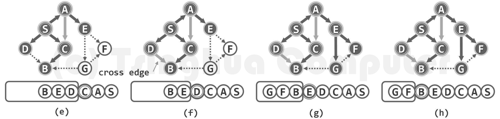

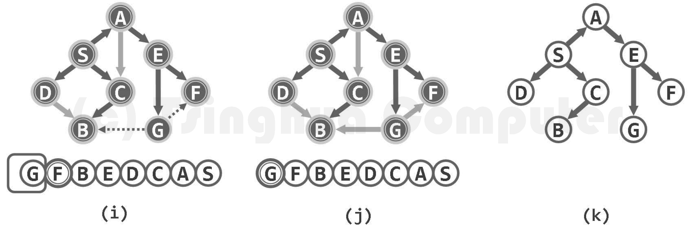

### 完整代码

使用分别使用DFS和BFS算法遍历有向图。

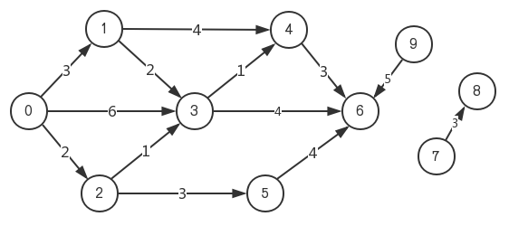

输入数据：

10个顶点（编号分别为0-9），13条边。
u -> v 的权值为 w

```
10 13
0 1 3
0 3 6
0 2 2
1 3 2
1 4 4
2 3 1
2 5 3
3 4 1
3 6 4
4 6 3
5 6 4
7 8 3
9 6 5
```

邻接矩阵输出：

```
0 1 3 4 6 2 5 7 8 9
0 1 2 3 4 5 6 7 8 9
```

邻接表输出：

```
0 1 3 4 6 2 5 7 8 9
0 1 3 2 4 6 5 7 8 9
```

#### 邻接矩阵面向对象实现

```cpp
#include <iostream>
#include <queue>
#include <algorithm>
using namespace std;

struct Graph {

	struct Vertex {
		int inDegree;
		int outDegree;
		//可以根据实际需求在此添加顶点的其余属性
		Vertex() :inDegree(0), outDegree(0) {}
	};

	struct Edge {
		bool isExist;
		int dist;
		//可以根据实际需求在此添加边的其余属性
		Edge() : isExist(false), dist(-1) {}
	};

	int numVertex;		//顶点个数
	int numEdge;		//边的个数
	Edge** AdjMatrix;	//邻接矩阵
	Vertex* vertexs;	//存储每个节点的属性（点权）

	Graph(int vertexNum) {
		numVertex = vertexNum;
		numEdge = 0;

		//动态分配一个二维数组
		AdjMatrix = new Edge * [numVertex];
		for (int i = 0; i < numVertex; i++) {
			AdjMatrix[i] = new Edge[numVertex];
		}

		vertexs = new Vertex[numVertex];
	}

	~Graph() {
		for (int i = 0; i < numVertex; i++) {
			delete[] AdjMatrix[i];
		}
		delete[] AdjMatrix;

		delete[] vertexs;
	}

	void addEdge(int u, int v, int dist) {
		AdjMatrix[u][v].isExist = true;
		AdjMatrix[u][v].dist = dist;
		vertexs[u].outDegree += 1;
		vertexs[v].inDegree += 1;
		numEdge += 1;
	}

	//顶点访问状态：
	//BFS算法会使用以下3个状态：未发现、已发现（但还未访问）、访问完毕
	//DFS算法会使用以下3个状态：未发现、正在访问中、访问完毕
	enum Status { Undiscovered, Discovered, Visiting, Visited };

	void _dfs(int u, Status statuses[]) {
		statuses[u] = Visiting;
		cout << u << " ";
		for (int v = 0; v < numVertex; v++) {
			if (AdjMatrix[u][v].isExist &&
				statuses[v] == Undiscovered) {
				_dfs(v, statuses);
			}
		}
        statuses[u] = Visited;
	}

	void DFS() {
		Status* statuses = new Status[numVertex];
		fill(statuses, statuses + numVertex, Undiscovered);

		for (int i = 0; i < numVertex; i++) {
			if (statuses[i] == Undiscovered) {
				_dfs(i, statuses);
			}
		}
		cout << endl;
		delete[] statuses;
	}

	void _bfs(int root, Status statuses[]) {
		queue<int> Q;
		Q.push(root);
		statuses[root] = Discovered;
		while (Q.empty() == false) {
			int u = Q.front(); Q.pop();
			cout << u << " ";
			statuses[u] = Visited;
			for (int v = 0; v < numVertex; v++) {
				if (statuses[v] == Undiscovered && AdjMatrix[u][v].isExist) {
					Q.push(v);
					statuses[v] = Discovered;
				}
			}
		}
	}

	void BFS() {
		Status* statuses = new Status[numVertex];
		fill(statuses, statuses + numVertex, Undiscovered);
		for (int i = 0; i < numVertex; i++) {
			if (statuses[i] == Undiscovered) {
				_bfs(i, statuses);
			}
		}
		cout << endl;
		delete[] statuses;
	}
};

int main() {
	int N, M;
	cin >> N >> M;
	Graph g(N);
	for (int i = 0; i < M; i++) {
		int u, v, dist;
		cin >> u >> v >> dist;
		g.addEdge(u, v, dist);
	}
	g.DFS();
	g.BFS();
	return 0;
}
```

#### 邻接链表面向对象实现

```cpp
#include <iostream>
#include <queue>
#include <algorithm>
using namespace std;

struct Graph {

	struct Vertex {
		int inDegree;
		int outDegree;
		//可以根据实际需求在此添加顶点的其余属性
		Vertex() :inDegree(0), outDegree(0) {}
	};

	struct Edge {
		int to;		//边的终点
		int dist;
		//可以根据实际需求在此添加边的其余属性
		Edge(int to, int dist) :to(to), dist(dist) {}
	};

	struct EdgeNode {
		Edge edge;
		struct EdgeNode* next;
		EdgeNode(int to, int dist) :edge(to, dist), next(NULL) {}
	};

	struct VertexNode {
		Vertex vertex;
		EdgeNode* first;	//不带头节点的链表的第一个节点指针
		EdgeNode* rear;		//链表最后一个节点的指针
		VertexNode() :vertex(), first(NULL), rear(NULL) {}
	};

	int numVertex;
	int numEdge;
	VertexNode* AdjList;	//邻接链表

	Graph(int vertexNum) {
		numVertex = vertexNum;
		numEdge = 0;
		AdjList = new VertexNode[numVertex];
	}

	~Graph() {
		for (int i = 0; i < numVertex; i++) {
			//销毁不带头节点的单链表
			EdgeNode* p = AdjList[i].first;
			while (p != NULL) {
				EdgeNode* temp = p;
				p = p->next;
				delete temp;
			}
		}
		delete[] AdjList;
	}

	void addEdge(int u, int v, int dist) {
		//在不带头节点的单向链表末尾添加一个节点
		EdgeNode* temp = new EdgeNode(v, dist);
		//使用引用语法给已有的变量取一个别名，让后面的代码更简洁
		EdgeNode* &first = AdjList[u].first;
		EdgeNode* &rear = AdjList[u].rear;
		if (first == NULL) {
			first = temp;
		}
		else {
			rear->next = temp;
		}
		rear = temp;
		//修改图的其他属性
		AdjList[u].vertex.outDegree += 1;
		AdjList[v].vertex.inDegree += 1;
		numEdge += 1;
	}

	//顶点访问状态：
	//BFS算法会使用以下3个状态：未发现、已发现（但还未访问）、访问完毕
	//DFS算法会使用以下3个状态：未发现、正在访问中、访问完毕
	enum Status {Undiscovered, Discovered, Visiting, Visited};

	void _dfs(int u, Status statuses[]) {
		statuses[u] = Visiting;
		cout << u << " ";
		for (EdgeNode* p = AdjList[u].first; p != NULL; p = p->next) {
			int v = p->edge.to;
			if (statuses[v] == Undiscovered) {
				_dfs(v, statuses);
			}
		}
		statuses[u] = Visited;
	}

	void DFS() {
		Status* statuses = new Status[numVertex];
		fill(statuses, statuses + numVertex, Undiscovered);

		for (int i = 0; i < numVertex; i++) {
			if (statuses[i] == Undiscovered) {
				_dfs(i, statuses);
			}
		}
		cout << endl;
		delete[] statuses;
	}

	void _bfs(int root, Status statuses[]) {
		queue<int> Q;
		Q.push(root);
		statuses[root] = Discovered;
		while (Q.empty() == false) {
			int u = Q.front(); Q.pop();
			cout << u << " ";
			statuses[u] = Visited;
			for (EdgeNode* p = AdjList[u].first; p != NULL; p = p->next) {
				int v = p->edge.to;
				if (statuses[v] == Undiscovered) {
					Q.push(v);
					statuses[v] = Discovered;
				}
			}
		}
	}

	void BFS() {
		Status* statuses = new Status[numVertex];
		fill(statuses, statuses + numVertex, Undiscovered);
		for (int i = 0; i < numVertex; i++) {
			if (statuses[i] == Undiscovered) {
				_bfs(i, statuses);
			}
		}
		cout << endl;
		delete[] statuses;
	}
};

int main() {
	int N, M;
	cin >> N >> M;
	Graph g(N);
	for (int i = 0; i < M; i++) {
		int u, v, dist;
		cin >> u >> v >> dist;
		g.addEdge(u, v, dist);
	}
	g.DFS();
	g.BFS();

	return 0;
}
```

#### 邻接矩阵简易实现

```cpp
#include <iostream>
#include <queue>
#include <algorithm>
using namespace std;

const int MAXN = 105;
const int INF = 1e9;

int G[MAXN][MAXN];
int N, K;

bool visited[MAXN];

void _dfs(int u) {
	visited[u] = true;
	printf("%d ", u);
	for (int v = 0; v < N; v++) {
		if (G[u][v] != INF && visited[v] == false) {
			_dfs(v);
		}
	}
}

void DFS() {
	fill(visited, visited + N, false);
	for (int i = 0; i < N; i++) {
		if (visited[i] == false) {
			_dfs(i);
		}
	}
	printf("\n");
}

void _bfs(int root) {
	queue<int> Q;
	Q.push(root);
	visited[root] = true;
	while (Q.empty() == false) {
		int u = Q.front(); Q.pop();
		printf("%d ", u);
		for (int v = 0; v < N; v++) {
			if (visited[v] == false && G[u][v] != INF) {
				Q.push(v);
				visited[v] = true; //准确来说visited数组是记录节点是否已经进入队列
			}
		}
	}
}

void BFS() {
	fill(visited, visited + N, false);
	for (int i = 0; i < N; i++) {
		if (visited[i] == false) {
			_bfs(i);
		}
	}
	printf("\n");
}

int main() {
	//将邻接矩阵的所有边全部初始化为不存在
	for (int i = 0; i < MAXN; i++) {
		for (int j = 0; j < MAXN; j++) {
			G[i][j] = INF;
		}
	}

	scanf("%d %d", &N, &K);
	for (int i = 0; i < K; i++) {
		int u, v, w;
		scanf("%d %d %d", &u, &v, &w);
		G[u][v] = w;
	}

	DFS();
	BFS();

	return 0;
}
```

#### 邻接表简易实现

```cpp
#include <iostream>
#include <vector>
#include <queue>
#include <algorithm>
using namespace std;

struct Node {
	int v;
	int w;	//边权

	Node() {}
	Node(int v, int w) :v(v), w(w) {}
};

const int MAXN = 105;
vector<Node> G[MAXN];
int N, K;

bool visited[MAXN];

void _dfs(int u) {
	visited[u] = true;
	printf("%d ", u);
	for (Node t : G[u]) {
		int v = t.v;
		if (visited[v] == false) {
			_dfs(v);
		}
	}
}

void DFS() {
	fill(visited, visited + N, false);
	for (int i = 0; i < N; i++) {
		if (visited[i] == false) {
			_dfs(i);
		}
	}
	printf("\n");
}

void _bfs(int root) {
	queue<int> Q;
	Q.push(root);
	visited[root] = true;
	while (Q.empty() == false) {
		int u = Q.front(); Q.pop();
		printf("%d ", u);
		for (Node t : G[u]) {
			int v = t.v;
			if (visited[v] == false) {
				Q.push(v);
				visited[v] = true; //准确来说visited数组是记录节点是否已经进入队列
			}
		}
	}
}

void BFS() {
	fill(visited, visited + N, false);
	for (int i = 0; i < N; i++) {
		if (visited[i] == false) {
			_bfs(i);
		}
	}
	printf("\n");
}

int main() {
	scanf("%d %d", &N, &K);
	for (int i = 0; i < K; i++) {
		int u, v, w;
		scanf("%d %d %d", &u, &v, &w);
		G[u].push_back(Node(v, w));
	}

	DFS();
	BFS();

	return 0;
    
}
```


### 另一种风格的图论题

1. 四连通图

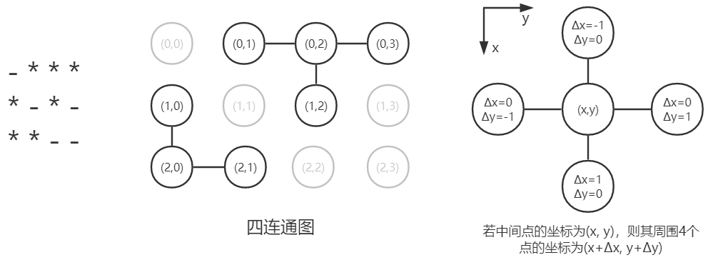

2. 八连通图

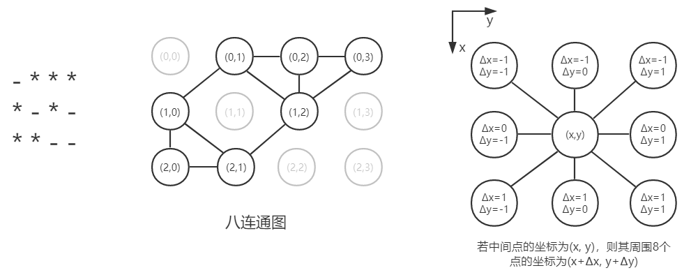

#### 求四连通块的个数

```
- * * * - - *
- - * - - - -
- - - - * - -
- - - * * * -
* * * - * - -
* * * * - - -
```


```
//6行，7列
6 7
0 1 1 1 0 0 1
0 0 1 0 0 0 0
0 0 0 0 1 0 0
0 0 0 1 1 1 0
1 1 1 0 1 0 0
1 1 1 1 0 0 0
```


```cpp
#include <iostream>
#include <queue>
#include <algorithm>
using namespace std;

const int MAXN = 20;

int G[MAXN][MAXN];
int N, M;
bool visited[MAXN][MAXN];

// (Δx, Δy)，分别对应于 上下左右 四个方向上的x、y坐标增量
const int directions[4][2] = { {-1,0},{1,0},{0,-1},{0,1} };

bool isValid(int x, int y) {
	// 检查坐标是否越界
	if (x < 0 || x >= N || y < 0 || y >= M) return false;
	// 检查该坐标是否已被访问 以及 该坐标对应的节点是否存在
	if (visited[x][y] || G[x][y] == 0) return false;
	return true;
}

void _dfs(int x, int y) {
	if (isValid(x, y) == false)	 return;
	visited[x][y] = true;
	for (int i = 0; i < 4; i++) {
		// 当前点(x, y)周围的4个点的坐标为(x+Δx, y+Δy)
		int newX = x + directions[i][0];
		int newY = y + directions[i][1];
		_dfs(newX, newY);
	}
}

int DFS() {
	fill(&visited[0][0], visited[0] + MAXN * MAXN, false);
	int cnt = 0;
	for (int i = 0; i < N; i++) {
		for (int j = 0; j < M; j++) {
			if (G[i][j] == 1 && visited[i][j] == false) {
				_dfs(i, j);
				cnt++;
			}
		}
	}
	return cnt;
}

struct Point {
	int x, y;
	Point(int x, int y) :x(x), y(y) {}
};

void _bfs(int x, int y) {
	if (isValid(x, y) == false)	 return;
	queue<Point> Q;
	Q.push(Point(x, y));
	visited[x][y] = true;
	while (!Q.empty()) {
		Point temp = Q.front(); Q.pop();
		for (int i = 0; i < 4; i++) {
			int newX = temp.x + directions[i][0];
			int newY = temp.y + directions[i][1];
			if (isValid(newX, newY)) {
				Q.push(Point(newX, newY));
				visited[newX][newY] = true;
			}
		}
	}
}

int BFS() {
	fill(&visited[0][0], visited[0] + MAXN * MAXN, false);
	int cnt = 0;
	for (int i = 0; i < N; i++) {
		for (int j = 0; j < M; j++) {
			if (G[i][j] == 1 && visited[i][j] == false) {
				_bfs(i, j);
				cnt++;
			}
		}
	}
	return cnt;
}

int main() {
	scanf("%d %d", &N, &M);
	for (int i = 0; i < N; i++) {
		for (int j = 0; j < M; j++) {
			scanf("%d", &G[i][j]);
		}
	}

	printf("%d\n", DFS());
	printf("%d\n", BFS());

	return 0;
}
```


## 图论算法

### 最小生成树

**生成树**

连通图G的某一无环连通子图T若覆盖G中所有的顶点，则称作G的一棵支撑树或生成树（spanning tree）。

就保留原图中边的数目而言，生成树既是“禁止环路”前提下的极大子图，也是“保持连通”前提下的最小子图。

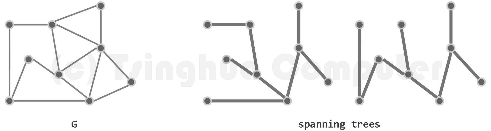

把DFS遍历过程中所经过的边保留，其余的边删除，会得到一颗树，称为“DFS生成树”。

**最小生成树**

若图G为一带权网络，则每一棵支撑树的成本（cost）即为其所采用各边权重的总和。在G的所有支撑树中，成本最低者称作最小支撑树（minimum spanning tree, MST）。

#### Prim算法

算法描述：

1. 初始时`点集合V`与`边集合E`均为空。从图中任取一个顶点（通常取序号最小的顶点），放入`集合V`中
2. 将`集合V、E`中的顶点和边当成一棵树，选择与这棵树相接的边中权值最小的那条边（且不能出现回路），将该边加入集合E中，这条边所相连的顶点加入集合V中。
3. 重复步骤2，直至原图中所有的顶点均已加入集合V，此时集合V、E中的顶点和边即为原图的一棵最小生成树。


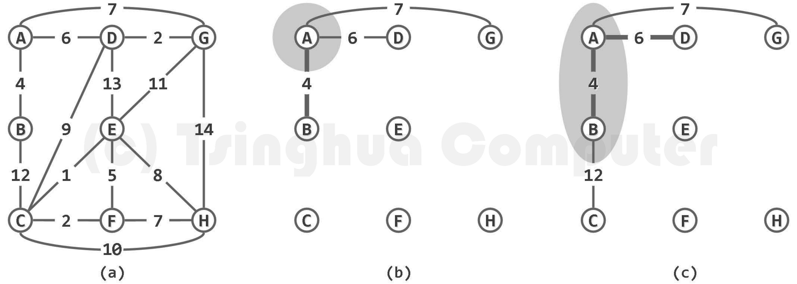

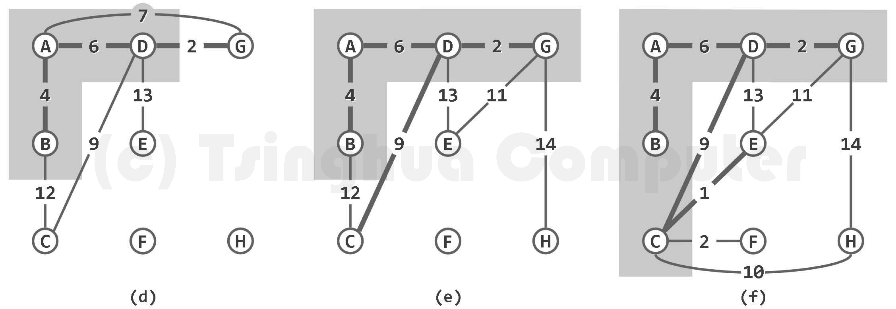

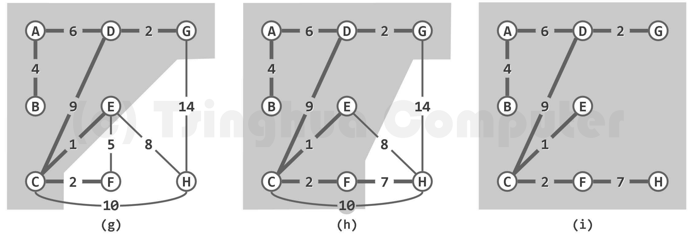

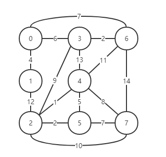

```
8 15
0 1 4
0 3 6
0 6 7
1 2 12
2 3 9
2 4 1
2 5 2
2 7 10
3 4 13
3 6 2
4 5 5
4 6 11
4 7 8
5 7 7
6 7 14
```

```
1 -> 0
3 -> 0
6 -> 3
2 -> 3
4 -> 2
5 -> 2
7 -> 5
31
```

完整代码：

```cpp
#include <iostream>
#include <algorithm>
using namespace std;

const int MAXN = 105;
const int INF = 1e9;

int G[MAXN][MAXN];
int N, K;

int dist[MAXN];			//记录每个节点到集合的最短距离
bool visited[MAXN];		//记录每个节点是否已被访问，false表示该顶点未加入集合中
int path[MAXN];

int Prime(int st = 0) {
	fill(dist, dist + MAXN, INF);
	fill(visited, visited + MAXN, false);
	fill(path, path + MAXN, -1);

	int cost = 0;
	dist[st] = 0;	//起点到集合的距离设置成0
	for (int t = 0; t < N; t++) {
		int u = -1, min_dist = INF;
		for (int i = 0; i < N; i++) {	//在未加入集合的节点中找到距离集合最短的节点u
			if (visited[i] == false && dist[i] < min_dist) {
				u = i;
				min_dist = dist[i];
			}
		}
		if (u == -1) break;		//如果没有找到说明图中所有顶点均已放入集合
								//即图中所有顶点到起点的最短路径均已求出，算法结束
		visited[u] = true;		//标记顶点u已被访问，放入集合中
		cost += dist[u];
		if (path[u] != -1) {
			printf("%d -> %d\n", u, path[u]);
		}

		for (int v = 0; v < N; v++) {
			//对于所有u能到达且未加入集合中的顶点v，优化顶点v到集合的最短距离
			if (visited[v] == false && G[u][v] != INF
				&& G[u][v] < dist[v]) {
				dist[v] = G[u][v];
				path[v] = u;
			}
		}
	}
	return cost;
}

int main() {
	fill(G[0], G[0] + MAXN * MAXN, INF);

	scanf("%d %d", &N, &K);
	for (int i = 0; i < K; i++) {
		int u, v, w;
		scanf("%d %d %d", &u, &v, &w);
		G[u][v] = w;
		G[v][u] = w;	//注意这是无向图
	}

	int mincost = Prime(0);
	printf("%d\n", mincost);

	return 0;
}
```


#### Kruskal算法 

每次从图中所有候选边中选择权值最小的边(且不能与已选中的边形成环路)，并入生成树中，直到所有的边都被检测完。

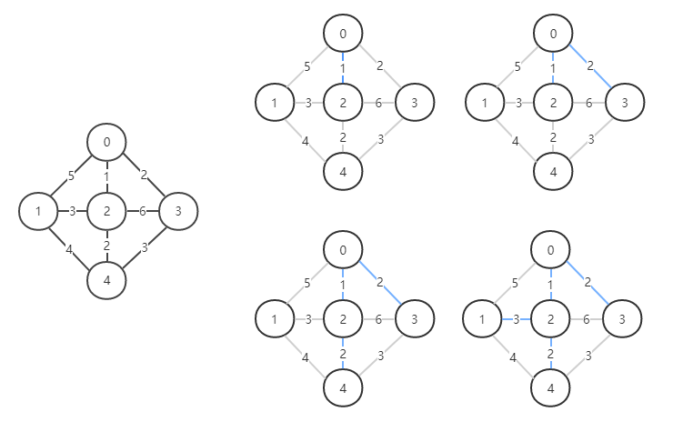

#### 破圈法

Prim算法和Kruskal算法都属于避圈法，都使用了贪心思想。

破圈法描述如下：

1.找到图中的一个环。2.删除该环中的权值最大的边。3.重复上述操作，直到图中已无环。 

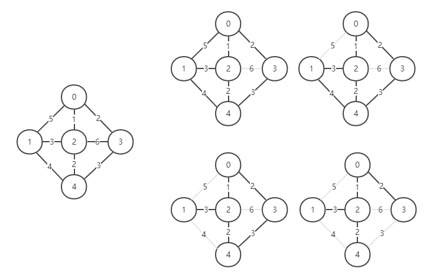

### 最短路径

#### Dijkstra算法

Dijkstra算法用于解决单源最短路径问题，可求出图中某一顶点st到其余所有顶点的最短路径。

算法思想：

1. 有两个集合S、T。集合S存放所有已找到最短路径的顶点，集合T存放图中剩余的顶点。
2. 每次从集合T中选择一个距离起点st最短的顶点u，放入集合S。以顶点u为中介点，对于所有u能到达且位于集合T中的顶点v，优化起点st到顶点v的最短距离。


```
//9个顶点 12条边 起点为0 终点为6
9 12 0 6
0 1 3
0 3 6
0 2 2
1 3 2
1 4 4
2 3 1
2 5 3
3 4 1
4 6 3
5 6 4
7 6 8
7 8 10
```

```
min distance: 7
0 -> 2 -> 3 -> 4 -> 6
```

```cpp
#include <iostream>
#include <algorithm>
using namespace std;

const int MAXN = 105;
const int INF = 1e9;

int G[MAXN][MAXN];
int N;

int dist[MAXN];			//记录每个节点到起点st的最短距离
bool visited[MAXN];		//记录每个节点是否已被访问，false表示该顶点位于集合T中
int path_preNode[MAXN];	//记录每个节点的上一个节点的编号

void Dijkstra(int st) {
	fill(dist, dist + MAXN, INF);
	fill(visited, visited + MAXN, false);
	for (int i = 0; i < N; i++) path_preNode[i] = i;

	dist[st] = 0;	//起点st到起点st的距离设置成0
	for (int t = 0; t < N; t++) {
		int u = -1, min_dist = INF;
		for (int i = 0; i < N; i++) {	//在集合T中找到距离起点st最短的节点u
			if (visited[i] == false && dist[i] < min_dist) {
				u = i;
				min_dist = dist[i];
			}
		}
		if (u == -1) return;	//出现这种情况是因为图中存在起点st无法到达的节点，算法提前退出
		visited[u] = true;		//标记顶点u已被访问，放入集合S中
		for (int v = 0; v < N; v++) {
			//以顶点u为中介点，对于所有u能到达且位于集合T中的顶点v，优化起点st到顶点v的最短距离。
			if (visited[v] == false && G[u][v] != INF 
				&& dist[u] + G[u][v] < dist[v]) {
				dist[v] = dist[u] + G[u][v];
				path_preNode[v] = u;
			}
		}
	}
}

void printPath(int st, int cur) {
	if (cur == st) {
		printf("%d", cur);
		return;
	}
	printPath(st, path_preNode[cur]);
	printf(" -> %d", cur);
}

int main() {
	fill(G[0], G[0] + MAXN * MAXN, INF);

	int K, st, ed;
	scanf("%d %d %d %d", &N, &K, &st, &ed);
	for (int i = 0; i < K; i++) {
		int u, v, w;
		scanf("%d %d %d", &u, &v, &w);
		G[u][v] = w;
	}

	Dijkstra(st);

	if (dist[ed] == INF) {
		printf("起点[%d]无法到达终点[%d]\n", st, ed);
		return 0;
	}

	printf("min distance: %d\n", dist[ed]);
	printPath(st, ed);
	printf("\n");
	return 0;
}
```

#### Floyd算法

Floyd算法用于解决全源最短路径问题，可求出图中任意两点u、v间的最短距离。

该算法基于这样一个事实：如果存在某个顶点k，使得当以k为中介点时，顶点i到顶点j的距离更短，则应使用顶点k作为中介点。

即当`dist[i][k] + dist[k][j] < dist[i][j]`时，令`dist[i][j] = dist[i][k] + dist[k][j]`。

```cpp
#include <iostream>
#include <algorithm>
using namespace std;

const int MAXN = 105;
const int INF = 1e9;

int G[MAXN][MAXN];
int N;

int dist[MAXN][MAXN];	//dist[i][j] = a 表示当前顶点i、j的最短距离是a
int path[MAXN][MAXN];	//path[i][j] = k，表示顶点i、j的最短路径需要经过顶点k，如果k = -1则表示不需要经过顶点k

void Floyd() {
	for (int i = 0; i < N; i++) {
		for (int j = 0; j < N; j++) {
			dist[i][j] = G[i][j];
			path[i][j] = -1;
		}
	}

	for (int k = 0; k < N; k++) {
		for (int i = 0; i < N; i++) {
			for (int j = 0; j < N; j++) {
				if (dist[i][k] == INF || dist[k][j] == INF) continue;
				if (dist[i][k] + dist[k][j] < dist[i][j]) {
					dist[i][j] = dist[i][k] + dist[k][j];
					path[i][j] = k;
				}
			}
		}
	}
}

void printPath(int u, int v) {
	if (path[u][v] == -1) {
		printf("%d -> %d\n", u, v);
		return;
	}
	int mid = path[u][v];
	printPath(u, mid);
	printPath(mid, v);
}

int main() {
	fill(G[0], G[0] + MAXN * MAXN, INF);

	int K, st, ed;
	scanf("%d %d %d %d", &N, &K, &st, &ed);
	for (int i = 0; i < K; i++) {
		int u, v, w;
		scanf("%d %d %d", &u, &v, &w);
		G[u][v] = w;
	}

	Floyd();

	printf("min distance: %d\n", dist[st][ed]);
	printPath(st, ed);

	return 0;
}
```

```
min distance: 7
0 -> 2
2 -> 3
3 -> 4
4 -> 6
```


### 拓扑排序

AOV网：在一个表示工程的有向图中，用顶点表示活动，用边表示活动之间的优先关系，这样的有向图为顶点表示活动的网，我们称之为AOV网（Activity on Vertex Network)。

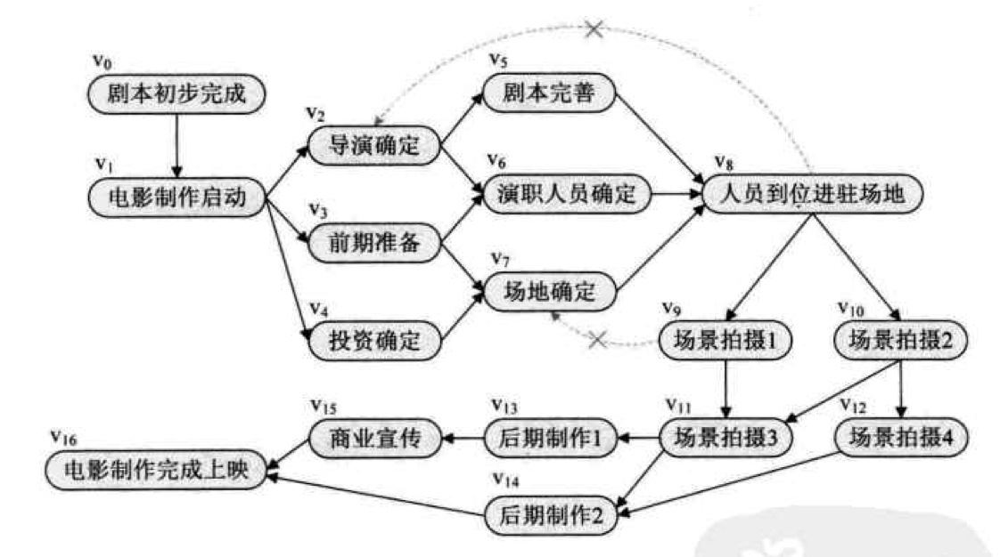

拓扑排序：拓扑排序，是将一个有向无环图中所有顶点排成一个线性序列，使得图中任意一对顶点u和v，若边(u,v)∈E(G)，则u在线性序列中出现在v之前。这样的线性序列称为满足拓扑次序(Topological Order)的序列，简称拓扑序列。

前提条件：有向无环图（DAG，Directed Acyclic Graph）

拓扑排序的结果不唯一.

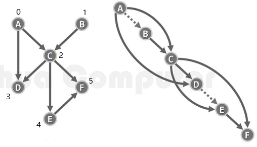


```
//第一行N、M分别表示节点的个数以及边的个数
6 7
0 2
0 3
1 2
2 3
2 4
2 5
4 5
```


#### 根据节点的入度

利用有向无环图总有入度为0的顶点的特性，每次将图中入度为0的顶点取出（并更新与之关联的其它节点的入度），放入数组中。

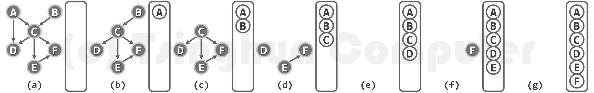

在实现该算法时，不需要真正删除边。

```cpp
#include <iostream>
#include <vector>
#include <queue>
using namespace std;

const int MAXN = 105;

int G[MAXN][MAXN];
int N, K;	//N个节点，K条边
int indegree[MAXN];
vector<int> topoSeq;

//进行拓扑排序，成功返回true，失败（有回路）返回false
bool topoSort() {
	queue<int> Q;	//队列中存放当前所有度为0且待处理的节点
	//先将所有度为0的节点入队
	for (int i = 0; i < N; i++) {
		if (indegree[i] == 0) {
			Q.push(i);
		}
	}
	int cnt = 0;
	while (!Q.empty()) {
		int u = Q.front(); Q.pop();
		cnt++;	//记录总共入队（出队）的节点数
		topoSeq.push_back(u);
		for (int v = 0; v < N; v++) {
			if (G[u][v] == 1) {
				indegree[v]--;
				if (indegree[v] == 0) {
					Q.push(v);
				}
			}
		}
	}
	//如果有节点没有入过队，说明图中存在回路
	return cnt == N;
}

int main() {
	scanf("%d %d", &N, &K);
	for (int i = 0; i < K; i++) {
		int u, v;
		scanf("%d %d", &u, &v);
		G[u][v] = 1;
		indegree[v]++;	//添加边的同时更新节点的入度
	}

	topoSort();

	for (int i = 0; i < N; i++) {
		printf("%d ", topoSeq[i]);
	}

	return 0;
}
```


#### 基于DFS搜索框架


```cpp
#include <iostream>
#include <vector>
using namespace std;

const int MAXN = 105;
enum Status { UnDiscovered, Visiting, Visited };	//节点访问状态：0-未访问，1-正在访问，2-已访问结束

int G[MAXN][MAXN];
int N, K;	//N个节点，K条边
Status statuses[MAXN];	//记录每个节点当前的访问状态
vector<int> topoStack;	//C++标准库中的stack功能太弱了，通常把vector当成stack用

void DFS(int u) {
	statuses[u] = Visiting;
	for (int v = 0; v < N; v++) {
		if (G[u][v] != 0) {
			if (statuses[v] == Visiting) {
				throw exception("出现回路");
			}
			else if (statuses[v] == UnDiscovered) {
				DFS(v);
			}
		}
	}
	statuses[u] = Visited;
	topoStack.push_back(u);
}

//进行拓扑排序，成功返回true，失败（有回路）返回false
bool topoSort() {
	//初始化（因为该函数可能被反复调用，每次调用前应先初始化）
	for (int i = 0; i < MAXN; i++) statuses[i] = UnDiscovered;
	topoStack.clear();

	try {
		for (int i = 0; i < N; i++) {
			if (statuses[i] == UnDiscovered) {
				DFS(i);
			}
		}
	}
	catch (exception ex) {
		return false;
	}
	return true;
}

int main() {
	scanf("%d %d", &N, &K);
	for (int i = 0; i < K; i++) {
		int u, v;
		scanf("%d %d", &u, &v);
		G[u][v] = 1;
	}

	topoSort();

	for (int i = topoStack.size() - 1; i >= 0; i--) {
		printf("%d ", topoStack[i]);
	}

	return 0;
}
```


### 关键路径

AOE网（Activity On Edge）即边表示活动的网，是一个带权的有向无环图，其中顶点表示事件（Event），每个事件表示在它之前的活动已经完成，在它之后的活动可以开始，弧表示活动，权表示活动持续的时间。AOE网可用来估算工程的完成时间。由于整个工程只有一个开始点和一个完成点，故在正常的情况（无环）下，网中只有一个入度为零的点（源点）和一个出度为零的点（汇点）。

AOE网有待研究的问题：

* 完成整项工程至少需要多少时间？
* 哪些活动是影响工程进度的关键？

由于在AOE网中有些活动可以并行地进行，所以完成工程的最短时间是从开始点到完成点的最长路径的长度（路径上各活动持续时间之和）。路径长度最长的路径叫做关键路径。

总结：在AOE网络中，

- 活动：业务逻辑中的行为，用边表示
- 事件：活动的结果或者触发条件，用节点表示
- 关键路径：具有最大路径长度（权重）的路径，可能不止一条

求AOE网络的关键路径及转变为DAG最长路径问题：给定一个有向无环图（DAG），求出其最长的一条路径

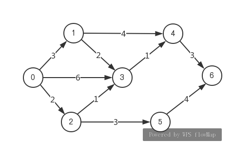

```
7 10
0 1 3
0 3 6
0 2 2
1 3 2
1 4 4
2 3 1
2 5 3
3 4 1
4 6 3
5 6 4
```

```
max length: 10
0 -> 1 -> 4 -> 6
```

#### 使用动态规划

```c++
int dp[MAXN] = {0};
```

`dp[i]`表示以顶点`i`为起点的**最长路径**的长度。
$$
dp[i] = \max{\{dp[j] + length(i \rightarrow j)}\} \qquad (i,j)∈E (即如果i到j的边存在)
$$
需要按照逆拓扑排序顺序来求解dp数组。

对于上图，我们需要按照i=6,5,4,3,2,1,0的顺序来求解dp[i]的值，

```cpp
#include <iostream>
#include <vector>
#include <queue>
#include <algorithm>
using namespace std;

const int MAXN = 105;

int G[MAXN][MAXN];	//-1表示边不存在
int N, K;	//N个节点，K条边
int indegree[MAXN];
vector<int> topoSeq;
int dp[MAXN];	//dp[i]表示以顶点i为起点的最长路径的长度。
int path[MAXN];

bool topoSort() {
	queue<int> Q;	//队列中存放当前所有度为0且待处理的节点
	//先将所有度为0的节点入队
	for (int i = 0; i < N; i++) {
		if (indegree[i] == 0) {
			Q.push(i);
		}
	}
	int cnt = 0;
	while (!Q.empty()) {
		int u = Q.front(); Q.pop();
		cnt++;	//记录总共入队（出队）的节点数
		topoSeq.push_back(u);
		for (int v = 0; v < N; v++) {
			if (G[u][v] == -1) continue;
			indegree[v]--;
			if (indegree[v] == 0) {
				Q.push(v);
			}
		}
	}
	//如果有节点没有入过队，说明图中存在回路
	return cnt == N;
}

void DP() {
	fill(path, path + MAXN, -1);
	fill(dp, dp + MAXN, 0);
	for (int i = topoSeq.size() - 1; i >= 0; i--) {
		int u = topoSeq[i];
		for (int v = 0; v < N; v++) {
			if (G[u][v] == -1) continue;
			int temp = dp[v] + G[u][v];
			if (temp > dp[u]) {
				dp[u] = temp;
				path[u] = v;
			}
		}
	}
}

void printPath(int nodeIndex) {
	printf("%d", nodeIndex);
	while (path[nodeIndex] != -1) {
		nodeIndex = path[nodeIndex];
		printf(" -> %d", nodeIndex);
	}
}

int main() {
	fill(&G[0][0], &G[0][0] + MAXN * MAXN, -1);	//将整个数组填充为-1

	scanf("%d %d", &N, &K);
	for (int i = 0; i < K; i++) {
		int u, v, w;
		scanf("%d %d %d", &u, &v, &w);
		G[u][v] = w;
		indegree[v]++;	//添加边的同时更新节点的入度
	}

	bool ret = topoSort();
	if (ret == false) {
		printf("图中有回路\n");
		return 0;
	}

	DP();

	int maxLengthIdx = 0;
	for (int i = 0; i < N; i++) {
		if (dp[i] > dp[maxLengthIdx]) {
			maxLengthIdx = i;
		}
	}
	printf("max length: %d\n", dp[maxLengthIdx]);
	printPath(maxLengthIdx);

	return 0;
}
```


#### 根据最早/最晚开始时间

查看视频：https://www.bilibili.com/video/av17396966

* 活动：业务逻辑中的行为，用边表示
* 事件：活动的结果或者触发条件，用节点表示
* 关键路径：具有最大路径长度（权重）的路径，可能不止一条

- 活动的两个属性
  - e(i)最早开始时间
  - l(i)最晚开始时间
- 事件的两个属性
  - ve(j)最早开始时间
  - vl(j)最晚开始时间

注：e和l分别是earliest和latest的缩写。

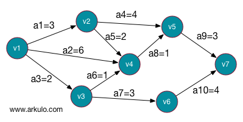

原理：

1. 先求出每个顶点的ve和vl值
2. 通过这两个值就可以求出每条边的e和l值。
3. 满足$e(i)=l(i)$的边就是“关键路径上的边”，关键路径可能不止一条

步骤：

1. 求ve(j)的值
   1. 从前向后，直接前驱节点的ve值＋当前节点的边的权值（有可能多条，取最大值）
   2. 第一个顶点的ve等于0

   下表为各顶点（事件）的ve值：

   | 顶点  | v1   | v2   | v3   | v4   | v5   | v6   | v7   |
   | :---- | :--- | :--- | :--- | :--- | :--- | :--- | :--- |
   | ve(j) | 0    | 3    | 2    | 6    | 7    | 5    | 10   |

2. 求vl(j)的值
   1. 从后向前，直接后继节点的vl值－当前节点的边的权值（有可能多条，取最小值）
   2. 终结点的vl等于它的ve

   | 顶点  | v1   | v2   | v3   | v4   | v5   | v6   | v7   |
   | :---- | :--- | :--- | :--- | :--- | :--- | :--- | :--- |
   | vl(j) | 0    | 3    | 3    | 6    | 7    | 6    | 10   |

3. 求e(i)的值

    e(i):活动ai是由弧$(vk,vj)$表示，则活动的最早开始时间应该和事件vk的最早发生时间相等，因此有e(i)=ve(k)。即：边（活动）的最早开始时间等于它发出的顶点(事件)的最早发生时间

    | 边   | a1(3) | a2(6) | a3(2) | a4(4) | a5(2) | a6(1) | a7(3) | a8(1) | a9(3) | a10(4) |
    | :--- | :---- | :---- | :---- | :---- | :---- | :---- | :---- | :---- | :---- | :----- |
    | e(i) | 0     | 0     | 0     | 3     | 3     | 2     | 2     | 6     | 7     | 5      |

4. 求l(i)的值

    l(i):活动ai是由弧$(vk,vj)$表示，则ai的最晚发生时间要保证vj的最迟发生时间不拖后（比如：vj最迟发生时间为9点的话，ai的最迟时间就必须是“9点减去活动耗时” ）。

    因此，$l(i)=vl(i)-length(vk,vj)$，即：活动到达顶点的最晚发生时间减去边的权重

    | 边   | a1(3) | a2(6) | a3(2) | a4(4) | a5(2) | a6(1) | a7(3) | a8(1) | a9(3) | a10(4) |
    | :--- | :---- | :---- | :---- | :---- | :---- | :---- | :---- | :---- | :---- | :----- |
    | l(i) | 0     | 0     | 1     | 3     | 4     | 5     | 3     | 6     | 7     | 6      |

5. 求出关键边和关键路径

    找到所有满足$e(i)=l(i)$的边：a1 a2 a4 a8 a9

    关键路径：a1->a4->a9 和 a2->a8->a9


### 哈密顿回路

- Hamilton 通路

  - 经过图中每个节点一次且仅一次的通路 　
  - 包含图中所有顶点，通路上各顶点不重复

- Hamilton 回路

  - 经过图中每个节点一次且仅一次的回路
  - 包含图中所有顶点，回路中，除了起点和终点相同之外，回路上各点不重复

- Hamilton 图

  - 存在 Hamilton 回路的图称为 Hamilton 图

  - 回路经过了图中所有的点，但不一定需要经过图中所有的边。

    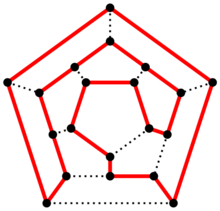

**旅行推销员问题(TSP)**

一个商品推销员要去若干个城市推销商品，该推销员从一个城市出发（可以理解为空降到某个城市），需要经过所有城市后，回到出发地。应如何选择行进路线，以使总的行程最短?

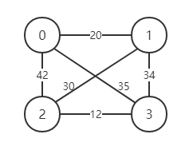

```
4 6
0 1 20
0 2 42
0 3 35
1 2 30
1 3 34
2 3 12
```

```
min distance: 97
0 -> 1 -> 2 -> 3 -> 0
```


```cpp
#include <iostream>
#include <vector>
using namespace std;
const int INF = 1e9;
const int MAXN = 1005;

int N, M;
int G[MAXN][MAXN];
bool visited[MAXN];

vector<int> path;		//记录当前dfs搜索的路线
vector<int> minPath;	//记录最短路线方案
int minDist = INF;		//记录最短路线方案的总距离

//total_dist 表示当前路径已经走过的距离
//st 表示当前路径的起点
void dfs(int u, int total_dist, int st) {
	path.push_back(u);
	visited[u] = true;
	if (path.size() == N) {
		//如果所有点都走过且从最后一个点能回到起点，且是更优解，则更新
		total_dist += G[u][st];
		if (G[u][st] != INF && total_dist < minDist) {
			minDist = total_dist;
			minPath = path;
		}
	}
	else {
		for (int v = 0; v < N; v++) {
			if (G[u][v] != INF && !visited[v]) {
				if (total_dist + G[u][v] >= minDist) continue;	//剪枝
				dfs(v, total_dist + G[u][v], st);
			}
		}
	}
	visited[u] = false;
	path.pop_back();
}

int main() {
	fill(G[0], G[0] + MAXN * MAXN, INF);
	cin >> N >> M;

	for (int i = 0; i < M; i++) {
		int u, v, w;
		cin >> u >> v >> w;
		G[u][v] = G[v][u] = w;
	}

	for (int st = 0; st < N; st++) {
		//每个点都可能成为起点
		fill(visited, visited + MAXN, false);
		path.clear();
		dfs(st, 0, st);
	}

	if (minDist != INF) {
		cout << "min distance: " << minDist << endl;
		for (int x : minPath) {
			cout << x << " -> ";
		}
		cout << minPath[0] << endl;	//再输出一次起点，形成回路
	}
	else
		cout << "No Solution!";
	return 0;
}
```

