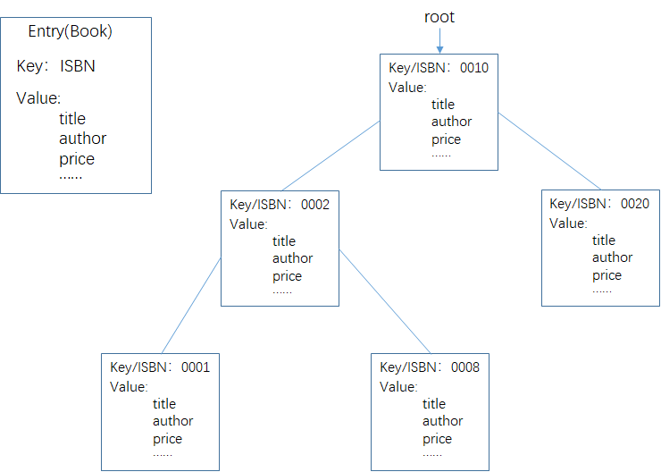
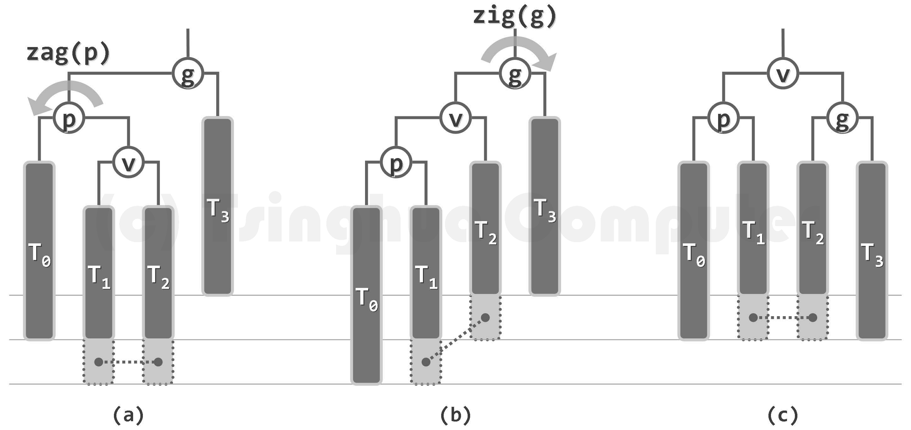
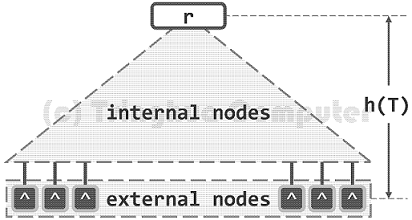
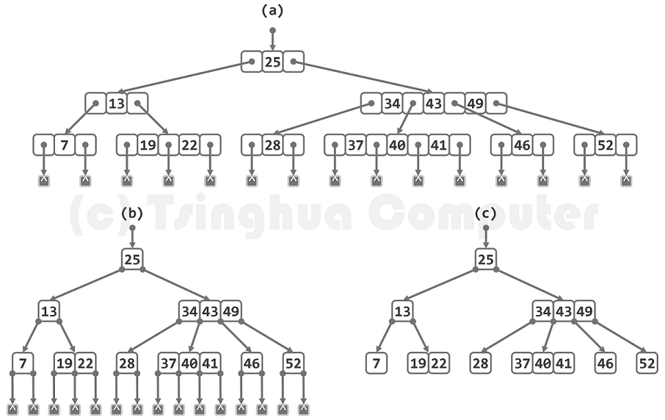

## 查找、搜索树

### 顺序查找

可用于数组、链表，不要求是否有序

```cpp
int search(int A[], int x, int lo, int hi) {
	for (int i = lo; i <= hi; i++) {
		if (A[i] == x) return i;
	}
	return -1;
}
```

### 二分查找

只针对有序数组

O(log(n))

```cpp
#include <stdio.h>

int binary_search_1(int A[], int lo, int hi, int x) {	//二分查找递归版，[lo, hi]
	if (lo > hi) return -1;
	int mid = (lo + hi) / 2;
	if (x == A[mid]) {
		return mid;
	}else if (x < A[mid]) {
		return binary_search_1(A, lo, mid - 1, x);
	} else {
		return binary_search_1(A, mid + 1, hi, x);
	}
}

int binary_search_2(int A[], int lo, int hi, int x) {	//二分查找迭代版，[lo, hi]
	while (lo <= hi) {
		int mid = (lo + hi) / 2;
		if (A[mid] == x) {
			return mid;
		} else if (x < A[mid]) {
			hi = mid - 1;
		} else {
			lo = mid + 1;
		}
	}
	return -1;	//没找到
}

int main() {
	int A[] = { 2,3,4,5,20,30,33,55,100 };
	int N = sizeof(A) / sizeof(int);
	int pos1 = binary_search_1(A, 0, N - 1, 100);
	printf("%d\n", pos1);
	int pos2 = binary_search_2(A, 0, N - 1, 4);
	printf("%d\n", pos2);
	return 0;
}
```

### 拓展：

对于有序数组中包含重复元素的情况：

lower_bound：在非递减序列中的返回**第一个**大于等于值x的元素下标

upper_bound：在非递减序列中的返回**第一个**大于值x的元素下标


```cpp
#include <stdio.h>

int lower_bound(int A[], int lo, int hi, int x) {	//[lo, hi]
	while (lo < hi) {
		int mid = lo + (hi - lo) / 2;
		if (A[mid] >= x) {
			hi = mid;
		} else {
			lo = mid + 1;
		}
	}
	return lo;
}

int upper_bound(int A[], int lo, int hi, int x) {	//[lo, hi]
	while (lo < hi) {
		int mid = lo + (hi - lo) / 2;
		if (A[mid] > x) {
			hi = mid;
		} else {
			lo = mid + 1;
		}
	}
	return lo;
}

void search(int A[], int N, int x) {
	int lo = lower_bound(A, 0, N - 1, x);
	int hi = upper_bound(A, 0, N - 1, x);
	printf("查找到x=%d的元素个数为%d个，下标范围[%d, %d)\n", x, hi - lo, lo, hi);
}

int main() {
	int A[] = { 1,2,2,2,2,5,8,10 };
	int N = sizeof(A) / sizeof(int);
	
	search(A, N, 2);
	search(A, N, 7);
	return 0;
}
```


等差数列中寻找重复出现的数字

在一个等差数列中，可能会有一个数字重复出现了一次，找出该重复的数字，返回其下标，如果没有则返回-1

```cpp
#include <iostream>
#include <vector>
using namespace std;

int find(const vector<int> &A) {
	if (A.size() < 2) return -1;
	if (A[0] == A[1]) return 1;
	int lo = 0;
	int hi = A.size() - 1;
	int delta = A[1] - A[0];
	while (lo <= hi) {
		int mid = (lo + hi) / 2;
		int expected = A[0] + mid * delta;
		if (A[mid] == A[mid - 1]) {
			return mid;
		} else if (expected == A[mid]) {
			lo = mid + 1;
		} else {
			hi = mid - 1;
		}
	}
	return -1;
}

int main() {
	cout << find({ 0,1,2,3,4,5,5,6,7 }) << endl;
	cout << find({ 0,1,2,3,4,5,6,7,7 }) << endl;
	cout << find({ 0,1,1,2,3,4,5,6,7 }) << endl;
	cout << find({ 0,1,2,3,4,5,6,7 }) << endl;
	cout << find({ 10,20,30,30,40 }) << endl;
	return 0;
}
```


## 二叉搜索树

### 定义

二叉搜索树是在二叉树的定义下，满足以下性质（就考研来说一般假设树中所有节点值互不相等）：

* 若左子树不为空，则左子树上的所有节点的值均小于根节点的值
* 若右子树不为空，则右子树上的所有节点的值均大于根节点的值

基于以上性质，**二叉搜索树的中序遍历序列必定单调递增**


### 词条和关键码



查找：根据key取出指定词条

插入：插入一个完整的词条

删除：根据key删除指定词条

### 查找


#### 递归版

```cpp
Node* search_recu(Node* root, int key) {	//查找，递归版
    if (root == nullptr) return nullptr;
    if (root->data == key) {
        return root;
    } else if (key < root->data) {
        return search_recu(root->lchild, key);
    } else {
        return search_recu(root->rchild, key);
    }
}
```

#### 非递归版

```cpp
Node* search_no_recu(Node* root, int key) {	//查找，非递归版
    Node* p = root;
    while (p != nullptr && p->data != key) {
        if (key < p->data) {
            p = p->lchild;
        } else {
            p = p->rchild;
        }
    }
    return p;
}
```


### 插入

插入一个节点前需要找到插入的位置，对该关键字进行查找，查找不成功的位置即为该节点插入的位置


### 删除

#### 叶节点情况

直接删除

#### 单分支情况

删除该节点，并用其子树替换该位置


#### 双分支情况


### 完整代码

```cpp
#include <iostream>
#include <vector>
#include <initializer_list>
using namespace std;


template<typename T>
class BinarySearchTree {
public:
	struct Node {
		T data;
		Node *parent;
		Node *lchild, *rchild;

		Node(const T &x) :data(x), lchild(nullptr), rchild(nullptr), parent(nullptr) {}

		bool isLeafNode() {
			return lchild == nullptr && rchild == nullptr;
		}

		bool hasOnlyOneChild() {
			return (lchild == nullptr && rchild != nullptr)
				|| (rchild == nullptr && lchild != nullptr);
		}

		bool hasTwoChildren() {
			return lchild != nullptr && rchild != nullptr;
		}
	};

private:
	Node * _root;

public:
	BinarySearchTree() {
		_root = nullptr;
	}

	BinarySearchTree(const initializer_list<T> &il) {
		_root = nullptr;
		for (T x : il) {
			insert(x);
		}
	}

	~BinarySearchTree() {
		clear();
	}

	Node* insert(const T &key) {
		if (_root == nullptr) {
			_root = new Node(key);
			return _root;
		}

		//找到合适的插入位置
		Node* r;	//r指针始终比p指针慢一步
		Node* p = _root;
		while (p != nullptr) {
			r = p;
			if (key < p->data) {
				p = p->lchild;
			}
			else {
				p = p->rchild;
			}
		}

		Node* temp = new Node(key);
		temp->parent = r;
		if (key < r->data) {
			r->lchild = temp;
		}
		else {
			r->rchild = temp;
		}
		return temp;
	}

	Node* search(const T &key, bool use_recursion = false) {
		if (use_recursion == true) {
			return search_recu(_root, key);
		}
		else {
			return search_no_recu(_root, key);
		}
	}

	void remove(const T &key) {
		Node* p = search_no_recu(_root, key);
		if (p == nullptr) throw exception("删除的节点不存在");

		if (p == _root && _root->isLeafNode()) {
			delete _root;
			_root = nullptr;
			return;
		}

		if (p->isLeafNode()) {
			deleteNode_leafNode(p);
		}
		else if (p->hasOnlyOneChild()) {
			deleteNode_oneChild(p);
		}
		else if (p->hasTwoChildren()) {
			deleteNode_twoChildren(p);
		}
	}

	void clear() {
		delete_tree(_root);
	}

	T maximum() {	//查找BST中最大值节点
		Node* p = maximum(_root);
		if (p == nullptr) throw exception("BST is empty");
		return p->data;
	}

	T minimum() {	//查找BST中最小值节点
		Node* p = minimum(_root);
		if (p == nullptr) throw exception("BST is empty");
		return p->data;
	}

	void preOrderTrav() {
		if (_root == nullptr) {
			cout << "The BST is empty" << endl;
			return;
		}
		preOrder(_root);
		cout << endl;
	}

	void inOrderTrav() {
		if (_root == nullptr) {
			cout << "The BST is empty" << endl;
			return;
		}
		inOrder(_root);
		cout << endl;
	}

private:	//以下函数只能内部调用
	void deleteNode_leafNode(Node * &p) {
		if (p->isLeafNode() == false) return;
		if (p == _root) {
			_root = nullptr;
			delete p;
			return;
		}
		Node* r = p->parent;
		if (r->lchild == p) {
			r->lchild = nullptr;
		}
		else {
			r->rchild = nullptr;
		}
		delete p;
	}

	void deleteNode_oneChild(Node * &p) {
		if (p->hasOnlyOneChild() == false) return;
		if (p == _root) {
			if (p->rchild == nullptr) {	//p有左子树
				_root = p->lchild;
			}
			else if (p->lchild == nullptr) {	//p有右子树
				_root = p->rchild;
			}
			delete p;
			return;
		}
		Node* r = p->parent;
		if (p->rchild == nullptr) {	//p有左子树
			p->lchild->parent = r;
			if (r->lchild == p) {
				r->lchild = p->lchild;
			}
			else {
				r->rchild = p->lchild;
			}
		}
		else if (p->lchild == nullptr) {	//p有右子树
			p->rchild->parent = r;
			if (r->lchild == p) {
				r->lchild = p->rchild;
			}
			else {
				r->rchild = p->rchild;
			}
		}
		delete p;
	}

	void deleteNode_twoChildren(Node * &p) {
		if (p->hasTwoChildren() == false) return;
		Node * temp = minimum(p->rchild);	//temp是p节点的右子树中最小的节点
		p->data = temp->data;

		if (temp->isLeafNode()) {
			deleteNode_leafNode(temp);
		}
		else if (temp->hasOnlyOneChild()) {
			deleteNode_oneChild(temp);
		}
	}

	void delete_tree(Node * p) {	//删除以p节点为根的子树
		if (p == nullptr) return;
		if (p->lchild != nullptr) delete_tree(p->lchild);
		if (p->rchild != nullptr) delete_tree(p->rchild);
		deleteNode_leafNode(p);
	}

	Node * minimum(Node * root) {	//返回root子树中最小值节点的位置
		if (root == nullptr) return nullptr;
		Node * p = root;
		while (p->lchild) {
			p = p->lchild;
		}
		return p;
	}

	Node* maximum(Node * root) {	//返回root子树中最大值节点的位置
		if (root == nullptr) return nullptr;
		Node * p = root;
		while (p->rchild) {
			p = p->rchild;
		}
		return p;
	}

	Node* search_recu(Node * root, const T & key) {	//查找，递归版
		if (root == nullptr) return nullptr;
		if (root->data == key) {
			return root;
		}
		else if (key < root->data) {
			return search_recu(root->lchild, key);
		}
		else {
			return search_recu(root->rchild, key);
		}
	}

	Node* search_no_recu(Node * root, const T & key) {	//查找，非递归版
		if (root == nullptr) return nullptr;
		Node * p = root;
		while (p != nullptr && p->data != key) {
			if (key < p->data) {
				p = p->lchild;
			}
			else {
				p = p->rchild;
			}
		}
		return p;
	}

	void preOrder(Node * root) {
		if (root == nullptr) return;
		cout << root->data << " ";
		preOrder(root->lchild);
		preOrder(root->rchild);
	}

	void inOrder(Node * root) {
		if (root == nullptr) return;
		inOrder(root->lchild);
		cout << root->data << " ";
		inOrder(root->rchild);
	}
};

int main() {
	BinarySearchTree<int> BST({ 3,1,2,5,4,7,9 });

	BST.preOrderTrav();

	BST.remove(9);
	BST.preOrderTrav();

	BST.remove(1);
	BST.preOrderTrav();

	BST.preOrderTrav();

	BST.inOrderTrav();

	auto p = BST.search(4, true);
	cout << p->data << endl;
	cout << BST.maximum() << endl;

	BinarySearchTree<int> bst1({ 1 });
	bst1.remove(1);
	bst1.inOrderTrav();
	return 0;
}
```

### 性能分析

* 二叉搜索树的查找、插入、删除等操作的运行时间，均线性正比于二叉搜索树的高度。O(h) 

* 在最坏情况下，二叉搜索树可能彻底地退化为链表，此时的查找效率甚至会降至O(n)，线性正比于数据集的规模。

* 因此，若不能有效地控制树高，则就实际的性能而言，较之此前的数组和链表，二叉搜索树将无法体现出明显优势。

### 等价变换

根据节点的插入顺序不同，可能最终生成的二叉搜索树也不一样。


若两棵二叉搜索树的中序遍历序列相同，则称它们彼此等价。

等价二叉搜索树中各节点的垂直高度可能有所不同，但水平次序完全一致。可概括为“上下可变，左右不乱”，


## 平衡二叉搜索树 

### 理想平衡与适度平衡

二叉搜索树的性能主要取决于树高，故在节点数目固定的前提下，应尽可能地降低树的高度。相应地，应尽可能地使兄弟子树的高度彼此接近，即全树尽可能地平衡。

包含n个节点的二叉树，高度不可能小于⌊log~2~n⌋。若树高恰好为⌊log~2~n⌋，则称作**理想平衡**树。完全二叉树和满二叉树均满足此要求，对于完全二叉树，其叶节点只能出现于最底部两层。

### AVL树

AVL树是指在满足二叉搜索树的基础上，其“左右子树的高度差不超过1”。

节点v的平衡因子：左子树的高度 - 右子树高度

`balFac(v) = height(lc(v)) - height(rc(v))`

对于AVL树，任何一个节点的平衡因子的取值只能是`1, 0 , -1`

### 失衡


### 插入

#### 单旋


#### 双旋


### 删除

#### 单旋


#### 双旋



#### 失衡传播*

在删除节点之后的调整过程中，由于低层失衡节点的重平衡而致使其更高层祖先失衡的现象，称作“失衡传播”。极端情况下删除某个节点在调整过程中可能导致其所有祖先节点都失衡。


### 性能分析

理论上，AVL树的查找、插入、删除最坏情况下均能在O(log n)时间内完成，所需的存储空间为O(n)

但AVL树的实测性能与理论性能存在较大差距，特别是需要频繁插入、删除时。

且AVL树的插入、删除操作不对等

* 插入操作，全树拓扑结构变化量为O(1)
* 删除操作，由于存在“失衡传播”现象，全树拓扑结构变化量可高达为O(log n)

## B树

### 引入背景

#### 分级存储结构


* 不同级别的存储器，访问速度差异悬殊

  以磁盘与内存为例， ms / ns > 10^5

* 从磁盘中读写1B，与读写1KB几乎一样快

  批量式访问，以页（page）或块（block）为单位，使用缓冲区

  单位字节的平均访问时间大大缩短

#### 多路搜索树

对于二叉搜索树，经过适当合并，得到超级节点

* 每2层合并：4 路
* 每3层合并：8 路
* 每k层合并：m = 2^k 路，每个超级节点有 m - 1 个关键字

根据中序遍历结果，该操作是等价变化


#### I/O 优化

多级存储系统中使用B树（B-Tree，B-树），可针对**外部查找**，大大减少I/O次数

若有 n = 10^10 (10G)个记录，将其组织为AVL树，每次查找需要 $$log(2, 10^{10}) = 33.2 $$次 I/O操作

B树能充分利用外存对批量访问的高效支持，每下降一层，都以超级节点为单位，读入一组关键字

具体多大一组通常视磁盘数据块大小而定，目前多数数据库系统采用m = 200~300

回到上例，若取m=256，则每次查找需要 $$log(256, 10^{10}) = 4.15 $$次 I/O操作

### 定义

m阶B树，即m路平衡搜索树（m>=2）

对于内部节点：

* 每个节点最多有m个分支，最多有m-1个关键字
* 设每个节点内最少有n个关键字，最少有n+1个分支，则
  * 根节点：最少有2个分支，最少有1个关键字
  * 其余节点：最少有 $\lceil m/2 \rceil$分支，最少有$\lceil m/2 \rceil - 1 $个关键字
* 所有叶节点的深度统一

对于外部节点，在实际应用中，其未必意味着查找失败， 而可能表示目标关键码存在于更低层次的某一外部存储系统中，顺着该节点的指示，即可深入至 下一级存储系统并继续查找。这里简单起见用空指针表示。







上图是一颗4阶B树，其总共包含24个节点（内部节点9个，外部节点15个），包含关键字14个。其高度为3，每个节点包含1-3个关键字，2-4个分支。

### 查找


### 插入

> m阶B树，即m路平衡搜索树（m>=2）
>
> 对于内部节点：
>
> - 每个节点最多有m个分支，最多有m-1个关键字
> - 设每个节点内最少有n个关键字，最少有n+1个分支，则
>   - 根节点：最少有2个分支，最少有1个关键字
>   - 其余节点：最少有 $\lceil m/2 \rceil$分支，最少有$\lceil m/2 \rceil - 1 $个关键字
> - 所有叶节点的深度统一
>

在m阶B-树中，刚发生上溢的节点，应恰好含有m个关键字。

若取$$s = \lfloor m/2 \rfloor$$，则它们依次为： $$\{ k_0, ..., k_{s-1};  k_s;  k_{s+1}, ..., k_{m-1} \}$$

以$k_s$为界，可将该节点分前、后两个子节点，且二者大致等长。于是，可令关键字$k_s$上升一层，归入其父节点（若存在）中的适当位置，并分别以这两个子节点作为其左、右孩子。 这一过程，称作节点的分裂（split）。


### 删除

> m阶B树，即m路平衡搜索树（m>=2）
>
> 对于内部节点：
>
> - 每个节点最多有m个分支，最多有m-1个关键字
> - 设每个节点内最少有n个关键字，最少有n+1个分支，则
>   - 根节点：最少有2个分支，最少有1个关键字
>   - 其余节点：最少有 $\lceil m/2 \rceil$分支，最少有$\lceil m/2 \rceil - 1 $个关键字
> - 所有叶节点的深度统一
>

在m阶B-树中，刚发生下溢的节点V必恰好包含$$\lceil m/2 \rceil - 2$$个关键字和$$\lceil m/2 \rceil - 1$$个分支


- V的左兄弟L存在，且至少包含$$\lceil m/2 \rceil $$个关键字 

下溢节点向父亲"借"一个关键字，父亲再向左兄弟"借"一个关键字


- V的右兄弟R存在，且至少包含$$\lceil m/2 \rceil $$个关键字 

下溢节点向父亲“借”一个关键字，父亲再向右兄弟“借”一个关键字


- V的左、右兄弟L和R或者不存在，或者其包含的关键字均不足$\lceil m/2 \rceil $个 

下溢节点向父亲“借”一个关键字，然后与左兄弟“粘接”成一个节点

这一过程称为节点的合并，且合并后新节点中，关键字总数应为： 

$(\lceil m/2 \rceil  - 1) + 1 + (\lceil m/2 \rceil - 2)  =  2 \times \lceil m/2 \rceil - 2  \le  m - 1 $

故原节点V的下溢缺陷得以修复，而且同时也不致于反过来引发上溢。


接下来，还须检查父节点P，关键字y的删除可能致使该节点出现下溢。


## B+树


B+树与B树的区别

* 在B树中，含有m个分支的节点有m-1个关键字，而在B+树中，含有m个分支的节点有m个关键字（即一个关键字对应一个分支）

* B+树中所有指向记录的关键字和指针均位于叶结点；不像B树，有的指向文件的关键字是在内部节点中。

  即，B+树的内部节点只是起一个索引的作用。


* B+树的查询效率更加稳定。

  由于内部结点并不是最终指向文件内容的结点，而只是叶子结点中关键字的索引。所以任何关键字的查找必须走一条从根结点到叶子结点的路。所有关键字查询的路径长度相同，导致每一个数据的查询效率相当。

* B+树更有利于对数据库的扫描 

  B树在提高了磁盘IO性能的同时并没有解决元素遍历的效率低下的问题，而B+树只需要遍历叶子节点就可以解决对全部关键字信息的扫描，所以对于数据库中频繁使用的range query，B+树有着更高的性能。

## 散列

散列以最基本的数组作为底层支撑结构，通过适当的散列函数在词条的关键码与数组下标之间建立起映射关系。

数组的每一个单元称为桶（bucket），该数组也称为桶数组（bucket array）。

若桶数组的容量为R，则其合法下标的区间[0, R)也称作地址空间（address space）。

hash() : key ---> hash(key)

这里的hash()称作散列函数（hash function）。反过来，hash(key)也称作key的散列地址（hashing address），即与关键码key相对应的桶在数组中的下标。

桶数组中非空桶的数目与桶单元总数的比值称作装填因子（load factor）。

### 常用散列函数

目标

* 关键码经映射后应尽量覆盖整个地址空间
* 关键码映射到各桶的概率应尽量接近于1/M，且尽量独立均匀地随机分布

#### 除余法

将散列表长度M取作为素数，并将关键码key映射至key关于M整除的余数：
hash(key) = key % M

#### MAD法（multiply-add-divide method）

hash(key) = (a * key + b ) % M，其中M为素数，a > 0，b > 0，且a mod M != 0

### 常用冲突解决策略

#### 链地址法

令各桶内相互冲突的词条串接成一个链表


优点：策略简单

缺点：1. 引入了次级关联结构结构 2. 不能保证引入的链表在物理上的关联性

#### 公共溢出法

将发生冲突的元素存放到一个公共的数组中（该数组也可以是一个散列表）。

该散列表可以理解成一种递归形式的散列表。


#### 开放定址法

仅仅依靠基本的散列表结构，且就地排解冲突，反而是更好的选择。若新词条与已有词条冲突，则只允许在散列表内部为其寻找另一空桶。

##### 线性试探法

第i次试探的地址是： (hash(key) + i) % M

缺点：易产生堆积现象


查找链、惰性删除

##### 平方试探法

第i次试探的地址是： (hash(key) + i^2) % M


### 平方试探法实现

```cpp
#include <iostream>
#include <vector>
#include <algorithm>
using namespace std;

class HashSet {
private:
	enum Status { Empty, LazyRemoved, Used };
	vector<int> table;
	vector<Status> status;	//记录哪些数组下标已被使用
	int _size;			//实际存放元素的个数
	int capacity;
	int M;				//找到一个大于表长的质数
	float loadFactor;

public:
	HashSet(int capacity) {
		M = getPrime(capacity);	//找到第一个大于等于表长的质数
		table.resize(capacity);
		status.resize(capacity);
		this->capacity = capacity;
		_size = 0;
		loadFactor = 0.5;
	}

	void put(int key) {
		int p = find(key);
		if (p != -1) return;

		int _hash = my_hash(key);
		int index = _hash % capacity;
		for (int j = 0; ; j++) {
			int p = (index + j * j) % capacity;	//平方试探法
			if (status[p] != Used) {
				// 遇到Empty或被LazyRemoved标记的下标，则把元素放在该位置
				table[p] = key;
				status[p] = Used;
				_size += 1;
				if (_size >= capacity * loadFactor) {
					resize();
				}
				return;	//插入成功，中断函数执行
			}
		}
	}

	bool contain(int key) {
		return find(key) != -1;
	}

	void remove(int key) {
		int p = find(key);
		if (p == -1) throw exception("表中没有该元素");
		status[p] = LazyRemoved;
		table[p] = 0;	//为了方便调试，还是把该下标元素重置为0
		_size -= 1;
	}


	//在哈希表中查找某元素，返回其所在数组下标，没有找到则返回-1
	int find(int key) {
		int _hash = my_hash(key);
		int index = _hash % capacity;
		for (int j = 0; ; j++) {
			int p = (index + j * j) % capacity;
			if (status[p] == Empty) {
				return -1;	//遇到从未使用过的下标，说明没有找到
			}
			else if (status[p] == Used && table[p] == key) {
				return p;
			}
			// 遇到存放其他元素的下标或被LazyRemoved标记的下标，会继续找下去
		}
	}

	int size() {
		return _size;
	}

	void clear() {
		for (int i = 0; i < capacity; i++) {
			status[i] = Empty;
		}
		_size = 0;
	}

	void display() {
		printf("\n\n");
		for (int i = 0; i < capacity; i++) {
			if (status[i] == Empty) {
				printf("   %d", i);
			}
			else if (status[i] == LazyRemoved) {
				printf("  #%d", i);
			}
			else {
				printf("  *%d", i);
			}
		}
		printf("      size = %d, M = %d, tablesize = %d", _size, M, capacity);
		printf("\n-------------------------------------------------------------------\n");
		for (int i = 0; i < capacity; i++) {
			if (i<10) printf("%4d", table[i]);
			else printf("%5d", table[i]);
		}
		printf("\n\n");
	}

private:
	//找到第一个大于等于该数的质数
	int getPrime(int begin) {
		while (true) {
			bool isPrime = true;
			for (int i = 2; i < begin; i++) {
				if (begin % i == 0) {
					isPrime = false;
					break;
				}
			}
			if (isPrime) return begin;
			begin += 1;
		}
	}

	int my_hash(int key) {
		return key % M;
	}

	void resize() {
		vector<int> temp;
		for (int i = 0; i < capacity; i++) {
			if (status[i] == Used) {
				temp.push_back(table[i]);
			}
		}
		clear();
		capacity *= 2;
		table.resize(capacity);
		status.resize(capacity);
		M = getPrime(capacity);
		for (int val : temp) {
			put(val);
		}
	}
};

int main() {
	HashSet ht(15);
	ht.put(2);
	ht.put(19);
	ht.put(36);
	ht.put(53);
	ht.put(70);
	ht.display();

	ht.put(11);
	ht.display();

	ht.remove(19);
	ht.display();

	//测试查找链断开的情况
	printf("ht.find(36) = %d\n", ht.find(36));

	for (int i = 100; i < 15000; i++) {
		ht.put(i);
	}
	cout << ht.contain(80) << endl;
	cout << ht.contain(12345) << endl;
	cout << ht.contain(22345) << endl;
	return 0;
}
```

说明：

在线性试探法中，只要散列表中有剩余位置，则试探过程最多遍历全表一遍，就能找到空余位置。

但对于平方试探法，不能保证这一点。但可以证明，只要保证散列表的长度为质数，且填装因子<=0.5，则一定可以找到空余位置。


### HashMap实现

```cpp
#include <iostream>
#include <string>
#include <vector>
#include <list>
#include <map>
#include <functional>
using namespace std;

template<typename K, typename V>
class HashMap {
public:
	struct Entry {
		K key;
		V value;

		Entry() :key(K()), value(V()) {}
		Entry(K key, V value) :key(key), value(value) {}
	};

private:
	vector<list<Entry>> table;
	int _size;
	int capacity;
	const hash<K> hash_func;
	float loadFactor;

	float DEFAULT_LOAD_FACTOR = 0.8;	//默认填装因子
	int DEFAULT_INIT_CAPACITY = 16;		//默认初始容量

private:
	void init(int initCapacity, float loadFactor) {
		this->capacity = initCapacity;
		this->loadFactor = loadFactor;
		_size = 0;
		table.resize(capacity);
	}

public:
	HashMap() {
		init(DEFAULT_INIT_CAPACITY, DEFAULT_LOAD_FACTOR);
	}

	HashMap(int initCapacity, float loadFactor) {
		init(initCapacity, loadFactor);
	}

	V get(K key) {
		Entry* p = find(key);
		if (p == nullptr) return V();
		return p->value;
	}

	void put(K key, V value) {
		Entry* p = find(key);
		if (p != nullptr) {		//如果已存在相同key的entry，则覆盖value
			p->value = value;
			return;
		}
		size_t _hash = hash_func(key);
		int index = _hash % capacity;
		table[index].push_back(Entry(key, value));
		_size += 1;
		if (_size >= capacity * loadFactor) {
			resize();
		}
	}

	bool contain(K key) {
		return find(key) != nullptr;
	}

	void clear() {
		for (list<Entry> &l : table) {
			l.clear();
		}
		_size = 0;
	}

	int size() {
		return _size;
	}

	//统计hash表中每个桶的状态
	void stat() {
		printf("--------------------------------------------\n");
		printf("size: %d, capacity: %d, loadFactory: %.2f\n", _size, capacity, (float)_size / capacity);
		map<int, int> m;
		for (list<Entry> &l : table) {
			m[l.size()] += 1;
		}
		for (pair<int, int> e : m) {
			int size = e.first, cnt = e.second;
			printf("bucket.size: %d, count: %d(%.1f%%)\n",
				size, cnt, (float)cnt * 100 / capacity);
		}
	}

private:
	Entry* find(K key) {
		size_t _hash = hash_func(key);
		int index = _hash % capacity;
		for (Entry &e : table[index]) {
			if (e.key == key) {
				return &e;
			}
		}
		return nullptr;
	}

	void resize() {
		vector<list<Entry>> oldTable = table;
		for (list<Entry> &l : table) {
			l.clear();
		}
		capacity *= 2;
		table.resize(capacity);
		for (list<Entry> &l : oldTable) {
			for (Entry &e : l) {
				size_t _hash = hash_func(e.key);
				int index = _hash % capacity;
				table[index].push_back(Entry(e.key, e.value));
			}
		}
	}
};

int main() {
	HashMap<string, int> map;
	map.put("b6", 6);
	map.put("c7", 7);
	cout << map.get("b6") << endl;
	cout << map.get("c7") << endl;
	cout << map.get("ddd") << endl;

	//插入10万条数据进行测试，如果运行速度太慢自己设置小一点
	for (int i = 0; i < 100000; i++) {
		map.put(string("a") + to_string(i), i);
	}
	cout << map.get("a1024") << endl;
	cout << map.get("a8080") << endl;
	cout << map.get("c7") << endl;
	cout << map.get("ddd") << endl;

	map.stat();
	return 0;
}
```

```
--------------------------------------------
size: 100002, capacity: 131072, loadFactory: 0.76
bucket.size: 0, count: 61482(46.9%)
bucket.size: 1, count: 45950(35.1%)
bucket.size: 2, count: 18052(13.8%)     //95.8%的查询最多遍历两次就能得到结果
bucket.size: 3, count: 4572(3.5%)
bucket.size: 4, count: 868(0.7%)
bucket.size: 5, count: 130(0.1%)
bucket.size: 6, count: 16(0.0%)
bucket.size: 7, count: 2(0.0%)
```


## 应用：LRU缓存机制实现

缓存是一种提高数据读取性能的技术，在硬件设计、软件开发中都有着非常广泛的应用，比如常见的：CPU缓存、数据库缓存、浏览器缓存等等。

缓存的大小有限，当缓存被用满时，哪些数据应该被清理出去，哪些数据应该被保留？这就需要缓存淘汰策略来决定。常见的策略有三种：先进先出策略 FIFO（First In，First Out）、最少使用策略 LFU（Least Frequently Used）、最近最少使用策略 LRU（Least Recently Used）。

举例说明：

你买了很多本技术书，但有一天你发现，这些书太多了，太占书房空间了，你要做个大扫除，扔掉一些书籍。那这个时候，你会选择扔掉哪些书呢？

* 先进先出策略 FIFO：扔掉最早购买的书
* 最少使用策略 LFU（Least Frequently Used）：统计每本书的使用次数，扔掉使用次数最少的书
* 最近最少使用策略 LRU（Least Recently Used）：记录每本书最后一次使用的时间（购买时间也记为使用时间），扔掉很久没有用过的书。

缓存在实际开发中的使用：

QQ的好友列表需要显示每个好友的头像，如果每次登录QQ都要向服务器发送请求获取每个好友的头像，缺点一是速度慢，二是加重了服务器的负担。若采用缓存技术，则将头像缓存到硬盘里，伪代码如下：

```c
Cache<int, string> cache;	//key：用户id, value：头像图片路径
Image getHeadImgById(int id) {
	string path = cache.get(id);
	if (path == "") {	//如果缓存中没找到
		path = 从服务器获取图片，保存到本地缓存文件夹中，返回图片路径
        cache.put(id, 本地路径);
	}
    return readImage(path);
}
```

当然缓存也可能会带来一致性问题。

Cache<K, V>需提供的接口：

* V get(K key);
* void put(K key, V value);
* int size();
* int capacity();
* void clear();
* bool full();

LRUCache实现思路：

维护一个有序的线性表，越靠近前面则是最近越早访问 ，末尾则是最近没有访问过的。

* 当访问某个元素时，若找到将其移动至表的开始。

* 当添加某个元素，先在表中查找。
  * 若找到，则将其覆盖，并将其移动至表的开始。
  * 若未找到
    * 如果表满，则删除最后一个元素，将其添加到表的开始
    * 如果表未满，则直接将其添加到表的开始

根据操作的特点选择合适的数据结构，这里选择双向链表

```cpp
#include <iostream>
#include <string>
using namespace std;

template<typename K, typename V>
class LRUCache {
private:
	struct Entry {
		K key;
		V value;
		Entry* next;
		Entry* pre;

		Entry() : key(K()), value(V()), next(nullptr), pre(nullptr) {}
		Entry(K key, V value) : key(key), value(value), next(nullptr), pre(nullptr) {}
	};

private:
	int _capacity;
	int _size;
	Entry* head;
	Entry* rear;

private:
	Entry* find(K key) {
		for (Entry* p = head->next; p != rear; p = p->next) {
			if (p->key == key) {
				return p;
			}
		}
		return nullptr;
	}

	void push_front(Entry* temp) {
		temp->next = head->next;
		temp->pre = head;
		head->next->pre = temp;
		head->next = temp;
		_size += 1;
	}

	void remove(Entry* p, bool release) {
		p->pre->next = p->next;
		p->next->pre = p->pre;
		if (release) delete p;
		_size -= 1;
	}

	void pop_back() {
		if (empty()) return;
		remove(rear->pre, true);
	}

	void moveToFront(Entry* p) {
		remove(p, false);
		push_front(p);
	}

public:
	LRUCache(int capacity) {
		head = new Entry();
		rear = new Entry();
		head->next = rear;
		rear->next = head;
		_size = 0;
		_capacity = capacity;
	}

	//第二个参数表示如果没有找到则返回什么值
	//比如如果V是int类型，则用户可以指定 -1 为没有找到的返回值
	//如果用户没有指定则返回该类型的默认值，比如V是int类型返回0
	//V是指针类型返回nullptr，V是字符串类型返回空字符串""
	V get(K key, V not_found_return = V()) {	//总时间复杂度O(n)
		Entry* p = find(key);	//O(n)
		if (p == nullptr) return not_found_return;
		moveToFront(p);			//O(1)
		return p->value;
	}

	void put(K key, V value) {	//总时间复杂度O(n)
		Entry* p = find(key);	//O(n)
		if (p == nullptr) {
			if (full()) {
				pop_back();		//O(1)
			}
			Entry* temp = new Entry(key, value);
			push_front(temp);	//O(1)
		}
		else {
			p->value = value;
			moveToFront(p);		//O(1)
		}
	}

	bool full() { return _size == _capacity; }
	bool empty() { return _size == 0; }
	int size() { return _size; }
	int capacity() { return _capacity; }
};

int main() {
	LRUCache<int, string> cache(2);
	cache.put(1, "C:\\temp\\img1.jpg");
	cache.put(2, "C:\\temp\\img2.jpg");
	cout << cache.get(1, "not found") << endl;	// 返回  img1.jpg

	cache.put(3, "C:\\temp\\img3.jpg");			// 该操作会使得key=2 作废
	cout << cache.get(2, "not found") << endl;	// 返回 not found

	cache.put(4, "C:\\temp\\img4.jpg");			// 该操作会使得key=1 作废

	cout << cache.get(1, "not found") << endl;	// 返回 not found
	cout << cache.get(3, "not found") << endl;	// 返回  img3.jpg
	cout << cache.get(4, "not found") << endl;	// 返回  img4.jpg
}
```

注意：该LRUCache类没有实现clear、析构函数，存在内存泄漏的风险。

性能分析

可以发现整个算法的瓶颈在于根据key查找节点的操作，查找采用的是顺序查找，时间复杂度为O(n)，导致最终get 、put的操作为O(n)。使用哈希表可将查找操作优化到O(1)，从而将整个get put操作优化到O(1)

改进后：

使用哈希表保存每个key所对应的链表节点地址

```cpp
#include <iostream>
#include <unordered_map>
#include <string>
using namespace std;

template<typename K, typename V>
class LRUCache {
private:
	struct Entry {
		K key;
		V value;
		Entry* next;
		Entry* pre;

		Entry() : key(K()), value(V()), next(nullptr), pre(nullptr) {}
		Entry(K key, V value) : key(key), value(value), next(nullptr), pre(nullptr) {}
	};

private:
	int _capacity;
	int _size;
	Entry* head;
	Entry* rear;
	unordered_map<K, Entry*> hash;

private:
	Entry* find(K key) {
		auto it = hash.find(key);
		if (it == hash.end()) return nullptr;
		return it->second;
	}

	void push_front(Entry* temp) {
		temp->next = head->next;
		temp->pre = head;
		head->next->pre = temp;
		head->next = temp;
		_size += 1;
	}

	void remove(Entry* p, bool release) {
		p->pre->next = p->next;
		p->next->pre = p->pre;
		if (release) delete p;
		_size -= 1;
	}

	void pop_back() {
		if (empty()) return;
		remove(rear->pre, true);
	}

	void moveToFront(Entry* p) {
		remove(p, false);
		push_front(p);
	}

public:
	LRUCache(int capacity) {
		head = new Entry();
		rear = new Entry();
		head->next = rear;
		rear->next = head;
		_size = 0;
		_capacity = capacity;
	}

	//第二个参数表示如果没有找到则返回什么值
	//比如如果V是int类型，则用户可以指定 -1 为没有找到的返回值
	//如果用户没有指定则返回该类型的默认值，比如V是int类型返回0
	//V是指针类型返回nullptr，V是字符串类型返回空字符串""
	V get(K key, V not_found_ret = V()) {
		Entry* p = find(key);
		if (p == nullptr) return not_found_ret;
		moveToFront(p);
		return p->value;
	}

	void put(K key, V value) {
		Entry* p = find(key);
		if (p == nullptr) {
			if (full()) {
				hash.erase(rear->pre->key);
				pop_back();
			}
			Entry* temp = new Entry(key, value);
			push_front(temp);
			hash[key] = temp;
		}
		else {
			p->value = value;
			moveToFront(p);
		}
	}

	bool full() { return _size == _capacity; }
	bool empty() { return _size == 0; }
	int size() { return _size; }
	int capacity() { return _capacity; }
};

int main() {
	LRUCache<int, string> cache(2);
	cache.put(1, "C:\\temp\\img1.jpg");
	cache.put(2, "C:\\temp\\img2.jpg");
	cout << cache.get(1, "not found") << endl;	// 返回  img1.jpg

	cache.put(3, "C:\\temp\\img3.jpg");			// 该操作会使得key=2 作废
	cout << cache.get(2, "not found") << endl;	// 返回 not found

	cache.put(4, "C:\\temp\\img4.jpg");			// 该操作会使得key=1 作废

	cout << cache.get(1, "not found") << endl;	// 返回 not found
	cout << cache.get(3, "not found") << endl;	// 返回  img3.jpg
	cout << cache.get(4, "not found") << endl;	// 返回  img4.jpg
}

```

