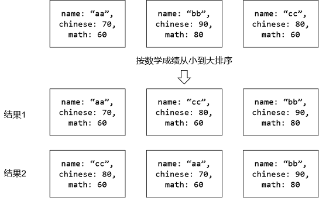

## 基本概念

1. 稳定性

   在排序之前，如果关键字Ki==Kj，并且i<j，称关键字Ki在Kj之前；如果能够保证在排序之后，Ki一定在Kj之前，则为稳定排序，反之为不稳定排序



2. 就地排序

   不需要辅助数组空间的排序算法称为就地排序。就地排序算法的空间复杂度不一定就是O(1)

3. 基于比较的排序算法的时间复杂度下界是O(nlogn)，非比较类的排序算法可以突破该下界（如桶排序）


## 冒泡排序

每趟扫描依次交换相邻的逆序对

每趟扫描可以保证当前扫描序列中最大的元素在末尾就位

* 时间复杂度： 
  * 最好O(n)：元素整体有序
  * 最坏(n^2) ：元素整体逆序
* 空间复杂度O(1)

* 属于稳定排序


将数组划分成两部分，前半部分`[0, t)`无序，后半部分`[t, n)`有序

每一次扫描只需对无序部分扫描，且扫描完前半部分最后一个元素一定就位，可归为后半部分。

```cpp
void bubbleSort(int A[], int n) {
    //前半部分[0, t)无序，后半部分[t, n)有序
	for (int t = n; t > 0; t--) {
		bool sorted = true;
		for (int i = 1; i < t; i++) {
			if (A[i - 1] > A[i]) {
				swap(A[i - 1], A[i]);
				sorted = false;
			}
		}
		if (sorted) break;
	}
}
```


## 插入排序


时间复杂度： 

- 最好O(n)：元素整体有序
- 最坏(n^2) ：元素整体逆序

当元素接近整体有序时，插入排序的效率很高（重要）

属于稳定排序

插入排序还可以使用二分查找来改进，称为折半插入排序。但折半插入排序仅仅是减少了关键字之间的比较次数，并没有减少关键字移动的次数，所以时间复杂度依然是O(n^2)

```cpp
#include <iostream>
using namespace std;

void insertionSort(int A[], int N) {
	for (int t = 0; t < N; t++) {
		int temp = A[t];
		int i;
		for (i = t - 1; i >= 0 && temp < A[i]; i--) {
			A[i + 1] = A[i];
		}
		A[i + 1] = temp;
	}
}

int main() {
	int A[] = { 6, 1, 2, 9, 7, 3 };
	int N = sizeof(A) / sizeof(A[0]);

	insertionSort(A, N);
	for (int i = 0; i < N; i++) {
		printf("%d ", A[i]);
	}
	printf("\n");
	return 0;
}
```


## 选择排序

也叫简单选择排序


* 最好、最坏时间复杂度 O(n^2)

* 属于非稳定排序

```cpp
#include <iostream>
#include <algorithm>
using namespace std;

void selectionSort(int A[], int N) {
	//前半部分[0, t)无序，后半部分[t, n)有序
	for (int t = N; t > 0; t--) {
		//从前半部分选一个最小的元素（记录其下标）
		int maxElemIndex = 0;
		for (int i = 0; i < t; i++) {
			if (A[maxElemIndex] < A[i]) {
				maxElemIndex = i;
			}
		}
		//让前半部分最小的元素跟该区间最后一个元素(下标为t-1)交换
		swap(A[maxElemIndex], A[t - 1]);
	}
}

int main() {
	int A[] = { 6, 1, 2, 9, 7, 3 };
	int N = sizeof(A) / sizeof(A[0]);

	selectionSort(A, N);
	for (int i = 0; i < N; i++) {
		printf("%d ", A[i]);
	}
	printf("\n");
	return 0;
}
```


## 归并排序

两个有序数组合并


使用了分治策略，递归深度位logn

时间复杂度：O(nlogn)

使用了辅助数组，不属于就地排序

空间复杂度：辅助数组O(n) + 递归深度O(logn) = O(n)

归并排序的计算量主要消耗于有序子数组的归并操作，而子数组的划分却几乎不费时间


```cpp
#include <iostream>
using namespace std;

void mergeArray(int A[], int lo, int mid, int hi) {
	int* temp = new int[hi - lo + 1];
	int i = lo, j = mid + 1;
	int k = 0;

	while (i <= mid && j <= hi) {
		if (A[i] <= A[j]) temp[k++] = A[i++];
		else temp[k++] = A[j++];
	}
	while (i <= mid) temp[k++] = A[i++];
	while (j <= hi) temp[k++] = A[j++];

	for (int i = lo, k = 0; i <= hi; i++, k++) {
		A[i] = temp[k];
	}
	delete[] temp;
}

void mergeSort(int A[], int lo, int hi) {
	if (lo >= hi) return;
	int mid = lo + (hi - lo) / 2;
	mergeSort(A, lo, mid);	//左半区间[lo, mid] 排好序
	mergeSort(A, mid + 1, hi);	//右半区间[mid + 1, hi] 排好序
	mergeArray(A, lo, mid, hi);	//进行合并
}

void mergeSort(int A[], int n) {
	mergeSort(A, 0, n - 1);
}

int main() {
	int A[] = { 6, 1, 2, 9, 7, 3 };
	int N = sizeof(A) / sizeof(int);

	mergeSort(A, N);
	for (int x : A) {
		cout << x << " ";
	}
	cout << endl;
	return 0;
}
```

背景：

早期，早期计算机的存储能力有限，以至于高速存储器不能容纳所有的数据， 或者只能使用磁带机或卡片之类的顺序存储设备，这些既促进了归并排序的诞生，也为该算法提供了施展的舞台。

如今，对于海量数据，不仅迫使我们更多地将它们存放和组织于分布式平台之上，而且对海量信息的处理也必须首先考虑，如何在跨节点的环境中高效地协同计算。因此在许多新算法和技术的背后，都可以看到归并排序的影子。


## 快速排序

### 思路

把序列S划分为两个子序列： S   =   S~L~   +   S~R~

且满足：     max(S~L~)  <  min(S~R~)

那么当对子序列递归排序后，原序列自然有序

sorted(S)   =   sorted(S~L~ )   +   sorted(S~R~ )

与归并排序区别：

* 都使用了分治的策略
* 归并排序难在合并，快速排序难在划分

### 轴点

轴点左侧的元素，均不比它大；轴点右侧的元素，均不比它小

对于轴点来说，其已经就位

特别的，对于有序数组来说，每一个元素都是轴点


```cpp
void quickSort(int A[], int lo, int hi) {	//对区间[lo, hi]进行排序
	if (lo >= hi) return;
	int pivot = partition(A, lo, hi);	//返回轴点下标
	quickSort(A, lo, pivot - 1);
	quickSort(A, pivot + 1, hi);
}
```

### 构造轴点

#### 方法一


```cpp
int partition(int A[], int lo, int hi) {
	int i = lo, j = hi;
	int pivot = A[i];	//通常选取第一个元素作为轴点，并用pivot变量备份
	while (i < j) {		//初始时下标i空闲（可以被覆盖）
		while (i < j && A[j] >= pivot) j--;	//在不小于pivot的前提下，向左拓展 右侧子区间
		A[i] = A[j];	//此时下标j所指元素一定小于轴点，可以放到左侧区间；
        				//由于此时下标i空闲，可直接覆盖
		while (i < j && A[i] <= pivot) i++;	//在不大于pivot的前提下，向右拓展 左侧子区间
		A[j] = A[i];	//此时下标i所指元素一定大于轴点，可以放到右侧区间；
        				//由于此时下标j空闲，可直接覆盖
	}	//此时 i == j
	A[i] = pivot;	//将备份的轴点放入两个区间之间
	return i;		//返回轴点的下标
}
```

构造轴点的实例


#### 方法二


```cpp
int partition_2(int A[], int lo, int hi) {
	int pivot = A[lo];
	int mid = lo;
	for (int k = lo + 1; k <= hi; k++) {
		if (A[k] < pivot) {
			swap(A[++mid], A[k]);
		}
	}
	swap(A[lo], A[mid]);
	return mid;
}
```


### 完整代码

```cpp
#include <iostream>
using namespace std;

int partition_1(int A[], int lo, int hi) {
	int i = lo, j = hi;
	int pivot = A[i];	//通常选取第一个元素作为轴点，并用pivot变量备份
	while (i < j) {		//初始时下标i空闲（可以被覆盖）
		while (i < j && A[j] >= pivot) j--;		//在不小于pivot的前提下，向左拓展 右侧子区间
		A[i] = A[j];	//此时下标j所指元素一定小于轴点，可以放到左侧区间；由于此时下标i空闲，可直接覆盖
		while (i < j && A[i] <= pivot) i++;		//在不大于pivot的前提下，向右拓展 左侧子区间
		A[j] = A[i];	//此时下标i所指元素一定大于轴点，可以放到右侧区间；由于此时下标j空闲，可直接覆盖
	}	//此时 i == j
	A[i] = pivot;	//将备份的轴点放入两个区间之间
	return i;		//返回轴点的下标
}

int partition_2(int A[], int lo, int hi) {
	int pivot = A[lo];
	int mid = lo;
	for (int k = lo + 1; k <= hi; k++) {
		if (A[k] < pivot) {
			swap(A[++mid], A[k]);
		}
	}
	swap(A[lo], A[mid]);
	return mid;
}

void quickSort(int A[], int lo, int hi) {	//对区间[lo, hi]进行排序
	if (lo >= hi) return;
	//int mid = partition_1(A, lo, hi);		//返回轴点下标
	int mid = partition_2(A, lo, hi);		//返回轴点下标
	quickSort(A, lo, mid - 1);
	quickSort(A, mid + 1, hi);
}

void quickSort(int A[], int n) {
	quickSort(A, 0, n - 1);
}

int main() {
	int A[] = { 6, 1, 2, 9, 7, 3 };
	int N = sizeof(A) / sizeof(int);

	quickSort(A, N);
	for (int x : A) {
		cout << x << " ";
	}
	cout << endl;
	return 0;
}
```

### 分析

**时间空间复杂度**

快速排序属于**就地排序**，不需要额外辅助数组

区间的划分是否均匀依赖于轴点的选取，

* 若每次都能均匀划分，则每次轴点都位于中央，递归深度为logn
  * 最好情况的时间复杂度为O(nlogn)，空间复杂度O(logn)

* 若每次划分都极不均匀，则递归深度为n
  * 最坏情况时间复杂度为O(n^2)，空间复杂度O(n)

可数学证明，快速排序的平均时间复杂度为O(nlogn)

对于轴点的选取，可采用 随机选取、三者取中等策略，可降低最坏情况出现的概率，但无法完全避免

在实际使用中，若待排序数组接近随机，则快速排序通常比其它排序算法拥有较好的性能

**稳定性**：属于不稳定算法

### 拓展：寻找第k小的数

常规做法：将数组从小到大排序，返回第k个元素的值。时间复杂度取决于排序算法的时间复杂度。

二分查找思想+快速排序轴点选取，时间复杂度$O(N)$

```cpp
#include <iostream>
#include <vector>
#include <algorithm>
using namespace std;

int partition(vector<int> &A, int lo, int hi) {
	int pivot = A[lo];
	int i = lo, j = hi;
	while (i < j) {
		while (i < j && A[j] > pivot) j--;
		while (i < j && A[i] < pivot) i++;
		swap(A[i], A[j]);
	}
	A[i] = pivot;
	return i;
}

int findK(vector<int> A, int K) {
	K -= 1;
	int lo = 0, hi = A.size() - 1;
	int temp = partition(A, lo, hi);
	while (temp != K) {
		if (temp < K) {
			lo = temp + 1;
		}
		else {
			hi = temp - 1;
		}
		temp = partition(A, lo, hi);
	}
	return A[temp];
}

int main() {
	vector<int> A = { 6, 1, 2, 7, 9, 4 };
	for (int i = 1; i <= A.size(); i++) {
		cout << findK(A, i) << " ";
	}
	cout << endl;
	return 0;
}
```


## 优先级队列

* 在选择排序中，每次要选择最大/最小的元素
* 在哈夫曼编码中构造哈夫曼树时，每次要从森林中选择权重最小的两棵树进行合并

数据项的某种属性只要可以相互比较大小，则这种大小关系即可称作优先级（priority）。而按照事先约定的优先级，可以始终高效查找并访问优先级最高数据项的数据结构，也统称作优先级队列（priority queue）。其操作接口：

* insert，
* getMAX
* deleteMax

### 完全二叉树


完全二叉树可用数组存放，若根节点的编号为0（存放在数组下标0），设某节点的编号为v，则其父子节点的编号为：

* 父节点： `(v - 1) / 2` (向下取整)
* 左孩子（若存在）：`2 * v + 1`
* 右孩子（若存在）：`2 * v + 2`

对于整棵树来说，若设节点总数为N，则

* 最后一个内部节点编号（即最后一个叶节点的父节点）：`N / 2 - 1`(向下取整)
* 内部节点的总数：`N / 2`(向下取整) 
* 含有叶节点的总数：`N / 2`(向上取整) 或 `(N + 1) / 2`(向下取整)
* 即对于完全二叉树，叶节点与非叶节点数要么相等，要么叶节点数多一个

### 完全二叉堆

定义

* 总是一颗完全二叉树
* 堆中每个节点的值必定不大于或不小于其父节点
  * 对于根节点是最大值的节点称为大顶堆
  * 对于根节点是最小值的节点称为小顶堆

相对于二叉搜索树需要动态维护整颗树的全序（full order）关系，堆只需要维护偏序（partial order）的关系。

以下讲解以大顶堆为例

### 插入与上滤

将新节点e插入数组末尾，若不满足堆序性则应进行上滤调整

上滤：将新插入的节点e不断与其父节点交换，直到满足堆序性


### 删除与下滤

删除根节点r，并将数组最后一个元素e移至根节点处，此时若不满足堆序性则应进行下滤调整

下滤：将新堆顶元素e不断与其（最多）两个子节点中的最大者交换，直至满足堆序性


### 建堆

给定一组元素，如何高效的将其组成一个堆？

1. 暴力做法：对每个元素都调用insert接口，不断的进行上滤调整

   O(log1 + log2 + ... + logn) = O(logn!) = O(nlogn)

   O(nlogn)的时间完全可以维护一个全序的关系，故必定存在更高效的算法

2. 自底向上不断的将两个堆合并，不断的进行下滤调整

   可数学证明其时间复杂度是O(n)
   
   具体过程：从最后一个内部节点开始进行下滤操作
   
   示例：初始数组元素为：`[2, 1, 6, 3, 9, 7, 4, 8, 5]`


### 完整代码

```cpp
#include <iostream>
#include <vector>
#include <initializer_list>
using namespace std;

template <typename T>
class PriorityQueue {
private:
	vector<T> elem;

public:
	PriorityQueue() {}

	PriorityQueue(const initializer_list<T> &il) {
		elem = il;
		//从最后一个内部节点开始进行下滤操作
		for (int i = elem.size() / 2 - 1; i >= 0; i--) {
			downAdjust(i);
		}
	}

	void insert(const T &e) {
		elem.push_back(e);
		upAdjust(elem.size() - 1);
	}

	T getMax() {
		if (empty()) throw exception("empty!");
		return elem[0];
	}

	T delMax() {
		if (empty()) throw exception("empty!");
		T ret = elem[0];
		elem[0] = elem.back();
		elem.pop_back();
		downAdjust(0);
		return ret;
	}

	bool empty() {
		return elem.empty();
	}

	int size() {
		return elem.size();
	}

	void print() {
		if (elem.empty()) {
			cout << "empty" << endl;
			return;
		}
		for (const T &x : elem) {
			cout << x << " ";
		}
		cout << endl;
	}

private:
	void downAdjust(int i) {
		int len = elem.size();
		while (i < len) {			//只要当前节点i存在
			int l = i * 2 + 1;		//i的左孩子记为l
			int r = i * 2 + 2;		//i的右孩子记为r
			int k = i;				//i、l、r三个节点中值最大的节点记为k
			if (l < len && elem[l] > elem[k]) k = l;
			if (r < len && elem[r] > elem[k]) k = r;
			if (k == i) break;
			//虽然是连续交换，但从上到下的路径不唯一，不能像上滤操作那样优化
			swap(elem[i], elem[k]);
			i = k;
		}
	}

	void upAdjust(int i) {
		T temp = elem[i];
		while (i > 0) {		//只要当前节点i不是根节点
			int j = (i - 1) / 2;	//i的父节点记为j
			if (elem[i] <= elem[j]) break;
			elem[i] = elem[j];
			i = j;
		}
		elem[i] = temp;
	}
};

int main() {
	PriorityQueue<int> pq = { 4,2,5,1,3 };
	pq.print();
	cout << pq.delMax() << endl;
	cout << pq.delMax() << endl;
	cout << pq.delMax() << endl;
	cout << pq.delMax() << endl;
	cout << pq.delMax() << endl;
	pq.print();
	return 0;
}
```

## 堆排序


### 实例

对数组`[4, 2, 5, 1, 3]` 进行堆排序

1. 建堆


2. 迭代 


性能分析

* 最好、最坏时间复杂度 O(nlogn)
* 属于就地排序，不需要辅助空间，空间复杂度O(1)
* 属于不稳定排序

### 完整代码

```cpp
#include <iostream>
#include <algorithm>
using namespace std;

/**
 @param len 数组A中需要进行下滤调整的区间长度
 @param i 当前待调整的元素的下标
 */
void downAdjust(int A[], int len, int i) {
	while (i < len) {			//只要当前节点i存在
		int l = i * 2 + 1;		//i的左孩子记为l，内部节点一定存在左孩子
		int r = i * 2 + 2;		//i的右孩子记为r，内部节点不一定存在右孩子
		int k = i;				//i、l、r三个节点中值最大的节点记为k
		if (l < len && A[l] > A[k]) k = l;
		if (r < len && A[r] > A[k]) k = r;
		if (k == i) break;
		swap(A[i], A[k]);
		i = k;
	}
}

void heapSort(int A[], int N) {
	//从最后一个内部节点开始进行建堆操作
	for (int i = N / 2 - 1; i >= 0; i--) {
		//对A[i]进行下滤调整，此时调整区间的长度为N
		downAdjust(A, N, i);
	}
	for (int i = N - 1; i > 0; i--) {
		swap(A[i], A[0]);
		//对A[0]进行下滤调整，此时调整区间的长度为i
		downAdjust(A, i, 0);
	}
}

int main() {
	int A[] = { 6, 1, 2, 9, 7, 3 };
	int N = sizeof(A) / sizeof(A[0]);

	heapSort(A, N);
	for (int i = 0; i < N; i++) {
		printf("%d ", A[i]);
	}
	printf("\n");
	return 0;
}
```


## 桶排序

对于N = 10000个范围均是0~100的整数，如何高效排序？

开一个大小M = 101的数组，其下标范围是0~100，统计每个数出现的次数。

```cpp
int cnt[101];
for(int i = 0; i < N; i++) {
    cnt[A[i]]++;
}
for(int i = 0; i < 101; i++) {
    for(int j = 0; j < cnt[i]; j++) {
        printf("%d ", i);
    }
}
```

空间复杂度O(M)，时间复杂度O(N + M)

在N >> M的场合，O(N + M)  =  O(max(N, M))  =  O(N)

桶排序：将数组每个元素依次分配到有限数量的桶里。每个桶再分别排序（可以选择其他算法或递归调用桶排序）。

举例：对于范围均是0-99的整数，可以开大小为10的桶数组，0-9的数放到桶0，10-19的数放到桶1，……90-99的数放到桶9

```cpp
#include <iostream>
#include <algorithm>
#include <vector>
using namespace std;

void bucketSort(int A[], int N) {
	static const int BUCKET_SIZE = 10;
	vector<int> bucket[BUCKET_SIZE];	//针对0-99范围内的数进行排序
	for (int i = 0; i < N; i++) {	//把数组的每个元素放入指定桶
		int index = A[i] / 10;
		bucket[index].push_back(A[i]);
	}
	for (int i = 0; i < BUCKET_SIZE; i++) {	//对每个桶进行排序
		sort(bucket[i].begin(), bucket[i].end());
	}
    int k = 0;
	for (int i = 0; i < BUCKET_SIZE; i++) {	//依次对每个桶进行遍历取出元素
		for (int x : bucket[i]) {
			A[k++] = x;
		}
	}
}

int main() {
	int A[] = { 23,12,24,80,99,66,63 };
	int N = sizeof(A) / sizeof(A[0]);
	bucketSort(A, N);
	for (int x : A) {
		printf("%d ", x);
	}
	printf("\n");
	return 0;
}
```


## 基数排序

基数排序(Radix Sort)是**桶排序**的扩展，它的基本思想是：将整数按位数切割成不同的数字，然后按每个位数分别比较。
具体做法是：将所有待比较数值统一为同样的数位长度，数位较短的数前面补零。然后，从最低位开始，依次进行一次排序。这样从最低位排序一直到最高位排序完成以后, 数列就变成一个有序序列。

以大小为9的数组{53, 3, 542, 748, 14, 214, 154, 63, 616}为例


## 希尔排序

又叫“缩小增量排序”，每一轮根据选取的增量w将相同增量的子序列排好序，每一轮的选择的增量应逐渐减小，最后一轮的增量一定为1。


`B[i][j] = A[i * w + j]`
`A[k] = B[k / w][k % w]`

希尔排序每经过一轮数组的整体有序性就有所改善

底层排序算法通常选择插入排序

对于长度为13的数组：{ 80, 23, 19, 40, 85, 1, 18, 92, 71, 8, 96, 46, 12 }


## 总结

|          | 最好时间复杂度 | 平均时间复杂度 | 最坏时间复杂度 | 空间复杂度   | 稳定性 |
| -------- | -------------- | -------------- | -------------- | ------------ | ------ |
| 冒泡排序 | O(n)           | O(n^2 )        | O(n^2 )        | O(1)         | 稳定   |
| 选择排序 | O(n^2 )        | O(n^2 )        | O(n^2 )        | O(1)         | 不稳定 |
| 插入排序 | O(n)           | O(n^2 )        | O(n^2 )        | O(1)         | 稳定   |
| 归并排序 | O(nlogn)       | O(nlogn)       | O(nlogn)       | O(n)         | 稳定   |
| 快速排序 | O(nlogn)       | O(nlogn)       | O(n^2 )        | O(logn)-O(n) | 不稳定 |
| 堆排序   | O(nlogn)       | O(nlogn)       | O(nlogn)       | O(1)         | 不稳定 |
| 希尔排序 | O(n^1.3 )      | O(n^2 )        | O(n^2 )        | O(1)         | 不稳定 |


C++ `STL`中的`sort`函数（位于`algorithm`头文件）并非只是普通的快速排序，除了对普通的**快速排序**进行优化，它还结合了**插入排序**和**堆排序**。根据不同的数量级别以及不同情况，能自动选用合适的排序方法。当数据量较大时采用快速排序，分段递归。一旦分段后的数据量小于某个阀值，为避免递归调用带来过大的额外负荷，便会改用插入排序。而如果递归层次过深，有出现最坏情况的倾向，还会改用堆排序。

sort函数接受待排序数组首位元素的地址（左闭右开），默认进行从小到大排序。

```cpp
#include <iostream>
#include <vector>
#include <algorithm>
using namespace std;

int main() {
	vector<int> A = { 2,1,4,7,4,3 };
	sort(A.begin(), A.end());
	for (int x : A) {
		printf("%d ", x);
	}
	printf("\n");

	int B[] = { 2,1,4,7,4,3 };
	int N = sizeof(B) / sizeof(B[0]);
	sort(B, B + N);
	for (int x : B) {
		printf("%d ", x);
	}
	printf("\n");
	return 0;
}
```

## 自定义规则排序

比较函数`cmp`编写规则：

一个数记为`a`，另一个数记为`b`

如果`a`应该排在`b`的前面，即`a`是"小于"`b`，则返回`true`。

否则返回`false`。

如果想保持`a`，`b`原有的顺序不做改变，即`a`与`b`“相等”，则返回`false`。

例1：

```cpp
#include <iostream>
#include <vector>
using namespace std;

template<typename T>
void sort(T* begin, T* end, bool (*isLess)(T a, T b)) {
	int n = end - begin;
	for (int t = n; t > 0; t--) {
		bool sorted = true;
		for (int i = 1; i < t; i++) {
			T& a = begin[i - 1];
			T& b = begin[i];
			if (isLess(b, a)) {
				swap(a, b);
				sorted = false;
			}
		}
		if (sorted) break;
	}
}

//从小到大排序
bool cmp1(int a, int b) {
	return a < b;
}

//从大到小排序
bool cmp2(int a, int b) {
	return a > b;
}

int main() {
	int A[] = { 1,3,-2,8,5,3,1 };
	sort(begin(A), end(A), cmp2);
	for (int x : A) {
		cout << x << " ";
	}
	cout << endl;
}
```

例2：

```cpp
#include <iostream>
#include <vector>
#include <string>
#include <algorithm>
using namespace std;

struct Student {
	int id;
	string name;
	int chinese;
	int math;
	Student(int id, string name, int chinese, int math) :
		id(id), name(name), chinese(chinese), math(math) {}
};

//按照id从小到大排序
bool cmp1(const Student &a, const Student &b) {
	return a.id < b.id;
}

//按照姓名的字典序排序
bool cmp2(const Student &a, const Student &b) {
	return a.name < b.name;
}

//先按语文成绩从高到底排序
//如果语文成绩相同，则比较数学成绩
//如果数学成绩也相同，则按id从小到大排序
bool cmp3(const Student &a, const Student &b) {
	if (a.chinese != b.chinese) {
		return a.chinese > b.chinese;
	}
	else if (a.math != b.math) {
		return a.math > b.math;
	}
	else {
		return a.id < b.id;
	}
}

void print(const vector<Student> &v) {
	printf("----------------------------------------\n");
	for (Student s : v) {
		printf("%d\t%s\t%d\t%d\n", s.id, s.name.c_str(), s.chinese, s.math);
	}
	printf("----------------------------------------\n");
}

int main() {
	vector<Student> v;
	v.push_back(Student(1001, "jack", 80, 60));
	v.push_back(Student(1005, "rose", 80, 70));
	v.push_back(Student(1006, "liu", 80, 50));
	v.push_back(Student(1003, "zhang", 70, 30));
	v.push_back(Student(1002, "wang", 90, 100));
	
	vector<Student> v1 = v;
	sort(v1.begin(), v1.end(), cmp1);
	print(v1);

	vector<Student> v2 = v;
	sort(v2.begin(), v2.end(), cmp2);
	print(v2);

	vector<Student> v3 = v;
	sort(v3.begin(), v3.end(), cmp3);
	print(v3);

	return 0;
}
```

例3：

给定一个数组，只对其中的质数做从小到大的排序，质数在前，非质数在后，并保证非质数的相对顺序不变。

比如`{ 23, 11, 0, 10, 13, 6, 8, 2 }`的排序结果应该是`{ 2, 11, 13, 23, 0, 10, 6, 8 }`。

```cpp
#include <iostream>
#include <vector>
#include <string>
#include <algorithm>
using namespace std;

bool isPrime(int num) {
	if (num < 2) return false;
	for (int i = 2; i < num; i++) {
		if (num % i == 0) return false;
	}
	return true;
}

bool cmp(int a, int b) {
	int flag = isPrime(a) + 2 * isPrime(b);
	switch (flag)
	{
	case 0:		//a, b都不是质数
		return false;
	case 1:		//a是质数，b不是质数
		return true;
	case 2:		//a不是质数，b是质数
		return false;
	case 3:		//a，b都是质数
		return a < b;
	}
}

int main() {
	vector<int> v = { 23, 11, 0, 2, 8, 10, 13, 6, 8, 2 };
	//vector<int> v = { 4,4,2,2,2,2 };
	sort(v.begin(), v.end(), cmp);

	for (int x : v) {
		printf("%d ", x);
	}
	printf("\n");

	return 0;
}
```


## 链表的排序算法

### 归并排序

每次采用快慢指针方法找到链表中间节点的位置，将链表一分为二。

`divide`、`merge`、`divideAndMerge`这三个函数均是对不带头节点的单链表做操作。

```cpp
#include <iostream>
#include <initializer_list>
using namespace std;

struct Node {
	int data;
	Node* next;

	Node(int x = 0) :data(x), next(NULL) {}
};

Node* divide(Node* first) {
	if (first == NULL) return NULL;
	Node* fast = first;
	Node* slow = first;
	while (fast->next != NULL && fast->next->next != NULL) {
		fast = fast->next->next;
		slow = slow->next;
	}
	return slow;
}

Node* merge(Node* p, Node* q) {
	if (p == NULL) return q;
	if (q == NULL) return p;
	Node* head;
	//选取p、q两个链表首节点的较小者作为头节点
	if (p->data < q->data) {
		head = p;
		p = p->next;
	}
	else {
		head = q;
		q = q->next;
	}
	Node* rear = head;
	while (p != NULL && q != NULL) {
		if (p->data < q->data) {
			rear->next = p;
			p = p->next;
		}
		else {
			rear->next = q;
			q = q->next;
		}
		rear = rear->next;
	}
	if (p != NULL) {
		rear->next = p;
	}
	if (q != NULL) {
		rear->next = q;
	}
	return head;
}

Node* divideAndMerge(Node* first) {
	if (first == NULL || first->next == NULL) return first;
	Node* mid = divide(first);
	Node* left = first;
	Node* right = mid->next;
	mid->next = NULL;	//链表中间断开，分成两个链表
	left = divideAndMerge(left);
	right = divideAndMerge(right);
	return merge(left, right);
}

void mergeSort(Node* head) {
	Node* first = divideAndMerge(head->next);
	head->next = first;
}

void printLinkList(Node* head) {
	if (head->next == NULL) {
		printf("empty\n");
		return;
	}
	for (Node* p = head->next; p != NULL; p = p->next) {
		printf("%d ", p->data);
	}
	printf("\n");
}

void test(const initializer_list<int> &il) {
	static int cnt = 0;
	printf("-------------------------------\n");
	printf("测试用例 #%d:\n", ++cnt);

	Node* head = new Node();
	Node* rear = head;
	for (int x : il) {
		rear->next = new Node(x);
		rear = rear->next;
	}
	printLinkList(head);
	mergeSort(head);
	printLinkList(head);
}

int main() {
	test({ 2,1,4,3 });
	test({ 3,2,1 });
	test({ 1 });
	test({ 2, -1 });
	test({ });

	return 0;
}
```

### 快速排序

因为是单向链表，所以选择将前面数组快速排序构造轴点的方法二改成链表的形式。

这里链表区间lo-hi采用左闭右开的形式，这样链表最后一个节点的下一个节点指针一定是NULL。

```cpp
#include <iostream>
#include <algorithm>
#include <initializer_list>
using namespace std;

struct Node {
	int data;
	Node* next;

	Node(int x = 0) :data(x), next(NULL) {}
};

Node* partition(Node* lo, Node* hi) {	//[lo, hi)
	int pivot = lo->data;
	Node* mid = lo;
	for (Node* p = lo->next; p != hi; p = p->next) {
		if (p->data < pivot) {
			mid = mid->next;
			swap(mid->data, p->data);
		}
	}
	swap(lo->data, mid->data);
	return mid;
}

void quickSort(Node* lo, Node* hi) {	//[lo, hi)
	if (lo == hi || lo->next == hi) return;
	Node* mid = partition(lo, hi);
	quickSort(lo, mid);			// [lo, mid)
	quickSort(mid->next, hi);	// [mid->next, hi)
}

void quickSort(Node* head) {
	quickSort(head->next, NULL);
}

void printLinkList(Node* head) {
	if (head->next == NULL) {
		printf("empty\n");
		return;
	}
	for (Node* p = head->next; p != NULL; p = p->next) {
		printf("%d ", p->data);
	}
	printf("\n");
}

void test(const initializer_list<int> &il) {
	static int cnt = 0;
	printf("-------------------------------\n");
	printf("测试用例 #%d:\n", ++cnt);

	Node* head = new Node();
	Node* rear = head;
	for (int x : il) {
		rear->next = new Node(x);
		rear = rear->next;
	}
	printLinkList(head);
	quickSort(head);
	printLinkList(head);
}

int main() {
	test({ 2,1,4,3 });
	test({ 3,2,1 });
	test({ 1 });
	test({ 2, -1 });
	test({ });

	return 0;
}
```

### 插入排序

```
sorted         unsorted
----------  ------------
         r  r.next       
```


```cpp
#include <iostream>
#include <algorithm>
#include <initializer_list>
using namespace std;

struct Node {
	int data;
	Node* next;

	Node(int x = 0) :data(x), next(NULL) {}
};

void insertionSort(Node* head) {
	Node* r = head;
	while (r->next != NULL) {
		//查找r->next节点应该插入的位置
		Node* p = head;
		while (p->next->data < r->next->data) {
			p = p->next;
		}
		//此时应将r后面的节点(记为temp)插入到p节点的后面
		if (p == r) {
			r = r->next;
			continue;
		}
		Node* temp = r->next;
		//先将temp从原链表中移除
		r->next = temp->next;
		//再将temp插入p的后面
		temp->next = p->next;
		p->next = temp;
	}
}

void printLinkList(Node* head) {
	if (head->next == NULL) {
		printf("empty\n");
		return;
	}
	for (Node* p = head->next; p != NULL; p = p->next) {
		printf("%d ", p->data);
	}
	printf("\n");
}

void test(const initializer_list<int> &il) {
	static int cnt = 0;
	printf("-------------------------------\n");
	printf("测试用例 #%d:\n", ++cnt);

	Node* head = new Node();
	Node* rear = head;
	for (int x : il) {
		rear->next = new Node(x);
		rear = rear->next;
	}
	printLinkList(head);
	insertionSort(head);
	printLinkList(head);
}

int main() {
	test({ 2,5,3,7 });
	test({ 2,1,4,3 });
	test({ 3,2,1 });
	test({ 1 });
	test({ 2, -1 });
	test({ });

	return 0;
}
```

### 选择排序

```
sorted         unsorted
----------  ------------
             r  
```


```cpp
#include <iostream>
#include <algorithm>
#include <initializer_list>
using namespace std;

struct Node {
	int data;
	Node* next;

	Node(int x = 0) :data(x), next(NULL) {}
};

void selectionSort(Node* head) {
	//链表前半部分已排序，后半部分未排序
	//r指针指向未排序部分节点的第一个
	//初始时所有节点（不含头节点）都属于未排序部分
	Node* r = head->next;
	while (r != NULL) {
		Node* minNode = r;
		for (Node* p = r; p != NULL; p = p->next) {
			if (p->data < minNode->data) {
				minNode = p;
			}
		}
		swap(r->data, minNode->data);
		r = r->next;
	}
}

void printLinkList(Node* head) {
	if (head->next == NULL) {
		printf("empty\n");
		return;
	}
	for (Node* p = head->next; p != NULL; p = p->next) {
		printf("%d ", p->data);
	}
	printf("\n");
}

void test(const initializer_list<int> &il) {
	static int cnt = 0;
	printf("-------------------------------\n");
	printf("测试用例 #%d:\n", ++cnt);

	Node* head = new Node();
	Node* rear = head;
	for (int x : il) {
		rear->next = new Node(x);
		rear = rear->next;
	}
	printLinkList(head);
	selectionSort(head);
	printLinkList(head);
}

int main() {
	test({ 2,5,3,7 });
	test({ 2,1,4,3 });
	test({ 3,2,1 });
	test({ 1 });
	test({ 2, -1 });
	test({ });

	return 0;
}
```

### 冒泡排序

```
unsorted       sorted
----------  ------------
             r  
```


```cpp
#include <iostream>
#include <algorithm>
#include <initializer_list>
using namespace std;

struct Node {
	int data;
	Node* next;

	Node(int x = 0) :data(x), next(NULL) {}
};

void bubbleSort(Node* head) {
	//链表前半部分未排序，后半部分已排序
	//r指针指向已排序部分节点的第一个
	Node* r = NULL;	//初始时已排序部分为空
	while (r != head->next) {
		bool isChanged = false;
		Node* p = head->next;
		while (p->next != r) {
			if (p->data > p->next->data) {
				swap(p->data, p->next->data);
				isChanged = true;
			}
			p = p->next;
		}
		if (isChanged == false) break;
		r = p;
	}
}

void printLinkList(Node* head) {
	if (head->next == NULL) {
		printf("empty\n");
		return;
	}
	for (Node* p = head->next; p != NULL; p = p->next) {
		printf("%d ", p->data);
	}
	printf("\n");
}

void test(const initializer_list<int> &il) {
	static int cnt = 0;
	printf("-------------------------------\n");
	printf("测试用例 #%d:\n", ++cnt);

	Node* head = new Node();
	Node* rear = head;
	for (int x : il) {
		rear->next = new Node(x);
		rear = rear->next;
	}
	printLinkList(head);
	bubbleSort(head);
	printLinkList(head);
}

int main() {
	test({ 2,5,3,7 });
	test({ 2,1,4,3 });
	test({ 3,2,1 });
	test({ 1 });
	test({ 2, -1 });
	test({ });

	return 0;
}
```

